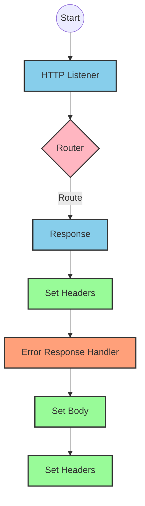
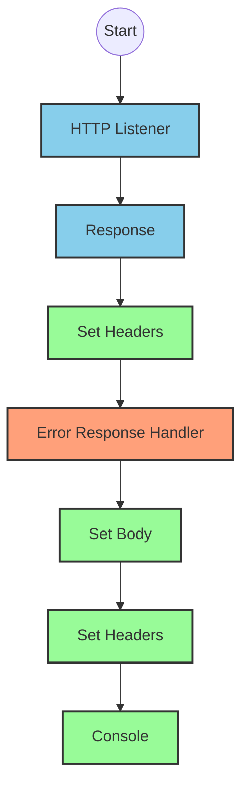
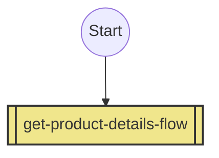
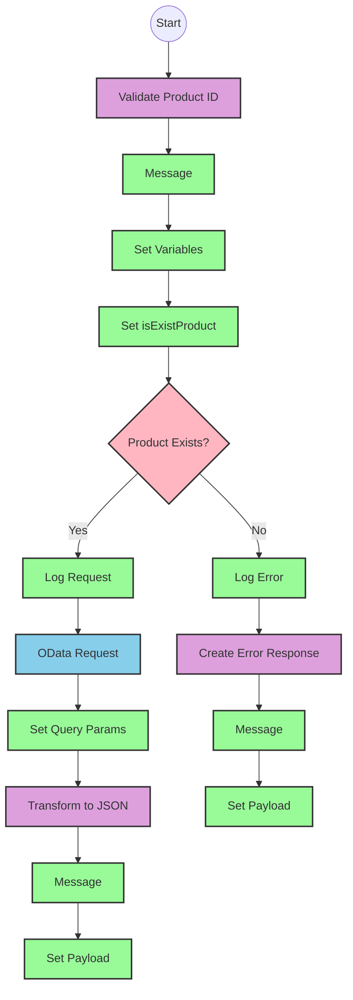

# API Overview
- This API provides product details from an SAP HANA database
- Base URL pattern: `/products`

# Endpoints

## GET /products
- **Purpose**: Retrieves product details based on a product identifier
- **Query Parameters**: 
  - `productIdentifier` (required): The unique identifier for the product
- **Response Format**: JSON
- **Status Codes**:
  - 200: Success
  - 400: Bad request
  - 404: Product not found
- **Response Body**: Product details including ProductId, Category, CategoryName, CurrencyCode, dimensions, descriptions, price, and other product attributes

# Current MuleSoft Flow Logic

## Flow: products-main
This is the main API entry point flow that handles incoming HTTP requests.
1. **Trigger**: HTTP listener
2. **Processing**: Routes requests to appropriate handlers
3. **Response**: Returns HTTP response with appropriate headers
4. **Error Handling**: Provides error responses when needed

## Flow: products-console
This flow appears to be a console/logging version of the main flow.
1. **Trigger**: HTTP listener
2. **Processing**: Logs request information to console
3. **Response**: Returns HTTP response with appropriate headers
4. **Error Handling**: Provides error responses when needed

## Flow: get:\products:products-config
This flow handles GET requests to the /products endpoint.
1. **Trigger**: API request to GET /products
2. **Processing**: References the get-product-details-flow subflow
3. **Outcome**: Returns product details or error message

## Subflow: get-product-details-flow
This subflow retrieves product details from SAP HANA.
1. **First Step**: Validates if the product identifier exists in the configured list
   ```
   %dw 2.0
   output application/java
   var productidentifer=p('odata.productIdentifiers') splitBy(",")
   ---
   sizeOf(productidentifer filter ($ == attributes.queryParams.productIdentifier))>0
   ```
2. **Conditional Processing**:
   - If product identifier is valid:
     - Logs the request
     - Makes an OData request to retrieve product details with these exact parameters:
       - `$filter`: `ProductId eq '" ++ (attributes.queryParams.productIdentifier default '') ++ "'`
       - `$select`: `ProductId,Category,CategoryName,CurrencyCode,DimensionDepth,DimensionHeight,DimensionUnit,DimensionWidth,LongDescription,Name,PictureUrl,Price,QuantityUnit,ShortDescription,SupplierId,Weight,WeightUnit`
     - Returns the product data as JSON
   - If product identifier is invalid:
     - Logs the error
     - Returns an error message
3. **Error Scenarios**:
   - Product identifier not found in the configured list
   - OData request failure

# DataWeave Transformations Explained

## Product Identifier Validation Transformation
```
%dw 2.0
output application/java
var productidentifer=p('odata.productIdentifiers') splitBy(",")
---
sizeOf(productidentifer filter ($ == attributes.queryParams.productIdentifier))>0
```
- **Purpose**: Validates if the provided product identifier exists in a configured list
- **Input**: Query parameter `productIdentifier` from the HTTP request
- **Output**: Boolean value (true/false)
- **Logic**:
  1. Retrieves a comma-separated list of valid product identifiers from a property
  2. Splits the list into an array
  3. Filters the array to find matches with the provided product identifier
  4. Returns true if at least one match is found (size > 0)

## OData Query Parameters Transformation
```
#[output application/java
---
{
	"$filter" : "ProductId eq '" ++ (attributes.queryParams.productIdentifier default '') ++ "'",
	"$select" : "ProductId,Category,CategoryName,CurrencyCode,DimensionDepth,DimensionHeight,DimensionUnit,DimensionWidth,LongDescription,Name,PictureUrl,Price,QuantityUnit,ShortDescription,SupplierId,Weight,WeightUnit"
}]
```
- **Purpose**: Constructs OData query parameters for the HTTP request
- **Input**: Product identifier from query parameters
- **Output**: Java map with OData query parameters
- **Logic**:
  1. Creates a filter condition to match the exact product identifier
  2. Specifies the fields to retrieve in the select parameter

## Response Payload Transformation (Success)
```
%dw 2.0
output application/json
---
payload
```
- **Purpose**: Transforms the OData response to JSON
- **Input**: OData response payload
- **Output**: JSON representation of the product details
- **Logic**: Simple pass-through transformation that maintains the structure but changes the format to JSON

## Error Response Transformation
```
%dw 2.0
output application/json
---
{
	status: "error",
	message: "The product identifier " ++ attributes.queryParams.productIdentifier ++ " was not found.",
	errorCode: "PRODUCT_NOT_FOUND"
}
```
- **Purpose**: Creates a standardized error response
- **Input**: Query parameter containing the invalid product identifier
- **Output**: JSON error object
- **Logic**: Constructs an error object with status, message, and error code

# SAP Integration Suite Implementation

## Component Mapping

| MuleSoft Component | SAP Integration Suite Equivalent | Notes |
|--------------------|----------------------------------|-------|
| HTTP Listener | HTTPS Adapter (Receiver) | Configure with the same path and method |
| Router | Content Modifier + Router | Use a Content Modifier to set properties and Router for conditional paths |
| Flow Reference | Process Call | References another integration flow |
| Transform (DataWeave) | Groovy Script or Message Mapping | Convert DataWeave scripts to equivalent Groovy or Message Mapping |
| Logger | Write to Message Log | Configure with the same message content |
| HTTP Request | OData Adapter (Sender) | Configure with the same OData query parameters |
| Set Variable | Content Modifier | Set properties with the same values |
| Choice/When/Otherwise | Router | Configure with the same conditions |
| Set Payload | Content Modifier | Set message body |
| Error Handler | Exception Subprocess | Configure with the same error types and handling logic |

## Integration Flow Visualization









## Configuration Details

### HTTP Listener Configuration
- Protocol: HTTPS
- Host: ${http.host}
- Port: ${http.port}
- Base Path: /api

### OData Adapter Configuration
- Connection Type: OData
- Service URL: ${hana.url}
- Authentication: Basic Authentication
- Username: ${hana.username}
- Password: ${hana.password}
- OData Version: V2

### Router Configuration
- Condition for product validation: ${property.isExistProduct}
- Default route: Error response

### Content Modifier Configuration
- For variable setting:
  - Property Name: isExistProduct
  - Property Type: java.lang.Boolean
  - Value Type: Expression
  - Value: The equivalent Groovy expression for the DataWeave validation logic

### Groovy Script (for DataWeave transformation)
- For product validation:
  ```groovy
  def productIdentifiers = property.get("odata.productIdentifiers").split(",")
  def productId = message.getProperty("productIdentifier")
  def isValid = productIdentifiers.any { it == productId }
  message.setProperty("isExistProduct", isValid)
  ```

- For error response:
  ```groovy
  def productId = message.getProperty("productIdentifier")
  def errorResponse = [
    status: "error",
    message: "The product identifier " + productId + " was not found.",
    errorCode: "PRODUCT_NOT_FOUND"
  ]
  message.setBody(new groovy.json.JsonBuilder(errorResponse).toString())
  ```

# Configuration

## Important Configuration Parameters
- `odata.productIdentifiers`: Comma-separated list of valid product identifiers
- `http.host`: Host for the HTTP listener
- `http.port`: Port for the HTTP listener
- `hana.url`: URL for the SAP HANA OData service
- `hana.username`: Username for SAP HANA authentication
- `hana.password`: Password for SAP HANA authentication

## Error Handling
The application implements error handling for:
- APIKIT:BAD_REQUEST
- APIKIT:NOT_FOUND
- APIKIT:METHOD_NOT_ALLOWED
- APIKIT:NOT_ACCEPTABLE
- APIKIT:UNSUPPORTED_MEDIA_TYPE
- APIKIT:NOT_IMPLEMENTED

These should be mapped to equivalent exception subprocesses in SAP Integration Suite.