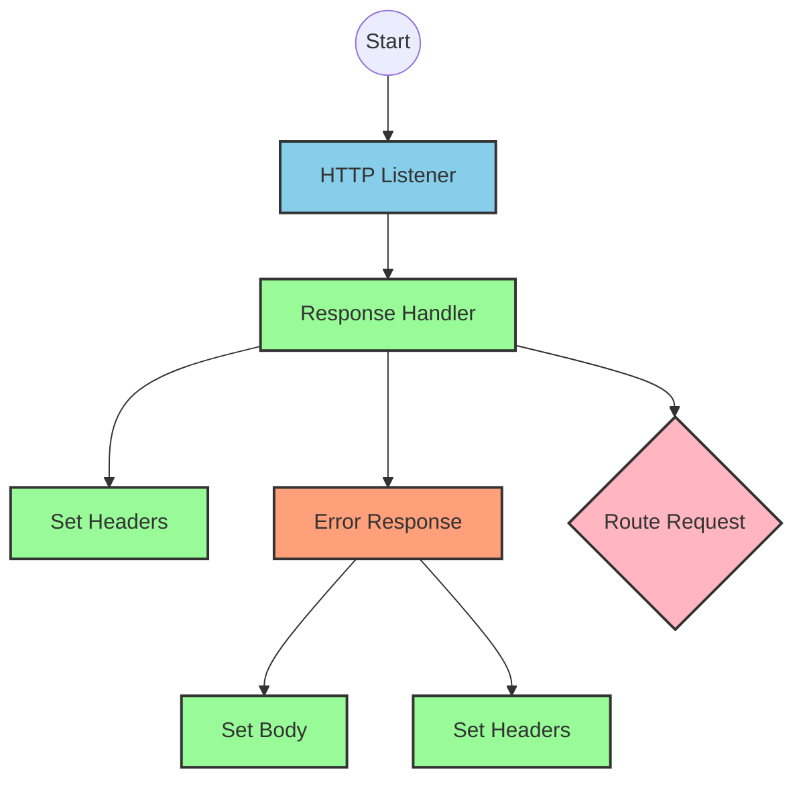
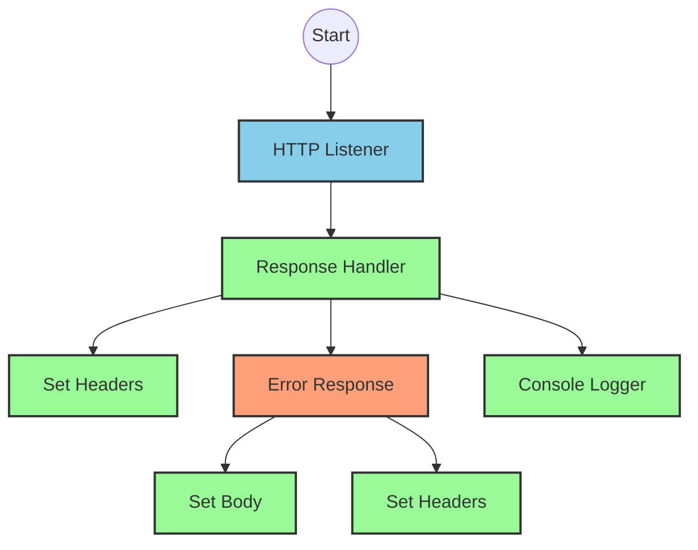
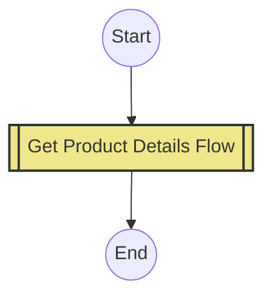
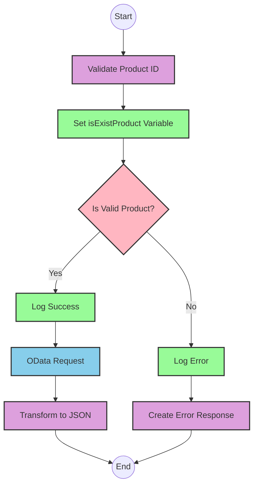

# API Overview
- This API provides product details from an SAP HANA database
- Base URL pattern: `/products`

# Endpoints

## GET /products
- **Purpose**: Retrieves product details based on a product identifier
- **Query Parameters**:
  - `productIdentifier` (required): The unique identifier for the product
- **Response Format**: JSON
- **Status Codes**:
  - 200: Success
  - 400: Bad Request
  - 404: Product Not Found
- **Response Body**: Product details including ProductId, Category, CategoryName, CurrencyCode, dimensions, descriptions, price, and other product attributes

# Current MuleSoft Flow Logic

## Flow: products-main
This is the main entry point for the API, triggered by an HTTP listener. It handles routing to the appropriate endpoints based on the API specification defined in products.raml.

## Flow: products-console
This flow appears to be a console logging version of the API, also triggered by an HTTP listener. It logs the requests and responses for monitoring purposes.

## Flow: get:\products:products-config
This flow is triggered when a GET request is made to the `/products` endpoint. It references the `get-product-details-flow` subflow to handle the request.

## Subflow: get-product-details-flow
This subflow processes the product details request:

1. **Validate Product Identifier**:
   - Checks if the provided productIdentifier is in the list of allowed product identifiers
   - Uses a DataWeave transformation to set `isExistProduct` variable:
   ```
   %dw 2.0
   output application/java
   var productidentifer=p('odata.productIdentifiers') splitBy(",")
   ---
   sizeOf(productidentifer filter ($ == attributes.queryParams.productIdentifier))>0
   ```

2. **Conditional Processing**:
   - If `isExistProduct` is true:
     - Logs that the request is being processed
     - Makes an HTTP request to the SAP HANA backend with specific OData query parameters:
       - `$filter`: `ProductId eq '" ++ (attributes.queryParams.productIdentifier default '') ++ "'`
       - `$select`: `ProductId,Category,CategoryName,CurrencyCode,DimensionDepth,DimensionHeight,DimensionUnit,DimensionWidth,LongDescription,Name,PictureUrl,Price,QuantityUnit,ShortDescription,SupplierId,Weight,WeightUnit`
     - Transforms the response to JSON format
   - If `isExistProduct` is false:
     - Logs that the product identifier was not passed or was incorrect
     - Returns an error response with status "error", message about the product not being found, and errorCode "PRODUCT_NOT_FOUND"

# DataWeave Transformations Explained

## Product Identifier Validation Transformation
```
%dw 2.0
output application/java
var productidentifer=p('odata.productIdentifiers') splitBy(",")
---
sizeOf(productidentifer filter ($ == attributes.queryParams.productIdentifier))>0
```

This transformation:
1. Retrieves a comma-separated list of valid product identifiers from a property `odata.productIdentifiers`
2. Splits this string into an array using the comma as a delimiter
3. Filters the array to find elements that match the productIdentifier from the query parameters
4. Returns true if at least one match is found (size > 0), false otherwise

## OData Query Parameters Transformation
```
#[output application/java
---
{
	"$filter" : "ProductId eq '" ++ (attributes.queryParams.productIdentifier default '') ++ "'",
	"$select" : "ProductId,Category,CategoryName,CurrencyCode,DimensionDepth,DimensionHeight,DimensionUnit,DimensionWidth,LongDescription,Name,PictureUrl,Price,QuantityUnit,ShortDescription,SupplierId,Weight,WeightUnit"
}]
```

This transformation:
1. Creates an OData query with two parameters:
   - `$filter`: Filters products where ProductId equals the provided productIdentifier (with empty string as default)
   - `$select`: Specifies which fields to retrieve from the product data

## Response Payload Transformation (Success Case)
```
%dw 2.0
output application/json
---
payload
```

This simple transformation converts the payload to JSON format without modifying its structure.

## Error Response Transformation
```
%dw 2.0
output application/json
---
{
	status: "error",
	message: "The product identifier " ++ attributes.queryParams.productIdentifier ++ " was not found.",
	errorCode: "PRODUCT_NOT_FOUND"
}
```

This transformation:
1. Creates a JSON error response with three fields:
   - `status`: Set to "error"
   - `message`: A descriptive message including the product identifier that wasn't found
   - `errorCode`: Set to "PRODUCT_NOT_FOUND"

# SAP Integration Suite Implementation

## Component Mapping

| MuleSoft Component | SAP Integration Suite Equivalent |
|--------------------|----------------------------------|
| HTTP Listener | HTTP Adapter (Receiver) |
| Router | Content Modifier + Router |
| Flow Reference | Process Call |
| DataWeave Transform | Message Mapping |
| Logger | Write to Log |
| HTTP Request | OData Adapter (Sender) |
| Set Variable | Content Modifier |
| Choice/When/Otherwise | Router |
| Error Handler | Exception Subprocess |

## Integration Flow Visualization









## Configuration Details

### HTTP Adapter (Receiver)
- **Address**: `/products`
- **Authentication**: None (or as required by your environment)
- **CSRF Protection**: Disabled
- **Connection Timeout**: 30 seconds

### OData Adapter (Sender)
- **Service**: SAP HANA OData Service
- **Query Options**:
  - `$filter`: Dynamic based on productIdentifier
  - `$select`: ProductId,Category,CategoryName,CurrencyCode,DimensionDepth,DimensionHeight,DimensionUnit,DimensionWidth,LongDescription,Name,PictureUrl,Price,QuantityUnit,ShortDescription,SupplierId,Weight,WeightUnit

### Content Modifiers
- **isExistProduct Variable**: Boolean value determined by checking if productIdentifier is in the allowed list
- **Headers**: Standard HTTP headers for JSON responses

### Router Configuration
- **Condition 1**: `${property.isExistProduct} = true`
- **Condition 2**: Default (otherwise)

# Configuration

## Important Configuration Parameters
- **odata.productIdentifiers**: Comma-separated list of valid product identifiers (from property file)
- **HTTP_Listener_config**: Configuration for the HTTP listener
- **Hana_HTTP_Request_Configuration**: Configuration for the HTTP request to SAP HANA
- **products-config**: API configuration referencing products.raml

## Error Handling
The application implements a global error handler (Gobal_Error_Handler) that handles various APIKIT errors:
- APIKIT:BAD_REQUEST
- APIKIT:NOT_FOUND
- APIKIT:METHOD_NOT_ALLOWED
- APIKIT:NOT_ACCEPTABLE
- APIKIT:UNSUPPORTED_MEDIA_TYPE
- APIKIT:NOT_IMPLEMENTED

Each error is handled using on-error-propagate to ensure proper error responses are returned to the client.