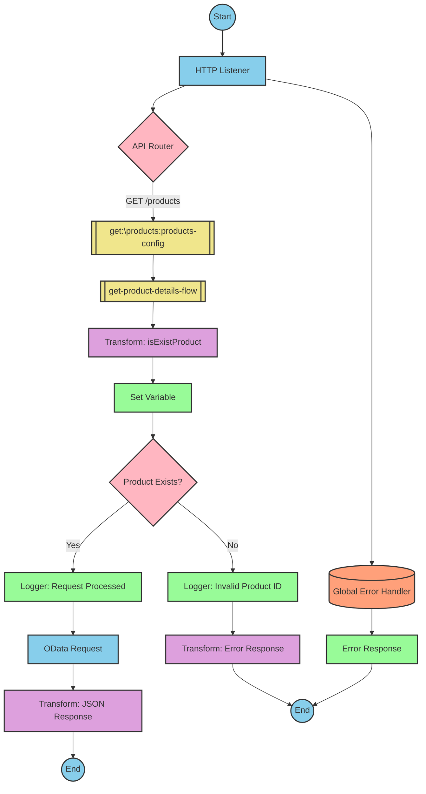

# Document Navigation
- [API Overview](#api-overview)
- [Endpoints](#endpoints)
- [Current MuleSoft Flow Logic](#current-mulesoft-flow-logic)
  - [products-main Flow](#products-main-flow)
  - [products-console Flow](#products-console-flow)
  - [get:\products:products-config Flow](#getproductsproducts-config-flow)
  - [get-product-details-flow Subflow](#get-product-details-flow-subflow)
- [DataWeave Transformations Explained](#dataweave-transformations-explained)
  - [isExistProduct Transformation](#isexistproduct-transformation)
  - [OData Query Parameters Transformation](#odata-query-parameters-transformation)
  - [Product Response Transformation](#product-response-transformation)
  - [Error Response Transformation](#error-response-transformation)
- [SAP Integration Suite Implementation](#sap-integration-suite-implementation)
  - [Component Mapping](#component-mapping)
  - [Integration Flow Visualization](#integration-flow-visualization)
- [Configuration Details](#configuration-details)
- [Configuration](#configuration)

# API Overview
This API provides product information from an SAP HANA database. It allows clients to retrieve product details by specifying a product identifier as a query parameter. The API validates the product identifier against a configured list of valid identifiers before retrieving the product details from the backend system.

- Base URL: Determined by the HTTP_Listener_config
- Main endpoint: /products

# Endpoints

## GET /products
- **Purpose**: Retrieves product details based on a product identifier
- **Request Parameters**:
  - **Query Parameters**:
    - `productIdentifier`: The unique identifier for the product to retrieve
  - **Headers**: Standard HTTP headers
- **Response Format**:
  - **Success**: JSON object containing product details
    - Status Code: 200 OK
  - **Error**: JSON object with error details
    - Status Code: Appropriate error code (e.g., 400, 404)
    - Body: 
      ```json
      {
        "status": "error",
        "message": "The product identifier [identifier] was not found.",
        "errorCode": "PRODUCT_NOT_FOUND"
      }
      ```

# Current MuleSoft Flow Logic

## products-main Flow
This is the main entry point for the API, which handles routing of requests.

1. **Trigger**: HTTP listener configured with the products-config
2. **Processing Steps**:
   - Sets response headers
   - Handles error responses
   - Sets response body
   - Routes requests to appropriate handlers based on the API specification

## products-console Flow
This flow appears to be a console-based version of the API, possibly for testing or monitoring purposes.

1. **Trigger**: HTTP listener
2. **Processing Steps**:
   - Sets response headers
   - Handles error responses
   - Sets response body
   - Outputs to console

## get:\products:products-config Flow
This flow handles GET requests to the /products endpoint.

1. **Trigger**: GET request to /products endpoint
2. **Processing Steps**:
   - Calls the get-product-details-flow subflow to retrieve and process product details

## get-product-details-flow Subflow
This subflow handles the core business logic for retrieving product details.

1. **Processing Steps**:
   - Validates the product identifier against a configured list of valid identifiers
   - Sets variables for processing
   - Logs the request details
   - Makes an OData request to retrieve product details with specific filters and field selections
   - Transforms the response to the required format
   - Handles error scenarios when the product identifier is invalid

2. **Key Technical Details**:
   - **Product Identifier Validation**:
     - Checks if the provided productIdentifier exists in a configured list of valid identifiers
     - Sets a boolean variable `isExistProduct` based on this check

   - **OData Query Parameters**:
     - `$filter`: `ProductId eq '[productIdentifier]'`
     - `$select`: `ProductId,Category,CategoryName,CurrencyCode,DimensionDepth,DimensionHeight,DimensionUnit,DimensionWidth,LongDescription,Name,PictureUrl,Price,QuantityUnit,ShortDescription,SupplierId,Weight,WeightUnit`

   - **Conditional Logic**:
     - If `vars.isExistProduct` is true, proceeds with the OData request
     - Otherwise, returns an error response

   - **Error Handling**:
     - Returns a structured error response when the product identifier is invalid
     - Logs appropriate error messages

# DataWeave Transformations Explained

## isExistProduct Transformation
This transformation checks if the provided product identifier exists in a configured list of valid product identifiers.

**Input**: The product identifier from the query parameters and a configured list of valid identifiers
**Output**: A boolean value indicating whether the product identifier is valid

```dw
%dw 2.0
output application/java
var productidentifer=p('odata.productIdentifiers') splitBy(",")
---
sizeOf(productidentifer filter ($ == attributes.queryParams.productIdentifier))>0
```

**Explanation**:
1. Retrieves a comma-separated list of valid product identifiers from a property `odata.productIdentifiers`
2. Splits this list into an array using the `splitBy` function
3. Filters the array to find elements that match the provided product identifier
4. Checks if the size of the filtered array is greater than 0 (indicating a match was found)
5. Returns true if a match is found, false otherwise

## OData Query Parameters Transformation
This transformation constructs the OData query parameters for retrieving product details.

**Input**: The product identifier from the query parameters
**Output**: A map of OData query parameters

```dw
#[output application/java
---
{
	"$filter" : "ProductId eq '" ++ (attributes.queryParams.productIdentifier default '') ++ "'",
	"$select" : "ProductId,Category,CategoryName,CurrencyCode,DimensionDepth,DimensionHeight,DimensionUnit,DimensionWidth,LongDescription,Name,PictureUrl,Price,QuantityUnit,ShortDescription,SupplierId,Weight,WeightUnit"
}]
```

**Explanation**:
1. Creates a map with two OData query parameters:
   - `$filter`: Constructs a filter expression that matches the ProductId with the provided product identifier
   - `$select`: Specifies the fields to retrieve from the OData service
2. Uses string concatenation (`++`) to embed the product identifier in the filter expression
3. Uses the `default` function to provide an empty string if the product identifier is not present

## Product Response Transformation
This transformation passes through the payload from the OData response.

**Input**: The OData response payload
**Output**: The same payload in JSON format

```dw
%dw 2.0
output application/json
---
payload
```

**Explanation**:
1. Simply outputs the input payload as JSON without any transformation
2. This is essentially a pass-through transformation that ensures the output is in JSON format

## Error Response Transformation
This transformation constructs an error response when the product identifier is invalid.

**Input**: The product identifier from the query parameters
**Output**: A structured error response in JSON format

```dw
%dw 2.0
output application/json
---
{
	status: "error",
	message: "The product identifier " ++ attributes.queryParams.productIdentifier ++ " was not found.",
	errorCode: "PRODUCT_NOT_FOUND"
}
```

**Explanation**:
1. Creates a JSON object with three fields:
   - `status`: Set to "error" to indicate an error condition
   - `message`: A descriptive error message that includes the invalid product identifier
   - `errorCode`: A specific error code "PRODUCT_NOT_FOUND" to identify the type of error
2. Uses string concatenation (`++`) to embed the product identifier in the error message

# SAP Integration Suite Implementation

## Component Mapping

| MuleSoft Component | SAP Integration Suite Equivalent | Notes |
|--------------------|----------------------------------|-------|
| HTTP Listener | HTTPS Adapter (Receiver) | Configure with the same path and method settings |
| Flow Reference | Process Call | Used to call subflows |
| DataWeave Transform | Content Modifier with Script | Use Groovy or JavaScript for complex transformations |
| Logger | Content Modifier with Log Level | Set appropriate log level |
| HTTP Request | OData Adapter (Sender) | Configure with the same OData query parameters |
| Set Variable | Content Modifier (Create/Set Context) | Used to set context variables |
| Choice Router | Router | Used for conditional processing |
| Error Handler | Exception Subprocess | Configure with appropriate error handling |

## Integration Flow Visualization

## REST API Integration Flow: GET /products



# Configuration Details

## HTTP Listener Configuration
- **Component**: HTTPS Adapter (Receiver)
- **Parameters**:
  - Name: HTTP_Listener_config
  - Port: [Configure based on deployment environment]
  - Host: [Configure based on deployment environment]
  - Path: /api/*

## OData Request Configuration
- **Component**: OData Adapter (Sender)
- **Parameters**:
  - Name: Hana_HTTP_Request_Configuration
  - Service URL: [SAP HANA OData service URL]
  - Authentication: [Configure based on SAP system requirements]
  - Query Parameters:
    - $filter: ProductId eq '[productIdentifier]'
    - $select: ProductId,Category,CategoryName,CurrencyCode,DimensionDepth,DimensionHeight,DimensionUnit,DimensionWidth,LongDescription,Name,PictureUrl,Price,QuantityUnit,ShortDescription,SupplierId,Weight,WeightUnit

## Router Configuration
- **Component**: Router
- **Parameters**:
  - Condition 1: ${context.isExistProduct} [Evaluates to true/false]
  - Default Route: Error path

## Content Modifier (isExistProduct)
- **Component**: Content Modifier with Script
- **Parameters**:
  - Script Type: Groovy
  - Script Content: 
    ```groovy
    def productIdentifiers = properties.get("odata.productIdentifiers").split(",")
    def productId = message.getHeaders().get("productIdentifier")
    return productIdentifiers.findAll { it == productId }.size() > 0
    ```
  - Target: Create context variable 'isExistProduct'

## Content Modifier (Error Response)
- **Component**: Content Modifier
- **Parameters**:
  - Message Body:
    ```json
    {
      "status": "error",
      "message": "The product identifier ${header.productIdentifier} was not found.",
      "errorCode": "PRODUCT_NOT_FOUND"
    }
    ```
  - Content Type: application/json

# Configuration

## Property Configuration
- **odata.productIdentifiers**: Comma-separated list of valid product identifiers (e.g., "001,002,003,004,005")

## Security Settings
- HTTPS should be configured for all endpoints
- Authentication should be configured based on the security requirements
- Appropriate roles and permissions should be set up for accessing the OData service

## Error Handling
- Global error handler configured to handle various API errors:
  - APIKIT:BAD_REQUEST
  - APIKIT:NOT_FOUND
  - APIKIT:METHOD_NOT_ALLOWED
  - APIKIT:NOT_ACCEPTABLE
  - APIKIT:UNSUPPORTED_MEDIA_TYPE
  - APIKIT:NOT_IMPLEMENTED

## Dependencies
- SAP HANA OData service must be accessible
- Product identifiers must be configured correctly in the property file