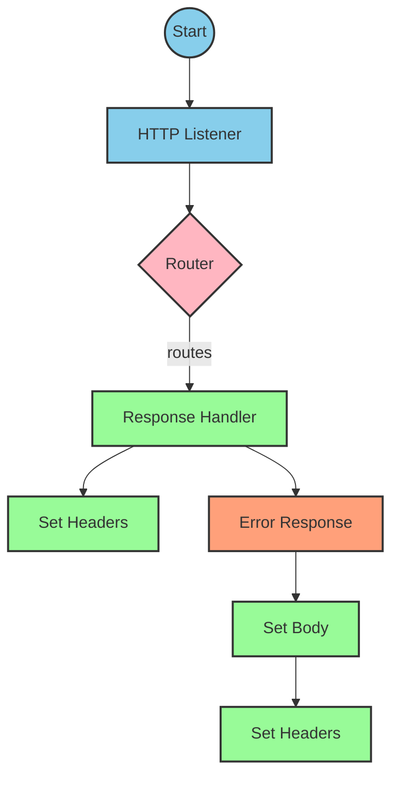
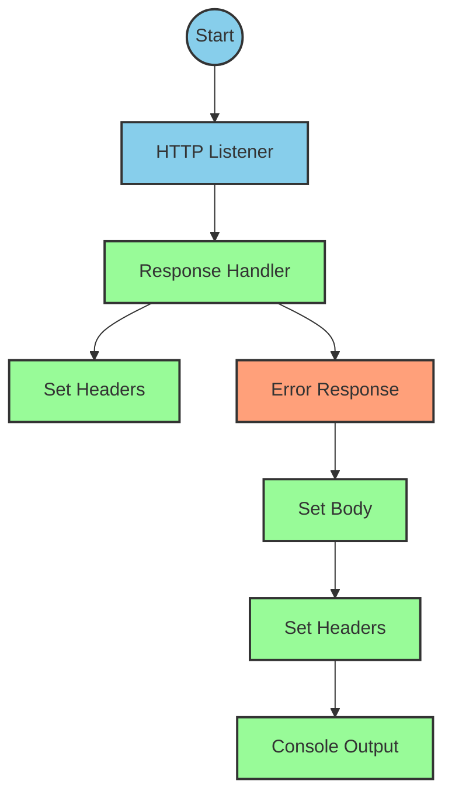
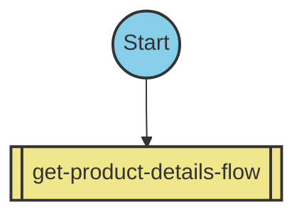

# API Overview
- This API provides product details from an SAP HANA database
- Base URL pattern: `/products`

# Endpoints

## GET /products
- **Purpose**: Retrieves product details based on a product identifier
- **Query Parameters**: 
  - `productIdentifier` (required): The unique identifier of the product
- **Response Format**: JSON
- **Status Codes**:
  - 200: Success
  - 400: Bad Request
  - 404: Product Not Found
- **Response Body**: Product details or error message

# Current MuleSoft Flow Logic

The application consists of three main flows and one subflow:

## 1. products-main Flow
Triggered by an HTTP request to the base endpoint. This flow handles the initial routing of requests.

## 2. products-console Flow
Triggered by an HTTP request to a console endpoint. This flow logs information to the console.

## 3. get:\products:products-config Flow
Triggered when a GET request is made to the `/products` endpoint. This flow references the `get-product-details-flow` subflow.

## 4. get-product-details-flow Subflow
This is the core processing flow that:
1. Validates if the requested product identifier is in the allowed list
2. If valid, queries the SAP HANA database using OData parameters
3. If invalid, returns an error message

Key processing steps:
1. Validates the product identifier against a configured list
   ```
   %dw 2.0
   output application/java
   var productidentifer=p('odata.productIdentifiers') splitBy(",")
   ---
   sizeOf(productidentifer filter ($ == attributes.queryParams.productIdentifier))>0
   ```

2. If valid, constructs an OData query with these exact parameters:
   - `$filter`: `ProductId eq '" ++ (attributes.queryParams.productIdentifier default '') ++ "'`
   - `$select`: `ProductId,Category,CategoryName,CurrencyCode,DimensionDepth,DimensionHeight,DimensionUnit,DimensionWidth,LongDescription,Name,PictureUrl,Price,QuantityUnit,ShortDescription,SupplierId,Weight,WeightUnit`

3. The OData query parameters are constructed using this DataWeave expression:
   ```
   #[output application/java
   ---
   {
     "$filter" : "ProductId eq '" ++ (attributes.queryParams.productIdentifier default '') ++ "'",
     "$select" : "ProductId,Category,CategoryName,CurrencyCode,DimensionDepth,DimensionHeight,DimensionUnit,DimensionWidth,LongDescription,Name,PictureUrl,Price,QuantityUnit,ShortDescription,SupplierId,Weight,WeightUnit"
   }]
   ```

4. Transforms the response payload:
   ```
   %dw 2.0
   output application/json
   ---
   payload
   ```

5. If the product identifier is invalid, returns an error response:
   ```
   %dw 2.0
   output application/json
   ---
   {
     status: "error",
     message: "The product identifier " ++ attributes.queryParams.productIdentifier ++ " was not found.",
     errorCode: "PRODUCT_NOT_FOUND"
   }
   ```

# DataWeave Transformations Explained

## 1. Product Identifier Validation
```
%dw 2.0
output application/java
var productidentifer=p('odata.productIdentifiers') splitBy(",")
---
sizeOf(productidentifer filter ($ == attributes.queryParams.productIdentifier))>0
```

This transformation:
- Takes a comma-separated list of allowed product identifiers from a property `odata.productIdentifiers`
- Splits it into an array using `splitBy(",")`
- Filters the array to find matches with the requested product identifier
- Returns true if at least one match is found (size > 0)
- The result is stored in a variable called `isExistProduct`

## 2. OData Query Parameters Construction
```
#[output application/java
---
{
  "$filter" : "ProductId eq '" ++ (attributes.queryParams.productIdentifier default '') ++ "'",
  "$select" : "ProductId,Category,CategoryName,CurrencyCode,DimensionDepth,DimensionHeight,DimensionUnit,DimensionWidth,LongDescription,Name,PictureUrl,Price,QuantityUnit,ShortDescription,SupplierId,Weight,WeightUnit"
}]
```

This transformation:
- Creates a Java map with two OData query parameters
- `$filter` parameter uses the product identifier from the query parameters to filter results
- `$select` parameter specifies all the fields to be returned from the database
- Uses the `default ''` operator to handle cases where productIdentifier might be null

## 3. Response Payload Pass-through
```
%dw 2.0
output application/json
---
payload
```

This transformation:
- Simply passes through the payload from the HTTP request to the response
- Converts the format to JSON

## 4. Error Response Construction
```
%dw 2.0
output application/json
---
{
  status: "error",
  message: "The product identifier " ++ attributes.queryParams.productIdentifier ++ " was not found.",
  errorCode: "PRODUCT_NOT_FOUND"
}
```

This transformation:
- Creates a JSON error response object
- Includes the invalid product identifier in the error message
- Sets a specific error code "PRODUCT_NOT_FOUND"

# SAP Integration Suite Implementation

## Component Mapping

| MuleSoft Component | SAP Integration Suite Equivalent |
|--------------------|----------------------------------|
| HTTP Listener | HTTPS Adapter (Server) |
| Router | Content Modifier + Router |
| Flow Reference | Process Call |
| Transform Message | Message Mapping |
| Logger | Write to Log |
| HTTP Request | OData Adapter (Client) |
| Set Variable | Content Modifier |
| Choice/When/Otherwise | Router |
| Error Handler | Exception Subprocess |

## Integration Flow Visualization







```mermaid
flowchart TD
%% Define node styles
classDef httpAdapter fill:#87CEEB,stroke:#333,stroke-width:2px
classDef contentModifier fill:#98FB98,stroke:#333,stroke-width:2px
classDef router fill:#FFB6C1,stroke:#333,stroke-width:2px
classDef mapping fill:#DDA0DD,stroke:#333,stroke-width:2px
classDef exception fill:#FFA07A,stroke:#333,stroke-width:2px
classDef processCall fill:#F0E68C,stroke:#333,stroke-width:2px

%% Flow: get-product-details-flow
start4((Start)) --> transform1[Validate Product ID]:::mapping
transform1 --> message1[Message]:::contentModifier
message1 --> variables[Set Variables]:::contentModifier
variables --> setVar[Set isExistProduct]:::contentModifier
setVar --> choice{Product Exists?}:::router

choice -->|Yes| logger1[Log Valid Product]:::contentModifier
logger1 --> request[OData Request]:::httpAdapter
request --> queryParams[Set Query Params]:::contentModifier
queryParams --> transform2[Transform Response]:::mapping
transform2 --> message2[Message]:::contentModifier
message2 --> setPayload1[Set Payload]:::contentModifier

choice -->|No| logger2[Log Invalid Product]:::contentModifier
logger2 --> transform3[Create Error Response]:::mapping
transform3 --> message3[Message]:::contentModifier
message3 --> setPayload2[Set Payload]:::contentModifier

setPayload1 --> end((End))
setPayload2 --> end
```

## Configuration Details

### HTTP Listener Configuration
- Component: HTTPS Adapter (Server)
- Parameters:
  - Address: `/products`
  - Authentication: None (or as required)
  - CSRF Protection: As required

### OData Request Configuration
- Component: OData Adapter (Client)
- Parameters:
  - Connection: SAP HANA Connection
  - Query Parameters:
    - $filter: Dynamic based on product identifier
    - $select: All product fields as specified in the original flow

### Router Configuration
- Component: Router
- Condition: `#{vars.isExistProduct}`
- Routes:
  - True route: Process valid product request
  - False route: Return error response

### Content Modifiers
- Set Variable (isExistProduct):
  - Name: isExistProduct
  - Value: Result of product validation expression
- Set Headers:
  - Content-Type: application/json

### Message Mapping
- Product Validation Mapping:
  - Source: Property `odata.productIdentifiers`
  - Target: Boolean value
- Error Response Mapping:
  - Source: Product identifier
  - Target: JSON error structure

# Configuration

## Important Configuration Parameters
- `odata.productIdentifiers`: Comma-separated list of valid product identifiers
- HTTP Listener configuration: `HTTP_Listener_config`
- HTTP Request configuration: `Hana_HTTP_Request_Configuration`
- API configuration: `products-config` referencing `products.raml`

## Error Handling
The application implements a global error handler (`Gobal_Error_Handler`) that handles various APIKIT errors:
- APIKIT:BAD_REQUEST
- APIKIT:NOT_FOUND
- APIKIT:METHOD_NOT_ALLOWED
- APIKIT:NOT_ACCEPTABLE
- APIKIT:UNSUPPORTED_MEDIA_TYPE
- APIKIT:NOT_IMPLEMENTED

Each error is handled using on-error-propagate strategy.