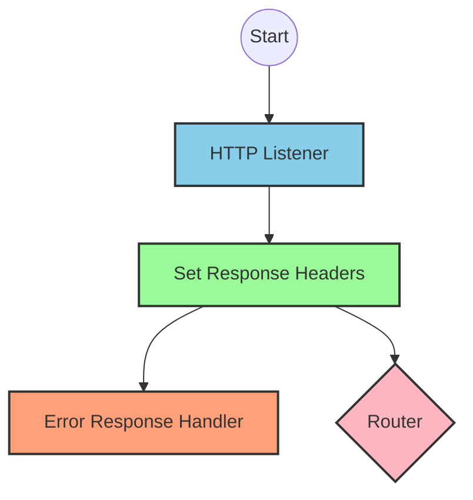
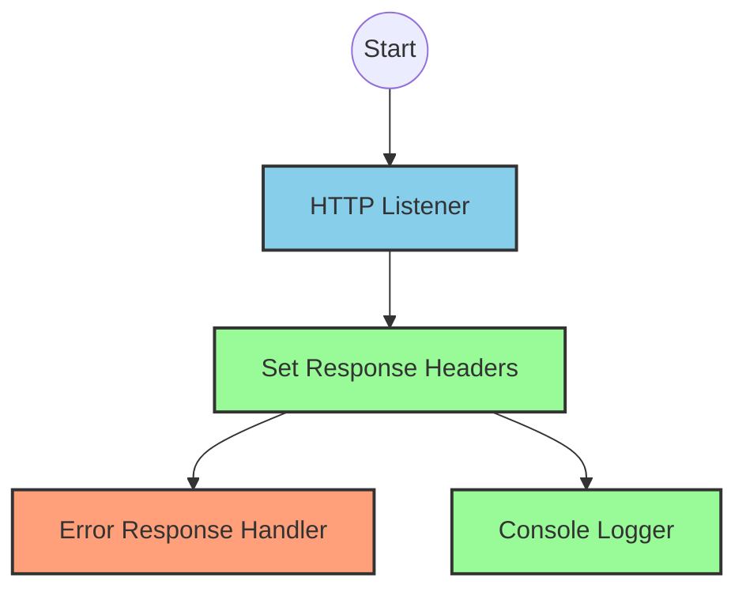
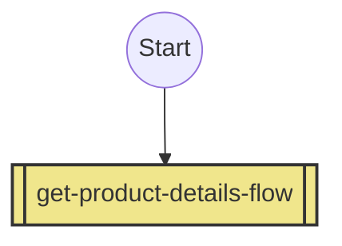
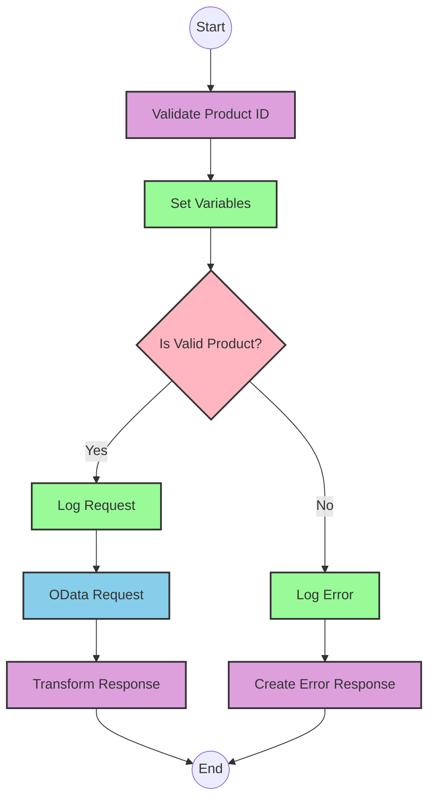

# API Overview
- This API provides product details from an SAP HANA database
- Base URL pattern: `/products`

# Endpoints

## GET /products
- **Purpose**: Retrieves product details based on a product identifier
- **Query Parameters**:
  - `productIdentifier` (required): The unique identifier for the product
- **Response Format**: JSON
- **Status Codes**:
  - 200: Success
  - 400: Bad Request
  - 404: Product Not Found
- **Response Body**:
  - Success: Product details including ProductId, Category, CategoryName, etc.
  - Error: JSON object with status, message, and errorCode

# Current MuleSoft Flow Logic

## Flow: products-main
This is the main entry point for the API. It:
1. Is triggered by an HTTP listener
2. Sets up response headers
3. Handles error responses
4. Routes requests to appropriate handlers based on the API specification

## Flow: products-console
This flow appears to be a console/logging version of the API that:
1. Is triggered by an HTTP listener
2. Sets up response headers
3. Handles error responses
4. Logs information to the console

## Flow: get:\products:products-config
This flow:
1. Is triggered when a GET request is made to the `/products` endpoint
2. References the `get-product-details-flow` subflow to process the request

## Subflow: get-product-details-flow
This subflow:
1. Validates if the provided product identifier is valid
2. If valid:
   - Logs the request
   - Makes an OData request to retrieve product details with specific filters and select parameters
   - Returns the product data
3. If invalid:
   - Logs an error
   - Returns an error response

The flow uses these key technical components:
- DataWeave transformations to validate product identifiers and format responses
- OData query parameters with specific $filter and $select expressions
- Error handling for invalid product identifiers

# DataWeave Transformations Explained

## Product Identifier Validation Transformation
This transformation checks if the provided product identifier is in the list of allowed product identifiers.

**Input**: The product identifier from query parameters
**Output**: Boolean value indicating if the product identifier is valid

```dw
%dw 2.0
output application/java
var productidentifer=p('odata.productIdentifiers') splitBy(",")
---
sizeOf(productidentifer filter ($ == attributes.queryParams.productIdentifier))>0
```

The transformation:
1. Retrieves a comma-separated list of valid product identifiers from a property
2. Splits the string into an array
3. Filters the array to find matches with the provided product identifier
4. Returns true if at least one match is found (size > 0)

## OData Query Parameters Transformation
This transformation constructs the OData query parameters for retrieving product details.

**Input**: The product identifier from query parameters
**Output**: OData query parameters as a Java map

```dw
#[output application/java
---
{
	"$filter" : "ProductId eq '" ++ (attributes.queryParams.productIdentifier default '') ++ "'",
	"$select" : "ProductId,Category,CategoryName,CurrencyCode,DimensionDepth,DimensionHeight,DimensionUnit,DimensionWidth,LongDescription,Name,PictureUrl,Price,QuantityUnit,ShortDescription,SupplierId,Weight,WeightUnit"
}]
```

The transformation:
1. Creates a filter expression that matches the exact product identifier
2. Specifies which fields to select from the product data
3. Outputs a Java map that will be used as query parameters in the HTTP request

## Success Response Transformation
This transformation passes through the payload from the OData response.

```dw
%dw 2.0
output application/json
---
payload
```

## Error Response Transformation
This transformation creates an error response when the product identifier is invalid.

**Input**: The invalid product identifier from query parameters
**Output**: JSON error object

```dw
%dw 2.0
output application/json
---
{
	status: "error",
	message: "The product identifier " ++ attributes.queryParams.productIdentifier ++ " was not found.",
	errorCode: "PRODUCT_NOT_FOUND"
}
```

The transformation:
1. Creates a structured error response with status, message, and error code
2. Includes the invalid product identifier in the error message

# SAP Integration Suite Implementation

## Component Mapping

| MuleSoft Component | SAP Integration Suite Equivalent |
|--------------------|----------------------------------|
| HTTP Listener | HTTPS Adapter (Server) |
| Router | Content Modifier + Router |
| Flow Reference | Process Call |
| DataWeave Transform | Groovy Script or Message Mapping |
| Logger | Write to Log |
| HTTP Request | HTTPS Adapter (Client) or OData Adapter |
| Set Variable | Content Modifier |
| Choice/When/Otherwise | Router |
| Error Handler | Exception Subprocess |

## Integration Flow Visualization









## Configuration Details

### HTTPS Adapter (Server)
- **Connection Type**: Server
- **Address**: `/products`
- **Authentication**: As per source system requirements
- **CSRF Protection**: Disabled

### OData Adapter (Client)
- **Connection Type**: Client
- **Service**: SAP HANA OData Service
- **Query Parameters**:
  - **$filter**: `ProductId eq '{productIdentifier}'`
  - **$select**: `ProductId,Category,CategoryName,CurrencyCode,DimensionDepth,DimensionHeight,DimensionUnit,DimensionWidth,LongDescription,Name,PictureUrl,Price,QuantityUnit,ShortDescription,SupplierId,Weight,WeightUnit`

### Content Modifier (Set Variables)
- **Variable Name**: `isExistProduct`
- **Value Type**: Expression
- **Value**: Result of product identifier validation script

### Router (Choice)
- **Condition 1**: `${property.isExistProduct} = true`
- **Default Route**: Error path

### Groovy Script (Product Validation)
```groovy
def productIdentifiers = property.get("odata.productIdentifiers").split(",")
def requestedProductId = message.getHeaders().get("productIdentifier")
return productIdentifiers.any { it == requestedProductId }
```

### Groovy Script (Error Response)
```groovy
def productId = message.getHeaders().get("productIdentifier")
def response = [
    status: "error",
    message: "The product identifier " + productId + " was not found.",
    errorCode: "PRODUCT_NOT_FOUND"
]
return groovy.json.JsonOutput.toJson(response)
```

# Configuration

## Required Properties
- `odata.productIdentifiers`: Comma-separated list of valid product identifiers

## External System Dependencies
- SAP HANA OData service for product data retrieval

## Security Settings
- HTTP Listener configuration with appropriate security settings
- HTTP Request configuration for connecting to SAP HANA

## Error Handling
- Global error handler for API Kit errors:
  - APIKIT:BAD_REQUEST
  - APIKIT:NOT_FOUND
  - APIKIT:METHOD_NOT_ALLOWED
  - APIKIT:NOT_ACCEPTABLE
  - APIKIT:UNSUPPORTED_MEDIA_TYPE
  - APIKIT:NOT_IMPLEMENTED