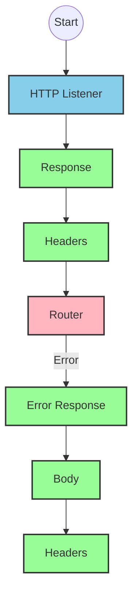
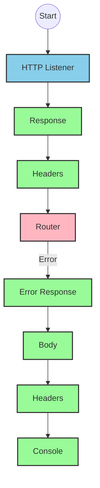
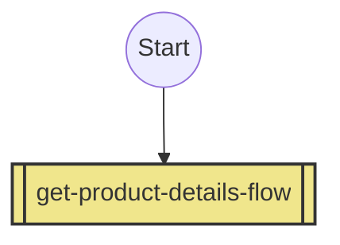
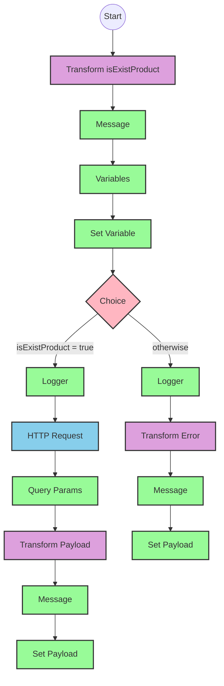

# API Overview
- This API provides product information from an SAP HANA database
- Base URL pattern: `/products`

# Endpoints

## GET /products
- **Purpose**: Retrieves product details based on a product identifier
- **Query Parameters**:
  - `productIdentifier` (required): The unique identifier for the product
- **Response Format**: JSON
- **Status Codes**:
  - 200: Success
  - 400: Bad Request
  - 404: Product Not Found
- **Response Body**: Product details including ProductId, Category, CategoryName, CurrencyCode, dimensions, descriptions, price, and other attributes

# Current MuleSoft Flow Logic

## Flow: products-main
This is the main API flow that handles incoming requests.
1. **Trigger**: HTTP listener
2. **Processing**: Routes requests to appropriate handlers
3. **Response**: Returns formatted responses with appropriate headers
4. **Error Handling**: Provides error responses with appropriate status codes and headers

## Flow: products-console
This flow appears to be a console/logging version of the main flow.
1. **Trigger**: HTTP listener
2. **Processing**: Logs request information to console
3. **Response**: Returns formatted responses with appropriate headers
4. **Error Handling**: Provides error responses with appropriate status codes and headers

## Flow: get:\products:products-config
This flow handles GET requests to the /products endpoint.
1. **Trigger**: HTTP GET request to /products
2. **Processing**: References the get-product-details-flow subflow

## Subflow: get-product-details-flow
This subflow retrieves product details based on the provided product identifier.
1. **Validation**: Checks if the provided product identifier is valid
2. **Processing**:
   - If valid: Makes an OData request to retrieve product details
   - If invalid: Returns an error message
3. **Data Transformation**: Transforms the response to JSON format

The flow includes these key technical elements:
- **OData Query Parameters**:
  - `$filter`: `ProductId eq '" ++ (attributes.queryParams.productIdentifier default '') ++ "'`
  - `$select`: `ProductId,Category,CategoryName,CurrencyCode,DimensionDepth,DimensionHeight,DimensionUnit,DimensionWidth,LongDescription,Name,PictureUrl,Price,QuantityUnit,ShortDescription,SupplierId,Weight,WeightUnit`

# DataWeave Transformations Explained

## Transformation 1: Validate Product Identifier
This transformation checks if the provided product identifier is in the list of valid product identifiers.

```dw
%dw 2.0
output application/java
var productidentifer=p('odata.productIdentifiers') splitBy(",")
---
sizeOf(productidentifer filter ($ == attributes.queryParams.productIdentifier))>0
```

- **Input**: The product identifier from query parameters
- **Output**: Boolean value indicating if the product identifier is valid
- **Key Operations**:
  - Retrieves valid product identifiers from a property (`odata.productIdentifiers`)
  - Splits the string into an array using comma as delimiter
  - Filters the array to find matches with the provided product identifier
  - Returns true if at least one match is found (size > 0)

## Transformation 2: OData Query Parameters
This transformation constructs the OData query parameters for retrieving product details.

```dw
#[output application/java
---
{
	"$filter" : "ProductId eq '" ++ (attributes.queryParams.productIdentifier default '') ++ "'",
	"$select" : "ProductId,Category,CategoryName,CurrencyCode,DimensionDepth,DimensionHeight,DimensionUnit,DimensionWidth,LongDescription,Name,PictureUrl,Price,QuantityUnit,ShortDescription,SupplierId,Weight,WeightUnit"
}]
```

- **Input**: The product identifier from query parameters
- **Output**: OData query parameters as a Java map
- **Key Operations**:
  - Constructs a filter expression to match the exact product identifier
  - Specifies the fields to be returned in the response

## Transformation 3: Pass-through Transformation
This transformation simply passes the payload through without modification.

```dw
%dw 2.0
output application/json
---
payload
```

- **Input**: The response from the OData request
- **Output**: The same payload in JSON format
- **Key Operations**: None (direct pass-through)

## Transformation 4: Error Response Transformation
This transformation constructs an error response when the product identifier is invalid.

```dw
%dw 2.0
output application/json
---
{
	status: "error",
	message: "The product identifier " ++ attributes.queryParams.productIdentifier ++ " was not found.",
	errorCode: "PRODUCT_NOT_FOUND"
}
```

- **Input**: The product identifier from query parameters
- **Output**: JSON error response
- **Key Operations**:
  - Constructs a standardized error response with status, message, and error code
  - Includes the invalid product identifier in the error message

# SAP Integration Suite Implementation

## Component Mapping

| MuleSoft Component | SAP Integration Suite Equivalent | Notes |
|--------------------|----------------------------------|-------|
| HTTP Listener | HTTPS Adapter (Server) | Configure with the same path and method |
| Router | Content Modifier + Router | Use a Content Modifier to set properties and a Router for conditional processing |
| Flow Reference | Process Call | References another integration flow |
| Transform | Message Mapping | Maps data between different formats |
| Logger | Write to Message Log | Logs messages to the integration flow log |
| Set Variable | Content Modifier | Sets variables in the message header |
| Choice/When/Otherwise | Router | Implements conditional processing |
| HTTP Request | HTTPS Adapter (Client) | Makes outbound HTTP requests |
| Set Payload | Content Modifier | Sets the message body |
| Error Handler | Exception Subprocess | Handles errors in the integration flow |

## Integration Flow Visualization









## Configuration Details

### HTTP Listener Configuration
- **Component**: HTTPS Adapter (Server)
- **Parameters**:
  - Name: HTTP_Listener_config
  - Port: 8081 (default)
  - Host: 0.0.0.0 (default)
  - Path: /api/* (to be configured)

### HTTP Request Configuration
- **Component**: HTTPS Adapter (Client)
- **Parameters**:
  - Name: Hana_HTTP_Request_Configuration
  - Base URL: [SAP HANA OData service URL]
  - Authentication: Basic Authentication (to be configured)
  - Query Parameters:
    - $filter: ProductId eq '[productIdentifier]'
    - $select: ProductId,Category,CategoryName,CurrencyCode,DimensionDepth,DimensionHeight,DimensionUnit,DimensionWidth,LongDescription,Name,PictureUrl,Price,QuantityUnit,ShortDescription,SupplierId,Weight,WeightUnit

### Router Configuration
- **Component**: Router
- **Conditions**:
  - When: ${header.isExistProduct} = true
  - Otherwise: Default route

### Content Modifier (Set Variable)
- **Component**: Content Modifier
- **Parameters**:
  - Action: Create
  - Name: isExistProduct
  - Value: [Result of product identifier validation]

### Message Mapping (Transform)
- **Component**: Message Mapping
- **Parameters**:
  - Source Format: XML/JSON (depending on input)
  - Target Format: JSON
  - Mapping: As per the DataWeave transformations

# Configuration

## Important Configuration Parameters
- **odata.productIdentifiers**: Comma-separated list of valid product identifiers (from property file)

## Error Handling
- **Global Error Handler**: Handles various API Kit errors:
  - APIKIT:BAD_REQUEST
  - APIKIT:NOT_FOUND
  - APIKIT:METHOD_NOT_ALLOWED
  - APIKIT:NOT_ACCEPTABLE
  - APIKIT:UNSUPPORTED_MEDIA_TYPE
  - APIKIT:NOT_IMPLEMENTED

## Dependencies
- SAP HANA OData service for product information
- HTTP connectivity to the SAP HANA system