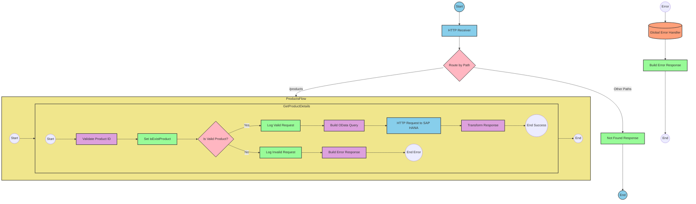

# SAP Integration Suite Implementation for Product API

# Document Navigation
- [API Overview](#api-overview)
- [Endpoints](#endpoints)
  - [GET /products](#get-products)
- [Current MuleSoft Flow Logic](#current-mulesoft-flow-logic)
  - [products-main Flow](#products-main-flow)
  - [products-console Flow](#products-console-flow)
  - [get:\products:products-config Flow](#getproductsproducts-config-flow)
  - [get-product-details-flow Subflow](#get-product-details-flow-subflow)
- [DataWeave Transformations Explained](#dataweave-transformations-explained)
  - [Product Identifier Validation](#product-identifier-validation)
  - [OData Query Parameters](#odata-query-parameters)
  - [Response Payload Transformation](#response-payload-transformation)
  - [Error Response Transformation](#error-response-transformation)
- [SAP Integration Suite Implementation](#sap-integration-suite-implementation)
  - [Component Mapping](#component-mapping)
  - [Integration Flow Visualization](#integration-flow-visualization)
- [Configuration Details](#configuration-details)
- [Configuration](#configuration)

# API Overview
This API provides access to product information from an SAP HANA backend system. It allows clients to retrieve product details by specifying a product identifier. The API validates the product identifier against a configured list of valid identifiers before retrieving the data from the SAP HANA system.

- Base URL: http://localhost:8081/api/v1

# Endpoints

## GET /products
This endpoint retrieves product details based on the provided product identifier.

**Request Parameters:**
- Query Parameters:
  - `productIdentifier` (required): The unique identifier of the product to retrieve

**Response Format:**
- Content-Type: application/json
- Status Codes:
  - 200: Success - Returns product details
  - 400: Bad Request - Invalid input parameters
  - 404: Not Found - Product identifier not found
  - 500: Internal Server Error - Server-side error

**Example Response (200):**
```json
{
  "ProductId": "HT-2000",
  "Category": "Notebooks",
  "CategoryName": "Notebooks",
  "CurrencyCode": "USD",
  "DimensionDepth": 30,
  "DimensionHeight": 3,
  "DimensionUnit": "cm",
  "DimensionWidth": 40,
  "LongDescription": "Notebook Basic 17 with 2,80 GHz quad core, 17\" LCD, 4 GB DDR3 RAM, 500 GB Hard Disc, Windows 8 Pro",
  "Name": "Notebook Basic 17",
  "PictureUrl": "/sap/public/bc/NWDEMO_MODEL/IMAGES/HT-2000.jpg",
  "Price": 1249,
  "QuantityUnit": "EA",
  "ShortDescription": "Notebook Basic 17 with 2,80 GHz quad core, 17\" LCD, 4 GB DDR3 RAM, 500 GB Hard Disc",
  "SupplierId": "0100000046",
  "Weight": 4.5,
  "WeightUnit": "KG"
}
```

**Example Response (404):**
```json
{
  "status": "error",
  "message": "The product identifier HT-9999 was not found.",
  "errorCode": "PRODUCT_NOT_FOUND"
}
```

# Current MuleSoft Flow Logic

## products-main Flow
This is the main entry point for the API. It handles HTTP requests and routes them to the appropriate flow based on the request path.

1. **Trigger**: HTTP Listener configured to listen on `/api/v1/*`
2. **Processing Steps**:
   - Sets response headers
   - Routes requests to appropriate handlers based on path
   - Handles errors and formats error responses

## products-console Flow
This flow is similar to the main flow but includes console logging for debugging purposes.

1. **Trigger**: HTTP Listener (likely for development/debugging)
2. **Processing Steps**:
   - Sets response headers
   - Logs request details to console
   - Handles errors and formats error responses

## get:\products:products-config Flow
This flow handles GET requests to the `/products` endpoint.

1. **Trigger**: Routed from the main flow when a GET request to `/products` is received
2. **Processing Steps**:
   - Calls the `get-product-details-flow` subflow to process the request

## get-product-details-flow Subflow
This subflow handles the core business logic for retrieving product details.

1. **Trigger**: Called from the `get:\products:products-config` flow
2. **Processing Steps**:
   - Validates the product identifier against a configured list of valid identifiers
   - If valid, constructs an OData query to retrieve product details from SAP HANA
   - If invalid, returns an error response
3. **Data Transformations**:
   - Transforms the product identifier validation result
   - Constructs OData query parameters
   - Transforms the response payload
4. **Expected Outcomes**:
   - Success: Returns product details in JSON format
   - Error: Returns an error message with appropriate status code

# DataWeave Transformations Explained

## Product Identifier Validation
This transformation checks if the provided product identifier exists in the configured list of valid identifiers.

**Input**: The product identifier from the query parameter and the configured list of valid identifiers
**Output**: A boolean indicating whether the product identifier is valid

```dw
%dw 2.0
output application/java
var productidentifer=p('odata.productIdentifiers') splitBy(",")
---
sizeOf(productidentifer filter ($ == attributes.queryParams.productIdentifier))>0
```

**Explanation**:
1. The transformation retrieves the list of valid product identifiers from the configuration (`odata.productIdentifiers`)
2. It splits this comma-separated string into an array using `splitBy(",")`
3. It then filters this array to find elements that match the provided product identifier
4. Finally, it checks if the size of the filtered array is greater than 0, returning true if a match is found

## OData Query Parameters
This transformation constructs the OData query parameters for retrieving product details.

**Input**: The product identifier from the query parameter
**Output**: A map of OData query parameters

```dw
#[output application/java
---
{
	"$filter" : "ProductId eq '" ++ (attributes.queryParams.productIdentifier default '') ++ "'",
	"$select" : "ProductId,Category,CategoryName,CurrencyCode,DimensionDepth,DimensionHeight,DimensionUnit,DimensionWidth,LongDescription,Name,PictureUrl,Price,QuantityUnit,ShortDescription,SupplierId,Weight,WeightUnit"
}]
```

**Explanation**:
1. The transformation creates a map with two OData query parameters:
   - `$filter`: Constructs a filter expression to match the product identifier
   - `$select`: Specifies the fields to retrieve from the product entity
2. The filter expression uses string concatenation (`++`) to embed the product identifier in the filter condition
3. The `default ''` ensures that if the product identifier is not provided, an empty string is used

## Response Payload Transformation
This transformation passes through the response payload from the SAP HANA system.

**Input**: The response from the SAP HANA system
**Output**: The same response in JSON format

```dw
%dw 2.0
output application/json
---
payload
```

**Explanation**:
This is a simple pass-through transformation that converts the payload to JSON format without modifying its structure.

## Error Response Transformation
This transformation constructs an error response when the product identifier is invalid.

**Input**: The product identifier from the query parameter
**Output**: A JSON error response

```dw
%dw 2.0
output application/json
---
{
	status: "error",
	message: "The product identifier " ++ attributes.queryParams.productIdentifier ++ " was not found.",
	errorCode: "PRODUCT_NOT_FOUND"
}
```

**Explanation**:
1. The transformation creates a JSON object with three fields:
   - `status`: Set to "error" to indicate an error condition
   - `message`: A descriptive error message that includes the invalid product identifier
   - `errorCode`: A specific error code ("PRODUCT_NOT_FOUND") for client applications to handle

# SAP Integration Suite Implementation

## Component Mapping

| MuleSoft Component | SAP Integration Suite Equivalent | Notes |
|--------------------|----------------------------------|-------|
| HTTP Listener | HTTPS Adapter (Receiver) | Configure with the same path and port |
| Router | Content Modifier with Router | Use a Content Modifier to set properties and a Router for conditional branching |
| Flow Reference | Process Call | Used to call other integration flows |
| Transform | Message Mapping | Use for DataWeave transformations |
| Logger | Write to Message Log | For logging messages to the integration flow log |
| Set Variable | Content Modifier | Use to set exchange properties |
| Choice/When/Otherwise | Router | Use for conditional branching |
| HTTP Request | HTTPS Adapter (Sender) | Configure with the same endpoint and parameters |
| Set Payload | Content Modifier | Use to set the message body |
| Error Handler | Exception Subprocess | Handle errors and format error responses |

## REST API Integration Flow: Product API



# Configuration Details

## HTTP Receiver Adapter
- **Address**: `/api/v1/*`
- **Port**: 8081 (from dev.yaml)
- **Authentication**: None (based on source)
- **CSRF Protection**: Disabled (based on source)

## HTTP Sender Adapter (SAP HANA)
- **Address**: `refapp-espm-ui-cf.cfapps.eu10.hana.ondemand.com` (from dev.yaml)
- **Port**: 443 (from dev.yaml)
- **Path**: `/espm-cloud-web/espm.svc/Products` (from dev.yaml)
- **Authentication**: None (based on source)
- **Query Parameters**: Dynamically set based on product identifier

## Content Modifiers
1. **Set isExistProduct**:
   - Type: Exchange Property
   - Name: isExistProduct
   - Value: Result of product identifier validation

2. **Build OData Query**:
   - Type: Query Parameters
   - Parameters:
     - $filter: `ProductId eq '{productIdentifier}'`
     - $select: `ProductId,Category,CategoryName,CurrencyCode,DimensionDepth,DimensionHeight,DimensionUnit,DimensionWidth,LongDescription,Name,PictureUrl,Price,QuantityUnit,ShortDescription,SupplierId,Weight,WeightUnit`

3. **Build Error Response**:
   - Type: Message Body
   - Content Type: application/json
   - Body: Error response JSON structure

## Message Mappings
1. **Validate Product ID**:
   - Source: Exchange Properties
   - Target: Exchange Property (isExistProduct)
   - Mapping: Implementation of the product identifier validation logic

2. **Transform Response**:
   - Source: HTTP Response Body
   - Target: Message Body
   - Mapping: Pass-through transformation

3. **Build Error Response**:
   - Source: Exchange Properties
   - Target: Message Body
   - Mapping: Construction of error response JSON

## Router
- **Is Valid Product?**:
  - Condition 1: ${property.isExistProduct} equals true
  - Condition 2: Default (otherwise)

## Process Calls
- **GET /products Flow**: Calls the main product retrieval flow
- **get-product-details Flow**: Implements the product details retrieval logic

## Exception Subprocess
- **Global Error Handler**:
  - Handles various error types (APIKIT:BAD_REQUEST, APIKIT:NOT_FOUND, etc.)
  - Constructs appropriate error responses based on error type

# Configuration

## Environment Variables
From dev.yaml:
```yaml
api:
  listener:
    port: "8081"
    path: /api/v1/*
    
hana:
  espm:
    url: refapp-espm-ui-cf.cfapps.eu10.hana.ondemand.com
    port: "443"
    path: /espm-cloud-web/espm.svc/Products
    
odata:
  productIdentifiers: "HT-2000,HT-2001"
```

## Dependencies on External Systems
- **SAP HANA System**: The integration depends on the SAP HANA OData service at `refapp-espm-ui-cf.cfapps.eu10.hana.ondemand.com` to retrieve product information.

## Security Settings
- The integration uses HTTPS for communication with the SAP HANA system (port 443).
- No explicit authentication mechanisms are defined in the source documentation.
- For production deployment, appropriate authentication and authorization mechanisms should be configured.