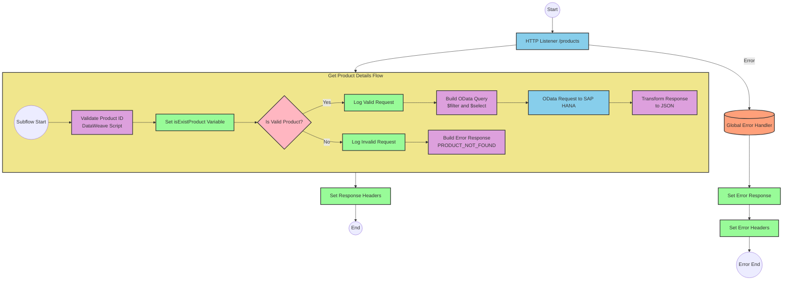

# SAP HANA Product Information API Integration

## Table of Contents
- [SAP HANA Product Information API Integration](#sap-hana-product-information-api-integration)
  - [Table of Contents](#table-of-contents)
  - [API Overview](#api-overview)
  - [Endpoints](#endpoints)
    - [GET /products](#get-products)
  - [Current MuleSoft Flow Logic](#current-mulesoft-flow-logic)
    - [Main Flows](#main-flows)
    - [Subflows](#subflows)
  - [DataWeave Transformations Explained](#dataweave-transformations-explained)
    - [Product Identifier Validation](#product-identifier-validation)
    - [OData Query Parameters Construction](#odata-query-parameters-construction)
    - [Product Not Found Error Response](#product-not-found-error-response)
    - [Response Transformation](#response-transformation)
  - [SAP Integration Suite Implementation](#sap-integration-suite-implementation)
    - [Component Mapping](#component-mapping)
    - [Integration Flow Visualization](#integration-flow-visualization)
    - [Configuration Details](#configuration-details)
  - [Environment Configuration](#environment-configuration)
  - [API Reference](#api-reference)
    - [GET /products](#get-products-1)
    - [Error Codes](#error-codes)

## API Overview
- This API provides product information from an SAP HANA database based on a product identifier
- Base URL: Determined by the HTTP listener configuration
- Authentication: Not explicitly defined in the source documentation
- Response Format: JSON
- The API validates product identifiers against a configured list and retrieves detailed product information from SAP HANA using OData queries

## Endpoints

### GET /products
- **Purpose**: Retrieves detailed product information based on a product identifier
- **Query Parameters**:
  - `productIdentifier` (required): The unique identifier of the product to retrieve
- **Response Format**: JSON
- **Status Codes**:
  - 200: Success - Product information retrieved successfully
  - 400: Error - Invalid or missing product identifier
- **Error Handling**:
  - Returns a structured error response with status, message, and errorCode fields when the product identifier is invalid or not found

## Current MuleSoft Flow Logic

### Main Flows

1. **products-main**
   - Triggered by an HTTP request to the API
   - Handles routing to appropriate endpoints
   - Manages response headers and error responses

2. **products-console**
   - Similar to products-main but includes console logging
   - Used for debugging and monitoring purposes

3. **get:\products:products-config**
   - Triggered when a GET request is made to the /products endpoint
   - References the get-product-details-flow subflow to process the request

### Subflows

**get-product-details-flow**
1. Validates if the provided product identifier exists in the configured list
   - Uses a DataWeave transformation to check if the product identifier is valid
   - Sets a variable `isExistProduct` based on the validation result

2. Conditional processing based on validation result:
   - If the product identifier is valid:
     - Logs the request with the product identifier
     - Constructs an OData query with $filter and $select parameters
     - Makes a request to the SAP HANA system
     - Transforms the response to JSON format
   - If the product identifier is invalid:
     - Logs an error message
     - Returns an error response with appropriate status and message

3. The flow uses specific OData query parameters:
   - `$filter`: `ProductId eq '[productIdentifier]'`
   - `$select`: `ProductId,Category,CategoryName,CurrencyCode,DimensionDepth,DimensionHeight,DimensionUnit,DimensionWidth,LongDescription,Name,PictureUrl,Price,QuantityUnit,ShortDescription,SupplierId,Weight,WeightUnit`

## DataWeave Transformations Explained

### Product Identifier Validation
```dw
%dw 2.0
output application/java
var productidentifer=p('odata.productIdentifiers') splitBy(",")
---
sizeOf(productidentifer filter ($ == attributes.queryParams.productIdentifier))>0
```

This transformation:
1. Retrieves a comma-separated list of valid product identifiers from a property `odata.productIdentifiers`
2. Splits the list into an array
3. Filters the array to find elements matching the requested product identifier
4. Returns true if at least one match is found (size > 0), false otherwise

### OData Query Parameters Construction
```
#[output application/java
---
{
	"$filter" : "ProductId eq '" ++ (attributes.queryParams.productIdentifier default '') ++ "'",
	"$select" : "ProductId,Category,CategoryName,CurrencyCode,DimensionDepth,DimensionHeight,DimensionUnit,DimensionWidth,LongDescription,Name,PictureUrl,Price,QuantityUnit,ShortDescription,SupplierId,Weight,WeightUnit"
}]
```

This transformation:
1. Creates a map of OData query parameters
2. Constructs a $filter parameter that filters products by the requested product identifier
3. Specifies a $select parameter to retrieve specific fields from the product data
4. Uses the `default ''` operator to handle cases where productIdentifier might be null

### Product Not Found Error Response
```dw
%dw 2.0
output application/json
---
{
	status: "error",
	message: "The product identifier " ++ attributes.queryParams.productIdentifier ++ " was not found.",
	errorCode: "PRODUCT_NOT_FOUND"
}
```

This transformation:
1. Creates a JSON error response
2. Includes a status field set to "error"
3. Constructs a message that includes the invalid product identifier
4. Sets an errorCode of "PRODUCT_NOT_FOUND"

### Response Transformation
```dw
%dw 2.0
output application/json
---
payload
```

This simple transformation:
1. Takes the input payload (from the SAP HANA response)
2. Outputs it as JSON without modification

## SAP Integration Suite Implementation

### Component Mapping

| MuleSoft Component | SAP Integration Suite Equivalent | Notes |
|--------------------|----------------------------------|-------|
| HTTP Listener | HTTPS Adapter (Receiver) | Configure with the same path and method settings |
| Flow Router | Router | Used for conditional processing based on validation results |
| Logger | Content Modifier with Write to Log option | Maintains the same log messages |
| Set Variable | Content Modifier | Used to set the isExistProduct variable |
| DataWeave Transform | Groovy Script or Message Mapping | For complex transformations like product validation |
| HTTP Request | OData Adapter (Sender) | Configure with the same OData query parameters |
| Set Payload | Content Modifier | Used to set response payloads |
| Error Handler | Exception Subprocess | Handles API errors with appropriate responses |

### Integration Flow Visualization



### Configuration Details

1. **HTTPS Adapter (Receiver)**
   - Path: `/products`
   - Method: GET
   - Authentication: To be determined based on security requirements

2. **OData Adapter (Sender)**
   - Connection to SAP HANA
   - Query Parameters:
     - $filter: `ProductId eq '[productIdentifier]'`
     - $select: `ProductId,Category,CategoryName,CurrencyCode,DimensionDepth,DimensionHeight,DimensionUnit,DimensionWidth,LongDescription,Name,PictureUrl,Price,QuantityUnit,ShortDescription,SupplierId,Weight,WeightUnit`

3. **Groovy Script (Product Validation)**
   - Input: HTTP request with productIdentifier query parameter
   - Output: Boolean indicating if the product identifier is valid
   - Logic: Check if productIdentifier exists in the configured list

4. **Content Modifier (Set Variable)**
   - Variable Name: isExistProduct
   - Value: Result from product validation script

5. **Router**
   - Condition: `${property.isExistProduct}`
   - True path: Proceed to OData request
   - False path: Generate error response

6. **Content Modifier (Error Response)**
   - Set payload to error JSON structure
   - Set appropriate HTTP status code

## Environment Configuration

1. **Required Properties**
   - `odata.productIdentifiers`: Comma-separated list of valid product identifiers

2. **Connection Details**
   - HTTP Listener Configuration:
     - Host and port for the API endpoint
   - HANA HTTP Request Configuration:
     - Base URL for SAP HANA OData service
     - Authentication credentials or method

3. **Security Settings**
   - Authentication method for SAP HANA connection
   - API security (if applicable)

4. **Error Handling**
   - Global error handler for APIKIT errors:
     - BAD_REQUEST
     - NOT_FOUND
     - METHOD_NOT_ALLOWED
     - NOT_ACCEPTABLE
     - UNSUPPORTED_MEDIA_TYPE
     - NOT_IMPLEMENTED

## API Reference

### GET /products

**Request**
- Method: GET
- Path: `/products`
- Query Parameters:
  - `productIdentifier` (required): The unique identifier of the product to retrieve

**Response**
- Content-Type: application/json
- Status Codes:
  - 200: Success
  - 400: Bad Request
  - 404: Not Found
  - 405: Method Not Allowed
  - 406: Not Acceptable
  - 415: Unsupported Media Type
  - 501: Not Implemented

**Success Response Example**
```json
{
  "ProductId": "HT-1000",
  "Category": "Laptops",
  "CategoryName": "Laptops",
  "CurrencyCode": "USD",
  "DimensionDepth": 30,
  "DimensionHeight": 3,
  "DimensionUnit": "cm",
  "DimensionWidth": 40,
  "LongDescription": "This laptop is perfect for business users...",
  "Name": "Notebook Basic 15",
  "PictureUrl": "/images/HT-1000.jpg",
  "Price": 956.00,
  "QuantityUnit": "EA",
  "ShortDescription": "Notebook Basic 15 with 2,80 GHz quad core",
  "SupplierId": "0100000046",
  "Weight": 4.2,
  "WeightUnit": "kg"
}
```

**Error Response Example**
```json
{
  "status": "error",
  "message": "The product identifier ABC-123 was not found.",
  "errorCode": "PRODUCT_NOT_FOUND"
}
```

### Error Codes

| Error Code | Description |
|------------|-------------|
| PRODUCT_NOT_FOUND | The requested product identifier is not valid or does not exist |
| BAD_REQUEST | The request was malformed or missing required parameters |
| NOT_FOUND | The requested resource was not found |
| METHOD_NOT_ALLOWED | The HTTP method is not supported for this endpoint |
| NOT_ACCEPTABLE | The requested content type cannot be produced |
| UNSUPPORTED_MEDIA_TYPE | The request content type is not supported |
| NOT_IMPLEMENTED | The requested functionality is not implemented |