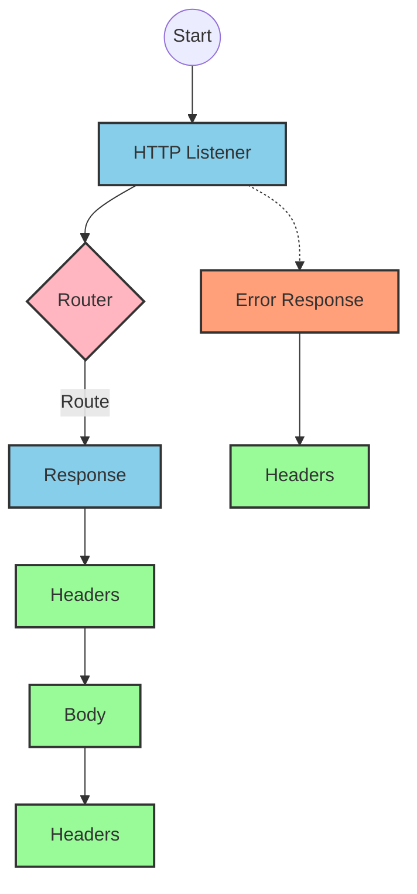
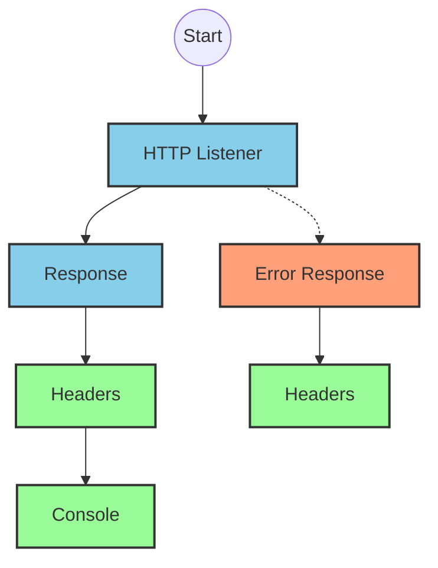
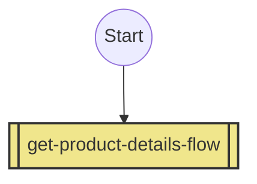
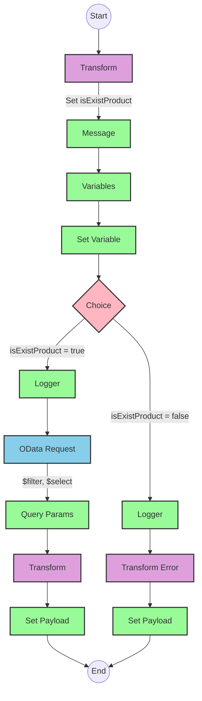

# API Overview
- This API provides product details from an SAP HANA database
- Base URL pattern: `/products`

# Endpoints

## GET /products
- **Purpose**: Retrieves product details based on a product identifier
- **Query Parameters**:
  - `productIdentifier` (required): The unique identifier for the product
- **Response Format**: JSON
- **Status Codes**:
  - 200: Success
  - 400: Bad Request
  - 404: Product Not Found
- **Response Body**:
  - Success: Product details including ProductId, Category, CategoryName, etc.
  - Error: JSON object with status, message, and errorCode

# Current MuleSoft Flow Logic

## Flow: products-main
This is the main entry point for the API that handles HTTP requests.
1. **Trigger**: HTTP listener
2. **Processing**: Routes requests to appropriate handlers
3. **Response**: Returns HTTP response with appropriate headers
4. **Error Handling**: Provides error responses with appropriate status codes

## Flow: products-console
This flow appears to be a console logging version of the main flow.
1. **Trigger**: HTTP listener
2. **Processing**: Logs information to the console
3. **Response**: Returns HTTP response with appropriate headers
4. **Error Handling**: Provides error responses with appropriate status codes

## Flow: get:\products:products-config
This flow handles GET requests to the /products endpoint.
1. **Trigger**: GET request to /products
2. **Processing**: References the get-product-details-flow subflow

## Subflow: get-product-details-flow
This subflow retrieves product details from SAP HANA.
1. **Validation**: Checks if the provided productIdentifier is valid
2. **Processing**:
   - If valid: Queries SAP HANA for product details using OData
   - If invalid: Returns an error response
3. **Data Transformation**: Transforms the response to JSON format
4. **Error Handling**: Logs errors and returns appropriate error messages

The flow uses these key technical components:
- OData query with exact parameters:
  - `$filter`: `ProductId eq '" ++ (attributes.queryParams.productIdentifier default '') ++ "'`
  - `$select`: `ProductId,Category,CategoryName,CurrencyCode,DimensionDepth,DimensionHeight,DimensionUnit,DimensionWidth,LongDescription,Name,PictureUrl,Price,QuantityUnit,ShortDescription,SupplierId,Weight,WeightUnit`

# DataWeave Transformations Explained

## Transformation 1: Validate Product Identifier
This transformation checks if the provided product identifier exists in a predefined list of valid product identifiers.

**Input**: Query parameter `productIdentifier`
**Output**: Boolean value indicating if the product identifier is valid

```dw
%dw 2.0
output application/java
var productidentifer=p('odata.productIdentifiers') splitBy(",")
---
sizeOf(productidentifer filter ($ == attributes.queryParams.productIdentifier))>0
```

This transformation:
1. Retrieves a comma-separated list of valid product identifiers from a property
2. Splits the list into an array
3. Filters the array to find matches with the provided product identifier
4. Returns true if at least one match is found (size > 0)

## Transformation 2: OData Query Parameters
This transformation constructs OData query parameters for the HTTP request to SAP HANA.

**Input**: Query parameter `productIdentifier`
**Output**: OData query parameters as a Java object

```dw
output application/java
---
{
	"$filter" : "ProductId eq '" ++ (attributes.queryParams.productIdentifier default '') ++ "'",
	"$select" : "ProductId,Category,CategoryName,CurrencyCode,DimensionDepth,DimensionHeight,DimensionUnit,DimensionWidth,LongDescription,Name,PictureUrl,Price,QuantityUnit,ShortDescription,SupplierId,Weight,WeightUnit"
}
```

This transformation:
1. Creates a filter condition to match the exact product identifier
2. Specifies the fields to be returned in the response

## Transformation 3: Pass-through Response
This transformation simply passes the payload through without modification.

**Input**: SAP HANA response
**Output**: Same payload as JSON

```dw
%dw 2.0
output application/json
---
payload
```

## Transformation 4: Error Response
This transformation creates an error response when the product identifier is not found or invalid.

**Input**: Query parameter `productIdentifier`
**Output**: JSON error object

```dw
%dw 2.0
output application/json
---
{
	status: "error",
	message: "The product identifier " ++ attributes.queryParams.productIdentifier ++ " was not found.",
	errorCode: "PRODUCT_NOT_FOUND"
}
```

This transformation:
1. Creates a standardized error response object
2. Includes the invalid product identifier in the error message
3. Sets a specific error code for product not found scenarios

# SAP Integration Suite Implementation

## Component Mapping

| MuleSoft Component | SAP Integration Suite Equivalent | Notes |
|--------------------|----------------------------------|-------|
| HTTP Listener | HTTPS Adapter (Server) | Configure with the same port and path |
| Router | Content Modifier + Router | Use a Content Modifier to set properties and a Router for conditional processing |
| Flow Reference | Process Call | References another integration flow |
| Transform | Message Mapping | Maps data between different formats |
| Logger | Write to Message Log | Logs messages to the integration flow log |
| HTTP Request | OData Adapter (Client) | Configure to connect to SAP HANA |
| Set Variable | Content Modifier | Sets flow variables |
| Choice/When/Otherwise | Router | Implements conditional logic |
| Set Payload | Content Modifier | Sets the message payload |
| Error Handler | Exception Subprocess | Handles errors with specific error codes |

## Integration Flow Visualization









## Configuration Details

### HTTP Listener (HTTPS Adapter - Server)
- **Address**: `/products`
- **Port**: Same as HTTP_Listener_config
- **Authentication**: As per source configuration

### OData Adapter (Client)
- **Connection**: SAP HANA connection
- **Service**: Product service
- **Query Parameters**:
  - `$filter`: `ProductId eq '{productIdentifier}'`
  - `$select`: `ProductId,Category,CategoryName,CurrencyCode,DimensionDepth,DimensionHeight,DimensionUnit,DimensionWidth,LongDescription,Name,PictureUrl,Price,QuantityUnit,ShortDescription,SupplierId,Weight,WeightUnit`

### Message Mapping (Transform)
- **Input Format**: As per source
- **Output Format**: JSON
- **Mapping Script**: Equivalent to the DataWeave transformations

### Router (Choice)
- **Condition**: `${property.isExistProduct}`
- **True Path**: Process valid product request
- **False Path**: Return error response

### Content Modifier (Set Variable)
- **Variable Name**: `isExistProduct`
- **Value**: Result of product identifier validation

### Write to Message Log (Logger)
- **Log Level**: INFO
- **Message**: Same as source logger messages

# Configuration
- **Property**: `odata.productIdentifiers` - Comma-separated list of valid product identifiers
- **HTTP Listener Configuration**: As per HTTP_Listener_config
- **Request Configuration**: As per Hana_HTTP_Request_Configuration
- **API Configuration**: Based on products.raml
- **Error Handling**: Global error handler for APIKIT errors