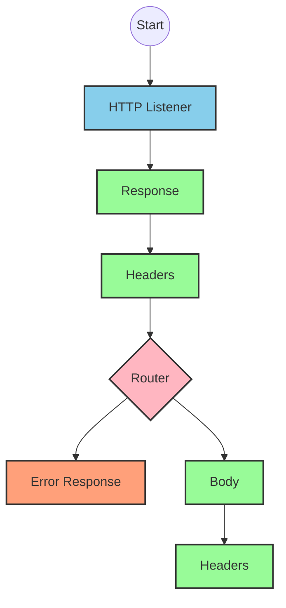
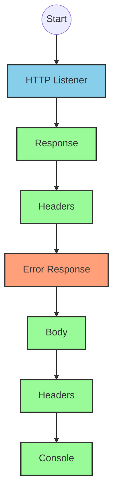
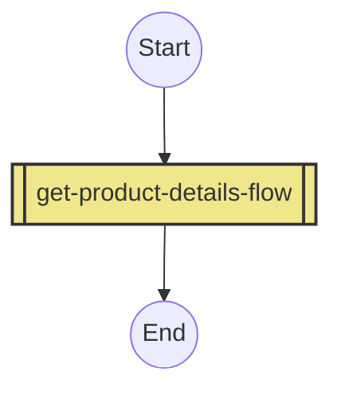
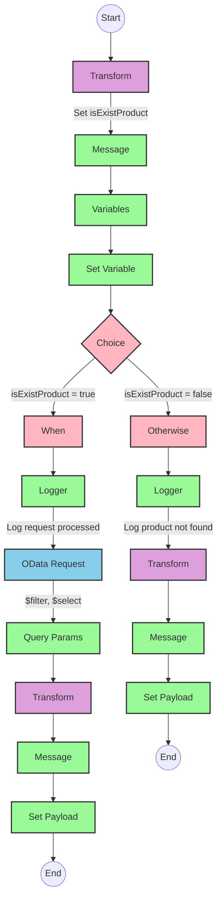

# API Overview
- This API provides product information from an SAP HANA database
- Base URL pattern: `/products`

# Endpoints

## GET /products
- **Purpose**: Retrieves product details based on a product identifier
- **Query Parameters**:
  - `productIdentifier` (required): The unique identifier for the product
- **Response Format**: JSON
- **Status Codes**:
  - 200: Success
  - 400: Bad Request
  - 404: Product Not Found
- **Response Body**:
  - Success: Product details including ProductId, Category, CategoryName, etc.
  - Error: JSON object with status, message, and errorCode

# Current MuleSoft Flow Logic

## Flow: products-main
This is the main entry point for the API that handles HTTP requests.

1. **Trigger**: HTTP listener
2. **Processing**:
   - Sets response headers
   - Routes requests to appropriate handlers
   - Includes error response handling
3. **Outcome**: Routes API requests to the appropriate flow based on the endpoint

## Flow: products-console
This flow appears to be a console/logging version of the main flow.

1. **Trigger**: HTTP listener
2. **Processing**:
   - Sets response headers
   - Includes error response handling
   - Logs information to the console
3. **Outcome**: Provides console output for debugging or monitoring

## Flow: get:\products:products-config
This flow handles GET requests to the /products endpoint.

1. **Trigger**: GET request to /products
2. **Processing**:
   - References the get-product-details-flow subflow
3. **Outcome**: Returns product details or an error message

## Subflow: get-product-details-flow
This subflow handles the core business logic for retrieving product details.

1. **Processing Steps**:
   - Validates if the provided productIdentifier is valid
   - Logs the request processing
   - Makes an OData request to retrieve product details
   - Transforms the response to JSON format

2. **Data Transformations**:
   - First transformation: Validates if the product identifier exists in the configured list
   ```
   %dw 2.0
   output application/java
   var productidentifer=p('odata.productIdentifiers') splitBy(",")
   ---
   sizeOf(productidentifer filter ($ == attributes.queryParams.productIdentifier))>0
   ```

   - OData query parameters construction:
   ```
   #[output application/java
   ---
   {
     "$filter" : "ProductId eq '" ++ (attributes.queryParams.productIdentifier default '') ++ "'",
     "$select" : "ProductId,Category,CategoryName,CurrencyCode,DimensionDepth,DimensionHeight,DimensionUnit,DimensionWidth,LongDescription,Name,PictureUrl,Price,QuantityUnit,ShortDescription,SupplierId,Weight,WeightUnit"
   }]
   ```

   - Response transformation:
   ```
   %dw 2.0
   output application/json
   ---
   payload
   ```

   - Error response transformation:
   ```
   %dw 2.0
   output application/json
   ---
   {
     status: "error",
     message: "The product identifier " ++ attributes.queryParams.productIdentifier ++ " was not found.",
     errorCode: "PRODUCT_NOT_FOUND"
   }
   ```

3. **Conditional Logic**:
   - If `vars.isExistProduct` is true, proceed with the OData request
   - Otherwise, return an error response

4. **Error Scenarios**:
   - Product identifier not found in the configured list
   - OData request failure

# DataWeave Transformations Explained

## Product Identifier Validation
```
%dw 2.0
output application/java
var productidentifer=p('odata.productIdentifiers') splitBy(",")
---
sizeOf(productidentifer filter ($ == attributes.queryParams.productIdentifier))>0
```

This transformation:
1. Retrieves a comma-separated list of valid product identifiers from a property `odata.productIdentifiers`
2. Splits this string into an array using the comma as a delimiter
3. Filters the array to find elements matching the provided query parameter `productIdentifier`
4. Returns a boolean value: true if at least one match is found (size > 0), false otherwise

## OData Query Parameters Construction
```
#[output application/java
---
{
	"$filter" : "ProductId eq '" ++ (attributes.queryParams.productIdentifier default '') ++ "'",
	"$select" : "ProductId,Category,CategoryName,CurrencyCode,DimensionDepth,DimensionHeight,DimensionUnit,DimensionWidth,LongDescription,Name,PictureUrl,Price,QuantityUnit,ShortDescription,SupplierId,Weight,WeightUnit"
}]
```

This transformation:
1. Creates a Java map containing OData query parameters
2. Constructs a `$filter` parameter that filters products where ProductId equals the provided productIdentifier
3. Specifies a `$select` parameter to retrieve specific fields from the product data
4. Uses the `default ''` expression to handle cases where productIdentifier might be null

## Success Response Transformation
```
%dw 2.0
output application/json
---
payload
```

This transformation:
1. Takes the current payload (presumably the OData response)
2. Outputs it as JSON without any modifications

## Error Response Transformation
```
%dw 2.0
output application/json
---
{
	status: "error",
	message: "The product identifier " ++ attributes.queryParams.productIdentifier ++ " was not found.",
	errorCode: "PRODUCT_NOT_FOUND"
}
```

This transformation:
1. Creates a JSON error response structure
2. Includes the product identifier in the error message
3. Sets a specific error code "PRODUCT_NOT_FOUND"

# SAP Integration Suite Implementation

## Component Mapping

| MuleSoft Component | SAP Integration Suite Equivalent | Notes |
|--------------------|----------------------------------|-------|
| HTTP Listener | HTTPS Adapter (Server) | Configure with the same path and method |
| Router | Content Modifier + Router | Use a Content Modifier to set variables and Router for conditional paths |
| Flow Reference | Process Call | References another integration flow |
| Logger | Write to Message Log | Configure with the same log message |
| Set Variable | Content Modifier (Create/Set Properties) | Set variables with the same names and values |
| Choice/When/Otherwise | Router | Configure with the same conditions |
| HTTP Request | OData Adapter | Configure with the same OData query parameters |
| Transform Message | Message Mapping | Implement the same DataWeave transformations using message mapping |
| Set Payload | Content Modifier (Replace Body) | Replace the message body with the transformed content |
| Error Handler | Exception Subprocess | Handle errors with the same logic |

## Integration Flow Visualization









## Configuration Details

### HTTP Listener (products-main)
- Configuration: HTTP_Listener_config
- Path: /api/*
- Method: * (all methods)

### HTTP Listener (products-console)
- Configuration: HTTP_Listener_config
- Path: /console/*
- Method: * (all methods)

### OData Request
- Configuration: Hana_HTTP_Request_Configuration
- OData Query Parameters:
  - $filter: ProductId eq '{productIdentifier}'
  - $select: ProductId,Category,CategoryName,CurrencyCode,DimensionDepth,DimensionHeight,DimensionUnit,DimensionWidth,LongDescription,Name,PictureUrl,Price,QuantityUnit,ShortDescription,SupplierId,Weight,WeightUnit

### Content Modifier (isExistProduct)
- Action: Create variable
- Variable Name: isExistProduct
- Value: Expression to check if productIdentifier exists in configured list

### Router (Choice)
- Condition 1: ${property.isExistProduct} = true
  - Route to: OData Request
- Default Condition:
  - Route to: Error Response

### Message Mapping (Transform)
- Source Format: OData Response
- Target Format: JSON
- Mapping: Direct pass-through of payload

### Message Mapping (Error Transform)
- Target Format: JSON
- Static Structure:
  ```json
  {
    "status": "error",
    "message": "The product identifier ${property.productIdentifier} was not found.",
    "errorCode": "PRODUCT_NOT_FOUND"
  }
  ```

# Configuration

## Important Configuration Parameters
- HTTP_Listener_config: Base configuration for HTTP listeners
- Hana_HTTP_Request_Configuration: Configuration for connecting to SAP HANA
- products-config: API configuration referencing products.raml

## Environment Variables
- odata.productIdentifiers: Comma-separated list of valid product identifiers

## Error Handling
- Global_Error_Handler: Handles various APIKIT errors:
  - APIKIT:BAD_REQUEST
  - APIKIT:NOT_FOUND
  - APIKIT:METHOD_NOT_ALLOWED
  - APIKIT:NOT_ACCEPTABLE
  - APIKIT:UNSUPPORTED_MEDIA_TYPE
  - APIKIT:NOT_IMPLEMENTED