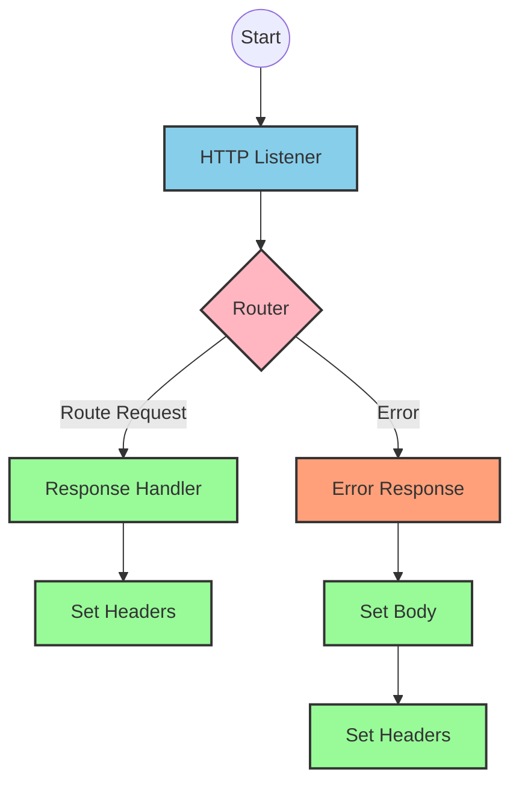
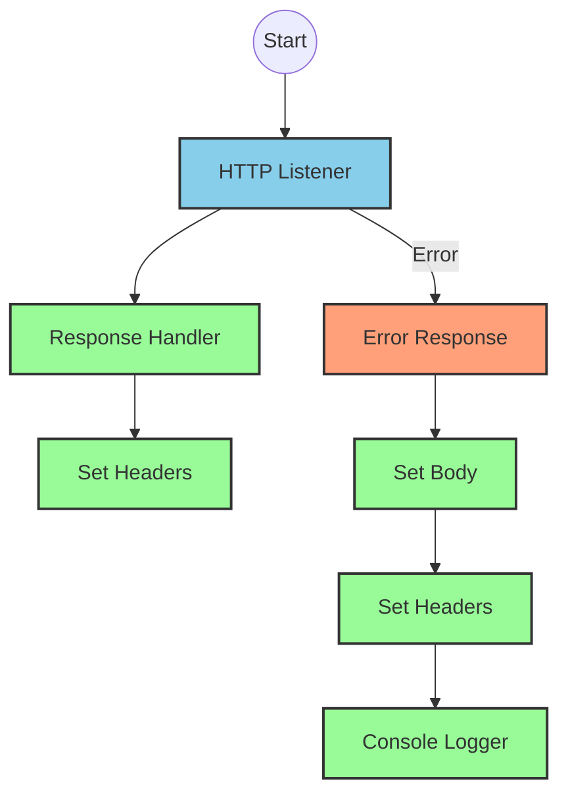
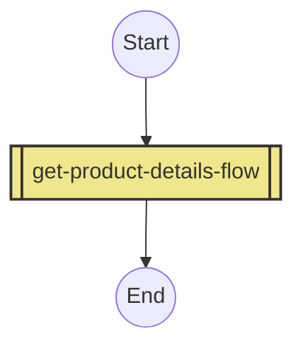
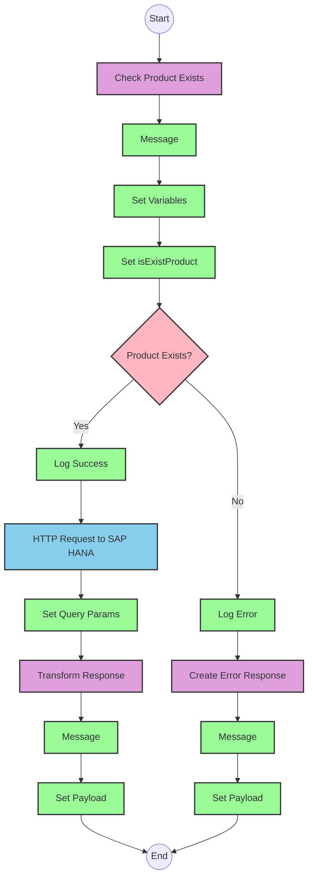

# API Overview
- This API provides product details from an SAP HANA database
- Base URL pattern: `/products`

# Endpoints

## GET /products
- **Purpose**: Retrieves product details based on a product identifier
- **Query Parameters**:
  - `productIdentifier` (required): The unique identifier of the product
- **Response Format**: JSON
- **Response Status Codes**:
  - 200: Success
  - 400: Bad Request
  - 404: Product Not Found
- **Response Body**: Product details including ProductId, Category, CategoryName, CurrencyCode, dimensions, descriptions, price, and other attributes

# Current MuleSoft Flow Logic

## Flow: products-main
This is the main API entry point that routes requests to appropriate handlers.
1. **Trigger**: HTTP listener
2. **Processing**: Routes incoming requests based on API configuration
3. **Error Handling**: Includes error response handling with appropriate headers

## Flow: products-console
This flow appears to be a console logging version of the main flow.
1. **Trigger**: HTTP listener
2. **Processing**: Logs requests to console
3. **Error Handling**: Includes error response handling with appropriate headers

## Flow: get:\products:products-config
This flow handles GET requests to the /products endpoint.
1. **Trigger**: HTTP GET request to /products
2. **Processing**: References the get-product-details-flow subflow

## Subflow: get-product-details-flow
This subflow retrieves product details from SAP HANA.
1. **Validation**: Checks if the provided productIdentifier is valid
2. **Processing**:
   - If valid, queries SAP HANA for product details
   - If invalid, returns an error response
3. **Data Transformation**:
   - First transforms to check if the product identifier is valid
   - Then transforms the SAP HANA response to the API response format

### Key Technical Details:
- **Product Validation**:
  - Checks if the product identifier exists in a configured list of valid identifiers
  - Uses a DataWeave expression to filter the list

- **OData Query Parameters**:
  - `$filter`: `ProductId eq '" ++ (attributes.queryParams.productIdentifier default '') ++ "'`
  - `$select`: `ProductId,Category,CategoryName,CurrencyCode,DimensionDepth,DimensionHeight,DimensionUnit,DimensionWidth,LongDescription,Name,PictureUrl,Price,QuantityUnit,ShortDescription,SupplierId,Weight,WeightUnit`

- **Error Handling**:
  - Returns a structured error response when product identifier is invalid or not found

# DataWeave Transformations Explained

## Product Identifier Validation Transformation
This transformation checks if the provided product identifier exists in a configured list of valid product identifiers.

```dw
%dw 2.0
output application/java
var productidentifer=p('odata.productIdentifiers') splitBy(",")
---
sizeOf(productidentifer filter ($ == attributes.queryParams.productIdentifier))>0
```

- **Input**: Query parameter `productIdentifier` from the request
- **Output**: Boolean value indicating if the product identifier is valid
- **Logic**:
  1. Retrieves a comma-separated list of valid product identifiers from a property
  2. Splits the list into an array
  3. Filters the array to find matches with the provided product identifier
  4. Returns true if at least one match is found (size > 0)

## OData Query Parameters Transformation
This transformation constructs the OData query parameters for the SAP HANA request.

```dw
#[output application/java
---
{
	"$filter" : "ProductId eq '" ++ (attributes.queryParams.productIdentifier default '') ++ "'",
	"$select" : "ProductId,Category,CategoryName,CurrencyCode,DimensionDepth,DimensionHeight,DimensionUnit,DimensionWidth,LongDescription,Name,PictureUrl,Price,QuantityUnit,ShortDescription,SupplierId,Weight,WeightUnit"
}]
```

- **Input**: Query parameter `productIdentifier` from the request
- **Output**: Java map containing OData query parameters
- **Logic**:
  1. Constructs a filter expression to match the exact product identifier
  2. Specifies the fields to be returned in the response

## Response Payload Transformation (Success)
This transformation passes through the SAP HANA response as JSON.

```dw
%dw 2.0
output application/json
---
payload
```

- **Input**: SAP HANA response
- **Output**: JSON response with product details
- **Logic**: Simple pass-through of the payload

## Error Response Transformation
This transformation constructs an error response when the product identifier is invalid or not found.

```dw
%dw 2.0
output application/json
---
{
	status: "error",
	message: "The product identifier " ++ attributes.queryParams.productIdentifier ++ " was not found.",
	errorCode: "PRODUCT_NOT_FOUND"
}
```

- **Input**: Query parameter `productIdentifier` from the request
- **Output**: JSON error response
- **Logic**: Constructs a structured error response with status, message, and error code

# SAP Integration Suite Implementation

## Component Mapping

| MuleSoft Component | SAP Integration Suite Equivalent | Notes |
|--------------------|----------------------------------|-------|
| HTTP Listener | HTTPS Adapter (Receiver) | Configure with the same path and method |
| Router | Content Modifier + Router | Use a Content Modifier to set properties and a Router for conditional logic |
| Flow Reference | Process Call | References another integration flow |
| Transform | Message Mapping | Maps data between different formats |
| Logger | Write to Log | Logs messages to the monitoring dashboard |
| Set Variable | Content Modifier | Sets process variables |
| Choice/When/Otherwise | Router | Implements conditional logic |
| HTTP Request | HTTPS Adapter (Sender) | Configures outbound HTTP requests |
| Set Payload | Content Modifier | Sets the message body |
| Error Handler | Exception Subprocess | Handles errors with specific error codes |

## Integration Flow Visualization









## Configuration Details

### HTTP Listener Configuration
- **Component**: HTTPS Adapter (Receiver)
- **Parameters**:
  - Name: HTTP_Listener_config
  - Port: 8081 (default)
  - Host: 0.0.0.0 (default)
  - Path: /api/* (based on API configuration)

### HTTP Request Configuration
- **Component**: HTTPS Adapter (Sender)
- **Parameters**:
  - Name: Hana_HTTP_Request_Configuration
  - Base URL: [SAP HANA OData service URL]
  - Authentication: Basic Authentication or OAuth (configuration decision)
  - Timeout: 30000ms (default)

### Router Configuration
- **Component**: Router
- **Parameters**:
  - Condition: `#[vars.isExistProduct]`
  - Default route: Otherwise branch

### Message Mapping Configuration
- **Component**: Message Mapping
- **Parameters**:
  - Source format: XML/JSON (based on input)
  - Target format: JSON
  - Mapping scripts: As defined in the DataWeave transformations

### Content Modifier Configuration
- **Component**: Content Modifier
- **Parameters**:
  - For variables: Set process data with appropriate names
  - For headers: Set HTTP headers
  - For payload: Set message body

### Process Call Configuration
- **Component**: Process Call
- **Parameters**:
  - Process: get-product-details-flow
  - Mode: Synchronous

### Exception Subprocess Configuration
- **Component**: Exception Subprocess
- **Parameters**:
  - Error types: APIKIT:BAD_REQUEST, APIKIT:NOT_FOUND, APIKIT:METHOD_NOT_ALLOWED, APIKIT:NOT_ACCEPTABLE, APIKIT:UNSUPPORTED_MEDIA_TYPE, APIKIT:NOT_IMPLEMENTED
  - Error handling: As defined in the Global_Error_Handler

# Configuration

## Important Configuration Parameters
- **odata.productIdentifiers**: Comma-separated list of valid product identifiers
- **API Configuration**: products.raml
- **Outbound Headers Map Name**: outboundHeaders
- **HTTP Status Variable Name**: httpStatus

## Error Handling
The application implements a global error handler (Gobal_Error_Handler) that handles various APIKIT errors:
- APIKIT:BAD_REQUEST
- APIKIT:NOT_FOUND
- APIKIT:METHOD_NOT_ALLOWED
- APIKIT:NOT_ACCEPTABLE
- APIKIT:UNSUPPORTED_MEDIA_TYPE
- APIKIT:NOT_IMPLEMENTED

Each error type is handled using on-error-propagate to ensure consistent error responses.