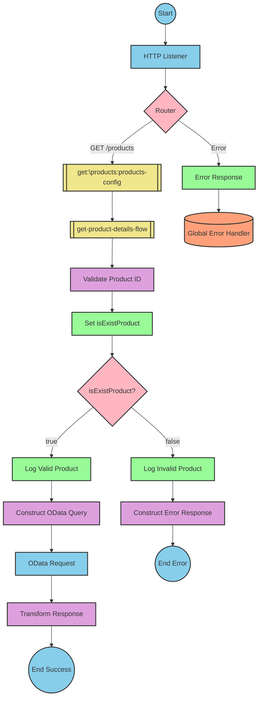

# SAP Integration Suite Implementation for Product API

# Table of Contents
- [API Overview](#api-overview)
- [Endpoints](#endpoints)
- [Current MuleSoft Flow Logic](#current-mulesoft-flow-logic)
- [DataWeave Transformations Explained](#dataweave-transformations-explained)
- [SAP Integration Suite Implementation](#sap-integration-suite-implementation)
  - [Component Mapping](#component-mapping)
  - [Integration Flow Visualization](#integration-flow-visualization)
- [Configuration Details](#configuration-details)
- [Configuration](#configuration)

# API Overview
This API provides functionality to retrieve product details from an SAP HANA backend system. The API allows clients to query product information by providing a product identifier. The implementation validates the product identifier against a configured list of valid identifiers before retrieving the product details from the backend system.

**Base URL**: `http://localhost:8081/api/v1`

# Endpoints

## GET /products
**Purpose**: Retrieves product details based on the provided product identifier.

**Request Parameters**:
- **Query Parameters**:
  - `productIdentifier` (required): The unique identifier of the product to retrieve.

**Response Format**:
- **200 OK**: Successfully retrieved product details
  - Content-Type: application/json
  - Body: JSON object containing product details
- **400 Bad Request**: Invalid request format
- **404 Not Found**: Product not found
- **500 Internal Server Error**: Server error

**Error Response Example**:
```json
{
  "status": "error",
  "message": "The product identifier HT-9999 was not found.",
  "errorCode": "PRODUCT_NOT_FOUND"
}
```

# Current MuleSoft Flow Logic

## products-main Flow
**Trigger**: HTTP listener configured at `/api/v1/*`
**Purpose**: Main entry point for the API that handles routing to appropriate endpoints

1. Receives HTTP requests via the listener component
2. Sets response headers
3. Routes the request to the appropriate flow based on the API endpoint
4. Handles errors and formats error responses

## products-console Flow
**Trigger**: HTTP listener
**Purpose**: Provides console logging functionality for debugging

1. Receives HTTP requests
2. Sets response headers
3. Logs information to the console
4. Handles errors

## get:\products:products-config Flow
**Trigger**: HTTP GET request to `/products` endpoint
**Purpose**: Handles product retrieval requests

1. Receives GET requests to the `/products` endpoint
2. Calls the `get-product-details-flow` subflow to process the request

## get-product-details-flow Subflow
**Purpose**: Validates the product identifier and retrieves product details

1. Validates if the provided product identifier exists in the configured list of valid identifiers
   - Uses a DataWeave transformation to check if the product identifier is valid
   ```
   %dw 2.0
   output application/java
   var productidentifer=p('odata.productIdentifiers') splitBy(",")
   ---
   sizeOf(productidentifer filter ($ == attributes.queryParams.productIdentifier))>0
   ```

2. If the product identifier is valid:
   - Logs a message indicating the request is being processed
   - Sends a request to the SAP HANA backend with OData query parameters:
     - `$filter`: `ProductId eq '" ++ (attributes.queryParams.productIdentifier default '') ++ "'`
     - `$select`: `ProductId,Category,CategoryName,CurrencyCode,DimensionDepth,DimensionHeight,DimensionUnit,DimensionWidth,LongDescription,Name,PictureUrl,Price,QuantityUnit,ShortDescription,SupplierId,Weight,WeightUnit`
   - Transforms the response payload to JSON format
   ```
   %dw 2.0
   output application/json
   ---
   payload
   ```

3. If the product identifier is invalid:
   - Logs a message indicating the product identifier was not found or was incorrect
   - Returns an error response with status "error", a descriptive message, and error code "PRODUCT_NOT_FOUND"
   ```
   %dw 2.0
   output application/json
   ---
   {
     status: "error",
     message: "The product identifier " ++ attributes.queryParams.productIdentifier ++ " was not found.",
     errorCode: "PRODUCT_NOT_FOUND"
   }
   ```

# DataWeave Transformations Explained

## Product Identifier Validation Transformation
**Purpose**: Validates if the provided product identifier exists in the configured list of valid identifiers

**Input**: Query parameter `productIdentifier` from the HTTP request
**Output**: Boolean value indicating if the product identifier is valid

**Logic**:
1. Retrieves the configured list of valid product identifiers from the property `odata.productIdentifiers`
2. Splits the comma-separated list into an array of individual identifiers
3. Filters the array to find matches with the provided product identifier
4. Returns true if at least one match is found, false otherwise

```dw
%dw 2.0
output application/java
var productidentifer=p('odata.productIdentifiers') splitBy(",")
---
sizeOf(productidentifer filter ($ == attributes.queryParams.productIdentifier))>0
```

## OData Query Parameters Transformation
**Purpose**: Constructs OData query parameters for the backend request

**Input**: Query parameter `productIdentifier` from the HTTP request
**Output**: Map of OData query parameters

**Logic**:
1. Constructs a `$filter` parameter to filter products by the provided product identifier
2. Specifies a `$select` parameter to select specific fields from the product data

```dw
#[output application/java
---
{
	"$filter" : "ProductId eq '" ++ (attributes.queryParams.productIdentifier default '') ++ "'",
	"$select" : "ProductId,Category,CategoryName,CurrencyCode,DimensionDepth,DimensionHeight,DimensionUnit,DimensionWidth,LongDescription,Name,PictureUrl,Price,QuantityUnit,ShortDescription,SupplierId,Weight,WeightUnit"
}]
```

## Response Payload Transformation
**Purpose**: Transforms the backend response to JSON format

**Input**: Response payload from the backend
**Output**: JSON representation of the product data

**Logic**: Simple pass-through transformation that converts the payload to JSON format

```dw
%dw 2.0
output application/json
---
payload
```

## Error Response Transformation
**Purpose**: Constructs an error response when the product identifier is invalid

**Input**: Query parameter `productIdentifier` from the HTTP request
**Output**: JSON error response

**Logic**: Constructs a JSON object with status "error", a descriptive message, and error code "PRODUCT_NOT_FOUND"

```dw
%dw 2.0
output application/json
---
{
	status: "error",
	message: "The product identifier " ++ attributes.queryParams.productIdentifier ++ " was not found.",
	errorCode: "PRODUCT_NOT_FOUND"
}
```

# SAP Integration Suite Implementation

## Component Mapping

| MuleSoft Component | SAP Integration Suite Equivalent | Notes |
|--------------------|----------------------------------|-------|
| HTTP Listener | HTTPS Adapter (Receiver) | Configure with the same path and port settings |
| Router | Content Modifier with Router | Use a Content Modifier to set properties and a Router for conditional branching |
| Flow Reference | Process Call | Use a Process Call to invoke another integration flow |
| Logger | Write to Message Log | Configure with the same log message |
| DataWeave Transform | Message Mapping | Use Groovy or JavaScript for complex transformations |
| HTTP Request | OData Adapter (Sender) | Configure with the same OData query parameters |
| Set Variable | Content Modifier | Use a Content Modifier to set properties |
| Choice/When/Otherwise | Router | Use a Router with multiple conditions |
| Set Payload | Content Modifier | Use a Content Modifier to set the message body |
| Error Handler | Exception Subprocess | Create an Exception Subprocess for error handling |

## Integration Flow Visualization

### REST API Integration Flow: GET /products



# Configuration Details

## HTTP Adapter (Receiver)
- **Address**: `/api/v1/*`
- **Port**: `8081` (from dev.yaml)
- **Authentication**: None (based on source documentation)

## OData Adapter (Sender)
- **Address**: `refapp-espm-ui-cf.cfapps.eu10.hana.ondemand.com` (from dev.yaml)
- **Port**: `443` (from dev.yaml)
- **Path**: `/espm-cloud-web/espm.svc/Products` (from dev.yaml)
- **Query Parameters**:
  - `$filter`: `ProductId eq '{productIdentifier}'`
  - `$select`: `ProductId,Category,CategoryName,CurrencyCode,DimensionDepth,DimensionHeight,DimensionUnit,DimensionWidth,LongDescription,Name,PictureUrl,Price,QuantityUnit,ShortDescription,SupplierId,Weight,WeightUnit`

## Content Modifier: Set isExistProduct
- **Property Name**: `isExistProduct`
- **Property Value**: Result of product identifier validation script

## Router: isExistProduct?
- **Condition 1**: `${property.isExistProduct} = true`
- **Condition 2**: `${property.isExistProduct} = false`

## Message Mapping: Validate Product ID
- **Source Format**: XML/JSON
- **Target Format**: XML/JSON
- **Mapping Script**: Equivalent to the DataWeave script for validating product identifiers

## Message Mapping: Construct OData Query
- **Source Format**: XML/JSON
- **Target Format**: XML/JSON
- **Mapping Script**: Equivalent to the DataWeave script for constructing OData query parameters

## Message Mapping: Transform Response
- **Source Format**: XML/JSON
- **Target Format**: JSON
- **Mapping Script**: Equivalent to the DataWeave script for transforming the response payload

## Message Mapping: Construct Error Response
- **Source Format**: XML/JSON
- **Target Format**: JSON
- **Mapping Script**: Equivalent to the DataWeave script for constructing the error response

# Configuration

## Environment Variables
From the source documentation (dev.yaml):

```yaml
api:
  listener:
    port: "8081"
    path: /api/v1/*
    
hana:
  espm:
    url: refapp-espm-ui-cf.cfapps.eu10.hana.ondemand.com
    port: "443"
    path: /espm-cloud-web/espm.svc/Products
    
odata:
  productIdentifiers: "HT-2000,HT-2001"
```

## External System Dependencies
- SAP HANA Cloud backend system at `refapp-espm-ui-cf.cfapps.eu10.hana.ondemand.com`
- OData service endpoint at `/espm-cloud-web/espm.svc/Products`

## Security Settings
- HTTPS connection to the SAP HANA backend (port 443)
- No explicit authentication mechanism specified in the source documentation
- Consider implementing appropriate authentication for the SAP Integration Suite implementation