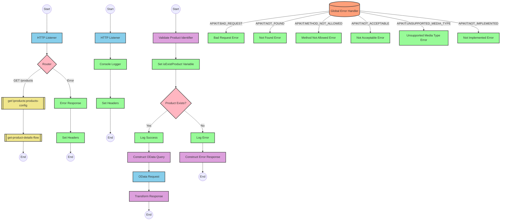

# Table of Contents
- [API Overview](#api-overview)
- [Endpoints](#endpoints)
- [Current MuleSoft Flow Logic](#current-mulesoft-flow-logic)
  - [products-main Flow](#products-main-flow)
  - [products-console Flow](#products-console-flow)
  - [get:\products:products-config Flow](#getproductsproducts-config-flow)
  - [get-product-details-flow Subflow](#get-product-details-flow-subflow)
- [DataWeave Transformations Explained](#dataweave-transformations-explained)
  - [isExistProduct Transformation](#isexistproduct-transformation)
  - [OData Query Parameters Transformation](#odata-query-parameters-transformation)
  - [Product Response Transformation](#product-response-transformation)
  - [Error Response Transformation](#error-response-transformation)
- [SAP Integration Suite Implementation](#sap-integration-suite-implementation)
  - [Component Mapping](#component-mapping)
  - [Integration Flow Visualization](#integration-flow-visualization)
  - [Configuration Details](#configuration-details)
- [Configuration](#configuration)
  - [HTTP Listener Configuration](#http-listener-configuration)
  - [Hana HTTP Request Configuration](#hana-http-request-configuration)
  - [API Configuration](#api-configuration)
  - [Error Handling](#error-handling)

# API Overview
This API provides product information from an SAP HANA database. It allows clients to retrieve detailed product information by providing a product identifier as a query parameter. The API validates the product identifier against a configured list of valid identifiers before retrieving the product details from the backend system.

- Base URL: `/api`
- Main endpoint: `/products`

# Endpoints

## GET /products
- **Purpose**: Retrieves detailed product information based on a product identifier
- **Request Parameters**:
  - **Query Parameters**:
    - `productIdentifier` (required): The unique identifier of the product to retrieve
  - **Headers**: Standard HTTP headers
- **Response Format**:
  - **Success Response (200 OK)**:
    - Content-Type: application/json
    - Body: JSON object containing product details
  - **Error Response (400 Bad Request)**:
    - Content-Type: application/json
    - Body: JSON object with error details
      ```json
      {
        "status": "error",
        "message": "The product identifier [identifier] was not found.",
        "errorCode": "PRODUCT_NOT_FOUND"
      }
      ```
- **Example Request**:
  ```
  GET /api/products?productIdentifier=HT-1000
  ```

# Current MuleSoft Flow Logic

## products-main Flow
1. **Trigger**: HTTP listener configured to receive incoming API requests
2. **Processing**:
   - Sets response headers
   - Routes the request to the appropriate handler based on the API specification
   - Handles errors and formats error responses
3. **Outcome**: Routes the request to the appropriate endpoint handler

## products-console Flow
1. **Trigger**: HTTP listener configured to receive incoming API requests
2. **Processing**:
   - Sets response headers
   - Logs request details to the console
   - Handles errors and formats error responses
3. **Outcome**: Provides console logging for API requests

## get:\products:products-config Flow
1. **Trigger**: GET request to the `/products` endpoint
2. **Processing**:
   - Calls the `get-product-details-flow` subflow to process the request
3. **Outcome**: Returns product details or an error response

## get-product-details-flow Subflow
1. **Trigger**: Called by the `get:\products:products-config` flow
2. **Processing**:
   - Validates the `productIdentifier` query parameter against a configured list of valid identifiers
   - If valid:
     - Logs a success message
     - Constructs an OData query with specific filter and select parameters
     - Sends a request to the backend system
     - Transforms the response to JSON format
   - If invalid:
     - Logs an error message
     - Constructs an error response
3. **Data Transformations**:
   - Validates product identifier using DataWeave:
     ```
     %dw 2.0
     output application/java
     var productidentifer=p('odata.productIdentifiers') splitBy(",")
     ---
     sizeOf(productidentifer filter ($ == attributes.queryParams.productIdentifier))>0
     ```
   - Constructs OData query parameters:
     ```
     #[output application/java
     ---
     {
         "$filter" : "ProductId eq '" ++ (attributes.queryParams.productIdentifier default '') ++ "'",
         "$select" : "ProductId,Category,CategoryName,CurrencyCode,DimensionDepth,DimensionHeight,DimensionUnit,DimensionWidth,LongDescription,Name,PictureUrl,Price,QuantityUnit,ShortDescription,SupplierId,Weight,WeightUnit"
     }]
     ```
   - Transforms backend response to JSON:
     ```
     %dw 2.0
     output application/json
     ---
     payload
     ```
   - Constructs error response:
     ```
     %dw 2.0
     output application/json
     ---
     {
         status: "error",
         message: "The product identifier " ++ attributes.queryParams.productIdentifier ++ " was not found.",
         errorCode: "PRODUCT_NOT_FOUND"
     }
     ```
4. **Error Scenarios**:
   - Invalid product identifier
   - Backend system unavailable
   - Malformed request

# DataWeave Transformations Explained

## isExistProduct Transformation
This transformation validates if the provided product identifier exists in a predefined list of valid product identifiers.

- **Input**: Query parameter `productIdentifier` from the request
- **Output**: Boolean value indicating if the product identifier is valid
- **Key Operations**:
  - Retrieves a comma-separated list of valid product identifiers from a property
  - Splits the list into an array using `splitBy(",")`
  - Filters the array to find matches with the provided product identifier
  - Checks if the size of the filtered array is greater than 0

```
%dw 2.0
output application/java
var productidentifer=p('odata.productIdentifiers') splitBy(",")
---
sizeOf(productidentifer filter ($ == attributes.queryParams.productIdentifier))>0
```

## OData Query Parameters Transformation
This transformation constructs the OData query parameters for retrieving product details from the backend system.

- **Input**: Query parameter `productIdentifier` from the request
- **Output**: Java map containing OData query parameters
- **Key Operations**:
  - Constructs a `$filter` parameter to filter products by the provided product identifier
  - Specifies a `$select` parameter to retrieve specific product fields

```
#[output application/java
---
{
    "$filter" : "ProductId eq '" ++ (attributes.queryParams.productIdentifier default '') ++ "'",
    "$select" : "ProductId,Category,CategoryName,CurrencyCode,DimensionDepth,DimensionHeight,DimensionUnit,DimensionWidth,LongDescription,Name,PictureUrl,Price,QuantityUnit,ShortDescription,SupplierId,Weight,WeightUnit"
}]
```

## Product Response Transformation
This transformation passes through the product details received from the backend system.

- **Input**: Response payload from the backend system
- **Output**: JSON representation of the product details
- **Key Operations**: Simple pass-through transformation

```
%dw 2.0
output application/json
---
payload
```

## Error Response Transformation
This transformation constructs an error response when the product identifier is invalid.

- **Input**: Query parameter `productIdentifier` from the request
- **Output**: JSON error object
- **Key Operations**:
  - Constructs a JSON object with error status, message, and error code
  - Includes the invalid product identifier in the error message

```
%dw 2.0
output application/json
---
{
    status: "error",
    message: "The product identifier " ++ attributes.queryParams.productIdentifier ++ " was not found.",
    errorCode: "PRODUCT_NOT_FOUND"
}
```

# SAP Integration Suite Implementation

## Component Mapping

| MuleSoft Component | SAP Integration Suite Equivalent | Notes |
|--------------------|----------------------------------|-------|
| HTTP Listener | HTTPS Adapter (Receiver) | Configure with the same path and method |
| Router | Router | Used for routing based on API specification |
| Flow Reference | Process Call | Used to call the product details subflow |
| DataWeave Transformer | Content Modifier (with script) | Use Groovy or JavaScript for equivalent logic |
| Logger | Content Modifier (with logging) | Set Log Level property accordingly |
| HTTP Request | OData Adapter (Sender) | Configure with the same OData query parameters |
| Choice/When/Otherwise | Router | Implement conditional routing based on variable values |
| Set Variable | Content Modifier | Set exchange properties or headers |
| Set Payload | Content Modifier | Modify the message body |
| Error Handler | Exception Subprocess | Configure with appropriate error handling logic |

## Integration Flow Visualization



## Configuration Details

### HTTP Adapter (Receiver)
- **Address**: `/api`
- **Supported Methods**: GET
- **Authentication**: As per source system requirements
- **CSRF Protection**: Disabled

### OData Adapter (Sender)
- **Address**: Base URL of the SAP HANA OData service
- **Authentication**: As per target system requirements
- **Query Options**:
  - **$filter**: `ProductId eq '{productIdentifier}'`
  - **$select**: `ProductId,Category,CategoryName,CurrencyCode,DimensionDepth,DimensionHeight,DimensionUnit,DimensionWidth,LongDescription,Name,PictureUrl,Price,QuantityUnit,ShortDescription,SupplierId,Weight,WeightUnit`

### Router
- **Condition 1**: `${property.isExistProduct} == true`
- **Condition 2**: `${property.isExistProduct} == false`

### Content Modifier (for DataWeave transformations)
- **Script Language**: Groovy or JavaScript
- **Script for isExistProduct**:
  ```groovy
  def productIdentifiers = properties.get("odata.productIdentifiers").split(",")
  def productIdentifier = message.getHeaders().get("productIdentifier")
  def isValid = productIdentifiers.find { it == productIdentifier } != null
  properties.put("isExistProduct", isValid)
  ```

- **Script for Error Response**:
  ```groovy
  def productIdentifier = message.getHeaders().get("productIdentifier")
  def errorResponse = [
      status: "error",
      message: "The product identifier " + productIdentifier + " was not found.",
      errorCode: "PRODUCT_NOT_FOUND"
  ]
  message.setBody(groovy.json.JsonOutput.toJson(errorResponse))
  ```

### Exception Subprocess
- **Error Types**: HTTP 400, 404, 405, 406, 415, 501
- **Response Headers**:
  - Content-Type: application/json

# Configuration

## HTTP Listener Configuration
- **Name**: HTTP_Listener_config
- **Host**: As per environment
- **Port**: As per environment
- **Base Path**: `/api`

## Hana HTTP Request Configuration
- **Name**: Hana_HTTP_Request_Configuration
- **Base URL**: URL of the SAP HANA OData service
- **Authentication**: As per target system requirements

## API Configuration
- **Name**: products-config
- **API Definition**: products.raml
- **Outbound Headers Map Name**: outboundHeaders
- **HTTP Status Variable Name**: httpStatus

## Error Handling
- **Name**: Gobal_Error_Handler
- **Error Types**:
  - APIKIT:BAD_REQUEST
  - APIKIT:NOT_FOUND
  - APIKIT:METHOD_NOT_ALLOWED
  - APIKIT:NOT_ACCEPTABLE
  - APIKIT:UNSUPPORTED_MEDIA_TYPE
  - APIKIT:NOT_IMPLEMENTED
- **Error Handling Strategy**: on-error-propagate

## Environment Variables
- **odata.productIdentifiers**: Comma-separated list of valid product identifiers