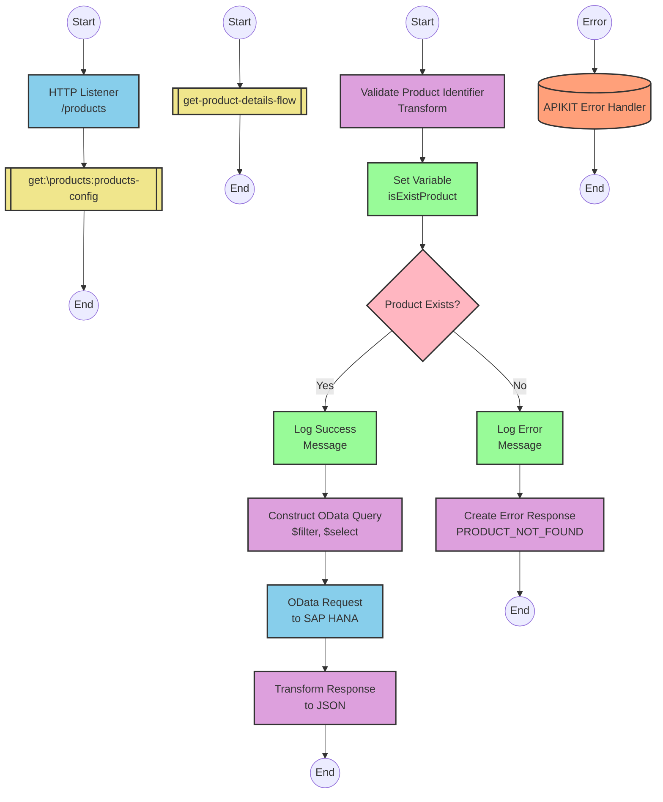

# SAP OData Product Information API Integration

## Table of Contents
- [API Overview](#api-overview)
- [Endpoints](#endpoints)
  - [GET /products](#get-products)
- [Current MuleSoft Flow Logic](#current-mulesoft-flow-logic)
  - [products-main Flow](#products-main-flow)
  - [products-console Flow](#products-console-flow)
  - [get:\products:products-config Flow](#getproductsproducts-config-flow)
  - [get-product-details-flow Subflow](#get-product-details-flow-subflow)
- [DataWeave Transformations Explained](#dataweave-transformations-explained)
  - [Product Identifier Validation](#product-identifier-validation)
  - [OData Query Parameters Construction](#odata-query-parameters-construction)
  - [Response Payload Transformation](#response-payload-transformation)
  - [Error Response Transformation](#error-response-transformation)
- [SAP Integration Suite Implementation](#sap-integration-suite-implementation)
  - [Component Mapping](#component-mapping)
  - [Integration Flow Visualization](#integration-flow-visualization)
  - [Configuration Details](#configuration-details)
- [Environment Configuration](#environment-configuration)
- [API Reference](#api-reference)

## API Overview
This API provides access to product information stored in an SAP HANA database through OData services. The integration retrieves detailed product information based on a product identifier passed as a query parameter. The API validates the product identifier against a configured list of valid identifiers before making the request to the backend system.

- **Base URL**: Determined by the HTTP_Listener_config
- **Authentication**: Not explicitly defined in the source documentation
- **Rate Limiting**: Not specified in the source documentation
- **General Response Format**: JSON

## Endpoints

### GET /products
Retrieves detailed product information based on a product identifier.

- **HTTP Method**: GET
- **Path**: /products
- **Purpose**: Fetch product details from SAP HANA database via OData service

**Request Parameters**:
- **Query Parameters**:
  - `productIdentifier` (required): The unique identifier of the product to retrieve

**Response Format**:
- **Success Response**:
  - **Status Code**: 200 OK
  - **Content Type**: application/json
  - **Body**: Product details including ProductId, Category, CategoryName, CurrencyCode, dimensions, descriptions, price, and other attributes

- **Error Response**:
  - **Status Code**: 400 Bad Request (or other appropriate error code)
  - **Content Type**: application/json
  - **Body**: Error details including status, message, and errorCode
    ```json
    {
      "status": "error",
      "message": "The product identifier [identifier] was not found.",
      "errorCode": "PRODUCT_NOT_FOUND"
    }
    ```

**Example Request**:
```
GET /products?productIdentifier=HT-1000
```

**Error Handling**:
- If the product identifier is not provided or is invalid, returns a PRODUCT_NOT_FOUND error
- APIKIT error handling for standard HTTP errors (400, 404, 405, 406, 415, 501)

## Current MuleSoft Flow Logic

### products-main Flow
1. **Trigger**: HTTP listener configured with HTTP_Listener_config
2. **Processing**:
   - Sets response headers
   - Handles error responses
   - Routes requests to appropriate flows based on API specification

### products-console Flow
1. **Trigger**: HTTP listener configured with HTTP_Listener_config
2. **Processing**:
   - Sets response headers
   - Handles error responses
   - Logs information to console

### get:\products:products-config Flow
1. **Trigger**: HTTP GET request to /products endpoint
2. **Processing**:
   - Calls the get-product-details-flow subflow

### get-product-details-flow Subflow
1. **Validation**:
   - Validates if the provided productIdentifier exists in the configured list of valid product identifiers
   - Sets a variable `isExistProduct` based on validation result

2. **Conditional Processing**:
   - If `isExistProduct` is true:
     - Logs that the request is being processed
     - Constructs OData query parameters with $filter and $select
     - Makes HTTP request to SAP HANA backend
     - Transforms response to JSON
   - If `isExistProduct` is false:
     - Logs that the product identifier was not found or incorrectly passed
     - Returns an error response

3. **Query Parameters Construction**:
   - $filter: `ProductId eq '[productIdentifier]'`
   - $select: `ProductId,Category,CategoryName,CurrencyCode,DimensionDepth,DimensionHeight,DimensionUnit,DimensionWidth,LongDescription,Name,PictureUrl,Price,QuantityUnit,ShortDescription,SupplierId,Weight,WeightUnit`

## DataWeave Transformations Explained

### Product Identifier Validation
This transformation checks if the provided product identifier exists in a configured list of valid identifiers.

**Input**: Query parameter `productIdentifier` and configuration property `odata.productIdentifiers`
**Output**: Boolean value indicating if the product identifier is valid

```dw
%dw 2.0
output application/java
var productidentifer=p('odata.productIdentifiers') splitBy(",")
---
sizeOf(productidentifer filter ($ == attributes.queryParams.productIdentifier))>0
```

**Explanation**:
1. Retrieves the list of valid product identifiers from a configuration property
2. Splits the comma-separated list into an array
3. Filters the array to find matches with the provided productIdentifier
4. Returns true if at least one match is found (size > 0)

### OData Query Parameters Construction
This transformation constructs the OData query parameters for filtering and selecting specific product fields.

**Input**: Query parameter `productIdentifier`
**Output**: OData query parameters as a Java map

```dw
#[output application/java
---
{
	"$filter" : "ProductId eq '" ++ (attributes.queryParams.productIdentifier default '') ++ "'",
	"$select" : "ProductId,Category,CategoryName,CurrencyCode,DimensionDepth,DimensionHeight,DimensionUnit,DimensionWidth,LongDescription,Name,PictureUrl,Price,QuantityUnit,ShortDescription,SupplierId,Weight,WeightUnit"
}]
```

**Explanation**:
1. Creates a map with two OData query parameters
2. $filter parameter uses the productIdentifier to filter products by ProductId
3. $select parameter specifies all the product fields to be returned
4. Uses the default operator to handle null values for productIdentifier

### Response Payload Transformation
This simple transformation passes the payload through without modification.

**Input**: Response from OData service
**Output**: Same payload as JSON

```dw
%dw 2.0
output application/json
---
payload
```

### Error Response Transformation
This transformation creates an error response when the product identifier is invalid.

**Input**: Query parameter `productIdentifier`
**Output**: Error response JSON

```dw
%dw 2.0
output application/json
---
{
	status: "error",
	message: "The product identifier " ++ attributes.queryParams.productIdentifier ++ " was not found.",
	errorCode: "PRODUCT_NOT_FOUND"
}
```

**Explanation**:
1. Creates a JSON object with three fields: status, message, and errorCode
2. Includes the invalid productIdentifier in the error message
3. Sets a specific error code for product not found scenarios

## SAP Integration Suite Implementation

### Component Mapping

| MuleSoft Component | SAP Integration Suite Equivalent | Notes |
|--------------------|----------------------------------|-------|
| HTTP Listener | HTTPS Adapter (Receiver) | Configure with the same path and method |
| Flow Reference | Process Call | Used to call subflows |
| DataWeave Transform | Content Modifier with Script | Use Groovy or JavaScript for complex transformations |
| Logger | Write to Message Log | Configure with the same log message |
| HTTP Request | OData Adapter (Sender) | Configure with the same OData query parameters |
| Set Variable | Content Modifier | Set properties in the message header |
| Choice/When/Otherwise | Router | Configure with the same condition |
| Set Payload | Content Modifier | Set the message body |
| Error Handler | Exception Subprocess | Configure with the same error types |

### Integration Flow Visualization



### Configuration Details

#### HTTP Adapter (Receiver)
- **Address**: /products
- **Method**: GET
- **Authentication**: To be determined based on security requirements
- **CSRF Protection**: Disabled

#### OData Adapter (Sender)
- **Connection**: SAP HANA HTTP Connection
- **Service**: Product Service
- **Entity Set**: Products
- **Query Options**:
  - **$filter**: ProductId eq '[productIdentifier]'
  - **$select**: ProductId,Category,CategoryName,CurrencyCode,DimensionDepth,DimensionHeight,DimensionUnit,DimensionWidth,LongDescription,Name,PictureUrl,Price,QuantityUnit,ShortDescription,SupplierId,Weight,WeightUnit

#### Content Modifier (Validate Product)
- **Script Language**: Groovy
- **Script**:
  ```groovy
  def productIdentifiers = property.get("odata.productIdentifiers").split(",")
  def requestedId = message.getHeaders().get("productIdentifier")
  def isValid = productIdentifiers.find { it == requestedId } != null
  return isValid
  ```

#### Router (Product Exists)
- **Condition 1**: ${property.isExistProduct} == true
- **Condition 2**: ${property.isExistProduct} == false

#### Content Modifier (Error Response)
- **Message Body**:
  ```json
  {
    "status": "error",
    "message": "The product identifier ${header.productIdentifier} was not found.",
    "errorCode": "PRODUCT_NOT_FOUND"
  }
  ```

#### Exception Subprocess
- **APIKIT:BAD_REQUEST**: Return 400 status code
- **APIKIT:NOT_FOUND**: Return 404 status code
- **APIKIT:METHOD_NOT_ALLOWED**: Return 405 status code
- **APIKIT:NOT_ACCEPTABLE**: Return 406 status code
- **APIKIT:UNSUPPORTED_MEDIA_TYPE**: Return 415 status code
- **APIKIT:NOT_IMPLEMENTED**: Return 501 status code

## Environment Configuration

### Configuration Parameters
- **odata.productIdentifiers**: Comma-separated list of valid product identifiers
  - Example value: "HT-1000,HT-1001,HT-1002,HT-1003"

### Connection Details
- **HTTP_Listener_config**: Configuration for the HTTP listener
  - Port: To be determined
  - Host: To be determined
  - Base Path: To be determined

- **Hana_HTTP_Request_Configuration**: Configuration for the SAP HANA HTTP request
  - Base URL: URL of the SAP HANA OData service
  - Authentication: To be determined (Basic, OAuth, etc.)
  - Timeout: To be determined

### Security Settings
- Authentication method for accessing the SAP HANA backend
- SSL/TLS configuration for secure communication
- API security policies (rate limiting, IP filtering, etc.)

### Deployment Considerations
- Memory requirements: Minimum 1GB recommended
- CPU requirements: Minimum 1 vCPU recommended
- Disk space: Minimum 500MB recommended
- Network connectivity to SAP HANA system
- Proper firewall configuration to allow communication between integration platform and SAP HANA

## API Reference

### Endpoints

#### GET /products
Retrieves product information based on a product identifier.

**Request**:
- **Method**: GET
- **Path**: /products
- **Query Parameters**:
  - `productIdentifier` (required): The unique identifier of the product

**Response**:
- **Success Response (200 OK)**:
  ```json
  {
    "ProductId": "HT-1000",
    "Category": "Laptops",
    "CategoryName": "Laptops",
    "CurrencyCode": "USD",
    "DimensionDepth": 30,
    "DimensionHeight": 3,
    "DimensionUnit": "cm",
    "DimensionWidth": 40,
    "LongDescription": "This laptop has a 14-inch screen and weighs only 1.5kg...",
    "Name": "Notebook Basic 15",
    "PictureUrl": "/images/HT-1000.jpg",
    "Price": 956.00,
    "QuantityUnit": "EA",
    "ShortDescription": "Notebook Basic 15 with 2,80 GHz quad core",
    "SupplierId": "0100000046",
    "Weight": 1.5,
    "WeightUnit": "kg"
  }
  ```

- **Error Response (400 Bad Request)**:
  ```json
  {
    "status": "error",
    "message": "The product identifier HT-9999 was not found.",
    "errorCode": "PRODUCT_NOT_FOUND"
  }
  ```

### Error Codes
- **PRODUCT_NOT_FOUND**: The requested product identifier is not valid or does not exist
- **APIKIT:BAD_REQUEST**: The request was malformed
- **APIKIT:NOT_FOUND**: The requested resource was not found
- **APIKIT:METHOD_NOT_ALLOWED**: The HTTP method is not supported for this endpoint
- **APIKIT:NOT_ACCEPTABLE**: The server cannot produce a response matching the list of acceptable values
- **APIKIT:UNSUPPORTED_MEDIA_TYPE**: The request entity has a media type which the server does not support
- **APIKIT:NOT_IMPLEMENTED**: The server does not support the functionality required to fulfill the request

### Authentication
Authentication requirements are not explicitly defined in the source documentation and should be determined based on security requirements.

### Rate Limiting
Rate limiting information is not specified in the source documentation.

### Pagination
Pagination is not implemented for this API as it returns a single product record.

### Versioning
API versioning information is not specified in the source documentation.