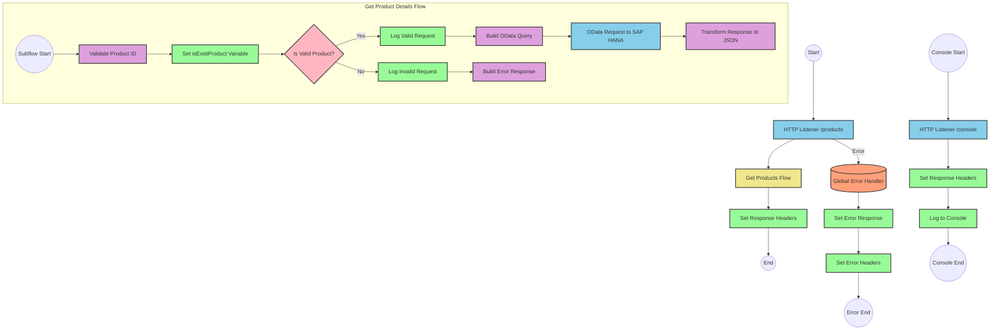

# SAP HANA Product Information API

## Table of Contents
- [SAP HANA Product Information API](#sap-hana-product-information-api)
  - [Table of Contents](#table-of-contents)
  - [API Overview](#api-overview)
  - [Endpoints](#endpoints)
    - [GET /products](#get-products)
  - [Current MuleSoft Flow Logic](#current-mulesoft-flow-logic)
    - [products-main Flow](#products-main-flow)
    - [products-console Flow](#products-console-flow)
    - [get:\\products:products-config Flow](#getproductsproducts-config-flow)
    - [get-product-details-flow Subflow](#get-product-details-flow-subflow)
  - [DataWeave Transformations Explained](#dataweave-transformations-explained)
    - [Product Identifier Validation](#product-identifier-validation)
    - [OData Query Parameters Construction](#odata-query-parameters-construction)
    - [Response Payload Transformation](#response-payload-transformation)
    - [Error Response Transformation](#error-response-transformation)
  - [SAP Integration Suite Implementation](#sap-integration-suite-implementation)
    - [Component Mapping](#component-mapping)
    - [Integration Flow Visualization](#integration-flow-visualization)
    - [Configuration Details](#configuration-details)
  - [Environment Configuration](#environment-configuration)
  - [API Reference](#api-reference)
    - [GET /products](#get-products-1)
    - [Error Codes](#error-codes)

## API Overview
- This API provides access to product information stored in SAP HANA.
- The API allows retrieval of detailed product information by product identifier.
- Base URL: Configured in HTTP_Listener_config
- Authentication: Not explicitly defined in the source documentation
- Response Format: JSON
- The API validates product identifiers against a configured list before retrieving data from SAP HANA.

## Endpoints

### GET /products
- **Purpose**: Retrieves detailed product information based on a product identifier
- **Request Parameters**:
  - **Query Parameters**:
    - `productIdentifier` (required): The unique identifier of the product to retrieve
- **Response Format**:
  - **Success Response (200 OK)**:
    - Content-Type: application/json
    - Body: Product details from SAP HANA
  - **Error Response (400 Bad Request)**:
    - Content-Type: application/json
    - Body: Error details including status, message, and errorCode
- **Example Error Response**:
  ```json
  {
    "status": "error",
    "message": "The product identifier ABC123 was not found.",
    "errorCode": "PRODUCT_NOT_FOUND"
  }
  ```

## Current MuleSoft Flow Logic

### products-main Flow
1. **Trigger**: HTTP listener receives incoming requests
2. **Processing**:
   - Sets response headers
   - Handles errors with an error-response component
   - Sets response body
   - Routes the request to appropriate handlers

### products-console Flow
1. **Trigger**: HTTP listener receives incoming requests
2. **Processing**:
   - Sets response headers
   - Handles errors with an error-response component
   - Sets response body
   - Logs information to the console

### get:\\products:products-config Flow
1. **Trigger**: HTTP GET request to /products endpoint
2. **Processing**:
   - References the get-product-details-flow subflow

### get-product-details-flow Subflow
1. **Validation**:
   - Transforms the request to validate if the product identifier exists in the configured list
   ```
   %dw 2.0
   output application/java
   var productidentifer=p('odata.productIdentifiers') splitBy(",")
   ---
   sizeOf(productidentifer filter ($ == attributes.queryParams.productIdentifier))>0
   ```
   - Sets a variable `isExistProduct` with the validation result

2. **Conditional Processing**:
   - If `isExistProduct` is true:
     - Logs a message: "The request is processed and sent downstream with the product identifier (#[attributes.queryParams.productIdentifier])."
     - Constructs OData query parameters:
     ```
     #[output application/java
     ---
     {
         "$filter" : "ProductId eq '" ++ (attributes.queryParams.productIdentifier default '') ++ "'",
         "$select" : "ProductId,Category,CategoryName,CurrencyCode,DimensionDepth,DimensionHeight,DimensionUnit,DimensionWidth,LongDescription,Name,PictureUrl,Price,QuantityUnit,ShortDescription,SupplierId,Weight,WeightUnit"
     }]
     ```
     - Transforms the response payload to JSON:
     ```
     %dw 2.0
     output application/json
     ---
     payload
     ```

   - If `isExistProduct` is false:
     - Logs a message: "The product identifier (#[attributes.queryParams.productIdentifier]) was not passed in the request or was passed incorrectly."
     - Transforms the payload to create an error response:
     ```
     %dw 2.0
     output application/json
     ---
     {
         status: "error",
         message: "The product identifier " ++ attributes.queryParams.productIdentifier ++ " was not found.",
         errorCode: "PRODUCT_NOT_FOUND"
     }
     ```

## DataWeave Transformations Explained

### Product Identifier Validation
```
%dw 2.0
output application/java
var productidentifer=p('odata.productIdentifiers') splitBy(",")
---
sizeOf(productidentifer filter ($ == attributes.queryParams.productIdentifier))>0
```
- **Purpose**: Validates if the provided product identifier exists in the configured list
- **Input**: Query parameter `productIdentifier` from the HTTP request
- **Process**:
  1. Retrieves the configured product identifiers from a property `odata.productIdentifiers`
  2. Splits the comma-separated list into an array
  3. Filters the array to find matches with the provided product identifier
  4. Returns true if at least one match is found (size > 0)
- **Output**: Boolean value indicating if the product identifier is valid

### OData Query Parameters Construction
```
#[output application/java
---
{
    "$filter" : "ProductId eq '" ++ (attributes.queryParams.productIdentifier default '') ++ "'",
    "$select" : "ProductId,Category,CategoryName,CurrencyCode,DimensionDepth,DimensionHeight,DimensionUnit,DimensionWidth,LongDescription,Name,PictureUrl,Price,QuantityUnit,ShortDescription,SupplierId,Weight,WeightUnit"
}]
```
- **Purpose**: Constructs OData query parameters for the SAP HANA request
- **Input**: Product identifier from query parameters
- **Process**:
  1. Creates a $filter parameter to filter by ProductId
  2. Creates a $select parameter to specify which fields to retrieve
- **Output**: Java map containing OData query parameters

### Response Payload Transformation
```
%dw 2.0
output application/json
---
payload
```
- **Purpose**: Transforms the response from SAP HANA to JSON format
- **Input**: Response payload from SAP HANA
- **Process**: Simple pass-through transformation to ensure JSON output
- **Output**: JSON representation of the product details

### Error Response Transformation
```
%dw 2.0
output application/json
---
{
    status: "error",
    message: "The product identifier " ++ attributes.queryParams.productIdentifier ++ " was not found.",
    errorCode: "PRODUCT_NOT_FOUND"
}
```
- **Purpose**: Creates a standardized error response when product identifier is invalid
- **Input**: Product identifier from query parameters
- **Process**: Constructs an error object with status, message, and errorCode
- **Output**: JSON error response

## SAP Integration Suite Implementation

### Component Mapping

| MuleSoft Component | SAP Integration Suite Equivalent | Notes |
|--------------------|----------------------------------|-------|
| HTTP Listener | HTTPS Adapter (Receiver) | Configure with the same path and method |
| Flow Reference | Process Call | Used to call the product details subflow |
| DataWeave Transform | Groovy Script or Content Modifier with Expression | For complex transformations |
| Logger | Write to Message Headers (Content Modifier) | Log messages can be stored in message headers |
| HTTP Request | OData Adapter (Sender) | Configure with the same OData parameters |
| Choice/When/Otherwise | Router | Implement conditional logic |
| Set Variable | Content Modifier | Store variables in message headers |
| Set Payload | Content Modifier | Set message body |
| Error Handler | Exception Subprocess | Handle API errors |

### Integration Flow Visualization



### Configuration Details

#### HTTPS Adapter (Receiver)
- **Address**: `/products`
- **Authentication**: To be determined based on security requirements
- **CSRF Protection**: Disabled

#### OData Adapter (Sender)
- **Connection**: SAP HANA Connection
- **Query Parameters**:
  - **$filter**: `ProductId eq '{productIdentifier}'`
  - **$select**: `ProductId,Category,CategoryName,CurrencyCode,DimensionDepth,DimensionHeight,DimensionUnit,DimensionWidth,LongDescription,Name,PictureUrl,Price,QuantityUnit,ShortDescription,SupplierId,Weight,WeightUnit`

#### Content Modifiers
1. **Set isExistProduct Variable**:
   - **Type**: Expression
   - **Expression**: Groovy script to check if product identifier exists in configured list

2. **Log Valid Request**:
   - **Type**: Header
   - **Target**: `LogMessage`
   - **Value**: `The request is processed and sent downstream with the product identifier ${property.productIdentifier}.`

3. **Log Invalid Request**:
   - **Type**: Header
   - **Target**: `LogMessage`
   - **Value**: `The product identifier ${property.productIdentifier} was not passed in the request or was passed incorrectly.`

4. **Set Response Headers**:
   - **Type**: Header
   - **Target**: `Content-Type`
   - **Value**: `application/json`

#### Router
- **Condition 1**: `${property.isExistProduct} == true`
- **Condition 2**: `${property.isExistProduct} == false`

#### Exception Subprocess
- **Error Types**:
  - APIKIT:BAD_REQUEST
  - APIKIT:NOT_FOUND
  - APIKIT:METHOD_NOT_ALLOWED
  - APIKIT:NOT_ACCEPTABLE
  - APIKIT:UNSUPPORTED_MEDIA_TYPE
  - APIKIT:NOT_IMPLEMENTED

## Environment Configuration

### Configuration Parameters
- **odata.productIdentifiers**: Comma-separated list of valid product identifiers

### Connection Details
1. **HTTP_Listener_config**:
   - **Type**: listener-config
   - **Required Parameters**: host, port, path

2. **Hana_HTTP_Request_Configuration**:
   - **Type**: request-config
   - **Required Parameters**: base URL, authentication details

3. **products-config**:
   - **Type**: config
   - **Parameters**:
     - **api**: products.raml
     - **outboundHeadersMapName**: outboundHeaders
     - **httpStatusVarName**: httpStatus

### Security Settings
- Authentication mechanism not explicitly defined in source documentation
- Consider implementing OAuth or Basic Authentication based on security requirements

### Deployment Considerations
- Ensure connectivity to SAP HANA system
- Configure proper memory allocation based on expected traffic
- Set up monitoring for API performance and error rates

## API Reference

### GET /products
Retrieves detailed product information from SAP HANA.

**Request**:
- **Method**: GET
- **Path**: `/products`
- **Query Parameters**:
  - `productIdentifier` (required): The unique identifier of the product to retrieve

**Response**:
- **Success (200 OK)**:
  ```json
  {
    "ProductId": "string",
    "Category": "string",
    "CategoryName": "string",
    "CurrencyCode": "string",
    "DimensionDepth": "number",
    "DimensionHeight": "number",
    "DimensionUnit": "string",
    "DimensionWidth": "number",
    "LongDescription": "string",
    "Name": "string",
    "PictureUrl": "string",
    "Price": "number",
    "QuantityUnit": "string",
    "ShortDescription": "string",
    "SupplierId": "string",
    "Weight": "number",
    "WeightUnit": "string"
  }
  ```

- **Error (400 Bad Request)**:
  ```json
  {
    "status": "error",
    "message": "The product identifier {productIdentifier} was not found.",
    "errorCode": "PRODUCT_NOT_FOUND"
  }
  ```

### Error Codes
- **PRODUCT_NOT_FOUND**: The requested product identifier is not in the configured list of valid identifiers
- **APIKIT:BAD_REQUEST**: The request was malformed
- **APIKIT:NOT_FOUND**: The requested resource was not found
- **APIKIT:METHOD_NOT_ALLOWED**: The HTTP method is not allowed for the requested resource
- **APIKIT:NOT_ACCEPTABLE**: The server cannot produce a response matching the list of acceptable values
- **APIKIT:UNSUPPORTED_MEDIA_TYPE**: The request entity has a media type which the server does not support
- **APIKIT:NOT_IMPLEMENTED**: The server does not support the functionality required to fulfill the request