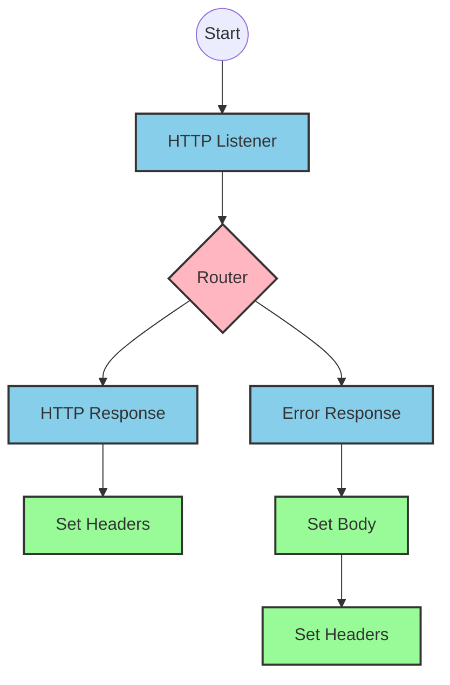
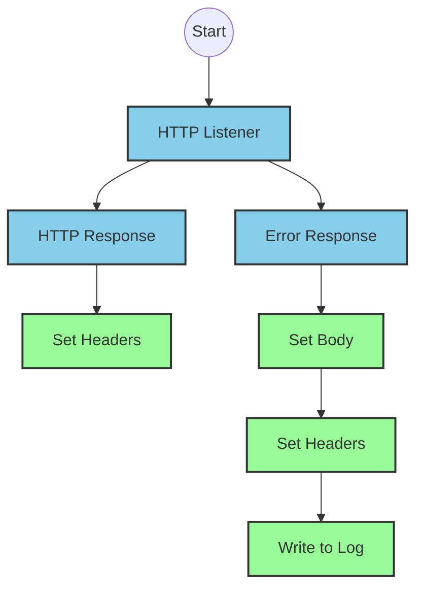
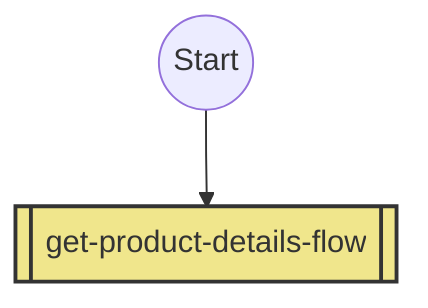
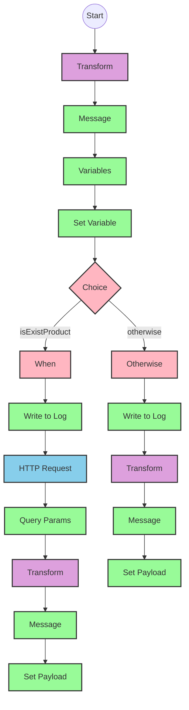

# API Overview
- This API provides product details from an SAP HANA database
- Base URL pattern: `/products`

# Endpoints

## GET /products
- **Purpose**: Retrieves product details based on a product identifier
- **Query Parameters**: 
  - `productIdentifier` (required): The unique identifier for the product
- **Response Format**: JSON
- **Status Codes**:
  - 200: Success
  - 400: Bad Request
  - 404: Product Not Found
- **Response Body**: Product details including ProductId, Category, CategoryName, CurrencyCode, dimensions, descriptions, price, and other product attributes

# Current MuleSoft Flow Logic

## Flow: products-main
This is the main entry point for the API that handles HTTP requests.
1. **Trigger**: HTTP listener
2. **Processing**: Routes requests to appropriate handlers
3. **Response**: Returns HTTP response with appropriate headers
4. **Error Handling**: Provides error responses with appropriate status codes

## Flow: products-console
This flow appears to be a console-based entry point, possibly for testing or monitoring.
1. **Trigger**: HTTP listener
2. **Processing**: Outputs to console
3. **Response**: Returns HTTP response with appropriate headers
4. **Error Handling**: Provides error responses

## Flow: get:\products:products-config
This flow handles GET requests to the `/products` endpoint.
1. **Trigger**: HTTP GET request to `/products`
2. **Processing**: References the `get-product-details-flow` subflow

## Subflow: get-product-details-flow
This subflow retrieves product details from SAP HANA.
1. **Validation**: Checks if the provided product identifier is valid
2. **Processing**:
   - If valid: Makes an HTTP request to SAP HANA OData service
   - If invalid: Returns an error message
3. **Data Transformation**: Transforms the response to the required format
4. **Technical Details**:
   - OData query parameters:
     - `$filter`: `ProductId eq '" ++ (attributes.queryParams.productIdentifier default '') ++ "'`
     - `$select`: `ProductId,Category,CategoryName,CurrencyCode,DimensionDepth,DimensionHeight,DimensionUnit,DimensionWidth,LongDescription,Name,PictureUrl,Price,QuantityUnit,ShortDescription,SupplierId,Weight,WeightUnit`

# DataWeave Transformations Explained

## Product Identifier Validation Transformation
This transformation checks if the provided product identifier is in the list of allowed product identifiers.

- **Input**: Query parameters from the HTTP request
- **Output**: Boolean value indicating if the product identifier is valid
- **Key Operations**: 
  - `splitBy` to convert a comma-separated string to an array
  - `filter` to check if the product identifier is in the array
  - `sizeOf` to determine if any matches were found

```dw
%dw 2.0
output application/java
var productidentifer=p('odata.productIdentifiers') splitBy(",")
---
sizeOf(productidentifer filter ($ == attributes.queryParams.productIdentifier))>0
```

## OData Query Parameters Transformation
This transformation constructs the OData query parameters for the SAP HANA request.

- **Input**: Query parameters from the HTTP request
- **Output**: OData query parameters
- **Key Operations**: String concatenation to build the filter expression

```dw
#[output application/java
---
{
	"$filter" : "ProductId eq '" ++ (attributes.queryParams.productIdentifier default '') ++ "'",
	"$select" : "ProductId,Category,CategoryName,CurrencyCode,DimensionDepth,DimensionHeight,DimensionUnit,DimensionWidth,LongDescription,Name,PictureUrl,Price,QuantityUnit,ShortDescription,SupplierId,Weight,WeightUnit"
}]
```

## Response Payload Transformation (Success)
This transformation passes through the payload from the SAP HANA response.

- **Input**: JSON response from SAP HANA
- **Output**: JSON response to the client
- **Key Operations**: Simple pass-through

```dw
%dw 2.0
output application/json
---
payload
```

## Error Response Transformation
This transformation creates an error response when the product identifier is not valid.

- **Input**: Query parameters from the HTTP request
- **Output**: JSON error response
- **Key Operations**: String concatenation to build the error message

```dw
%dw 2.0
output application/json
---
{
	status: "error",
	message: "The product identifier " ++ attributes.queryParams.productIdentifier ++ " was not found.",
	errorCode: "PRODUCT_NOT_FOUND"
}
```

# SAP Integration Suite Implementation

## Component Mapping

| MuleSoft Component | SAP Integration Suite Equivalent |
|--------------------|----------------------------------|
| HTTP Listener | HTTPS Adapter (Server) |
| HTTP Request | HTTP Adapter (Client) |
| Router | Router |
| DataWeave Transform | Content Modifier with Script |
| Logger | Write to Log |
| Flow Reference | Process Call |
| Set Variable | Content Modifier |
| Choice/When/Otherwise | Router with multiple branches |
| Error Handler | Exception Subprocess |

## Integration Flow Visualization









## Configuration Details

### HTTP Listener Configuration
- **Component**: HTTPS Adapter (Server)
- **Parameters**:
  - Name: HTTP_Listener_config
  - Port: [To be configured]
  - Host: [To be configured]
  - Path: /products

### HTTP Request Configuration
- **Component**: HTTP Adapter (Client)
- **Parameters**:
  - Name: Hana_HTTP_Request_Configuration
  - URL: [SAP HANA OData service URL to be configured]
  - Method: GET
  - Authentication: [To be configured based on SAP HANA requirements]

### Transform Components
- **Component**: Content Modifier with Script
- **Parameters**:
  - Script language: Groovy or JavaScript (SAP Integration Suite equivalent to DataWeave)
  - Script content: Equivalent logic to the DataWeave transformations

### Router Component
- **Component**: Router
- **Parameters**:
  - Condition: ${property.isExistProduct} (equivalent to vars.isExistProduct in MuleSoft)

### Logger Components
- **Component**: Write to Log
- **Parameters**:
  - Log Level: INFO
  - Log Messages:
    - "The request is processed and sent downstream with the product identifier (${property.productIdentifier})."
    - "The product identifier (${property.productIdentifier}) was not passed in the request or was passed incorrectly."

# Configuration

## Important Configuration Parameters
- **odata.productIdentifiers**: Comma-separated list of valid product identifiers (from properties file)

## Environment Variables
- No explicit environment variables mentioned in the source documentation

## Dependencies on External Systems
- SAP HANA OData service for product data retrieval

## Security Settings
- Authentication configuration for SAP HANA HTTP Request (not explicitly defined in source)
- HTTPS configuration for API endpoints (not explicitly defined in source)