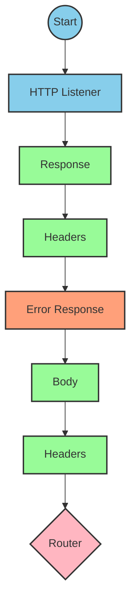
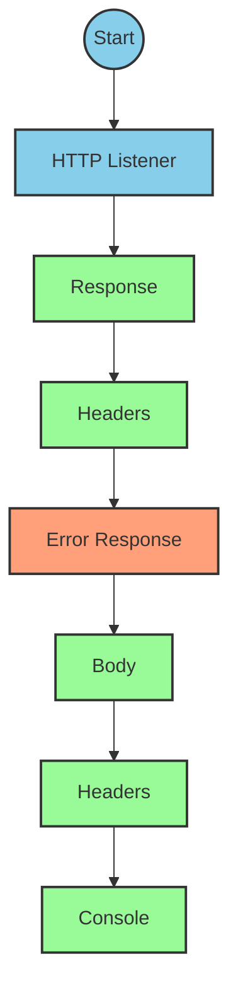
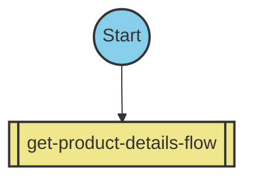
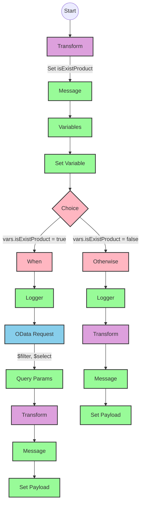
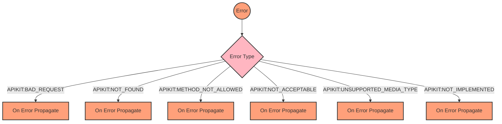

# API Overview
- This API provides product details from an SAP HANA database
- Base URL pattern: `/products`

# Endpoints

## GET /products
- **Purpose**: Retrieves product details based on a product identifier
- **Query Parameters**:
  - `productIdentifier` (required): The unique identifier for the product
- **Response Format**: JSON
- **Status Codes**:
  - 200: Success
  - 400: Bad Request
  - 404: Product Not Found
- **Response Body**:
  - Success: Product details including ProductId, Category, CategoryName, etc.
  - Error: JSON object with status, message, and errorCode

# Current MuleSoft Flow Logic

## Flow: products-main
This is the main entry point for the API, triggered by an HTTP request. It sets up the response structure and routes requests to appropriate handlers.

1. **Trigger**: HTTP listener
2. **Processing**:
   - Sets up response headers
   - Handles error responses
   - Routes requests based on API specification

## Flow: products-console
This flow appears to be a console-based entry point, possibly for testing or monitoring.

1. **Trigger**: HTTP listener
2. **Processing**:
   - Sets up response headers
   - Handles error responses
   - Outputs to console

## Flow: get:\products:products-config
This flow handles GET requests to the `/products` endpoint.

1. **Trigger**: HTTP GET request to `/products`
2. **Processing**:
   - References the `get-product-details-flow` subflow to process the request

## Subflow: get-product-details-flow
This subflow handles the core business logic for retrieving product details.

1. **Validation**:
   - Checks if the provided product identifier is valid using a DataWeave transformation
   - Sets variables for processing

2. **Processing**:
   - If product identifier is valid:
     - Logs the request
     - Makes an OData request to retrieve product details with specific query parameters:
       - `$filter`: `ProductId eq '" ++ (attributes.queryParams.productIdentifier default '') ++ "'`
       - `$select`: `ProductId,Category,CategoryName,CurrencyCode,DimensionDepth,DimensionHeight,DimensionUnit,DimensionWidth,LongDescription,Name,PictureUrl,Price,QuantityUnit,ShortDescription,SupplierId,Weight,WeightUnit`
     - Transforms the response to JSON
   - If product identifier is invalid:
     - Logs the error
     - Returns an error response

3. **Error Handling**:
   - Global error handler for API Kit errors (BAD_REQUEST, NOT_FOUND, etc.)

# DataWeave Transformations Explained

## Product Identifier Validation Transformation
This transformation checks if the provided product identifier is in the list of allowed product identifiers.

```dw
%dw 2.0
output application/java
var productidentifer=p('odata.productIdentifiers') splitBy(",")
---
sizeOf(productidentifer filter ($ == attributes.queryParams.productIdentifier))>0
```

- **Purpose**: Validates if the provided product identifier exists in the configured list
- **Input**: Query parameter `productIdentifier` from the request
- **Output**: Boolean value (true if product identifier is valid, false otherwise)
- **Key Operations**:
  - Retrieves product identifiers from a property `odata.productIdentifiers`
  - Splits the comma-separated list into an array
  - Filters the array to find matches with the provided product identifier
  - Checks if the size of the filtered array is greater than 0

## OData Query Parameters Transformation
This transformation constructs the OData query parameters for the HTTP request.

```dw
#[output application/java
---
{
	"$filter" : "ProductId eq '" ++ (attributes.queryParams.productIdentifier default '') ++ "'",
	"$select" : "ProductId,Category,CategoryName,CurrencyCode,DimensionDepth,DimensionHeight,DimensionUnit,DimensionWidth,LongDescription,Name,PictureUrl,Price,QuantityUnit,ShortDescription,SupplierId,Weight,WeightUnit"
}]
```

- **Purpose**: Constructs OData query parameters for filtering and selecting specific fields
- **Input**: Product identifier from query parameters
- **Output**: Java map with OData query parameters
- **Key Operations**:
  - Constructs a filter expression to match the exact product identifier
  - Specifies the fields to be returned in the response

## Response Payload Transformation (Success)
This transformation passes through the payload from the OData response.

```dw
%dw 2.0
output application/json
---
payload
```

- **Purpose**: Converts the response payload to JSON format
- **Input**: Response from the OData request
- **Output**: JSON representation of the product details

## Error Response Transformation
This transformation constructs an error response when the product identifier is invalid.

```dw
%dw 2.0
output application/json
---
{
	status: "error",
	message: "The product identifier " ++ attributes.queryParams.productIdentifier ++ " was not found.",
	errorCode: "PRODUCT_NOT_FOUND"
}
```

- **Purpose**: Creates a standardized error response
- **Input**: Query parameter `productIdentifier` from the request
- **Output**: JSON error object with status, message, and error code
- **Key Operations**:
  - Concatenates the product identifier into the error message

# SAP Integration Suite Implementation

## Component Mapping

| MuleSoft Component | SAP Integration Suite Equivalent |
|--------------------|----------------------------------|
| HTTP Listener | HTTP Adapter (Receiver) |
| Router | Content Modifier + Router |
| Flow Reference | Process Call |
| DataWeave Transform | Groovy Script or Message Mapping |
| Logger | Write to Log |
| HTTP Request | OData Adapter (Sender) |
| Set Variable | Content Modifier |
| Choice/When/Otherwise | Router |
| Error Handler | Exception Subprocess |

## Integration Flow Visualization











## Configuration Details

### HTTP Adapter (Receiver)
- **Component**: HTTP Adapter
- **Configuration**: 
  - Name: HTTP_Listener_config
  - Connection Type: Receiver
  - Address: /products
  - Authentication: None (or as required)

### OData Adapter (Sender)
- **Component**: OData Adapter
- **Configuration**:
  - Name: Hana_HTTP_Request_Configuration
  - Connection Type: Sender
  - Address: [SAP HANA OData Service URL]
  - Authentication: Basic/OAuth (as required)

### Router Configuration
- **Component**: Router
- **Configuration**:
  - Condition Expression: `${property.isExistProduct}`
  - Default Route: Error response

### Content Modifier (for Variables)
- **Component**: Content Modifier
- **Configuration**:
  - Action: Create
  - Name: isExistProduct
  - Type: Boolean
  - Value: [Result of product identifier validation]

### Groovy Script (for DataWeave Transformations)
- **Component**: Groovy Script
- **Configuration**:
  - Script for Product Validation:
    ```groovy
    def productIdentifiers = property.get("odata.productIdentifiers").split(",")
    def productIdentifier = message.getProperty("queryParams.productIdentifier")
    def isValid = productIdentifiers.any { it == productIdentifier }
    message.setProperty("isExistProduct", isValid)
    return message
    ```
  - Script for Error Response:
    ```groovy
    def productIdentifier = message.getProperty("queryParams.productIdentifier")
    def errorResponse = [
        status: "error",
        message: "The product identifier " + productIdentifier + " was not found.",
        errorCode: "PRODUCT_NOT_FOUND"
    ]
    message.setBody(groovy.json.JsonOutput.toJson(errorResponse))
    return message
    ```

### OData Request Parameters
- **Component**: OData Adapter
- **Configuration**:
  - Query Options:
    - $filter: `ProductId eq '${property.queryParams.productIdentifier}'`
    - $select: `ProductId,Category,CategoryName,CurrencyCode,DimensionDepth,DimensionHeight,DimensionUnit,DimensionWidth,LongDescription,Name,PictureUrl,Price,QuantityUnit,ShortDescription,SupplierId,Weight,WeightUnit`

# Configuration
- **Property Values**:
  - odata.productIdentifiers: Comma-separated list of valid product identifiers
- **Environment Variables**:
  - None explicitly mentioned in the source documentation
- **Dependencies**:
  - SAP HANA OData service for product data
- **Security Settings**:
  - Authentication details for SAP HANA connection (not specified in source)