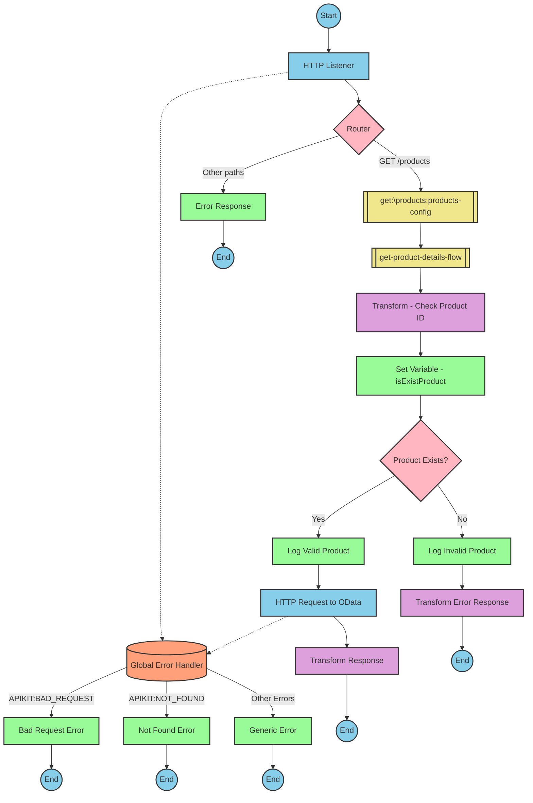

# Table of Contents
- [API Overview](#api-overview)
- [Endpoints](#endpoints)
- [Current MuleSoft Flow Logic](#current-mulesoft-flow-logic)
  - [products-main Flow](#products-main-flow)
  - [products-console Flow](#products-console-flow)
  - [get:\products:products-config Flow](#getproductsproducts-config-flow)
  - [get-product-details-flow Subflow](#get-product-details-flow-subflow)
- [DataWeave Transformations Explained](#dataweave-transformations-explained)
  - [isExistProduct Transformation](#isexistproduct-transformation)
  - [OData Query Parameters Transformation](#odata-query-parameters-transformation)
  - [Product Response Transformation](#product-response-transformation)
  - [Error Response Transformation](#error-response-transformation)
- [SAP Integration Suite Implementation](#sap-integration-suite-implementation)
  - [Component Mapping](#component-mapping)
  - [Integration Flow Visualization](#integration-flow-visualization)
- [Configuration Details](#configuration-details)
- [Configuration](#configuration)

# API Overview
This API provides product information by retrieving product details from an SAP HANA database using OData queries. The API allows clients to query product information by providing a product identifier as a query parameter. The API validates the product identifier against a configured list of valid identifiers before processing the request.

- Base URL: `/products`

# Endpoints

## GET /products
- **Purpose**: Retrieves product details based on a product identifier
- **Request Parameters**:
  - **Query Parameters**:
    - `productIdentifier`: The unique identifier of the product to retrieve
  - **Headers**: Standard HTTP headers
- **Response Format**:
  - **Success**: JSON object containing product details
    - Status Code: 200 OK
  - **Error**: JSON object with error details
    - Status Code: 400 Bad Request (when product identifier is invalid)
    - Error structure:
      ```json
      {
        "status": "error",
        "message": "The product identifier [identifier] was not found.",
        "errorCode": "PRODUCT_NOT_FOUND"
      }
      ```

# Current MuleSoft Flow Logic

## products-main Flow
This is the main entry point for the API. It handles HTTP requests and routes them to the appropriate flow based on the API specification.

1. **Trigger**: HTTP listener configured with `HTTP_Listener_config`
2. **Processing Steps**:
   - Sets response headers
   - Handles errors with an error response component
   - Routes requests to the appropriate flow based on the API specification

## products-console Flow
This flow appears to be a console-based entry point, possibly for testing or monitoring purposes.

1. **Trigger**: HTTP listener
2. **Processing Steps**:
   - Sets response headers
   - Handles errors with an error response component
   - Outputs to console

## get:\products:products-config Flow
This flow handles GET requests to the `/products` endpoint.

1. **Trigger**: API request to GET `/products`
2. **Processing Steps**:
   - References the `get-product-details-flow` subflow to process the request

## get-product-details-flow Subflow
This subflow processes product detail requests and performs validation and data retrieval.

1. **Validation**:
   - Transforms the request to check if the provided product identifier exists in a configured list
   - Sets a variable `isExistProduct` using DataWeave:
     ```
     %dw 2.0
     output application/java
     var productidentifer=p('odata.productIdentifiers') splitBy(",")
     ---
     sizeOf(productidentifer filter ($ == attributes.queryParams.productIdentifier))>0
     ```

2. **Conditional Processing**:
   - If `vars.isExistProduct` is true:
     - Logs a message: "The request is processed and sent downstream with the product identifier (#[attributes.queryParams.productIdentifier])."
     - Sends an HTTP request to retrieve product details with OData query parameters:
       ```
       #[output application/java
       ---
       {
         "$filter" : "ProductId eq '" ++ (attributes.queryParams.productIdentifier default '') ++ "'",
         "$select" : "ProductId,Category,CategoryName,CurrencyCode,DimensionDepth,DimensionHeight,DimensionUnit,DimensionWidth,LongDescription,Name,PictureUrl,Price,QuantityUnit,ShortDescription,SupplierId,Weight,WeightUnit"
       }]
       ```
     - Transforms the response payload to JSON format
   - Otherwise (if product identifier is invalid):
     - Logs a message: "The product identifier (#[attributes.queryParams.productIdentifier]) was not passed in the request or was passed incorrectly."
     - Returns an error response:
       ```
       %dw 2.0
       output application/json
       ---
       {
         status: "error",
         message: "The product identifier " ++ attributes.queryParams.productIdentifier ++ " was not found.",
         errorCode: "PRODUCT_NOT_FOUND"
       }
       ```

# DataWeave Transformations Explained

## isExistProduct Transformation
```
%dw 2.0
output application/java
var productidentifer=p('odata.productIdentifiers') splitBy(",")
---
sizeOf(productidentifer filter ($ == attributes.queryParams.productIdentifier))>0
```

This transformation:
1. Defines the output format as Java
2. Creates a variable `productidentifer` that retrieves a comma-separated list of valid product identifiers from a property `odata.productIdentifiers` and splits it into an array
3. Filters the array to find elements that match the `productIdentifier` query parameter
4. Returns a boolean value: `true` if at least one match is found (size > 0), otherwise `false`

## OData Query Parameters Transformation
```
#[output application/java
---
{
  "$filter" : "ProductId eq '" ++ (attributes.queryParams.productIdentifier default '') ++ "'",
  "$select" : "ProductId,Category,CategoryName,CurrencyCode,DimensionDepth,DimensionHeight,DimensionUnit,DimensionWidth,LongDescription,Name,PictureUrl,Price,QuantityUnit,ShortDescription,SupplierId,Weight,WeightUnit"
}]
```

This transformation:
1. Defines the output format as Java
2. Creates an object with two OData query parameters:
   - `$filter`: Constructs a filter expression that matches products where `ProductId` equals the provided `productIdentifier` (with an empty string default)
   - `$select`: Specifies the fields to retrieve from the product data

## Product Response Transformation
```
%dw 2.0
output application/json
---
payload
```

This transformation:
1. Takes the payload from the HTTP response
2. Converts it to JSON format without any structural changes

## Error Response Transformation
```
%dw 2.0
output application/json
---
{
  status: "error",
  message: "The product identifier " ++ attributes.queryParams.productIdentifier ++ " was not found.",
  errorCode: "PRODUCT_NOT_FOUND"
}
```

This transformation:
1. Creates a JSON error response object with:
   - A status field set to "error"
   - A message that includes the invalid product identifier
   - An error code "PRODUCT_NOT_FOUND"

# SAP Integration Suite Implementation

## Component Mapping

| MuleSoft Component | SAP Integration Suite Equivalent | Notes |
|--------------------|----------------------------------|-------|
| HTTP Listener | HTTPS Adapter (Receiver) | Configure with the same path and method settings |
| Router | Router | Maps to Content Modifier with routing conditions |
| Flow Reference | Process Call | References another integration flow |
| Transform (DataWeave) | Content Modifier with script | Use Groovy or JavaScript for similar transformations |
| Logger | Write to Message Headers | Store log messages in message headers |
| HTTP Request | OData Adapter (Sender) | Configure with the same OData query parameters |
| Set Variable | Content Modifier | Set properties in the message header |
| Choice/When/Otherwise | Router | Implement conditional logic with Router step |
| Set Payload | Content Modifier | Modify the message body |
| Error Handler | Exception Subprocess | Handle errors with specific exception subprocesses |

## REST API Integration Flow: GET /products



## Configuration Details

### HTTP Listener (HTTPS Adapter - Receiver)
- **Path**: `/products`
- **Allowed Methods**: GET
- **Authentication**: As per source configuration
- **Connection**: HTTP_Listener_config

### Router
- **Condition 1**: Match path `/products` with GET method
- **Condition 2**: Default route for error handling

### get-product-details-flow (Process Call)
- **Referenced Integration Flow**: get-product-details-flow

### Transform - Check Product ID (Content Modifier with Script)
- **Script Type**: Groovy or JavaScript
- **Script Logic**: 
  ```groovy
  def productIdentifiers = properties.get("odata.productIdentifiers").split(",")
  def requestedId = message.getHeaders().get("productIdentifier")
  def isExistProduct = productIdentifiers.find { it == requestedId } != null
  message.setProperty("isExistProduct", isExistProduct)
  return message
  ```

### Set Variable - isExistProduct (Content Modifier)
- **Action**: Create property
- **Name**: isExistProduct
- **Value**: From script result

### Product Router
- **Condition**: `${property.isExistProduct} == true`

### Log Valid Product (Content Modifier)
- **Action**: Set Header
- **Name**: logMessage
- **Value**: `The request is processed and sent downstream with the product identifier (${header.productIdentifier}).`

### HTTP Request to OData (OData Adapter - Sender)
- **Connection**: Hana_HTTP_Request_Configuration
- **OData Service**: As configured in source
- **Query Options**:
  - **$filter**: `ProductId eq '${header.productIdentifier}'`
  - **$select**: `ProductId,Category,CategoryName,CurrencyCode,DimensionDepth,DimensionHeight,DimensionUnit,DimensionWidth,LongDescription,Name,PictureUrl,Price,QuantityUnit,ShortDescription,SupplierId,Weight,WeightUnit`

### Transform Response (Content Modifier)
- **Action**: Set Body
- **Content Type**: application/json
- **Body**: Pass through the OData response

### Log Invalid Product (Content Modifier)
- **Action**: Set Header
- **Name**: logMessage
- **Value**: `The product identifier (${header.productIdentifier}) was not passed in the request or was passed incorrectly.`

### Transform Error Response (Content Modifier)
- **Action**: Set Body
- **Content Type**: application/json
- **Body**:
  ```json
  {
    "status": "error",
    "message": "The product identifier ${header.productIdentifier} was not found.",
    "errorCode": "PRODUCT_NOT_FOUND"
  }
  ```

### Global Error Handler (Exception Subprocess)
- **Error Types**:
  - APIKIT:BAD_REQUEST
  - APIKIT:NOT_FOUND
  - APIKIT:METHOD_NOT_ALLOWED
  - APIKIT:NOT_ACCEPTABLE
  - APIKIT:UNSUPPORTED_MEDIA_TYPE
  - APIKIT:NOT_IMPLEMENTED

# Configuration

## HTTP Configuration
- **HTTP_Listener_config**: Base configuration for HTTP listeners
  - Protocol, host, and port settings should be configured based on deployment environment

## OData Configuration
- **Hana_HTTP_Request_Configuration**: Configuration for connecting to SAP HANA OData service
  - Authentication details and connection parameters should be configured based on the target SAP HANA system

## API Configuration
- **products-config**: RAML-based API configuration
  - API: products.raml
  - outboundHeadersMapName: outboundHeaders
  - httpStatusVarName: httpStatus

## Environment Variables
- **odata.productIdentifiers**: Comma-separated list of valid product identifiers
  - This should be configured as a property in the SAP Integration Suite

## Security Settings
- Authentication and authorization settings should be configured based on the security requirements
- SSL certificates may be required for secure communication with SAP HANA