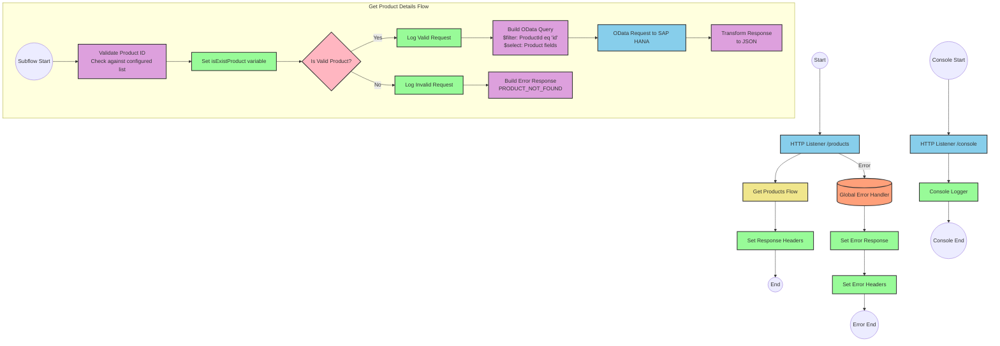

# SAP HANA Product Information API Integration

## Table of Contents
- [SAP HANA Product Information API Integration](#sap-hana-product-information-api-integration)
  - [Table of Contents](#table-of-contents)
  - [API Overview](#api-overview)
  - [Endpoints](#endpoints)
    - [GET /products](#get-products)
  - [Current MuleSoft Flow Logic](#current-mulesoft-flow-logic)
    - [Main Flows](#main-flows)
    - [Subflows](#subflows)
  - [DataWeave Transformations Explained](#dataweave-transformations-explained)
    - [Product Identifier Validation](#product-identifier-validation)
    - [OData Query Parameters Construction](#odata-query-parameters-construction)
    - [Response Transformation](#response-transformation)
    - [Error Response Transformation](#error-response-transformation)
  - [SAP Integration Suite Implementation](#sap-integration-suite-implementation)
    - [Component Mapping](#component-mapping)
    - [Integration Flow Visualization](#integration-flow-visualization)
    - [Configuration Details](#configuration-details)
  - [Environment Configuration](#environment-configuration)
  - [API Reference](#api-reference)
    - [GET /products](#get-products-1)
    - [Error Codes](#error-codes)

## API Overview
- This API provides access to product information stored in SAP HANA
- The API allows retrieval of detailed product information by product identifier
- Base URL: Determined by the HTTP_Listener_config
- Authentication: Not explicitly defined in the source documentation
- Response Format: JSON
- The API validates product identifiers against a configured list before retrieving data from SAP HANA

## Endpoints

### GET /products
- **Purpose**: Retrieves detailed product information based on a product identifier
- **Query Parameters**:
  - `productIdentifier` (required): The unique identifier of the product to retrieve
- **Response Format**: JSON
- **Success Response**:
  - Status Code: 200 OK
  - Body: Product details including ProductId, Category, CategoryName, CurrencyCode, dimensions, descriptions, price, and other attributes
- **Error Response**:
  - Status Code: Determined by error handler
  - Body: JSON object with status, message, and errorCode fields
  - Example:
    ```json
    {
      "status": "error",
      "message": "The product identifier ABC123 was not found.",
      "errorCode": "PRODUCT_NOT_FOUND"
    }
    ```

## Current MuleSoft Flow Logic

### Main Flows

1. **products-main**
   - Triggered by an HTTP listener
   - Sets response headers
   - Routes requests to appropriate handlers
   - Includes error response handling

2. **products-console**
   - Triggered by an HTTP listener
   - Sets response headers
   - Logs information to console
   - Includes error response handling

3. **get:\products:products-config**
   - Triggered when a GET request is made to the /products endpoint
   - References the get-product-details-flow subflow to process the request

### Subflows

**get-product-details-flow**
1. Validates if the provided product identifier exists in the configured list
   - Uses a DataWeave transformation to check if the product identifier is valid
   - Sets a variable `isExistProduct` based on the validation result

2. Conditional processing based on validation result:
   - If the product identifier is valid:
     - Logs a message indicating the request is being processed
     - Constructs an OData query with specific $filter and $select parameters
     - Makes a request to retrieve product details
     - Transforms the response to JSON format
   
   - If the product identifier is invalid:
     - Logs a message indicating the product identifier was not found or incorrectly passed
     - Returns an error response with appropriate status and message

## DataWeave Transformations Explained

### Product Identifier Validation

```dw
%dw 2.0
output application/java
var productidentifer=p('odata.productIdentifiers') splitBy(",")
---
sizeOf(productidentifer filter ($ == attributes.queryParams.productIdentifier))>0
```

This transformation:
1. Retrieves a comma-separated list of valid product identifiers from a property `odata.productIdentifiers`
2. Splits the list into an array
3. Filters the array to find matches with the provided product identifier from query parameters
4. Returns true if at least one match is found (size > 0), false otherwise

### OData Query Parameters Construction

```dw
#[output application/java
---
{
	"$filter" : "ProductId eq '" ++ (attributes.queryParams.productIdentifier default '') ++ "'",
	"$select" : "ProductId,Category,CategoryName,CurrencyCode,DimensionDepth,DimensionHeight,DimensionUnit,DimensionWidth,LongDescription,Name,PictureUrl,Price,QuantityUnit,ShortDescription,SupplierId,Weight,WeightUnit"
}]
```

This transformation:
1. Creates an OData query with two parameters:
   - `$filter`: Constructs a filter expression that matches products where ProductId equals the provided product identifier
   - `$select`: Specifies which fields to include in the response, listing all required product attributes

### Response Transformation

```dw
%dw 2.0
output application/json
---
payload
```

This simple transformation:
1. Takes the payload from the OData response
2. Outputs it as JSON without modification

### Error Response Transformation

```dw
%dw 2.0
output application/json
---
{
	status: "error",
	message: "The product identifier " ++ attributes.queryParams.productIdentifier ++ " was not found.",
	errorCode: "PRODUCT_NOT_FOUND"
}
```

This transformation:
1. Creates a standardized error response structure
2. Includes the invalid product identifier in the error message
3. Sets a specific error code "PRODUCT_NOT_FOUND"

## SAP Integration Suite Implementation

### Component Mapping

| MuleSoft Component | SAP Integration Suite Equivalent | Notes |
|--------------------|----------------------------------|-------|
| HTTP Listener | HTTPS Adapter (Receiver) | Configure with the same path and method settings |
| Flow Reference | Process Call | Used to call the product details subflow |
| DataWeave Transformation | Content Modifier with Script | Use Groovy or JavaScript for equivalent logic |
| Logger | Write to Message Log | Configure with the same log messages |
| Choice/When/Otherwise | Router | Implement the same conditional logic |
| HTTP Request | OData Adapter (Sender) | Configure with the same OData query parameters |
| Set Variable | Content Modifier | Store the validation result |
| Set Payload | Content Modifier | Set the response payload |
| Error Handler | Exception Subprocess | Implement the same error handling logic |

### Integration Flow Visualization



### Configuration Details

1. **HTTPS Adapter (Receiver)**
   - Path: `/products`
   - Method: GET
   - Authentication: To be determined based on security requirements

2. **OData Adapter (Sender)**
   - Connection to SAP HANA
   - OData Version: V2 (assumed, to be confirmed)
   - Query Parameters: 
     - $filter: `ProductId eq '{productIdentifier}'`
     - $select: `ProductId,Category,CategoryName,CurrencyCode,DimensionDepth,DimensionHeight,DimensionUnit,DimensionWidth,LongDescription,Name,PictureUrl,Price,QuantityUnit,ShortDescription,SupplierId,Weight,WeightUnit`

3. **Content Modifier (Validate Product)**
   - Script Type: Groovy or JavaScript
   - Script Logic: Equivalent to the DataWeave transformation for product validation
   - Output: Boolean value indicating if product identifier is valid

4. **Router (Product Validation)**
   - Condition: `${property.isExistProduct}`
   - Routes: Valid product (true) and Invalid product (false)

5. **Message Logger**
   - Log Level: INFO
   - Log Messages: Same as in MuleSoft flow

6. **Content Modifier (Error Response)**
   - Message Body: JSON structure with status, message, and errorCode
   - Headers: Content-Type: application/json

## Environment Configuration

### Important Configuration Parameters
- **odata.productIdentifiers**: Comma-separated list of valid product identifiers
- **HTTP_Listener_config**: Configuration for the HTTP listener
- **Hana_HTTP_Request_Configuration**: Configuration for connecting to SAP HANA

### Environment Variables
- Product identifiers list (from property `odata.productIdentifiers`)
- HTTP listener port and host configuration
- SAP HANA connection details

### Dependencies on External Systems
- SAP HANA: The integration depends on a connection to SAP HANA for retrieving product information
- The OData service must support the query parameters used in the integration

### Security Settings
- Authentication method for SAP HANA connection (not specified in source)
- API security settings (not specified in source)

### Deployment Considerations
- Ensure the SAP HANA system is accessible from the integration environment
- Configure proper error handling and monitoring
- Set up appropriate logging levels for production vs. development

## API Reference

### GET /products
Retrieves detailed product information based on a product identifier.

**Request**
- Method: GET
- Path: `/products`
- Query Parameters:
  - `productIdentifier` (required): The unique identifier of the product to retrieve

**Response**
- Content-Type: application/json
- Body: Product details including:
  - ProductId
  - Category
  - CategoryName
  - CurrencyCode
  - DimensionDepth
  - DimensionHeight
  - DimensionUnit
  - DimensionWidth
  - LongDescription
  - Name
  - PictureUrl
  - Price
  - QuantityUnit
  - ShortDescription
  - SupplierId
  - Weight
  - WeightUnit

**Example Request**
```
GET /products?productIdentifier=HT-1000
```

**Example Response**
```json
{
  "ProductId": "HT-1000",
  "Category": "Laptops",
  "CategoryName": "Laptops",
  "CurrencyCode": "USD",
  "DimensionDepth": 30,
  "DimensionHeight": 3,
  "DimensionUnit": "cm",
  "DimensionWidth": 40,
  "LongDescription": "This laptop is perfect for business users...",
  "Name": "Business Laptop",
  "PictureUrl": "/images/HT-1000.jpg",
  "Price": 999.99,
  "QuantityUnit": "EA",
  "ShortDescription": "Business laptop",
  "SupplierId": "SUPPLIER-001",
  "Weight": 2.5,
  "WeightUnit": "kg"
}
```

### Error Codes
- **PRODUCT_NOT_FOUND**: The requested product identifier was not found or is not valid
- Additional error codes may be returned by the API framework for standard HTTP errors