# Financial Services Cloud Wealth Management API Integration

## Table of Contents
- [Financial Services Cloud Wealth Management API Integration](#financial-services-cloud-wealth-management-api-integration)
  - [Table of Contents](#table-of-contents)
  - [API Overview](#api-overview)
  - [Endpoints](#endpoints)
    - [POST /InvestmentAccounts/Initiate](#post-investmentaccountsinitiate)
    - [PATCH /InvestmentAccounts/Update](#patch-investmentaccountsupdate)
    - [DELETE /InvestmentAccounts/Delete](#delete-investmentaccountsdelete)
    - [GET /InvestmentAccounts/{accountId}/Retrieve](#get-investmentaccountsaccountidretrieve)
    - [POST /InvestmentAccounts/{accountId}/Payments/Initiate](#post-investmentaccountsaccountidpaymentsinitiate)
    - [PATCH /InvestmentAccounts/{accountId}/Payments/Update](#patch-investmentaccountsaccountidpaymentsupdate)
    - [GET /InvestmentAccounts/{accountId}/Payments/Retrieve](#get-investmentaccountsaccountidpaymentsretrieve)
    - [POST /InvestmentAccounts/{accountId}/Acats](#post-investmentaccountsaccountidacats)
    - [POST /InvestmentAccounts/{accountId}/RMD](#post-investmentaccountsaccountidrmd)
    - [PATCH /customers/{customerId}](#patch-customerscustomerid)
  - [Current MuleSoft Flow Logic](#current-mulesoft-flow-logic)
    - [Main API Flow](#main-api-flow)
    - [Investment Accounts Flows](#investment-accounts-flows)
    - [Payments Flows](#payments-flows)
    - [Customer Profile Flow](#customer-profile-flow)
    - [Special Transaction Flows](#special-transaction-flows)
  - [DataWeave Transformations Explained](#dataweave-transformations-explained)
    - [Error Handling Transformations](#error-handling-transformations)
    - [Investment Account Transformations](#investment-account-transformations)
    - [Payment Order Transformations](#payment-order-transformations)
    - [Customer Profile Transformation](#customer-profile-transformation)
    - [Special Transaction Transformations](#special-transaction-transformations)
  - [SAP Integration Suite Implementation](#sap-integration-suite-implementation)
    - [Component Mapping](#component-mapping)
    - [Integration Flow Visualization](#integration-flow-visualization)
    - [Configuration Details](#configuration-details)
  - [Environment Configuration](#environment-configuration)
    - [API Configuration](#api-configuration)
    - [HTTP Listener Configuration](#http-listener-configuration)
    - [TLS Configuration](#tls-configuration)
    - [Error Handling Configuration](#error-handling-configuration)
  - [API Reference](#api-reference)
    - [Authentication](#authentication)
    - [Error Codes](#error-codes)
    - [Request Tracing](#request-tracing)
    - [Complete Endpoint List](#complete-endpoint-list)

## API Overview

The Financial Services Cloud Wealth Management API provides a comprehensive interface for managing investment accounts, beneficiaries, payment orders, and customer profiles within a wealth management system. This API enables financial institutions to:

- Create, update, and delete investment accounts and their beneficiaries
- Manage standing payment orders for investment accounts
- Retrieve account details and payment information
- Process specialized transactions like ACATS (Automated Customer Account Transfer Service) and RMD (Required Minimum Distribution)
- Update customer profile information

**Base URL**: `/api/v1`

**Authentication**: The API uses TLS for secure communication. Authentication details are configured through keystore secrets.

**Response Format**: All responses are in JSON format with standardized error handling. Success responses include the relevant data structures, while error responses follow a consistent format with error codes, messages, transaction IDs, and timestamps.

**Request Tracing**: All requests can include optional `requestId` and `flowRefId` query parameters for tracing purposes.

## Endpoints

### POST /InvestmentAccounts/Initiate

**Purpose**: Creates a new investment account with beneficiaries.

**Request Parameters**:
- **Query Parameters**:
  - `requestId` (optional): Unique identifier for the request for tracing
  - `flowRefId` (optional): Reference ID for the flow for tracing

**Request Body**:
```json
{
  "InvestmentAccounts": {
    "AccountIds": ["string"],
    "Beneficiaries": {
      "Primary": [
        {
          "BeneficiaryName": "string",
          "BeneficiaryType": "string",
          "BeneficiaryDob": "string",
          "SSN": "string",
          "EmailAddress": "string",
          "MobileNumber": "string",
          "RelationshipType": "string",
          "Address": {
            "AddressType": "string",
            "AddressLine1": "string",
            "AddressLine2": "string",
            "City": "string",
            "State": "string",
            "PostalCode": "string",
            "Country": "string"
          },
          "SharePercentage": "string",
          "PerStirpes": "string"
        }
      ],
      "Contingent": [
        {
          "BeneficiaryName": "string",
          "BeneficiaryType": "string",
          "BeneficiaryDob": "string",
          "SSN": "string",
          "EmailAddress": "string",
          "MobileNumber": "string",
          "RelationshipType": "string",
          "Address": {
            "AddressType": "string",
            "AddressLine1": "string",
            "AddressLine2": "string",
            "City": "string",
            "State": "string",
            "PostalCode": "string",
            "Country": "string"
          },
          "SharePercentage": "string",
          "PerStirpes": "string"
        }
      ]
    }
  }
}
```

**Response**:
- **Status Code**: 201 Created
- **Response Body**:
```json
{
  "InvestmentAccounts": {
    "AccountIds": ["string"],
    "Beneficiaries": {
      "Primary": [
        {
          "BeneficiaryId": "BFR-1234567",
          "BeneficiaryName": "string",
          "BeneficiaryType": "string",
          "BeneficiaryDob": "string",
          "SSN": "string",
          "EmailAddress": "string",
          "MobileNumber": "string",
          "RelationshipType": "string",
          "Address": {
            "AddressType": "string",
            "AddressLine1": "string",
            "AddressLine2": "string",
            "City": "string",
            "State": "string",
            "PostalCode": "string",
            "Country": "string"
          },
          "SharePercentage": "string",
          "PerStirpes": "string"
        }
      ],
      "Contingent": [
        {
          "BeneficiaryId": "BFR-1234567",
          "BeneficiaryName": "string",
          "BeneficiaryType": "string",
          "BeneficiaryDob": "string",
          "SSN": "string",
          "EmailAddress": "string",
          "MobileNumber": "string",
          "RelationshipType": "string",
          "Address": {
            "AddressType": "string",
            "AddressLine1": "string",
            "AddressLine2": "string",
            "City": "string",
            "State": "string",
            "PostalCode": "string",
            "Country": "string"
          },
          "SharePercentage": "string",
          "PerStirpes": "string"
        }
      ]
    }
  }
}
```

**Error Responses**:
- 400 Bad Request: Invalid input parameters
- 500 Internal Server Error: Server-side processing error

### PATCH /InvestmentAccounts/Update

**Purpose**: Updates existing beneficiaries for investment accounts.

**Request Parameters**:
- **Query Parameters**:
  - `requestId` (optional): Unique identifier for the request for tracing
  - `flowRefId` (optional): Reference ID for the flow for tracing

**Request Body**:
```json
{
  "InvestmentAccounts": {
    "AccountIds": ["string"],
    "Addresses": [
      {
        "AddressType": "string",
        "AddressLine1": "string",
        "AddressLine2": "string",
        "City": "string",
        "State": "string",
        "PostalCode": "string",
        "Country": "string"
      }
    ],
    "Beneficiaries": {
      "Primary": [
        {
          "BeneficiaryId": "string",
          "BeneficiaryName": "string",
          "BeneficiaryType": "string",
          "BeneficiaryDob": "string",
          "SSN": "string",
          "EmailAddress": "string",
          "MobileNumber": "string",
          "RelationshipType": "string",
          "Address": {
            "AddressType": "string",
            "AddressLine1": "string",
            "AddressLine2": "string",
            "City": "string",
            "State": "string",
            "PostalCode": "string",
            "Country": "string"
          },
          "SharePercentage": "string",
          "PerStirpes": "string"
        }
      ],
      "Contingent": [
        {
          "BeneficiaryId": "string",
          "BeneficiaryName": "string",
          "BeneficiaryType": "string",
          "BeneficiaryDob": "string",
          "SSN": "string",
          "EmailAddress": "string",
          "MobileNumber": "string",
          "RelationshipType": "string",
          "Address": {
            "AddressType": "string",
            "AddressLine1": "string",
            "AddressLine2": "string",
            "City": "string",
            "State": "string",
            "PostalCode": "string",
            "Country": "string"
          },
          "SharePercentage": "string",
          "PerStirpes": "string"
        }
      ]
    }
  }
}
```

**Response**:
- **Status Code**: 200 OK
- **Response Body**:
```json
{
  "InvestmentAccounts": {
    "AccountIds": ["string"],
    "Addresses": [
      {
        "AddressType": "string",
        "AddressLine1": "string",
        "AddressLine2": "string",
        "City": "string",
        "State": "string",
        "PostalCode": "string",
        "Country": "string"
      }
    ],
    "Beneficiaries": {
      "Primary": [
        {
          "BeneficiaryId": "string",
          "BeneficiaryName": "string",
          "BeneficiaryType": "string",
          "BeneficiaryDob": "string",
          "SSN": "string",
          "EmailAddress": "string",
          "MobileNumber": "string",
          "RelationshipType": "string",
          "Address": {
            "AddressType": "string",
            "AddressLine1": "string",
            "AddressLine2": "string",
            "City": "string",
            "State": "string",
            "PostalCode": "string",
            "Country": "string"
          },
          "SharePercentage": "string",
          "PerStirpes": "string"
        }
      ],
      "Contingent": [
        {
          "BeneficiaryId": "string",
          "BeneficiaryName": "string",
          "BeneficiaryType": "string",
          "BeneficiaryDob": "string",
          "SSN": "string",
          "EmailAddress": "string",
          "MobileNumber": "string",
          "RelationshipType": "string",
          "Address": {
            "AddressType": "string",
            "AddressLine1": "string",
            "AddressLine2": "string",
            "City": "string",
            "State": "string",
            "PostalCode": "string",
            "Country": "string"
          },
          "SharePercentage": "string",
          "PerStirpes": "string"
        }
      ]
    }
  }
}
```

**Error Responses**:
- 400 Bad Request: Invalid input parameters
- 404 Not Found: Account or beneficiary not found
- 500 Internal Server Error: Server-side processing error

### DELETE /InvestmentAccounts/Delete

**Purpose**: Deletes beneficiaries from investment accounts.

**Request Parameters**:
- **Query Parameters**:
  - `requestId` (optional): Unique identifier for the request for tracing
  - `flowRefId` (optional): Reference ID for the flow for tracing

**Request Body**:
```json
{
  "InvestmentAccounts": {
    "AccountIds": ["string"],
    "Beneficiaries": [
      {
        "BeneficiaryId": "string"
      }
    ]
  }
}
```

**Response**:
- **Status Code**: 200 OK
- **Response Body**:
```json
{
  "InvestmentAccounts": {
    "AccountIds": ["string"],
    "Beneficiaries": [
      {
        "BeneficiaryId": "string",
        "Status": "DELETED"
      }
    ]
  }
}
```

**Error Responses**:
- 400 Bad Request: Invalid input parameters
- 404 Not Found: Account or beneficiary not found
- 500 Internal Server Error: Server-side processing error

### GET /InvestmentAccounts/{accountId}/Retrieve

**Purpose**: Retrieves details of a specific investment account, including beneficiaries.

**Request Parameters**:
- **Path Parameters**:
  - `accountId`: The unique identifier of the investment account
- **Query Parameters**:
  - `requestId` (optional): Unique identifier for the request for tracing
  - `flowRefId` (optional): Reference ID for the flow for tracing

**Response**:
- **Status Code**: 200 OK
- **Response Body**:
```json
{
  "LinkedAccount": {
    "AccountNumber": "string",
    "AccountHolderName": "string",
    "AccountType": "string",
    "BankReference": {
      "BankName": "string",
      "RoutingNumber": "string",
      "Address": {
        "AddressType": "string",
        "AddressLine1": "string",
        "AddressLine2": "string",
        "City": "string",
        "State": "string",
        "PostalCode": "string",
        "Country": "string"
      }
    }
  },
  "Beneficiaries": {
    "Primary": [
      {
        "BeneficiaryId": "string",
        "BeneficiaryName": "string",
        "BeneficiaryType": "string",
        "BeneficiaryDob": "string",
        "SSN": "string",
        "EmailAddress": "string",
        "MobileNumber": "string",
        "RelationshipType": "string",
        "Address": {
          "AddressType": "string",
          "AddressLine1": "string",
          "AddressLine2": "string",
          "City": "string",
          "State": "string",
          "PostalCode": "string",
          "Country": "string"
        },
        "SharePercentage": "string",
        "PerStirpes": "string"
      }
    ],
    "Contingent": [
      {
        "BeneficiaryId": "string",
        "BeneficiaryName": "string",
        "BeneficiaryType": "string",
        "BeneficiaryDob": "string",
        "SSN": "string",
        "EmailAddress": "string",
        "MobileNumber": "string",
        "RelationshipType": "string",
        "Address": {
          "AddressType": "string",
          "AddressLine1": "string",
          "AddressLine2": "string",
          "City": "string",
          "State": "string",
          "PostalCode": "string",
          "Country": "string"
        },
        "SharePercentage": "string",
        "PerStirpes": "string"
      }
    ]
  }
}
```

**Error Responses**:
- 404 Not Found: Account not found
- 500 Internal Server Error: Server-side processing error

### POST /InvestmentAccounts/{accountId}/Payments/Initiate

**Purpose**: Creates new standing payment orders for an investment account.

**Request Parameters**:
- **Path Parameters**:
  - `accountId`: The unique identifier of the investment account
- **Query Parameters**:
  - `requestId` (optional): Unique identifier for the request for tracing
  - `flowRefId` (optional): Reference ID for the flow for tracing

**Request Body**:
```json
{
  "Payments": [
    {
      "PaymentType": "string",
      "PaymentMode": "string",
      "PaymentMechanism": "string",
      "PaymentPurpose": "string",
      "PaymentDefinition": {
        "PaymentAmount": {
          "MaxAmount": "string",
          "Currency": "string"
        }
      },
      "PayeeBankReference": {
        "BankName": "string",
        "RoutingNumber": "string"
      },
      "PayeeAccountReference": {
        "PayeeAccountNumber": "string",
        "PayeeAccountType": "string",
        "PayeeAccountDetails": "string"
      },
      "PaymentTransferType": "string",
      "PayeeReference": {
        "PayeeName": "string",
        "PayeeAddress": {
          "AddressType": "string",
          "AddressLine1": "string",
          "AddressLine2": "string",
          "City": "string",
          "State": "string",
          "PostalCode": "string",
          "Country": "string"
        }
      }
    }
  ]
}
```

**Response**:
- **Status Code**: 201 Created
- **Response Body**:
```json
{
  "Payments": [
    {
      "PaymentId": "PMT1234567",
      "CreationDateTime": "2023-10-09T16:34:19.993+05:30",
      "PaymentType": "string",
      "PaymentMode": "string",
      "PaymentMechanism": "string",
      "PaymentPurpose": "string",
      "PaymentDefinition": {
        "PaymentAmount": {
          "MaxAmount": "string",
          "Currency": "string"
        }
      },
      "PayeeBankReference": {
        "BankName": "string",
        "RoutingNumber": "string"
      },
      "PayeeAccountReference": {
        "PayeeAccountNumber": "string",
        "PayeeAccountType": "string",
        "PayeeAccountDetails": "string"
      },
      "PaymentTransferType": "string",
      "PayeeReference": {
        "PayeeName": "string",
        "PayeeAddress": {
          "AddressType": "string",
          "AddressLine1": "string",
          "AddressLine2": "string",
          "City": "string",
          "State": "string",
          "PostalCode": "string",
          "Country": "string"
        }
      }
    }
  ]
}
```

**Error Responses**:
- 400 Bad Request: Invalid input parameters
- 404 Not Found: Account not found
- 500 Internal Server Error: Server-side processing error

### PATCH /InvestmentAccounts/{accountId}/Payments/Update

**Purpose**: Cancels existing standing payment orders for an investment account.

**Request Parameters**:
- **Path Parameters**:
  - `accountId`: The unique identifier of the investment account
- **Query Parameters**:
  - `requestId` (optional): Unique identifier for the request for tracing
  - `flowRefId` (optional): Reference ID for the flow for tracing

**Request Body**:
```json
{
  "PaymentIds": ["string"]
}
```

**Response**:
- **Status Code**: 200 OK
- **Response Body**:
```json
{
  "PaymentIds": ["string"],
  "CancelDateTime": "2023-10-09T16:34:19.993+05:30"
}
```

**Error Responses**:
- 400 Bad Request: Invalid input parameters
- 404 Not Found: Account or payment not found
- 500 Internal Server Error: Server-side processing error

### GET /InvestmentAccounts/{accountId}/Payments/Retrieve

**Purpose**: Retrieves standing payment orders for an investment account with optional filtering.

**Request Parameters**:
- **Path Parameters**:
  - `accountId`: The unique identifier of the investment account
- **Query Parameters**:
  - `requestId` (optional): Unique identifier for the request for tracing
  - `flowRefId` (optional): Reference ID for the flow for tracing
  - `paymentId` (optional): Filter by payment ID
  - `payeeName` (optional): Filter by payee name
  - `amount` (optional): Filter by payment amount

**Response**:
- **Status Code**: 200 OK
- **Response Body**:
```json
{
  "PaymentOrders": [
    {
      "CreationDateTime": "2023-10-09T16:34:19.993+05:30",
      "PaymentId": "PMT1234567",
      "Payments": {
        "PaymentType": "string",
        "PaymentMode": "string",
        "PaymentMechanism": "string",
        "PaymentPurpose": "string",
        "PaymentDefinition": {
          "PaymentAmount": {
            "MaxAmount": "string",
            "Currency": "string"
          }
        },
        "PayeeBankReference": {
          "BankName": "string",
          "RoutingNumber": "string"
        },
        "PayeeAccountReference": {
          "PayeeAccountNumber": "string",
          "PayeeAccountType": "string",
          "PayeeAccountDetails": "string"
        },
        "PaymentTransferType": "string",
        "PayeeReference": {
          "PayeeName": "string",
          "PayeeAddress": {
            "AddressType": "string",
            "AddressLine1": "string",
            "AddressLine2": "string",
            "City": "string",
            "State": "string",
            "PostalCode": "string",
            "Country": "string"
          }
        }
      }
    }
  ]
}
```

**Error Responses**:
- 404 Not Found: Account not found
- 500 Internal Server Error: Server-side processing error

### POST /InvestmentAccounts/{accountId}/Acats

**Purpose**: Initiates an ACATS (Automated Customer Account Transfer Service) transaction for an investment account.

**Request Parameters**:
- **Path Parameters**:
  - `accountId`: The unique identifier of the investment account
- **Query Parameters**:
  - `requestId` (optional): Unique identifier for the request for tracing
  - `flowRefId` (optional): Reference ID for the flow for tracing

**Request Body**:
```json
{
  "AcatDetails": {
    "TransferType": "string",
    "AcatType": "string",
    "TransferAction": "string",
    "TransferDetails": {
      "Securities": "string",
      "Cash": "string",
      "FundsTransfer": "string",
      "CashTransfer": "string",
      "CDTransfer": "string",
      "AnnuityTransfer": "string",
      "ManagedAccountTransfer": "string"
    },
    "ExternalAccountDetails": {
      "AccountNumber": "string",
      "AccountType": "string",
      "AccountTitle": "string",
      "TransferringFirmDetails": {
        "FirmName": "string",
        "Phone": "string",
        "Address": "string"
      }
    }
  }
}
```

**Response**:
- **Status Code**: 200 OK
- **Response Body**:
```json
{
  "AcatDetails": {
    "TransferType": "string",
    "AcatType": "string",
    "TransferAction": "string",
    "TransferDetails": {
      "Securities": "string",
      "Cash": "string",
      "FundsTransfer": "string",
      "CashTransfer": "string",
      "CDTransfer": "string",
      "AnnuityTransfer": "string",
      "ManagedAccountTransfer": "string"
    },
    "ExternalAccountDetails": {
      "AccountNumber": "string",
      "AccountType": "string",
      "AccountTitle": "string",
      "TransferringFirmDetails": {
        "FirmName": "string",
        "Phone": "string",
        "Address": "string"
      }
    }
  }
}
```

**Error Responses**:
- 400 Bad Request: Invalid input parameters
- 404 Not Found: Account not found
- 500 Internal Server Error: Server-side processing error

### POST /InvestmentAccounts/{accountId}/RMD

**Purpose**: Initiates a Required Minimum Distribution (RMD) transaction for an investment account.

**Request Parameters**:
- **Path Parameters**:
  - `accountId`: The unique identifier of the investment account
- **Query Parameters**:
  - `requestId` (optional): Unique identifier for the request for tracing
  - `flowRefId` (optional): Reference ID for the flow for tracing

**Request Body**:
```json
{
  "PaymentOption": "string",
  "PaymentFrequency": "string",
  "DistributionSchedule": "string",
  "TaxYear": "string",
  "CalculateRMDAmount": "string",
  "WithdrawlAmount": "string",
  "PaymentInstructions": "string",
  "TaxWithholdings": "string"
}
```

**Response**:
- **Status Code**: 200 OK
- **Response Body**:
```json
{
  "PaymentOption": "string",
  "PaymentFrequency": "string",
  "DistributionSchedule": "string",
  "TaxYear": "string",
  "CalculateRMDAmount": "string",
  "WithdrawlAmount": "string",
  "PaymentInstructions": "string",
  "TaxWithholdings": "string"
}
```

**Error Responses**:
- 400 Bad Request: Invalid input parameters
- 404 Not Found: Account not found
- 500 Internal Server Error: Server-side processing error

### PATCH /customers/{customerId}

**Purpose**: Updates customer profile information.

**Request Parameters**:
- **Path Parameters**:
  - `customerId`: The unique identifier of the customer
- **Query Parameters**:
  - `requestId` (optional): Unique identifier for the request for tracing
  - `flowRefId` (optional): Reference ID for the flow for tracing

**Request Body**:
```json
{
  "ProfileInformation": {
    "Addresses": [
      {
        "AddressType": "string",
        "AddressLine1": "string",
        "AddressLine2": "string",
        "City": "string",
        "State": "string",
        "PostalCode": "string",
        "Country": "string"
      }
    ],
    "Email": "string",
    "FirstName": "string",
    "Phone": "string",
    "LastName": "string",
    "Mobile": "string",
    "BirthDate": "string",
    "MaritalStatus": "string",
    "EmploymentDetails": "string"
  }
}
```

**Response**:
- **Status Code**: 200 OK
- **Response Body**:
```json
{
  "ProfileInformation": {
    "Addresses": [
      {
        "AddressType": "string",
        "AddressLine1": "string",
        "AddressLine2": "string",
        "City": "string",
        "State": "string",
        "PostalCode": "string",
        "Country": "string"
      }
    ],
    "Email": "string",
    "FirstName": "string",
    "Phone": "string",
    "LastName": "string",
    "Mobile": "string",
    "BirthDate": "string",
    "MaritalStatus": "string",
    "EmploymentDetails": "string"
  }
}
```

**Error Responses**:
- 400 Bad Request: Invalid input parameters
- 404 Not Found: Customer not found
- 500 Internal Server Error: Server-side processing error

## Current MuleSoft Flow Logic

### Main API Flow

The main API flow (`fsc-wealth-management-api-main`) serves as the entry point for all API requests. It performs the following operations:

1. **HTTP Listener**: Listens for incoming HTTP requests on the configured endpoint.
2. **Response Handling**: Sets up the response structure including headers.
3. **Error Response Handling**: Configures error response handling.
4. **Logging**: Logs request details including requestId and flowRefId:
   ```
   #["\n RequestId: " ++ (attributes.queryParams.requestId default "N/A") ++ "\n FlowReferenceId: " ++ (attributes.queryParams.flowRefId default "N/A")]
   ```
5. **Payload Logging**: Logs the request payload.
6. **Router**: Routes the request to the appropriate flow based on the endpoint path and HTTP method.
7. **Response Logging**: Logs the response payload.
8. **Error Handler**: Handles any errors that occur during processing.

### Investment Accounts Flows

#### Add Beneficiaries Flow
The `post:\InvestmentAccounts\Initiate:application\json:fsc-wealth-management-api-config` flow handles the creation of new investment accounts with beneficiaries:

1. Receives the request with account and beneficiary details.
2. Calls the `add-beneficiaries-sub-flow` subflow.
3. The subflow transforms the input using the `p-addBeneficiariesResponse.dwl` transformation to generate unique beneficiary IDs.
4. Returns the created beneficiaries with their new IDs.

#### Update Beneficiaries Flow
The `patch:\InvestmentAccounts\Update:application\json:fsc-wealth-management-api-config` flow handles updating existing beneficiaries:

1. Receives the request with updated beneficiary details.
2. Calls the `update-beneficiaries-sub-flow` subflow.
3. The subflow transforms the input using the `p-updateBeneficiariesResponse.dwl` transformation.
4. Returns the updated beneficiary information.

#### Delete Beneficiaries Flow
The `delete:\InvestmentAccounts\Delete:application\json:fsc-wealth-management-api-config` flow handles deleting beneficiaries:

1. Receives the request with beneficiary IDs to delete.
2. Calls the `delete-beneficiaries-sub-flow` subflow.
3. The subflow transforms the input using the `p-deleteBeneficiariesResponse.dwl` transformation.
4. Returns confirmation of deletion with status "DELETED".

#### Retrieve Investment Account Details Flow
The `get:\InvestmentAccounts\(accountId)\Retrieve:fsc-wealth-management-api-config` flow retrieves account details:

1. Receives the request with the account ID.
2. Calls the `retrieve-investment-account-details-sub-flow` subflow.
3. The subflow sets the account details in a variable and transforms the data using the `p-getBeneficiariesResponse.dwl` transformation.
4. Returns the account and beneficiary details.

### Payments Flows

#### Add Standing Orders Flow
The `post:\InvestmentAccounts\(accountId)\Payments\Initiate:application\json:fsc-wealth-management-api-config` flow creates new payment orders:

1. Receives the request with payment details.
2. Calls the `add-standing-orders-sub-flow` subflow.
3. The subflow transforms the input using the `p-addPaymentOrdersResponse.dwl` transformation to generate unique payment IDs.
4. Returns the created payment orders with their new IDs and creation timestamps.

#### Cancel Standing Orders Flow
The `patch:\InvestmentAccounts\(accountId)\Payments\Update:application\json:fsc-wealth-management-api-config` flow cancels existing payment orders:

1. Receives the request with payment IDs to cancel.
2. Calls the `cancel-standing-orders-sub-flow` subflow.
3. The subflow transforms the input using the `p-cancelPaymentOrdersResponse.dwl` transformation.
4. Returns confirmation of cancellation with the current timestamp.

#### Retrieve Standing Orders Flow
The `get:\InvestmentAccounts\(accountId)\Payments\Retrieve:fsc-wealth-management-api-config` flow retrieves payment orders:

1. Receives the request with optional filter parameters.
2. Logs the query parameters.
3. Calls the `retrieve-standing-orders-sub-flow` subflow.
4. The subflow sets the payment orders in a variable and transforms the data using the `p-retrievePaymentOrdersResponse.dwl` transformation.
5. Applies filtering based on the query parameters (paymentId, payeeName, amount).
6. Returns the filtered payment orders.

### Customer Profile Flow

The `patch:\customers\(customerId):application\json:fsc-wealth-management-api-config` flow updates customer profile information:

1. Receives the request with updated profile details.
2. Calls the `update-customers-profile-sub-flow` subflow.
3. The subflow transforms the input using the `p-updateProfileResponse.dwl` transformation.
4. Returns the updated profile information.

### Special Transaction Flows

#### ACATS Flow
The `post:\InvestmentAccounts\(accountId)\Acats:application\json:fsc-wealth-management-api-config` flow handles ACATS transactions:

1. Receives the request with ACATS details.
2. Calls the `prepare-acats-response-sub-flow` subflow.
3. The subflow transforms the input using the `p-acatResponse.dwl` transformation.
4. Returns the processed ACATS information.

#### RMD Flow
The `post:\InvestmentAccounts\(accountId)\RMD:application\json:fsc-wealth-management-api-config` flow handles RMD transactions:

1. Receives the request with RMD details.
2. Calls the `prepare-rmd-response-sub-flow` subflow.
3. The subflow transforms the input using the `p-rmdResponse.dwl` transformation.
4. Returns the processed RMD information.

## DataWeave Transformations Explained

### Error Handling Transformations

#### e-400.dwl
This transformation creates a standardized error response for 400 Bad Request errors.

**Input**: Error details from the system
**Output**: Standardized error response JSON

```dataweave
%dw 2.0
output application/json
---
{
  "errorCode": "400",
  "errorMessage": (((error.description splitBy "\n") distinctBy $) orderBy $)[-1 to 0],
  "transactionId": correlationId,
  "timeStamp": now()
}
```

The transformation:
1. Sets the error code to "400"
2. Processes the error description by splitting it by newlines, removing duplicates, ordering the lines, and then taking the last line (which typically contains the most specific error message)
3. Includes the correlation ID for tracing
4. Adds the current timestamp

Similar transformations exist for other error codes (404, 405, 406, 415, 500, 501) with the same structure but different error codes.

### Investment Account Transformations

#### p-addBeneficiariesResponse.dwl
This transformation processes the request to add beneficiaries and generates unique IDs for each new beneficiary.

**Input**: Investment account and beneficiary details
**Output**: Investment account with beneficiaries that have unique IDs

```dataweave
%dw 2.0
var bfr= "BFR-"
var bfrTrack= "BFRTRACK"
var bfrNumbers= '0123456789'
var bfrCharSetLength= sizeOf(bfrNumbers) - 1
var bfrNumbersLength= 7
output application/json skipNullOn = "everywhere"
---
{
	InvestmentAccounts: {
		AccountIds: payload.InvestmentAccounts.AccountIds map ( accountId , indexOfAccountId ) -> accountId,
		Beneficiaries: {
			Primary: payload.InvestmentAccounts.Beneficiaries.Primary map ($ ++ {
				BeneficiaryId: bfr ++ (1 to bfrNumbersLength map bfrNumbers[randomInt(bfrCharSetLength)] joinBy '')
			}),
			Contingent: payload.InvestmentAccounts.Beneficiaries.Contingent map ($ ++ {
				BeneficiaryId: bfr ++ (1 to bfrNumbersLength map bfrNumbers[randomInt(bfrCharSetLength)] joinBy '')
			})
		}
	}
}
```

The transformation:
1. Defines variables for generating unique beneficiary IDs with a "BFR-" prefix followed by 7 random digits
2. Maps through the account IDs to maintain them in the response
3. Maps through both primary and contingent beneficiaries, adding a unique BeneficiaryId to each one
4. Uses the skipNullOn = "everywhere" option to remove any null values from the output

#### p-updateBeneficiariesResponse.dwl
This transformation processes the request to update beneficiaries, generating IDs for new beneficiaries while preserving existing IDs.

**Input**: Investment account with updated beneficiary details
**Output**: Investment account with updated beneficiaries, ensuring all have IDs

```dataweave
%dw 2.0
var bfr= "BFR-"
var bfrTrack= "BFRTRACK"
var bfrNumbers= '0123456789'
var bfrCharSetLength= sizeOf(bfrNumbers) - 1
var bfrNumbersLength= 7

fun treeFilter(value: Any, predicate: (value:Any) -> Boolean) =
    value  match {
            case object is Object ->  do {
               object mapObject ((value, key, index) -> 
                    (key): treeFilter(value, predicate)
                )
                filterObject ((value, key, index) -> predicate(value))
            }
            case array is Array -> do {
                    array map ((item, index) -> treeFilter(item, predicate))
                                         filter ((item, index) -> predicate(item))                 
            }
            else -> $
    }
    
output application/json skipNullOn = "everywhere"
---
{
	InvestmentAccounts: {
		AccountIds: payload.InvestmentAccounts.AccountIds map ( accountId , indexOfAccountId ) -> accountId,
		Addresses: payload.InvestmentAccounts.Addresses,
		Beneficiaries: {
			Primary: payload.InvestmentAccounts.Beneficiaries.Primary map if ( $.BeneficiaryId == null ) ($ ++ {
				"BeneficiaryId": bfr ++ (1 to bfrNumbersLength map bfrNumbers[randomInt(bfrCharSetLength)] joinBy '')
			}) else $,
			Contingent: payload.InvestmentAccounts.Beneficiaries.Contingent map if ( $.BeneficiaryId == null ) ($ ++ {
				"BeneficiaryId": bfr ++ (1 to bfrNumbersLength map bfrNumbers[randomInt(bfrCharSetLength)] joinBy '')
			}) else $
		}
	}
} treeFilter ((value) -> 
    value match {
        case v is Array| Object | Null | "" -> !isEmpty(v)
        else -> true
    }
)
```

The transformation:
1. Defines variables for generating unique beneficiary IDs with a "BFR-" prefix followed by 7 random digits
2. Defines a recursive `treeFilter` function to remove empty values from the output
3. Maps through the account IDs and includes the addresses
4. Maps through both primary and contingent beneficiaries:
   - If a beneficiary doesn't have an ID (BeneficiaryId is null), generates a new one
   - If a beneficiary already has an ID, preserves it
5. Applies the treeFilter function to remove any empty arrays, objects, null values, or empty strings from the output

#### p-deleteBeneficiariesResponse.dwl
This transformation processes the request to delete beneficiaries and returns a confirmation response.

**Input**: Investment account with beneficiary IDs to delete
**Output**: Confirmation of deletion with status "DELETED"

```dataweave
%dw 2.0
output application/json skipNullOn = "everywhere"
---
{
	InvestmentAccounts: {
		AccountIds: payload.InvestmentAccounts.AccountIds map ( accountId , indexOfAccountId ) -> accountId, 
		Beneficiaries: payload.InvestmentAccounts.Beneficiaries map {
			BeneficiaryId: $.BeneficiaryId,
			Status: "DELETED"
		}
	}
}
```

The transformation:
1. Maps through the account IDs to maintain them in the response
2. Maps through the beneficiaries to be deleted, keeping only the BeneficiaryId and adding a Status of "DELETED"

#### p-getBeneficiariesResponse.dwl
This transformation retrieves investment account details including beneficiaries.

**Input**: None (uses a variable set earlier in the flow)
**Output**: Account details with beneficiaries

```dataweave
%dw 2.0
output application/json
---
{
	LinkedAccount: vars.investmentAccountDetails.LinkedAccount,
	Beneficiaries: vars.investmentAccountDetails.Beneficiaries
}
```

The transformation:
1. Retrieves the LinkedAccount and Beneficiaries from the investmentAccountDetails variable
2. Structures them in the response format

### Payment Order Transformations

#### p-addPaymentOrdersResponse.dwl
This transformation processes the request to add payment orders and generates unique IDs for each new payment.

**Input**: Payment order details
**Output**: Payment orders with unique IDs and creation timestamps

```dataweave
%dw 2.0
var sot= "PMT"
var stordTrack= "STORDTRACK"
var sotNumbers= '0123456789'
var sotCharSetLength= sizeOf(sotNumbers) - 1
var sotNumbersLength= 7
output application/json skipNullOn = "everywhere"
---
{
	Payments: payload.Payments map ($ ++ {
		CreationDateTime: now(),
		PaymentId: sot ++ (1 to sotNumbersLength map sotNumbers[randomInt(sotCharSetLength)] joinBy '')
	})
}
```

The transformation:
1. Defines variables for generating unique payment IDs with a "PMT" prefix followed by 7 random digits
2. Maps through the payments, adding:
   - A CreationDateTime with the current timestamp
   - A unique PaymentId
3. Uses the skipNullOn = "everywhere" option to remove any null values from the output

#### p-cancelPaymentOrdersResponse.dwl
This transformation processes the request to cancel payment orders and returns a confirmation response.

**Input**: Payment IDs to cancel
**Output**: Confirmation of cancellation with timestamp

```dataweave
%dw 2.0
output application/json
---
{
	PaymentIds: payload.PaymentIds,
	CancelDateTime: now()
}
```

The transformation:
1. Includes the PaymentIds from the request
2. Adds a CancelDateTime with the current timestamp

#### p-retrievePaymentOrdersResponse.dwl
This transformation retrieves payment orders with optional filtering based on query parameters.

**Input**: None (uses a variable set earlier in the flow and query parameters)
**Output**: Filtered payment orders

```dataweave
%dw 2.0
output application/json  
---
{
  PaymentOrders: 
    if (attributes.queryParams.paymentId? and attributes.queryParams.payeeName? and attributes.queryParams.amount?)
      vars.paymentOrders filter ($.PaymentId ~= attributes.queryParams.paymentId and $.Payments.PayeeReference.PayeeName ~= attributes.queryParams.payeeName and $.Payments.PaymentDefinition.PaymentAmount.Amount ~= attributes.queryParams.amount)
    else if (attributes.queryParams.paymentId? and attributes.queryParams.payeeName?)
      vars.paymentOrders filter ($.PaymentId ~= attributes.queryParams.paymentId and $.Payments.PayeeReference.PayeeName ~= attributes.queryParams.payeeName)
    else if (attributes.queryParams.paymentId? and attributes.queryParams.amount?)
      vars.paymentOrders filter ($.PaymentId ~= attributes.queryParams.paymentId and $.Payments.PaymentDefinition.PaymentAmount.Amount ~= attributes.queryParams.amount)
    else if (attributes.queryParams.payeeName? and attributes.queryParams.amount?)
      vars.paymentOrders filter ($.Payments.PayeeReference.PayeeName ~= attributes.queryParams.payeeName and $.Payments.PaymentDefinition.PaymentAmount.Amount ~= attributes.queryParams.amount)
    else if (attributes.queryParams.paymentId?)
      vars.paymentOrders filter ($.PaymentId ~= attributes.queryParams.paymentId)
    else if (attributes.queryParams.payeeName?)
      vars.paymentOrders filter ($.Payments.PayeeReference.PayeeName ~= attributes.queryParams.payeeName)
    else if (attributes.queryParams.amount?)
      vars.paymentOrders filter ($.Payments.PaymentDefinition.PaymentAmount.Amount ~= attributes.queryParams.amount)
    else
      vars.paymentOrders
}
```

The transformation:
1. Uses a series of conditional statements to filter the payment orders based on the query parameters:
   - If all three parameters (paymentId, payeeName, amount) are provided, filters by all three
   - If two parameters are provided, filters by those two
   - If one parameter is provided, filters by that one
   - If no parameters are provided, returns all payment orders
2. Uses the `~=` operator for approximate matching (case-insensitive, partial matching)

### Customer Profile Transformation

#### p-updateProfileResponse.dwl
This transformation processes the request to update a customer profile.

**Input**: Updated profile information
**Output**: Processed profile information

```dataweave
%dw 2.0
var ProfileInformation = payload.ProfileInformation
output application/json skipNullOn="everywhere"
---
{
	ProfileInformation: {
		Addresses: ProfileInformation.Addresses map ( address , indexOfAddress ) -> {
			AddressLine2: address.AddressLine2,
			AddressLine1: address.AddressLine1,
			State: address.State,
			PostalCode: address.PostalCode,
			City: address.City,
			AddressType: address.AddressType,
			Country: address.Country
		},
		Email: ProfileInformation.Email,
		FirstName: ProfileInformation.FirstName,
		Phone: ProfileInformation.Phone,
		LastName: ProfileInformation.LastName,
		Mobile: ProfileInformation.Mobile,
		BirthDate: ProfileInformation.BirthDate,
		MaritalStatus: ProfileInformation.MaritalStatus,
		EmploymentDetails: ProfileInformation.EmploymentDetails
	}
}
```

The transformation:
1. Stores the ProfileInformation from the payload in a variable for easier access
2. Maps through the addresses, maintaining their structure
3. Includes all other profile fields (Email, FirstName, Phone, etc.)
4. Uses the skipNullOn="everywhere" option to remove any null values from the output

### Special Transaction Transformations

#### p-acatResponse.dwl
This transformation processes the request for an ACATS transaction.

**Input**: ACATS transaction details
**Output**: Processed ACATS information

```dataweave
%dw 2.0
output application/json skipNullOn="everywhere"
---
{
	AcatDetails: {
		TransferType: payload.AcatDetails.TransferType,
		AcatType: payload.AcatDetails.AcatType default null,
		TransferAction: payload.AcatDetails.TransferAction,
		TransferDetails: {
			Securities: payload.AcatDetails.TransferDetails.Securities,
			Cash: payload.AcatDetails.TransferDetails.Cash,
			FundsTransfer: payload.AcatDetails.TransferDetails.FundsTransfer,
			CashTransfer: payload.AcatDetails.TransferDetails.CashTransfer,
			CDTransfer: payload.AcatDetails.TransferDetails.CDTransfer,
			AnnuityTransfer: payload.AcatDetails.TransferDetails.AnnuityTransfer,
			ManagedAccountTransfer: payload.AcatDetails.TransferDetails.ManagedAccountTransfer
		},
		ExternalAccountDetails: {
			AccountNumber: payload.AcatDetails.ExternalAccountDetails.AccountNumber,
			AccountType: payload.AcatDetails.ExternalAccountDetails.AccountType,
			AccountTitle: payload.AcatDetails.ExternalAccountDetails.AccountTitle,
			TransferringFirmDetails: {
				FirmName: payload.AcatDetails.ExternalAccountDetails.TransferringFirmDetails.FirmName,
				Phone: payload.AcatDetails.ExternalAccountDetails.TransferringFirmDetails.Phone,
				Address: payload.AcatDetails.ExternalAccountDetails.TransferringFirmDetails.Address
			}
		}
	}
}
```

The transformation:
1. Maintains the structure of the ACATS details
2. Uses the `default null` expression for the AcatType field to handle cases where it's not provided
3. Uses the skipNullOn="everywhere" option to remove any null values from the output

#### p-rmdResponse.dwl
This transformation processes the request for an RMD transaction.

**Input**: RMD transaction details
**Output**: Processed RMD information

```dataweave
%dw 2.0
output application/json skipNullOn="everywhere"
---
{
		PaymentOption: payload.PaymentOption,
		PaymentFrequency: payload.PaymentFrequency,
		DistributionSchedule: payload.DistributionSchedule,
		TaxYear: payload.TaxYear,
		CalculateRMDAmount: payload.CalculateRMDAmount,
		WithdrawlAmount: payload.WithdrawlAmount,
		PaymentInstructions: payload.PaymentInstructions,
		TaxWithholdings: payload.TaxWithholdings
}
```

The transformation:
1. Maintains all fields from the input payload
2. Uses the skipNullOn="everywhere" option to remove any null values from the output

## SAP Integration Suite Implementation

### Component Mapping

| MuleSoft Component | SAP Integration Suite Equivalent | Notes |
|--------------------|----------------------------------|-------|
| HTTP Listener | HTTPS Adapter | Configure with the same path and method bindings |
| Flow Reference | Process Call | Used to call subflows |
| Transform Message | Message Mapping | Maps to SAP's message mapping functionality |
| Set Variable | Content Modifier | Used to set variables in the message processing |
| Set Payload | Content Modifier | Used to set the message payload |
| Logger | Write to Log | Used for logging messages and payloads |
| Router | Router | Used to route messages based on conditions |
| Error Handler | Exception Subprocess | Handles errors during message processing |

### Integration Flow Visualization

```mermaid
flowchart TD
%% Define node styles
classDef httpAdapter fill:#87CEEB,stroke:#333,stroke-width:2px
classDef contentModifier fill:#98FB98,stroke:#333,stroke-width:2px
classDef router fill:#FFB6C1,stroke:#333,stroke-width:2px
classDef mapping fill:#DDA0DD,stroke:#333,stroke-width:2px
classDef exception fill:#FFA07A,stroke:#333,stroke-width:2px
classDef processCall fill:#F0E68C,stroke:#333,stroke-width:2px

%% Main API Flow
Start((Start)) --> HttpListener[HTTP Listener]
HttpListener --> SetupResponse[Set Response Headers]
SetupResponse --> LogRequest[Log Request Details]
LogRequest --> LogPayload[Log Request Payload]
LogPayload --> ApiRouter{API Router}
ApiRouter -->|Investment Accounts| InvestmentAccountsFlow
ApiRouter -->|Payments| PaymentsFlow
ApiRouter -->|Customer Profile| CustomerProfileFlow
ApiRouter -->|Special Transactions| SpecialTransactionsFlow
InvestmentAccountsFlow --> LogResponse[Log Response]
PaymentsFlow --> LogResponse
CustomerProfileFlow --> LogResponse
SpecialTransactionsFlow --> LogResponse
LogResponse --> End((End))

%% Error Handling
HttpListener -->|Error| ErrorHandler[(Global Error Handler)]
ErrorHandler --> SetErrorResponse[Set Error Response]
SetErrorResponse --> SetErrorHeaders[Set Error Headers]
SetErrorHeaders --> ErrorEnd((Error End))

%% Investment Accounts Flow
subgraph InvestmentAccountsFlow[Investment Accounts Flow]
    IAStart((Start)) --> IARouter{Operation Router}
    IARouter -->|Add| AddBeneficiariesFlow[Add Beneficiaries Flow]
    IARouter -->|Update| UpdateBeneficiariesFlow[Update Beneficiaries Flow]
    IARouter -->|Delete| DeleteBeneficiariesFlow[Delete Beneficiaries Flow]
    IARouter -->|Retrieve| RetrieveAccountFlow[Retrieve Account Flow]
    
    AddBeneficiariesFlow --> AddBeneficiariesSubflow[[Add Beneficiaries Subflow]]
    UpdateBeneficiariesFlow --> UpdateBeneficiariesSubflow[[Update Beneficiaries Subflow]]
    DeleteBeneficiariesFlow --> DeleteBeneficiariesSubflow[[Delete Beneficiaries Subflow]]
    RetrieveAccountFlow --> RetrieveAccountSubflow[[Retrieve Account Subflow]]
    
    AddBeneficiariesSubflow --> AddBeneficiariesTransform[Transform Response]
    UpdateBeneficiariesSubflow --> UpdateBeneficiariesTransform[Transform Response]
    DeleteBeneficiariesSubflow --> DeleteBeneficiariesTransform[Transform Response]
    RetrieveAccountSubflow --> SetAccountVar[Set Account Variable]
    SetAccountVar --> RetrieveAccountTransform[Transform Response]
    
    AddBeneficiariesTransform --> IAEnd((End))
    UpdateBeneficiariesTransform --> IAEnd
    DeleteBeneficiariesTransform --> IAEnd
    RetrieveAccountTransform --> IAEnd
end

%% Payments Flow
subgraph PaymentsFlow[Payments Flow]
    PStart((Start)) --> PRouter{Operation Router}
    PRouter -->|Add| AddPaymentFlow[Add Payment Flow]
    PRouter -->|Cancel| CancelPaymentFlow[Cancel Payment Flow]
    PRouter -->|Retrieve| RetrievePaymentFlow[Retrieve Payment Flow]
    
    AddPaymentFlow --> AddPaymentSubflow[[Add Standing Orders Subflow]]
    CancelPaymentFlow --> CancelPaymentSubflow[[Cancel Standing Orders Subflow]]
    RetrievePaymentFlow --> LogQueryParams[Log Query Parameters]
    LogQueryParams --> RetrievePaymentSubflow[[Retrieve Standing Orders Subflow]]
    
    AddPaymentSubflow --> AddPaymentTransform[Transform Response]
    CancelPaymentSubflow --> CancelPaymentTransform[Transform Response]
    RetrievePaymentSubflow --> SetPaymentVar[Set Payment Variable]
    SetPaymentVar --> RetrievePaymentTransform[Transform Response]
    
    AddPaymentTransform --> PEnd((End))
    CancelPaymentTransform --> PEnd
    RetrievePaymentTransform --> PEnd
end

%% Customer Profile Flow
subgraph CustomerProfileFlow[Customer Profile Flow]
    CPStart((Start)) --> UpdateProfileFlow[Update Profile Flow]
    UpdateProfileFlow --> UpdateProfileSubflow[[Update Customer Profile Subflow]]
    UpdateProfileSubflow --> UpdateProfileTransform[Transform Response]
    UpdateProfileTransform --> CPEnd((End))
end

%% Special Transactions Flow
subgraph SpecialTransactionsFlow[Special Transactions Flow]
    STStart((Start)) --> STRouter{Transaction Type Router}
    STRouter -->|ACATS| AcatsFlow[ACATS Flow]
    STRouter -->|RMD| RmdFlow[RMD Flow]
    
    AcatsFlow --> AcatsSubflow[[Prepare ACATS Response Subflow]]
    RmdFlow --> RmdSubflow[[Prepare RMD Response Subflow]]
    
    AcatsSubflow --> AcatsTransform[Transform Response]
    RmdSubflow --> RmdTransform[Transform Response]
    
    AcatsTransform --> STEnd((End))
    RmdTransform --> STEnd
end

%% Add Beneficiaries Subflow
subgraph AddBeneficiariesSubflow[Add Beneficiaries Subflow]
    ABSStart((Start)) --> ABSTransform[Transform Request]
    ABSTransform --> ABSSetPayload[Set Response Payload]
    ABSSetPayload --> ABSEnd((End))
end

%% Update Beneficiaries Subflow
subgraph UpdateBeneficiariesSubflow[Update Beneficiaries Subflow]
    UBSStart((Start)) --> UBSTransform[Transform Request]
    UBSTransform --> UBSSetPayload[Set Response Payload]
    UBSSetPayload --> UBSEnd((End))
end

%% Delete Beneficiaries Subflow
subgraph DeleteBeneficiariesSubflow[Delete Beneficiaries Subflow]
    DBSStart((Start)) --> DBSTransform[Transform Request]
    DBSTransform --> DBSSetPayload[Set Response Payload]
    DBSSetPayload --> DBSEnd((End))
end

%% Retrieve Account Subflow
subgraph RetrieveAccountSubflow[Retrieve Account Subflow]
    RASStart((Start)) --> RASSetVar[Set Account Variable]
    RASSetVar --> RASTransform[Transform Data]
    RASTransform --> RASSetPayload[Set Response Payload]
    RASSetPayload --> RASEnd((End))
end

%% Add Payment Subflow
subgraph AddPaymentSubflow[Add Payment Subflow]
    APSStart((Start)) --> APSTransform[Transform Request]
    APSTransform --> APSSetPayload[Set Response Payload]
    APSSetPayload --> APSEnd((End))
end

%% Cancel Payment Subflow
subgraph CancelPaymentSubflow[Cancel Payment Subflow]
    CPSStart((Start)) --> CPSTransform[Transform Request]
    CPSTransform --> CPSSetPayload[Set Response Payload]
    CPSSetPayload --> CPSEnd((End))
end

%% Retrieve Payment Subflow
subgraph RetrievePaymentSubflow[Retrieve Payment Subflow]
    RPSStart((Start)) --> RPSSetVar[Set Payment Variable]
    RPSSetVar --> RPSTransform[Transform Data]
    RPSTransform --> RPSSetPayload[Set Response Payload]
    RPSSetPayload --> RPSEnd((End))
end

%% Update Profile Subflow
subgraph UpdateProfileSubflow[Update Profile Subflow]
    UPSStart((Start)) --> UPSTransform[Transform Request]
    UPSTransform --> UPSSetPayload[Set Response Payload]
    UPSSetPayload --> UPSEnd((End))
end

%% ACATS Subflow
subgraph AcatsSubflow[ACATS Subflow]
    ASStart((Start)) --> ASTransform[Transform Request]
    ASTransform --> ASSetPayload[Set Response Payload]
    ASSetPayload --> ASEnd((End))
end

%% RMD Subflow
subgraph RmdSubflow[RMD Subflow]
    RSStart((Start)) --> RSTransform[Transform Request]
    RSTransform --> RSSetPayload[Set Response Payload]
    RSSetPayload --> RSEnd((End))
end

%% Add styling
class HttpListener httpAdapter
class SetupResponse,LogRequest,LogPayload,LogResponse,LogQueryParams,SetErrorResponse,SetErrorHeaders contentModifier
class ApiRouter,IARouter,PRouter,STRouter router
class AddBeneficiariesTransform,UpdateBeneficiariesTransform,DeleteBeneficiariesTransform,RetrieveAccountTransform,AddPaymentTransform,CancelPaymentTransform,RetrievePaymentTransform,UpdateProfileTransform,AcatsTransform,RmdTransform,ABSTransform,UBSTransform,DBSTransform,RASTransform,APSTransform,CPSTransform,RPSTransform,UPSTransform,ASTransform,RSTransform mapping
class ErrorHandler exception
class AddBeneficiariesSubflow,UpdateBeneficiariesSubflow,DeleteBeneficiariesSubflow,RetrieveAccountSubflow,AddPaymentSubflow,CancelPaymentSubflow,RetrievePaymentSubflow,UpdateProfileSubflow,AcatsSubflow,RmdSubflow processCall
class SetAccountVar,SetPaymentVar,RASSetVar,RPSSetVar contentModifier
class ABSSetPayload,UBSSetPayload,DBSSetPayload,RASSetPayload,APSSetPayload,CPSSetPayload,RPSSetPayload,UPSSetPayload,ASSetPayload,RSSetPayload contentModifier
```



### Configuration Details

#### HTTPS Adapter Configuration
- **Address**: `/api/v1`
- **Authentication**: TLS with keystore configuration
- **Methods**: GET, POST, PATCH, DELETE
- **CSRF Protection**: Enabled
- **Timeout**: 30 seconds

#### Process Call Configuration
- **Process Reference**: Reference to the corresponding subflow
- **Error Handling**: Propagate errors to main flow

#### Message Mapping Configuration
For each transformation, configure a message mapping with:
- **Source Format**: JSON
- **Target Format**: JSON
- **Mapping Script**: Corresponding DataWeave script

#### Content Modifier Configuration
- **Variable Setting**:
  - For `set-variable` components: Set the variable name and value
  - For `set-payload` components: Set the message body

#### Router Configuration
- **Condition Expressions**: Based on HTTP method and path
- **Default Route**: Error handler

#### Exception Subprocess Configuration
- **Error Types**: Map to corresponding MuleSoft error types
- **Error Handling**: Set appropriate HTTP status codes and error messages

## Environment Configuration

### API Configuration

**Configuration Name**: `fsc-wealth-management-api-config`

**Parameters**:
- **API Definition**: `fsc-wealth-management-api.raml`
- **Outbound Headers Map Name**: `outboundHeaders`
- **HTTP Status Variable Name**: `httpStatus`

### HTTP Listener Configuration

**Configuration Name**: `fsc-wealth-management-api-httpListenerConfig`

**Parameters**:
- **Host**: Configuration-dependent (set during deployment)
- **Port**: Configuration-dependent (set during deployment)
- **Base Path**: `/api/v1`
- **TLS Configuration**: Reference to TLS configuration

### TLS Configuration

**Parameters**:
- **Key Secret**: `integration@keystore`
- **Key Store Secret**: `integration@keystore`

These secrets should be configured in the SAP Integration Suite's secure store.

### Error Handling Configuration

**Default Error Handler**:
- Handles general errors not caught by specific handlers

**Common Exception Handler**:
- **APIKIT:BAD_REQUEST**: Returns 400 status code with error details
- **APIKIT:NOT_FOUND**: Returns 404 status code with error details
- **APIKIT:METHOD_NOT_ALLOWED**: Returns 405 status code with error details
- **APIKIT:NOT_ACCEPTABLE**: Returns 406 status code with error details
- **APIKIT:UNSUPPORTED_MEDIA_TYPE**: Returns 415 status code with error details
- **APIKIT:NOT_IMPLEMENTED**: Returns 501 status code with error details
- **ANY**: Returns 500 status code with error details

## API Reference

### Authentication

The API uses TLS for secure communication. Authentication details are configured through keystore secrets.

### Error Codes

| HTTP Status Code | Error Code | Description |
|------------------|------------|-------------|
| 400 | BAD_REQUEST | The request was invalid or cannot be served |
| 404 | NOT_FOUND | The requested resource could not be found |
| 405 | METHOD_NOT_ALLOWED | The HTTP method is not allowed for the requested resource |
| 406 | NOT_ACCEPTABLE | The server cannot produce a response matching the list of acceptable values |
| 415 | UNSUPPORTED_MEDIA_TYPE | The media format of the requested data is not supported |
| 500 | INTERNAL_SERVER_ERROR | An error occurred on the server |
| 501 | NOT_IMPLEMENTED | The server does not support the functionality required |

### Request Tracing

All endpoints support the following query parameters for request tracing:

- `requestId`: A unique identifier for the request
- `flowRefId`: A reference ID for the flow

### Complete Endpoint List

| HTTP Method | Endpoint | Description |
|-------------|----------|-------------|
| POST | /InvestmentAccounts/Initiate | Creates a new investment account with beneficiaries |
| PATCH | /InvestmentAccounts/Update | Updates existing beneficiaries for investment accounts |
| DELETE | /InvestmentAccounts/Delete | Deletes beneficiaries from investment accounts |
| GET | /InvestmentAccounts/{accountId}/Retrieve | Retrieves details of a specific investment account |
| POST | /InvestmentAccounts/{accountId}/Payments/Initiate | Creates new standing payment orders |
| PATCH | /InvestmentAccounts/{accountId}/Payments/Update | Cancels existing standing payment orders |
| GET | /InvestmentAccounts/{accountId}/Payments/Retrieve | Retrieves standing payment orders with optional filtering |
| POST | /InvestmentAccounts/{accountId}/Acats | Initiates an ACATS transaction |
| POST | /InvestmentAccounts/{accountId}/RMD | Initiates an RMD transaction |
| PATCH | /customers/{customerId} | Updates customer profile information |