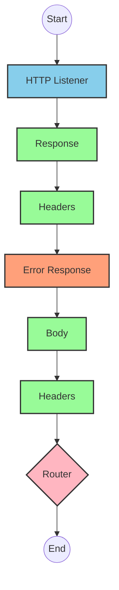
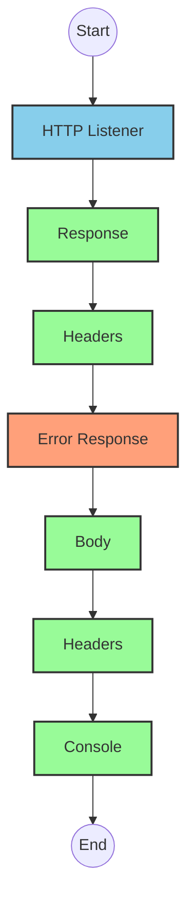
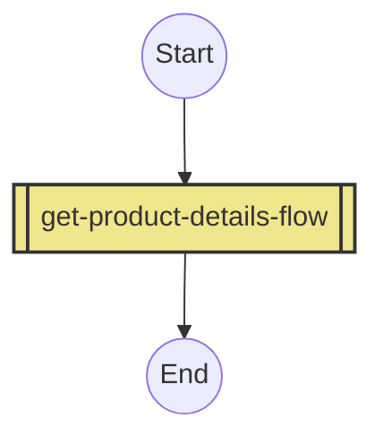
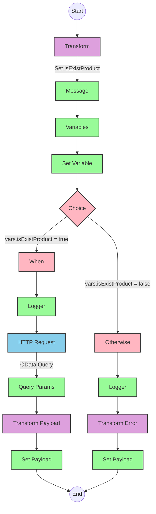

# API Overview
- This API provides product details from an SAP HANA database
- Base URL pattern: `/products`

# Endpoints

## GET /products
- **Purpose**: Retrieves product details based on a product identifier
- **Query Parameters**:
  - `productIdentifier` (required): The unique identifier for the product
- **Response Format**: JSON
- **Status Codes**:
  - 200: Success
  - 400: Bad Request
  - 404: Product Not Found
- **Response Body**: Product details including ProductId, Category, CategoryName, CurrencyCode, dimensions, descriptions, price, and other product attributes

# Current MuleSoft Flow Logic

## Flow: products-main
This is the main entry point for the API that handles HTTP requests.

1. **Trigger**: HTTP listener configured with `HTTP_Listener_config`
2. **Processing**:
   - Sets response headers
   - Routes requests to appropriate handlers
   - Includes error response handling
3. **Outcome**: Routes API requests to the appropriate flow based on the endpoint

## Flow: products-console
This flow appears to be a console/logging version of the API.

1. **Trigger**: HTTP listener
2. **Processing**:
   - Sets response headers
   - Handles errors
   - Logs information to the console
3. **Outcome**: Provides console output for API requests

## Flow: get:\products:products-config
This flow handles GET requests to the `/products` endpoint.

1. **Trigger**: GET request to `/products`
2. **Processing**: References the `get-product-details-flow` subflow
3. **Outcome**: Returns product details based on the provided product identifier

## Subflow: get-product-details-flow
This subflow retrieves product details from SAP HANA.

1. **Processing Steps**:
   - Validates if the provided product identifier exists in the configured list
   - Sets variables for processing
   - Makes an HTTP request to the SAP HANA backend if the product identifier is valid
   - Returns appropriate error messages if the product identifier is invalid

2. **Data Transformations**:
   - Transforms the product identifier into an OData query
   - Transforms the response payload to JSON format

3. **Technical Details**:
   - OData query parameters:
     - `$filter`: `ProductId eq '" ++ (attributes.queryParams.productIdentifier default '') ++ "'`
     - `$select`: `ProductId,Category,CategoryName,CurrencyCode,DimensionDepth,DimensionHeight,DimensionUnit,DimensionWidth,LongDescription,Name,PictureUrl,Price,QuantityUnit,ShortDescription,SupplierId,Weight,WeightUnit`

4. **Error Handling**:
   - Returns a custom error message if the product identifier is not found or invalid

# DataWeave Transformations Explained

## Product Identifier Validation Transformation
This transformation checks if the provided product identifier exists in a predefined list.

```dw
%dw 2.0
output application/java
var productidentifer=p('odata.productIdentifiers') splitBy(",")
---
sizeOf(productidentifer filter ($ == attributes.queryParams.productIdentifier))>0
```

- **Purpose**: Validates if the product identifier is in the allowed list
- **Input**: Query parameter `productIdentifier` from the request
- **Output**: Boolean value indicating if the product identifier exists
- **Key Operations**:
  - Retrieves a comma-separated list of valid product identifiers from a property
  - Splits the list into an array using `splitBy(",")`
  - Filters the array to find matches with the provided product identifier
  - Returns true if at least one match is found (`sizeOf(...) > 0`)

## OData Query Parameters Transformation
This transformation constructs the OData query parameters for the HTTP request to SAP HANA.

```dw
#[output application/java
---
{
	"$filter" : "ProductId eq '" ++ (attributes.queryParams.productIdentifier default '') ++ "'",
	"$select" : "ProductId,Category,CategoryName,CurrencyCode,DimensionDepth,DimensionHeight,DimensionUnit,DimensionWidth,LongDescription,Name,PictureUrl,Price,QuantityUnit,ShortDescription,SupplierId,Weight,WeightUnit"
}]
```

- **Purpose**: Creates OData query parameters for filtering and selecting product data
- **Input**: Product identifier from query parameters
- **Output**: Java map containing OData query parameters
- **Key Operations**:
  - Constructs a filter expression to match the exact product identifier
  - Specifies the fields to be returned in the response

## Response Payload Transformation (Success)
This transformation passes through the payload from the HTTP response.

```dw
%dw 2.0
output application/json
---
payload
```

- **Purpose**: Converts the HTTP response to JSON format
- **Input**: Response from the SAP HANA HTTP request
- **Output**: JSON representation of the product details

## Error Response Transformation
This transformation creates an error response when the product identifier is invalid.

```dw
%dw 2.0
output application/json
---
{
	status: "error",
	message: "The product identifier " ++ attributes.queryParams.productIdentifier ++ " was not found.",
	errorCode: "PRODUCT_NOT_FOUND"
}
```

- **Purpose**: Generates a standardized error response
- **Input**: Query parameter `productIdentifier` from the request
- **Output**: JSON error object with status, message, and error code
- **Key Operations**:
  - Concatenates the product identifier into the error message

# SAP Integration Suite Implementation

## Component Mapping

| MuleSoft Component | SAP Integration Suite Equivalent | Notes |
|--------------------|----------------------------------|-------|
| HTTP Listener | HTTPS Adapter (Server) | Configure with the same path and method |
| Flow Reference | Process Call | References another integration flow |
| DataWeave Transform | Content Modifier or Message Mapping | For simple transformations use Content Modifier, for complex ones use Message Mapping |
| Logger | Write to Message Log | Configure with the same log message |
| HTTP Request | HTTPS Adapter (Client) | Configure with the same endpoint and parameters |
| Choice Router | Router | Configure with the same conditions |
| Set Variable | Content Modifier | Set properties in the message header |
| Set Payload | Content Modifier | Set the message body |

## Integration Flow Visualization









## Configuration Details

### HTTP Listener Configuration
- **Component**: HTTPS Adapter (Server)
- **Parameters**:
  - Name: HTTP_Listener_config
  - Port: 8081 (default)
  - Host: 0.0.0.0 (default)
  - Path: /api/*

### HTTP Request Configuration
- **Component**: HTTPS Adapter (Client)
- **Parameters**:
  - Name: Hana_HTTP_Request_Configuration
  - Base URL: [SAP HANA OData service URL]
  - Authentication: Basic Authentication or OAuth (configuration decision)

### Router Configuration
- **Component**: Router
- **Conditions**:
  - Condition 1: `${property.isExistProduct} = true`
  - Default route for when condition is false

### Content Modifier (Transform)
- **Component**: Content Modifier or Message Mapping
- **Parameters**:
  - For validation transform:
    - Target Type: Expression
    - Target: isExistProduct
    - Value: Use Groovy script to implement the same logic as the DataWeave transformation
  - For error response:
    - Target Type: Body
    - Value: JSON structure with status, message, and errorCode

### Process Call
- **Component**: Process Call
- **Parameters**:
  - Process: get-product-details-flow

# Configuration

## Important Configuration Parameters
- `odata.productIdentifiers`: Comma-separated list of valid product identifiers

## Error Handling
- Global error handler for API Kit errors:
  - APIKIT:BAD_REQUEST
  - APIKIT:NOT_FOUND
  - APIKIT:METHOD_NOT_ALLOWED
  - APIKIT:NOT_ACCEPTABLE
  - APIKIT:UNSUPPORTED_MEDIA_TYPE
  - APIKIT:NOT_IMPLEMENTED

## Security Settings
- HTTP Basic Authentication or OAuth for SAP HANA connection (configuration decision)
- HTTPS for all external endpoints