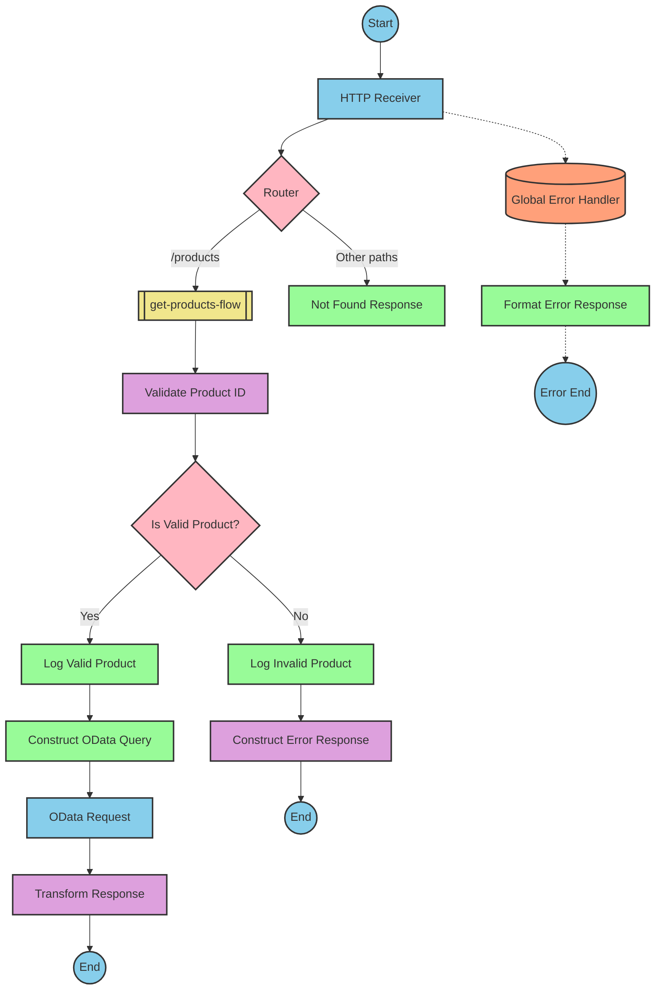

# SAP Integration Suite Documentation for Product API

# Table of Contents
- [API Overview](#api-overview)
- [Endpoints](#endpoints)
  - [GET /products](#get-products)
- [Current MuleSoft Flow Logic](#current-mulesoft-flow-logic)
  - [products-main Flow](#products-main-flow)
  - [products-console Flow](#products-console-flow)
  - [get:\products:products-config Flow](#getproductsproducts-config-flow)
  - [get-product-details-flow Subflow](#get-product-details-flow-subflow)
- [DataWeave Transformations Explained](#dataweave-transformations-explained)
  - [Product Identifier Validation](#product-identifier-validation)
  - [OData Query Parameters](#odata-query-parameters)
  - [Response Payload Transformation](#response-payload-transformation)
  - [Error Response Transformation](#error-response-transformation)
- [SAP Integration Suite Implementation](#sap-integration-suite-implementation)
  - [Component Mapping](#component-mapping)
  - [Integration Flow Visualization](#integration-flow-visualization)
- [Configuration Details](#configuration-details)
  - [HTTP Adapter Configuration](#http-adapter-configuration)
  - [OData Adapter Configuration](#odata-adapter-configuration)
  - [Content Modifier Configuration](#content-modifier-configuration)
  - [Router Configuration](#router-configuration)
- [Configuration](#configuration)
  - [Environment Variables](#environment-variables)
  - [External System Dependencies](#external-system-dependencies)

# API Overview
This API provides access to product information from an SAP HANA backend system. It allows clients to retrieve product details by specifying a product identifier. The API validates the product identifier against a configured list of valid identifiers before retrieving the data from the backend system.

Base URL: `http://localhost:8081/api/v1`

# Endpoints

## GET /products
This endpoint retrieves product details based on the provided product identifier.

**Request Parameters:**
- Query Parameters:
  - `productIdentifier` (required): The unique identifier of the product to retrieve

**Response Format:**
- Content-Type: `application/json`
- Status Codes:
  - 200: Successful response with product details
  - 400: Bad request (invalid input)
  - 404: Product not found
  - 500: Server error

**Example Request:**
```
GET /api/v1/products?productIdentifier=HT-2000
```

**Example Response (200 OK):**
```json
{
  "ProductId": "HT-2000",
  "Category": "Notebooks",
  "CategoryName": "Notebooks",
  "CurrencyCode": "USD",
  "DimensionDepth": 30,
  "DimensionHeight": 3,
  "DimensionUnit": "cm",
  "DimensionWidth": 40,
  "LongDescription": "Notebook Basic 17 with 2,80 GHz quad core, 17\" LCD, 4 GB DDR3 RAM, 500 GB Hard Disc, Windows 8 Pro",
  "Name": "Notebook Basic 17",
  "PictureUrl": "/sap/public/bc/NWDEMO_MODEL/IMAGES/HT-2000.jpg",
  "Price": 1249,
  "QuantityUnit": "EA",
  "ShortDescription": "Notebook Basic 17 with 2,80 GHz quad core, 17\" LCD, 4 GB DDR3 RAM, 500 GB Hard Disc",
  "SupplierId": "0100000046",
  "Weight": 4.2,
  "WeightUnit": "KG"
}
```

**Example Error Response (404 Not Found):**
```json
{
  "status": "error",
  "message": "The product identifier HT-9999 was not found.",
  "errorCode": "PRODUCT_NOT_FOUND"
}
```

# Current MuleSoft Flow Logic

## products-main Flow
This is the main entry point for the API. It handles HTTP requests and routes them to the appropriate flow based on the request path.

1. **Trigger**: HTTP listener configured to listen on `/api/v1/*`
2. **Processing Steps**:
   - Sets response headers
   - Routes requests to appropriate handlers based on path
   - Handles errors and formats error responses

## products-console Flow
This flow is similar to the main flow but includes console logging for debugging purposes.

1. **Trigger**: HTTP listener (likely for development/testing)
2. **Processing Steps**:
   - Sets response headers
   - Logs request details to console
   - Handles errors and formats error responses

## get:\products:products-config Flow
This flow handles GET requests to the `/products` endpoint.

1. **Trigger**: Routed from the main flow when a GET request to `/products` is received
2. **Processing Steps**:
   - Calls the `get-product-details-flow` subflow to process the request

## get-product-details-flow Subflow
This subflow contains the core business logic for retrieving product details.

1. **Trigger**: Called from the `get:\products:products-config` flow
2. **Processing Steps**:
   - Validates the product identifier against a configured list of valid identifiers
   - If valid, constructs an OData query to retrieve product details from the backend
   - If invalid, returns an error response
3. **Data Transformations**:
   - Transforms the input to check if the product identifier is valid
   - Constructs OData query parameters with filter and select options
   - Transforms the backend response to the API response format
   - Transforms error messages for invalid product identifiers
4. **Error Scenarios**:
   - Product identifier not provided or invalid
   - Backend system errors

# DataWeave Transformations Explained

## Product Identifier Validation
This transformation checks if the provided product identifier is in the list of valid identifiers configured in the application.

**Input**: Product identifier from query parameter
**Output**: Boolean indicating if the product identifier is valid

```dw
%dw 2.0
output application/java
var productidentifer=p('odata.productIdentifiers') splitBy(",")
---
sizeOf(productidentifer filter ($ == attributes.queryParams.productIdentifier))>0
```

**Explanation**:
1. Retrieves the list of valid product identifiers from the configuration property `odata.productIdentifiers`
2. Splits the comma-separated list into an array
3. Filters the array to find elements matching the provided product identifier
4. Checks if the size of the filtered array is greater than 0 (meaning a match was found)

## OData Query Parameters
This transformation constructs the OData query parameters for retrieving product details from the backend.

**Input**: Product identifier from query parameter
**Output**: OData query parameters as a Java map

```dw
#[output application/java
---
{
	"$filter" : "ProductId eq '" ++ (attributes.queryParams.productIdentifier default '') ++ "'",
	"$select" : "ProductId,Category,CategoryName,CurrencyCode,DimensionDepth,DimensionHeight,DimensionUnit,DimensionWidth,LongDescription,Name,PictureUrl,Price,QuantityUnit,ShortDescription,SupplierId,Weight,WeightUnit"
}]
```

**Explanation**:
1. Creates a Java map with two OData query parameters:
   - `$filter`: Filters products where ProductId equals the provided product identifier
   - `$select`: Specifies which fields to include in the response
2. Uses string concatenation (`++`) to include the product identifier in the filter expression
3. Uses the `default` operator to provide an empty string if the product identifier is not present

## Response Payload Transformation
This transformation passes through the backend response without modification.

**Input**: Backend response (JSON)
**Output**: API response (JSON)

```dw
%dw 2.0
output application/json
---
payload
```

**Explanation**:
1. Simply outputs the input payload as JSON without any transformation
2. This is used when the backend response format matches the desired API response format

## Error Response Transformation
This transformation constructs an error response when the product identifier is invalid.

**Input**: Product identifier from query parameter
**Output**: Error response (JSON)

```dw
%dw 2.0
output application/json
---
{
	status: "error",
	message: "The product identifier " ++ attributes.queryParams.productIdentifier ++ " was not found.",
	errorCode: "PRODUCT_NOT_FOUND"
}
```

**Explanation**:
1. Creates a JSON object with three fields:
   - `status`: Set to "error"
   - `message`: A descriptive error message including the invalid product identifier
   - `errorCode`: A specific error code ("PRODUCT_NOT_FOUND")
2. Uses string concatenation (`++`) to include the product identifier in the error message

# SAP Integration Suite Implementation

## Component Mapping

| MuleSoft Component | SAP Integration Suite Equivalent | Notes |
|--------------------|----------------------------------|-------|
| HTTP Listener | HTTP Adapter (Receiver) | Configure with the same path and port settings |
| Router | Router | Maps to the same conditional routing logic |
| Flow Reference | Process Call | Used to call subflows |
| Transform | Content Modifier or Message Mapping | For simple transformations, use Content Modifier; for complex ones, use Message Mapping |
| Logger | Write to Log | Configure with the same log message |
| Set Variable | Content Modifier | Use to set exchange properties |
| Choice/When/Otherwise | Router | Implement conditional logic with Router component |
| HTTP Request | HTTP Adapter (Sender) or OData Adapter | For OData calls, use the OData Adapter specifically |
| Set Payload | Content Modifier | Use to modify the message body |
| Error Handler | Exception Subprocess | Implement error handling logic |

## Integration Flow Visualization

### REST API Integration Flow: GET /products



# Configuration Details

## HTTP Adapter Configuration

### HTTP Receiver Adapter
- **Adapter Type**: HTTP
- **Direction**: Receiver
- **Path**: `/api/v1/*`
- **Port**: `8081` (from `api.listener.port` property)
- **Authentication**: None (based on source documentation)
- **CSRF Protection**: Disabled
- **Supported Methods**: GET

### HTTP Sender Adapter (OData)
- **Adapter Type**: HTTP or OData
- **Direction**: Sender
- **Address**: `https://refapp-espm-ui-cf.cfapps.eu10.hana.ondemand.com:443/espm-cloud-web/espm.svc/Products` (from `hana.espm.*` properties)
- **Authentication**: None (based on source documentation)
- **Query Parameters**: Dynamically set from Content Modifier

## OData Adapter Configuration
- **Adapter Type**: OData
- **Direction**: Sender
- **Address**: `https://refapp-espm-ui-cf.cfapps.eu10.hana.ondemand.com:443/espm-cloud-web/espm.svc/Products`
- **OData Service Version**: V2 (assumed based on query parameter format)
- **Query Options**:
  - **$filter**: Dynamically set to `ProductId eq '[productIdentifier]'`
  - **$select**: Set to `ProductId,Category,CategoryName,CurrencyCode,DimensionDepth,DimensionHeight,DimensionUnit,DimensionWidth,LongDescription,Name,PictureUrl,Price,QuantityUnit,ShortDescription,SupplierId,Weight,WeightUnit`

## Content Modifier Configuration

### Validate Product ID
- **Type**: Content Modifier
- **Action**: Create Exchange Property
- **Property Name**: `isExistProduct`
- **Property Value**: Script expression to check if product identifier is in the allowed list
- **Script Language**: Groovy

### Construct OData Query
- **Type**: Content Modifier
- **Action**: Set Query Parameters
- **Parameters**:
  - **$filter**: `ProductId eq '[productIdentifier]'`
  - **$select**: `ProductId,Category,CategoryName,CurrencyCode,DimensionDepth,DimensionHeight,DimensionUnit,DimensionWidth,LongDescription,Name,PictureUrl,Price,QuantityUnit,ShortDescription,SupplierId,Weight,WeightUnit`

### Construct Error Response
- **Type**: Content Modifier
- **Action**: Create Message Body
- **Body Content**:
```json
{
  "status": "error",
  "message": "The product identifier ${property.productIdentifier} was not found.",
  "errorCode": "PRODUCT_NOT_FOUND"
}
```
- **Content Type**: application/json

## Router Configuration

### Main Router
- **Type**: Router
- **Condition 1**: 
  - **Path**: `/products`
  - **Target**: get-products-flow
- **Default**: Not Found Response

### Product Validation Router
- **Type**: Router
- **Condition 1**:
  - **Expression**: `${property.isExistProduct} == true`
  - **Target**: Log Valid Product
- **Default**: Log Invalid Product

# Configuration

## Environment Variables
Based on the source documentation, the following environment variables or properties are used:

```yaml
api:
  listener:
    port: "8081"
    path: /api/v1/*
    
hana:
  espm:
    url: refapp-espm-ui-cf.cfapps.eu10.hana.ondemand.com
    port: "443"
    path: /espm-cloud-web/espm.svc/Products
    
odata:
  productIdentifiers: "HT-2000,HT-2001"
```

These properties should be configured in the SAP Integration Suite as follows:

1. **API Configuration**:
   - HTTP Receiver port and path settings

2. **HANA Backend Configuration**:
   - URL, port, and path for the OData service

3. **OData Configuration**:
   - List of valid product identifiers for validation

## External System Dependencies
The integration depends on the following external systems:

1. **SAP HANA ESPM Demo Application**:
   - Endpoint: `https://refapp-espm-ui-cf.cfapps.eu10.hana.ondemand.com:443/espm-cloud-web/espm.svc/Products`
   - This is an OData service providing product information
   - The integration retrieves product details from this service based on product identifiers