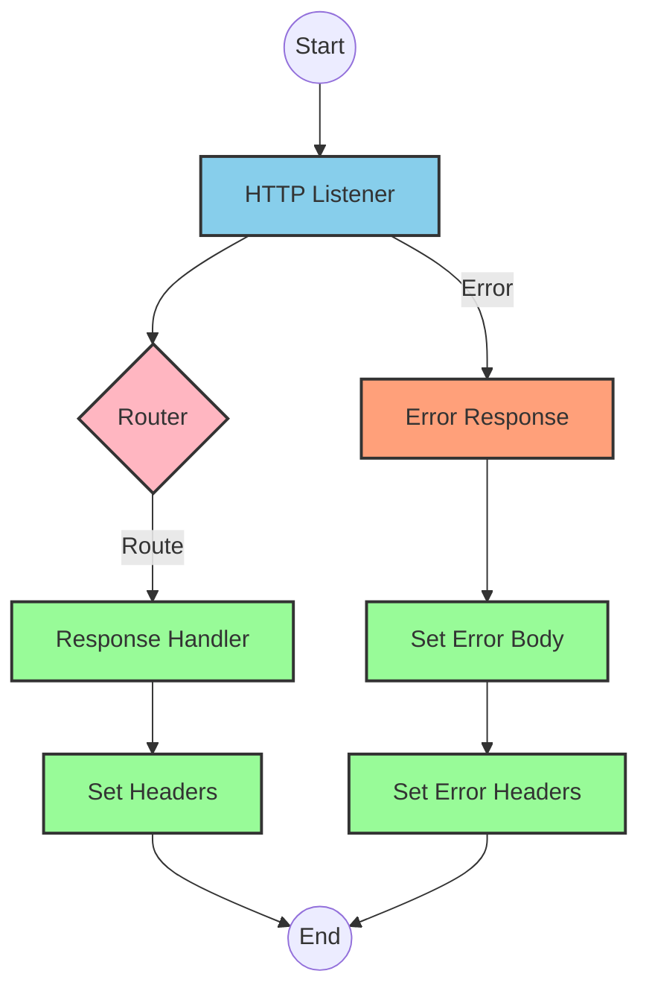
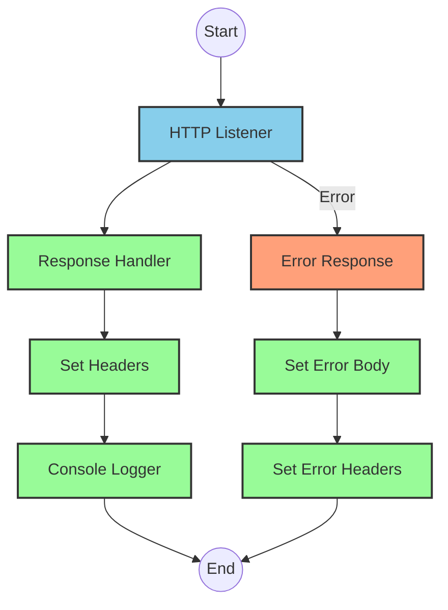
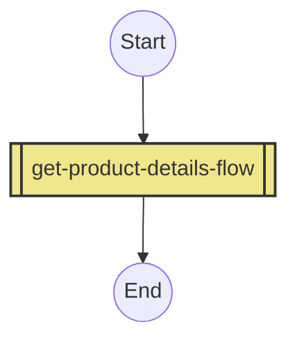
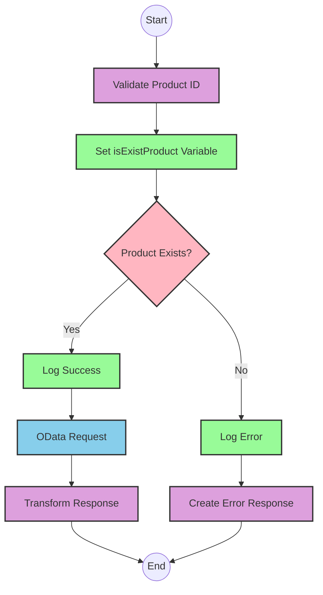

# API Overview
- This API provides product details from an SAP HANA database based on product identifiers
- Base URL pattern: `/products`

# Endpoints

## GET /products
- **Purpose**: Retrieves product details based on a product identifier
- **Request Parameters**:
  - **Query Parameters**:
    - `productIdentifier` (required): The unique identifier for the product
  - **Headers**: Standard HTTP headers
- **Response Format**:
  - **Success**: JSON object containing product details
    - Status Code: 200 OK
  - **Error**: JSON object with error details
    - Status Code: 400 Bad Request (when product identifier is invalid)
- **Example Response (Success)**:
  ```json
  {
    "ProductId": "HT-1000",
    "Category": "Laptops",
    "CategoryName": "Laptops",
    "CurrencyCode": "USD",
    "DimensionDepth": "30",
    "DimensionHeight": "3",
    "DimensionUnit": "cm",
    "DimensionWidth": "40",
    "LongDescription": "Notebook Basic 15 with 2,80 GHz quad core, 15\" LCD, 4 GB DDR3 RAM, 500 GB Hard Disc, Windows 8 Pro",
    "Name": "Notebook Basic 15",
    "PictureUrl": "/sap/public/bc/NWDEMO_MODEL/IMAGES/HT-1000.jpg",
    "Price": "956.00",
    "QuantityUnit": "EA",
    "ShortDescription": "Notebook Basic 15 with 2,80 GHz quad core, 15\" LCD, 4 GB DDR3 RAM, 500 GB Hard Disc, Windows 8 Pro",
    "SupplierId": "0100000046",
    "Weight": "4.2",
    "WeightUnit": "KG"
  }
  ```
- **Example Response (Error)**:
  ```json
  {
    "status": "error",
    "message": "The product identifier ABC123 was not found.",
    "errorCode": "PRODUCT_NOT_FOUND"
  }
  ```

# Current MuleSoft Flow Logic

## Flow: products-main
1. **Trigger**: HTTP listener receives incoming requests
2. **Processing**:
   - Sets response headers
   - Routes requests based on API specification
   - Handles errors with appropriate error responses

## Flow: products-console
1. **Trigger**: HTTP listener receives incoming requests
2. **Processing**:
   - Sets response headers
   - Logs request details to console
   - Handles errors with appropriate error responses

## Flow: get:\products:products-config
1. **Trigger**: HTTP GET request to `/products` endpoint
2. **Processing**:
   - Calls the `get-product-details-flow` subflow to retrieve product details

## Subflow: get-product-details-flow
1. **Validation**:
   - Validates if the provided product identifier exists in the configured list
   - Uses DataWeave to check if the product identifier is valid:
     ```
     %dw 2.0
     output application/java
     var productidentifer=p('odata.productIdentifiers') splitBy(",")
     ---
     sizeOf(productidentifer filter ($ == attributes.queryParams.productIdentifier))>0
     ```

2. **Successful Path** (when product identifier is valid):
   - Logs a message indicating the request is being processed
   - Makes an HTTP request to the SAP HANA backend with specific OData query parameters:
     - `$filter`: `ProductId eq '" ++ (attributes.queryParams.productIdentifier default '') ++ "'`
     - `$select`: `ProductId,Category,CategoryName,CurrencyCode,DimensionDepth,DimensionHeight,DimensionUnit,DimensionWidth,LongDescription,Name,PictureUrl,Price,QuantityUnit,ShortDescription,SupplierId,Weight,WeightUnit`
   - Transforms the response to JSON format:
     ```
     %dw 2.0
     output application/json
     ---
     payload
     ```

3. **Error Path** (when product identifier is invalid):
   - Logs a message indicating the product identifier was not found or was passed incorrectly
   - Returns an error response with a custom error message:
     ```
     %dw 2.0
     output application/json
     ---
     {
       status: "error",
       message: "The product identifier " ++ attributes.queryParams.productIdentifier ++ " was not found.",
       errorCode: "PRODUCT_NOT_FOUND"
     }
     ```

# DataWeave Transformations Explained

## Transformation 1: Product Identifier Validation
```
%dw 2.0
output application/java
var productidentifer=p('odata.productIdentifiers') splitBy(",")
---
sizeOf(productidentifer filter ($ == attributes.queryParams.productIdentifier))>0
```

- **Purpose**: Validates if the provided product identifier exists in the configured list
- **Input**: Query parameter `productIdentifier` from the HTTP request
- **Output**: Boolean value indicating if the product identifier is valid
- **Logic**:
  1. Retrieves a comma-separated list of valid product identifiers from a property `odata.productIdentifiers`
  2. Splits the list into an array using the `splitBy` function
  3. Filters the array to find elements matching the provided product identifier
  4. Checks if the size of the filtered array is greater than 0 (indicating a match was found)

## Transformation 2: OData Query Parameters
```
#[output application/java
---
{
	"$filter" : "ProductId eq '" ++ (attributes.queryParams.productIdentifier default '') ++ "'",
	"$select" : "ProductId,Category,CategoryName,CurrencyCode,DimensionDepth,DimensionHeight,DimensionUnit,DimensionWidth,LongDescription,Name,PictureUrl,Price,QuantityUnit,ShortDescription,SupplierId,Weight,WeightUnit"
}]
```

- **Purpose**: Constructs OData query parameters for the HTTP request to the SAP HANA backend
- **Input**: Product identifier from query parameters
- **Output**: Java map containing OData query parameters
- **Logic**:
  1. Creates a `$filter` parameter that filters products by the provided product identifier
  2. Creates a `$select` parameter that specifies which fields to include in the response

## Transformation 3: Response Transformation
```
%dw 2.0
output application/json
---
payload
```

- **Purpose**: Transforms the response from the SAP HANA backend to JSON format
- **Input**: Response payload from the HTTP request
- **Output**: JSON representation of the payload
- **Logic**: Simple pass-through transformation that converts the input to JSON format

## Transformation 4: Error Response
```
%dw 2.0
output application/json
---
{
	status: "error",
	message: "The product identifier " ++ attributes.queryParams.productIdentifier ++ " was not found.",
	errorCode: "PRODUCT_NOT_FOUND"
}
```

- **Purpose**: Constructs an error response when the product identifier is invalid
- **Input**: Product identifier from query parameters
- **Output**: JSON error object
- **Logic**: Creates a structured error response with status, message, and error code

# SAP Integration Suite Implementation

## Component Mapping

| MuleSoft Component | SAP Integration Suite Equivalent | Notes |
|--------------------|----------------------------------|-------|
| HTTP Listener | HTTPS Adapter (Receiver) | Configure with the same path and method |
| Flow Reference | Process Call | Used to call subflows |
| Logger | Write Message | For logging messages to the monitoring dashboard |
| Transform Message | Content Modifier with Message Mapping | For DataWeave transformations |
| HTTP Request | OData Adapter (Sender) | For connecting to SAP HANA backend |
| Choice Router | Router | For conditional processing based on product identifier validation |
| Set Variable | Content Modifier | For setting variables |
| Set Payload | Content Modifier | For setting the message payload |
| Error Handler | Exception Subprocess | For handling API errors |

## Integration Flow Visualization









## Configuration Details

### HTTP Adapter (Receiver)
- **Connection Type**: HTTPS
- **Path**: `/products`
- **Method**: GET
- **Authentication**: As per source system requirements

### OData Adapter (Sender)
- **Connection Type**: OData V2
- **Service URL**: SAP HANA backend URL (from Hana_HTTP_Request_Configuration)
- **Query Parameters**:
  - `$filter`: `ProductId eq '{productIdentifier}'`
  - `$select`: `ProductId,Category,CategoryName,CurrencyCode,DimensionDepth,DimensionHeight,DimensionUnit,DimensionWidth,LongDescription,Name,PictureUrl,Price,QuantityUnit,ShortDescription,SupplierId,Weight,WeightUnit`

### Content Modifier (Validate Product ID)
- **Message Mapping**: 
  - Input: Query parameter `productIdentifier`
  - Output: Boolean variable `isExistProduct`
  - Mapping Script: Same logic as the DataWeave transformation that checks if the product identifier exists in the configured list

### Router (Product Exists?)
- **Condition 1**: `${property.isExistProduct} = true`
  - Route to success path
- **Default Condition**:
  - Route to error path

### Content Modifier (Error Response)
- **Message Body**:
  ```json
  {
    "status": "error",
    "message": "The product identifier ${property.productIdentifier} was not found.",
    "errorCode": "PRODUCT_NOT_FOUND"
  }
  ```

# Configuration

## Important Configuration Parameters
- **HTTP Listener Configuration**:
  - Name: HTTP_Listener_config
  - Port: As configured in the source system

- **HTTP Request Configuration**:
  - Name: Hana_HTTP_Request_Configuration
  - Base URL: SAP HANA backend URL

- **API Configuration**:
  - Name: products-config
  - API: products.raml
  - Outbound Headers Map Name: outboundHeaders
  - HTTP Status Variable Name: httpStatus

## Environment Variables
- `odata.productIdentifiers`: Comma-separated list of valid product identifiers

## Error Handling
- **Global Error Handler**:
  - Handles APIKIT:BAD_REQUEST errors
  - Handles APIKIT:NOT_FOUND errors
  - Handles APIKIT:METHOD_NOT_ALLOWED errors
  - Handles APIKIT:NOT_ACCEPTABLE errors
  - Handles APIKIT:UNSUPPORTED_MEDIA_TYPE errors
  - Handles APIKIT:NOT_IMPLEMENTED errors