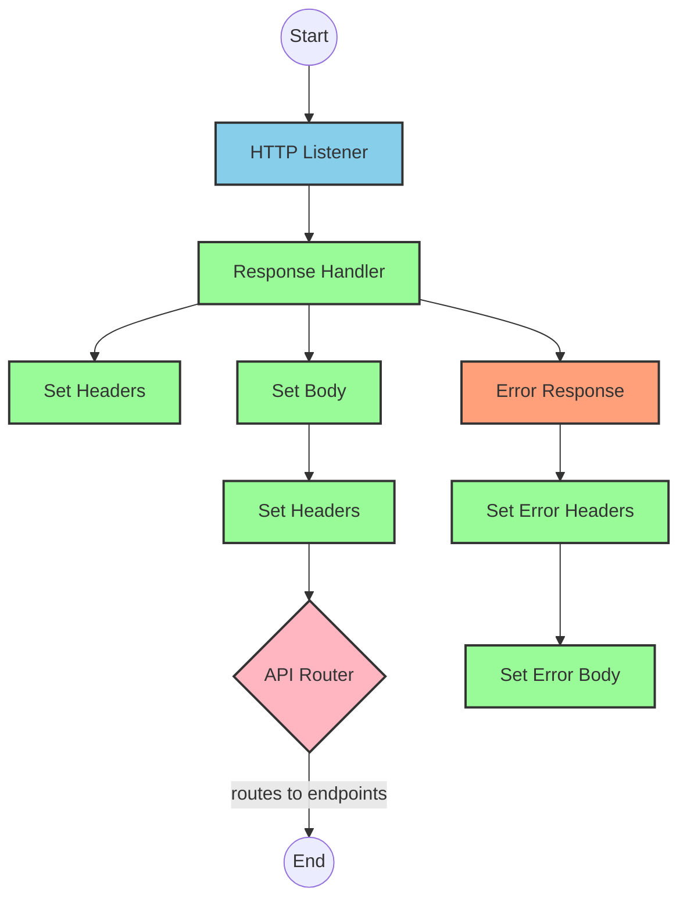
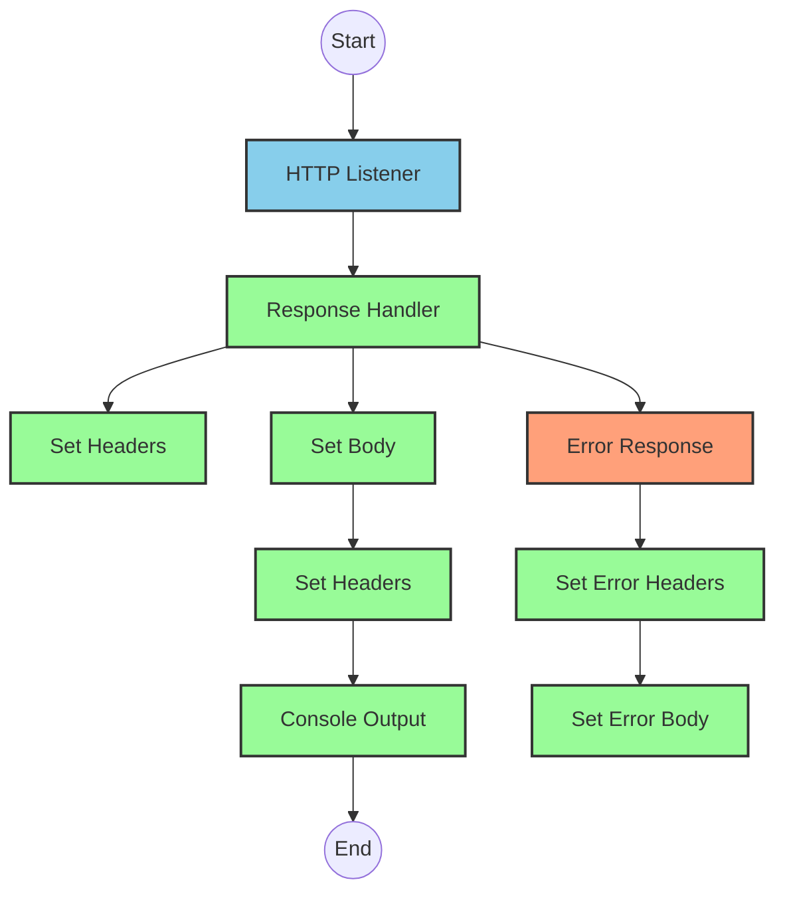
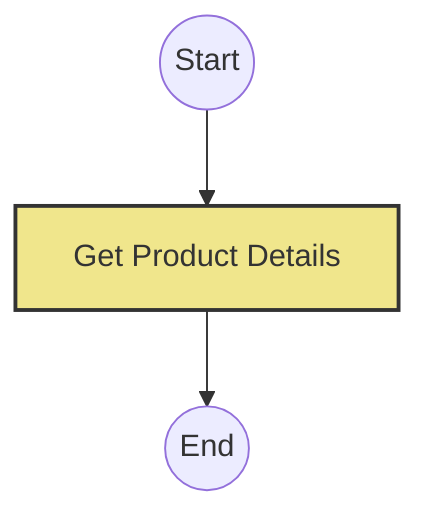
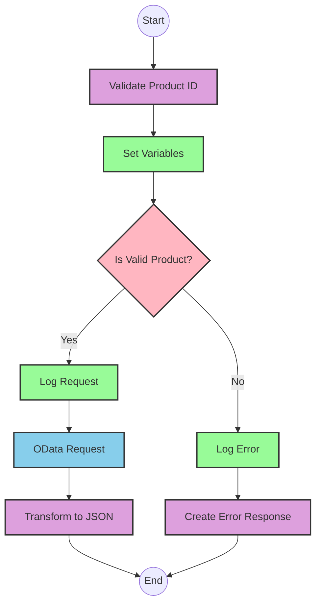

# API Overview
- This API provides product details from an SAP HANA database
- Base URL pattern: `/products`

# Endpoints

## GET /products
- **Purpose**: Retrieves product details based on a product identifier
- **Query Parameters**: 
  - `productIdentifier` (required): The unique identifier for the product
- **Response Format**: JSON
- **Status Codes**:
  - 200: Success
  - 400: Bad Request
  - 404: Product Not Found
- **Response Body**: Product details including ProductId, Category, CategoryName, CurrencyCode, dimensions, descriptions, price, and other product attributes

# Current MuleSoft Flow Logic

## Flow: products-main
This is the main entry point for the API that handles routing to the appropriate endpoints.

1. **Trigger**: HTTP listener
2. **Processing**:
   - Sets response headers
   - Routes requests based on API configuration
   - Handles errors with a dedicated error response handler

## Flow: products-console
This flow appears to be a console/logging version of the API.

1. **Trigger**: HTTP listener
2. **Processing**:
   - Sets response headers
   - Logs information to the console
   - Handles errors with a dedicated error response handler

## Flow: get:\products:products-config
This flow handles GET requests to the `/products` endpoint.

1. **Trigger**: HTTP GET request to `/products`
2. **Processing**:
   - References the `get-product-details-flow` subflow to retrieve product details

## Subflow: get-product-details-flow
This subflow handles the core business logic for retrieving product details.

1. **Processing Steps**:
   - Validates if the provided product identifier is valid
   - Logs the request processing
   - Makes an OData request to retrieve product details
   - Transforms the response to JSON format

2. **Data Transformations**:
   - Validates product identifier against a configured list
   - Constructs OData query parameters with exact filter expressions
   - Transforms the response payload to JSON

3. **OData Query Parameters**:
   - `$filter`: `ProductId eq '" ++ (attributes.queryParams.productIdentifier default '') ++ "'`
   - `$select`: `ProductId,Category,CategoryName,CurrencyCode,DimensionDepth,DimensionHeight,DimensionUnit,DimensionWidth,LongDescription,Name,PictureUrl,Price,QuantityUnit,ShortDescription,SupplierId,Weight,WeightUnit`

4. **Error Handling**:
   - If product identifier is invalid, returns an error response with status "error" and errorCode "PRODUCT_NOT_FOUND"

# DataWeave Transformations Explained

## Product Identifier Validation Transformation
```dw
%dw 2.0
output application/java
var productidentifer=p('odata.productIdentifiers') splitBy(",")
---
sizeOf(productidentifer filter ($ == attributes.queryParams.productIdentifier))>0
```

This transformation:
1. Retrieves a comma-separated list of valid product identifiers from a property
2. Splits the list into an array
3. Filters the array to find matches with the provided product identifier
4. Returns true if at least one match is found (size > 0)

## OData Query Parameters Transformation
```dw
#[output application/java
---
{
	"$filter" : "ProductId eq '" ++ (attributes.queryParams.productIdentifier default '') ++ "'",
	"$select" : "ProductId,Category,CategoryName,CurrencyCode,DimensionDepth,DimensionHeight,DimensionUnit,DimensionWidth,LongDescription,Name,PictureUrl,Price,QuantityUnit,ShortDescription,SupplierId,Weight,WeightUnit"
}]
```

This transformation:
1. Creates an OData query with two parameters:
   - `$filter`: Filters products where ProductId equals the provided product identifier
   - `$select`: Specifies which fields to include in the response
2. Uses string concatenation (`++`) to insert the product identifier into the filter expression
3. Provides a default empty string if the product identifier is not provided

## Success Response Transformation
```dw
%dw 2.0
output application/json
---
payload
```

This simple transformation:
1. Takes the input payload (likely from the OData response)
2. Outputs it as JSON without modification

## Error Response Transformation
```dw
%dw 2.0
output application/json
---
{
	status: "error",
	message: "The product identifier " ++ attributes.queryParams.productIdentifier ++ " was not found.",
	errorCode: "PRODUCT_NOT_FOUND"
}
```

This transformation:
1. Creates a structured error response with three fields:
   - `status`: Set to "error"
   - `message`: A descriptive message including the product identifier that wasn't found
   - `errorCode`: Set to "PRODUCT_NOT_FOUND"
2. Uses string concatenation to include the product identifier in the error message

# SAP Integration Suite Implementation

## Component Mapping

| MuleSoft Component | SAP Integration Suite Equivalent |
|--------------------|----------------------------------|
| HTTP Listener | HTTPS Adapter (Server) |
| Router | Content Modifier with Router |
| Flow Reference | Process Call |
| Transform (DataWeave) | Message Mapping / Content Modifier / Groovy Script |
| Logger | Write to Log |
| HTTP Request | OData Adapter (Client) |
| Set Variable | Content Modifier (Create/Set Properties) |
| Choice/When/Otherwise | Router with conditions |
| Set Payload | Content Modifier (Replace Body) |
| Error Handler | Exception Subprocess |

## Integration Flow Visualization









## Configuration Details

### HTTPS Adapter (Server)
- **Path**: `/products`
- **Authentication**: As per source configuration
- **Connection**: HTTP_Listener_config

### OData Adapter (Client)
- **Service**: SAP HANA OData service
- **Connection**: Hana_HTTP_Request_Configuration
- **Query Parameters**:
  - `$filter`: Dynamic based on product identifier
  - `$select`: All product fields as specified in the original query

### Content Modifier (Validate Product ID)
- **Script Type**: Groovy
- **Input**: Query parameters
- **Output**: Boolean flag indicating if product identifier is valid
- **Logic**: Match against configured list of valid product identifiers

### Router (Product Validation)
- **Condition 1**: `${property.isExistProduct} == true`
- **Condition 2**: Default (otherwise)

### Message Mapping (Error Response)
- **Source**: Empty message
- **Target**: JSON error structure
- **Mapping**: Create error response with status, message, and errorCode

### Write to Log
- **Log Level**: INFO
- **Messages**:
  - Success: "The request is processed and sent downstream with the product identifier (${property.productIdentifier})."
  - Error: "The product identifier (${property.productIdentifier}) was not passed in the request or was passed incorrectly."

# Configuration

## Important Configuration Parameters
- **odata.productIdentifiers**: Comma-separated list of valid product identifiers

## Environment Variables
- No explicit environment variables mentioned in the source documentation

## Dependencies on External Systems
- SAP HANA database (accessed via OData)

## Security Settings
- Standard HTTP security configurations
- No specific certificates or security settings mentioned in the source documentation