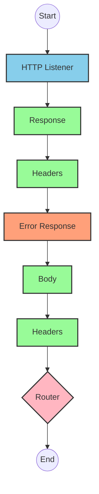
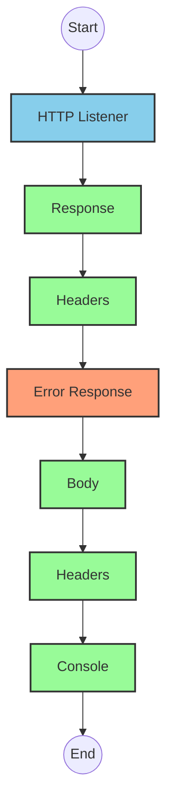
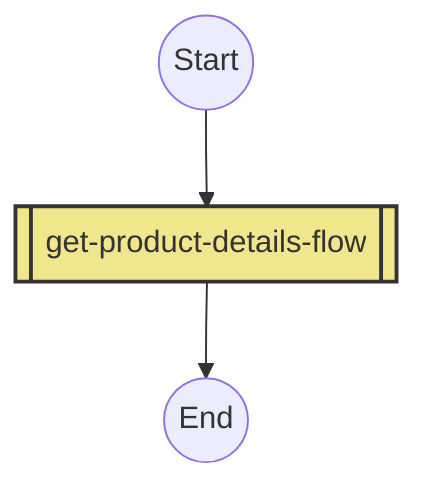
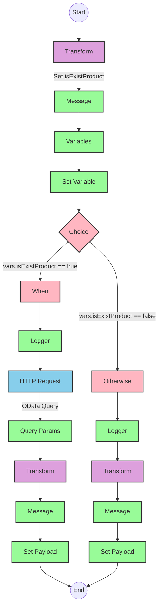

# API Overview
- This API provides product details from an SAP HANA database
- Base URL pattern: `/products`

# Endpoints

## GET /products
- **Purpose**: Retrieves product details based on a product identifier
- **Query Parameters**:
  - `productIdentifier` (required): The unique identifier for the product
- **Response Format**: JSON
- **Status Codes**:
  - 200: Success
  - 400: Bad Request
  - 404: Product Not Found
- **Response Body**:
  - Success: Product details including ProductId, Category, CategoryName, etc.
  - Error: JSON object with status, message, and errorCode

# Current MuleSoft Flow Logic

## Flow: products-main
This is the main entry point for the API that handles HTTP requests.
1. **Trigger**: HTTP listener
2. **Processing**: Routes requests to appropriate handlers
3. **Response**: Returns formatted HTTP responses with appropriate headers
4. **Error Handling**: Provides error responses with headers

## Flow: products-console
This flow appears to be a console/logging version of the main flow.
1. **Trigger**: HTTP listener
2. **Processing**: Logs information to the console
3. **Response**: Returns formatted HTTP responses with appropriate headers
4. **Error Handling**: Provides error responses with headers

## Flow: get:\products:products-config
This flow handles GET requests to the /products endpoint.
1. **Trigger**: HTTP GET request to /products
2. **Processing**: References the get-product-details-flow subflow

## Subflow: get-product-details-flow
This subflow retrieves product details from SAP HANA.
1. **Validation**: Checks if the provided productIdentifier is valid
2. **Processing**:
   - If valid: Makes an OData request to retrieve product details
   - If invalid: Returns an error response
3. **Data Transformation**: Transforms the response to JSON format
4. **OData Query Parameters**:
   - `$filter`: `ProductId eq '" ++ (attributes.queryParams.productIdentifier default '') ++ "'`
   - `$select`: `ProductId,Category,CategoryName,CurrencyCode,DimensionDepth,DimensionHeight,DimensionUnit,DimensionWidth,LongDescription,Name,PictureUrl,Price,QuantityUnit,ShortDescription,SupplierId,Weight,WeightUnit`

# DataWeave Transformations Explained

## Validation Transformation
This transformation checks if the provided product identifier is in the list of valid product identifiers.

```dw
%dw 2.0
output application/java
var productidentifer=p('odata.productIdentifiers') splitBy(",")
---
sizeOf(productidentifer filter ($ == attributes.queryParams.productIdentifier))>0
```

- **Input**: Query parameter containing productIdentifier
- **Output**: Boolean value indicating if the product identifier is valid
- **Logic**: 
  1. Retrieves a comma-separated list of valid product identifiers from a property
  2. Splits the list into an array
  3. Filters the array to find matches with the provided productIdentifier
  4. Returns true if at least one match is found (size > 0)

## OData Query Parameters Transformation
This transformation constructs the OData query parameters for the HTTP request.

```dw
#[output application/java
---
{
	"$filter" : "ProductId eq '" ++ (attributes.queryParams.productIdentifier default '') ++ "'",
	"$select" : "ProductId,Category,CategoryName,CurrencyCode,DimensionDepth,DimensionHeight,DimensionUnit,DimensionWidth,LongDescription,Name,PictureUrl,Price,QuantityUnit,ShortDescription,SupplierId,Weight,WeightUnit"
}]
```

- **Input**: Query parameter containing productIdentifier
- **Output**: OData query parameters as a Java map
- **Logic**:
  1. Constructs a $filter parameter that filters products by the provided productIdentifier
  2. Specifies the fields to retrieve using $select

## Response Transformation (Success)
This transformation passes through the payload from the OData response.

```dw
%dw 2.0
output application/json
---
payload
```

- **Input**: OData response payload
- **Output**: JSON representation of the payload
- **Logic**: Simple pass-through transformation

## Error Response Transformation
This transformation creates an error response when the product identifier is not valid.

```dw
%dw 2.0
output application/json
---
{
	status: "error",
	message: "The product identifier " ++ attributes.queryParams.productIdentifier ++ " was not found.",
	errorCode: "PRODUCT_NOT_FOUND"
}
```

- **Input**: Query parameter containing productIdentifier
- **Output**: JSON error object
- **Logic**: Constructs an error object with status, message, and errorCode

# SAP Integration Suite Implementation

## Component Mapping

| MuleSoft Component | SAP Integration Suite Equivalent | Notes |
|--------------------|----------------------------------|-------|
| HTTP Listener | HTTPS Adapter (Server) | Configure with the same path and method |
| Router | Router | Same routing logic |
| Flow Reference | Process Call | References another integration flow |
| Transform | Content Modifier (for simple cases) or Message Mapping (for complex transformations) | DataWeave scripts need to be converted to SAP mapping syntax |
| Logger | Write to Message Log | Configure with the same log message |
| HTTP Request | OData Adapter (Client) | Configure with the same OData query parameters |
| Set Variable | Content Modifier | Set properties in the message header |
| Choice/When/Otherwise | Router | Configure with the same conditions |
| Set Payload | Content Modifier | Set the message body |
| Error Handler | Exception Subprocess | Configure with the same error types and handling logic |

## Integration Flow Visualization









## Configuration Details

### HTTP Listener Configuration
- **Component**: HTTPS Adapter (Server)
- **Parameters**:
  - Name: HTTP_Listener_config
  - Path: /products
  - Method: GET

### OData Request Configuration
- **Component**: OData Adapter (Client)
- **Parameters**:
  - Name: Hana_HTTP_Request_Configuration
  - OData Query Parameters:
    - $filter: ProductId eq '{productIdentifier}'
    - $select: ProductId,Category,CategoryName,CurrencyCode,DimensionDepth,DimensionHeight,DimensionUnit,DimensionWidth,LongDescription,Name,PictureUrl,Price,QuantityUnit,ShortDescription,SupplierId,Weight,WeightUnit

### Router Configuration
- **Component**: Router
- **Condition**: vars.isExistProduct
- **Routes**:
  - True: Process valid product request
  - False: Return error response

### Content Modifier (Transform)
- **Component**: Content Modifier or Message Mapping
- **Parameters**:
  - For validation: Convert DataWeave script to check if productIdentifier is valid
  - For error response: Create error message with status, message, and errorCode

### Logger Configuration
- **Component**: Write to Message Log
- **Parameters**:
  - Success message: "The request is processed and sent downstream with the product identifier ({productIdentifier})."
  - Error message: "The product identifier ({productIdentifier}) was not passed in the request or was passed incorrectly."

# Configuration

## Important Configuration Parameters
- **odata.productIdentifiers**: Comma-separated list of valid product identifiers (from property file)

## Error Handling
- **Global Error Handler**: Handles various APIKIT errors:
  - APIKIT:BAD_REQUEST
  - APIKIT:NOT_FOUND
  - APIKIT:METHOD_NOT_ALLOWED
  - APIKIT:NOT_ACCEPTABLE
  - APIKIT:UNSUPPORTED_MEDIA_TYPE
  - APIKIT:NOT_IMPLEMENTED

## Dependencies
- SAP HANA OData service for product data retrieval