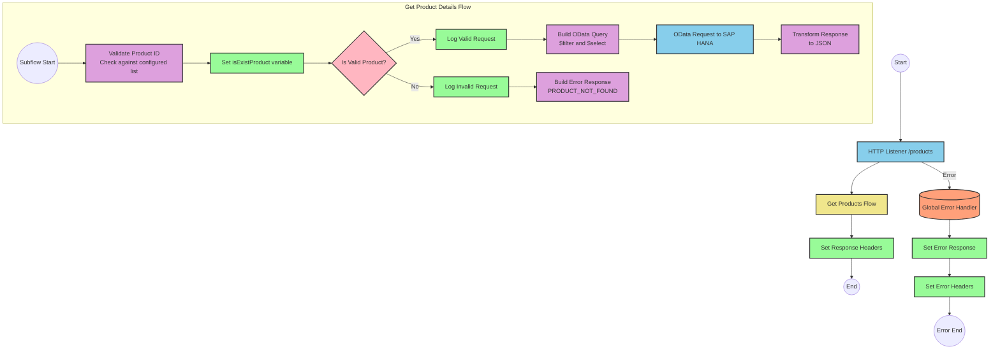

# SAP HANA Product Information API Integration

## Table of Contents
- [SAP HANA Product Information API Integration](#sap-hana-product-information-api-integration)
  - [Table of Contents](#table-of-contents)
  - [API Overview](#api-overview)
  - [Endpoints](#endpoints)
    - [GET /products](#get-products)
  - [Current MuleSoft Flow Logic](#current-mulesoft-flow-logic)
    - [Main Flows](#main-flows)
    - [Subflows](#subflows)
  - [DataWeave Transformations Explained](#dataweave-transformations-explained)
    - [Product Identifier Validation](#product-identifier-validation)
    - [OData Query Parameters Construction](#odata-query-parameters-construction)
    - [Response Transformation](#response-transformation)
    - [Error Response Transformation](#error-response-transformation)
  - [SAP Integration Suite Implementation](#sap-integration-suite-implementation)
    - [Component Mapping](#component-mapping)
    - [Integration Flow Visualization](#integration-flow-visualization)
    - [Configuration Details](#configuration-details)
  - [Environment Configuration](#environment-configuration)
  - [API Reference](#api-reference)
    - [GET /products](#get-products-1)
    - [Error Codes](#error-codes)

## API Overview
- This API provides access to product information stored in SAP HANA
- The API allows retrieving detailed product information by product identifier
- Base URL: Determined by the HTTP listener configuration
- Authentication: Not explicitly defined in the source documentation
- Response Format: JSON
- The API validates product identifiers against a configured list before retrieving data from SAP HANA

## Endpoints

### GET /products
- **Purpose**: Retrieves detailed product information based on a product identifier
- **Query Parameters**:
  - `productIdentifier` (required): The unique identifier of the product to retrieve
- **Response Format**: JSON
- **Status Codes**:
  - 200: Successful response with product details
  - 400: Error response when product identifier is invalid or not found
- **Error Handling**:
  - Returns a structured error response with status, message, and errorCode when the product identifier is not valid

## Current MuleSoft Flow Logic

### Main Flows

1. **products-main**
   - Triggered by an HTTP request to the API
   - Handles routing to appropriate endpoints
   - Manages response headers and error responses

2. **products-console**
   - Similar to products-main but includes console logging
   - Handles response headers and error responses

3. **get:\products:products-config**
   - Triggered when a GET request is made to the /products endpoint
   - References the get-product-details-flow subflow to process the request

### Subflows

**get-product-details-flow**
1. Validates if the provided product identifier exists in the configured list
   - Uses a DataWeave transformation to check if the product identifier is valid
   - Sets a variable `isExistProduct` with the result of the validation

2. Conditional processing based on product identifier validation:
   - If valid:
     - Logs the request with the product identifier
     - Constructs an OData query with $filter and $select parameters
     - Makes a request to the SAP HANA system
     - Transforms the response to JSON format
   - If invalid:
     - Logs an error message
     - Returns an error response with status, message, and errorCode

## DataWeave Transformations Explained

### Product Identifier Validation

```dw
%dw 2.0
output application/java
var productidentifer=p('odata.productIdentifiers') splitBy(",")
---
sizeOf(productidentifer filter ($ == attributes.queryParams.productIdentifier))>0
```

This transformation:
1. Retrieves a comma-separated list of valid product identifiers from a property `odata.productIdentifiers`
2. Splits the list into an array using the `splitBy` function
3. Filters the array to find elements matching the product identifier from the query parameters
4. Checks if the size of the filtered array is greater than 0 (meaning the product identifier exists)
5. Returns a boolean value indicating whether the product identifier is valid

### OData Query Parameters Construction

```dw
#[output application/java
---
{
	"$filter" : "ProductId eq '" ++ (attributes.queryParams.productIdentifier default '') ++ "'",
	"$select" : "ProductId,Category,CategoryName,CurrencyCode,DimensionDepth,DimensionHeight,DimensionUnit,DimensionWidth,LongDescription,Name,PictureUrl,Price,QuantityUnit,ShortDescription,SupplierId,Weight,WeightUnit"
}]
```

This transformation:
1. Creates a map of OData query parameters
2. Constructs a $filter parameter that filters products where ProductId equals the provided product identifier
3. Specifies a $select parameter with a list of fields to retrieve from the SAP HANA system
4. Uses the default operator to handle cases where productIdentifier might be null

### Response Transformation

```dw
%dw 2.0
output application/json
---
payload
```

This simple transformation:
1. Takes the payload from the SAP HANA response
2. Outputs it as JSON without any modifications

### Error Response Transformation

```dw
%dw 2.0
output application/json
---
{
	status: "error",
	message: "The product identifier " ++ attributes.queryParams.productIdentifier ++ " was not found.",
	errorCode: "PRODUCT_NOT_FOUND"
}
```

This transformation:
1. Creates a structured error response in JSON format
2. Includes a status field set to "error"
3. Constructs a message that includes the invalid product identifier
4. Sets an errorCode of "PRODUCT_NOT_FOUND"

## SAP Integration Suite Implementation

### Component Mapping

| MuleSoft Component | SAP Integration Suite Equivalent | Notes |
|--------------------|----------------------------------|-------|
| HTTP Listener | HTTPS Adapter (Receiver) | Configure with the same path and method settings |
| Flow Reference | Process Call | Used to call the product details subflow |
| DataWeave Transform | Content Modifier + Groovy Script | For complex transformations, use Groovy Script; for simple mappings, use Content Modifier |
| Logger | Write to Message Log | Configure with the same log message |
| HTTP Request | OData Adapter (Sender) | Configure with the same OData query parameters |
| Choice/When/Otherwise | Router | Configure with the same condition expression |
| Set Variable | Content Modifier | Use to set exchange properties |
| Set Payload | Content Modifier | Use to modify the message body |
| Error Handler | Exception Subprocess | Configure with the same error types and handling logic |

### Integration Flow Visualization



### Configuration Details

1. **HTTPS Adapter (Receiver)**
   - Path: `/products`
   - Method: GET
   - Authentication: To be determined based on security requirements

2. **OData Adapter (Sender)**
   - Connection to SAP HANA
   - Query Parameters:
     - $filter: `ProductId eq '{productIdentifier}'`
     - $select: `ProductId,Category,CategoryName,CurrencyCode,DimensionDepth,DimensionHeight,DimensionUnit,DimensionWidth,LongDescription,Name,PictureUrl,Price,QuantityUnit,ShortDescription,SupplierId,Weight,WeightUnit`

3. **Content Modifier (Validate Product)**
   - Script Type: Groovy
   - Script:
     ```groovy
     def productIdentifiers = property.get("odata.productIdentifiers").split(",")
     def requestedId = message.getProperty("productIdentifier")
     def isValid = productIdentifiers.find { it == requestedId } != null
     message.setProperty("isExistProduct", isValid)
     return message
     ```

4. **Router (Product Validation)**
   - Condition 1: `${property.isExistProduct} == true`
   - Condition 2: `${property.isExistProduct} == false`

5. **Content Modifier (Error Response)**
   - Body:
     ```json
     {
       "status": "error",
       "message": "The product identifier ${property.productIdentifier} was not found.",
       "errorCode": "PRODUCT_NOT_FOUND"
     }
     ```

6. **Exception Subprocess**
   - Handle all API errors with appropriate status codes and messages

## Environment Configuration

1. **Configuration Parameters**
   - `odata.productIdentifiers`: Comma-separated list of valid product identifiers
   - HTTP Listener configuration: Port and host settings
   - SAP HANA HTTP Request Configuration: Connection details to SAP HANA

2. **Environment Variables**
   - No specific environment variables were mentioned in the source documentation

3. **External System Dependencies**
   - SAP HANA system for product data retrieval
   - The integration relies on OData queries to retrieve product information

4. **Security Settings**
   - Authentication mechanism for SAP HANA connection (to be determined)
   - API security settings (to be determined)

5. **Deployment Considerations**
   - Ensure connectivity between SAP Integration Suite and SAP HANA
   - Configure proper error handling and monitoring
   - Set up appropriate logging levels

## API Reference

### GET /products

**Request**
- Method: GET
- Path: `/products`
- Query Parameters:
  - `productIdentifier` (required): The unique identifier of the product to retrieve

**Response**
- Content-Type: application/json
- Status Code: 200 OK
- Body: Product details from SAP HANA

**Example Request**
```
GET /products?productIdentifier=HT-1000
```

**Example Response**
```json
{
  "ProductId": "HT-1000",
  "Category": "Laptops",
  "CategoryName": "Laptops",
  "CurrencyCode": "USD",
  "DimensionDepth": 30,
  "DimensionHeight": 3,
  "DimensionUnit": "cm",
  "DimensionWidth": 40,
  "LongDescription": "This laptop is perfect for business users...",
  "Name": "Business Laptop",
  "PictureUrl": "/images/HT-1000.jpg",
  "Price": 999.99,
  "QuantityUnit": "EA",
  "ShortDescription": "Business laptop with high performance",
  "SupplierId": "SUPPLIER-001",
  "Weight": 2.5,
  "WeightUnit": "kg"
}
```

### Error Codes

| Error Code | Description | HTTP Status |
|------------|-------------|-------------|
| PRODUCT_NOT_FOUND | The requested product identifier was not found or is invalid | 400 Bad Request |
| APIKIT:BAD_REQUEST | The request was malformed | 400 Bad Request |
| APIKIT:NOT_FOUND | The requested resource was not found | 404 Not Found |
| APIKIT:METHOD_NOT_ALLOWED | The HTTP method is not allowed for the requested resource | 405 Method Not Allowed |
| APIKIT:NOT_ACCEPTABLE | The server cannot produce a response matching the list of acceptable values | 406 Not Acceptable |
| APIKIT:UNSUPPORTED_MEDIA_TYPE | The media type is not supported | 415 Unsupported Media Type |
| APIKIT:NOT_IMPLEMENTED | The requested functionality is not implemented | 501 Not Implemented |