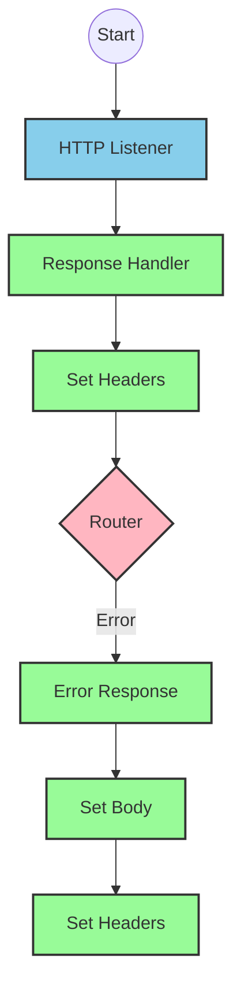
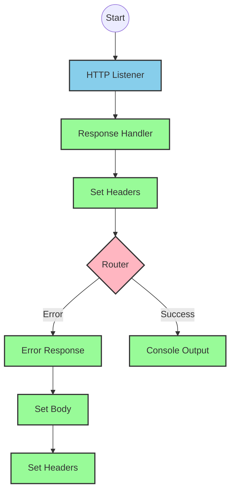
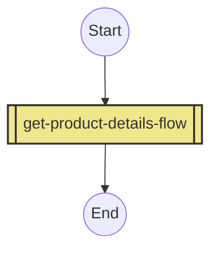
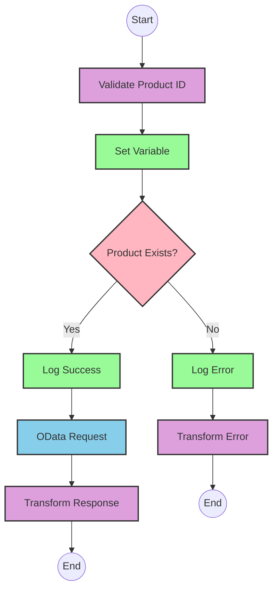

# API Overview
- This API provides product details from an SAP HANA database
- Base URL pattern: `/products`

# Endpoints

## GET /products
- **Purpose**: Retrieves product details based on a product identifier
- **Query Parameters**:
  - `productIdentifier` (required): The unique identifier for the product
- **Response Format**: JSON
- **Status Codes**:
  - 200: Success
  - 400: Bad Request
  - 404: Product Not Found
- **Response Body**:
  - Success: Product details including ProductId, Category, CategoryName, etc.
  - Error: JSON object with status, message, and errorCode

# Current MuleSoft Flow Logic

## Flow: products-main
This is the main entry point for the API that handles HTTP requests.

1. **Trigger**: HTTP listener
2. **Processing**:
   - Sets response headers
   - Routes requests to appropriate handlers
   - Includes error response handling
3. **Outcome**: Routes API requests to the appropriate flow based on the endpoint

## Flow: products-console
This flow appears to be a console/logging version of the API.

1. **Trigger**: HTTP listener
2. **Processing**:
   - Sets response headers
   - Includes error response handling
   - Logs information to the console
3. **Outcome**: Provides console output for API requests

## Flow: get:\products:products-config
This flow handles GET requests to the `/products` endpoint.

1. **Trigger**: GET request to `/products`
2. **Processing**: 
   - References the `get-product-details-flow` subflow to process the request
3. **Outcome**: Returns product details or an error response

## Subflow: get-product-details-flow
This subflow retrieves product details from SAP HANA.

1. **Processing Steps**:
   - Validates if the provided product identifier is valid
   - Logs the request processing
   - Makes an OData request to retrieve product details
   - Transforms the response to JSON format

2. **Data Transformations**:
   - First transformation: Validates if the product identifier exists in the configured list
   ```
   %dw 2.0
   output application/java
   var productidentifer=p('odata.productIdentifiers') splitBy(",")
   ---
   sizeOf(productidentifer filter ($ == attributes.queryParams.productIdentifier))>0
   ```

   - OData query parameters for product retrieval:
   ```
   #[output application/java
   ---
   {
     "$filter" : "ProductId eq '" ++ (attributes.queryParams.productIdentifier default '') ++ "'",
     "$select" : "ProductId,Category,CategoryName,CurrencyCode,DimensionDepth,DimensionHeight,DimensionUnit,DimensionWidth,LongDescription,Name,PictureUrl,Price,QuantityUnit,ShortDescription,SupplierId,Weight,WeightUnit"
   }]
   ```

   - Response transformation:
   ```
   %dw 2.0
   output application/json
   ---
   payload
   ```

   - Error response transformation:
   ```
   %dw 2.0
   output application/json
   ---
   {
     status: "error",
     message: "The product identifier " ++ attributes.queryParams.productIdentifier ++ " was not found.",
     errorCode: "PRODUCT_NOT_FOUND"
   }
   ```

3. **Conditional Logic**:
   - If `vars.isExistProduct` is true, proceed with the OData request
   - Otherwise, return an error response

4. **Error Scenarios**:
   - Product identifier not provided or invalid
   - Product not found in the database

# DataWeave Transformations Explained

## Product Identifier Validation
```
%dw 2.0
output application/java
var productidentifer=p('odata.productIdentifiers') splitBy(",")
---
sizeOf(productidentifer filter ($ == attributes.queryParams.productIdentifier))>0
```

- **Purpose**: Validates if the provided product identifier exists in the configured list
- **Input**: Query parameter `productIdentifier` from the HTTP request
- **Output**: Boolean value (true/false)
- **Logic**:
  1. Retrieves a comma-separated list of valid product identifiers from a property
  2. Splits the list into an array
  3. Filters the array to find matches with the provided product identifier
  4. Returns true if at least one match is found (size > 0)

## OData Query Parameters Construction
```
#[output application/java
---
{
  "$filter" : "ProductId eq '" ++ (attributes.queryParams.productIdentifier default '') ++ "'",
  "$select" : "ProductId,Category,CategoryName,CurrencyCode,DimensionDepth,DimensionHeight,DimensionUnit,DimensionWidth,LongDescription,Name,PictureUrl,Price,QuantityUnit,ShortDescription,SupplierId,Weight,WeightUnit"
}]
```

- **Purpose**: Constructs OData query parameters for the HTTP request to SAP HANA
- **Input**: Product identifier from query parameters
- **Output**: Java map with OData query parameters
- **Logic**:
  1. Creates a $filter parameter to filter products by ProductId
  2. Creates a $select parameter to specify which fields to retrieve
  3. Uses string concatenation to include the product identifier in the filter

## Response Transformation
```
%dw 2.0
output application/json
---
payload
```

- **Purpose**: Transforms the OData response to JSON format
- **Input**: OData response from SAP HANA
- **Output**: JSON representation of the product details
- **Logic**: Simple pass-through transformation that converts the payload to JSON format

## Error Response Transformation
```
%dw 2.0
output application/json
---
{
  status: "error",
  message: "The product identifier " ++ attributes.queryParams.productIdentifier ++ " was not found.",
  errorCode: "PRODUCT_NOT_FOUND"
}
```

- **Purpose**: Creates a standardized error response
- **Input**: Product identifier from query parameters
- **Output**: JSON error object
- **Logic**: Constructs an error object with status, message, and error code

# SAP Integration Suite Implementation

## Component Mapping

| MuleSoft Component | SAP Integration Suite Equivalent |
|-------------------|----------------------------------|
| HTTP Listener | HTTPS Adapter (Server) |
| HTTP Request | HTTP Adapter (Client) |
| Router | Content Modifier with Router |
| Flow Reference | Process Call |
| Logger | Write to Log |
| Transform | Message Mapping |
| Set Variable | Content Modifier (with property setting) |
| Choice/When/Otherwise | Router with conditions |
| Set Payload | Content Modifier |
| Error Handler | Exception Subprocess |

## Integration Flow Visualization









## Configuration Details

### HTTPS Adapter (Server) Configuration
- Protocol: HTTPS
- Address: `/products`
- Authentication: As per source system requirements
- Port: From environment variable or configuration

### HTTP Adapter (Client) Configuration
- URL: SAP HANA OData endpoint
- Authentication: As per target system requirements
- Query Parameters: 
  - $filter: "ProductId eq '[productIdentifier]'"
  - $select: "ProductId,Category,CategoryName,CurrencyCode,DimensionDepth,DimensionHeight,DimensionUnit,DimensionWidth,LongDescription,Name,PictureUrl,Price,QuantityUnit,ShortDescription,SupplierId,Weight,WeightUnit"

### Content Modifier (Set Variable) Configuration
- Variable Name: isExistProduct
- Value Type: Expression
- Value: Result of product identifier validation

### Router Configuration
- Condition 1: ${property.isExistProduct} == true
- Default Route: Error path

### Message Mapping Configuration
- For Product Validation:
  - Source Format: JSON
  - Target Format: Java
  - Mapping: As per DataWeave transformation
- For Response Transformation:
  - Source Format: OData
  - Target Format: JSON
  - Mapping: Direct pass-through
- For Error Response:
  - Source Format: None
  - Target Format: JSON
  - Mapping: Create error object with status, message, and errorCode

### Write to Log Configuration
- Log Level: INFO
- Message: 
  - Success: "The request is processed and sent downstream with the product identifier ([productIdentifier])."
  - Error: "The product identifier ([productIdentifier]) was not passed in the request or was passed incorrectly."

# Configuration

## Important Configuration Parameters
- HTTP Listener Configuration: `HTTP_Listener_config`
- HTTP Request Configuration: `Hana_HTTP_Request_Configuration`
- API Configuration: `products-config` (references products.raml)

## Environment Variables
- `odata.productIdentifiers`: Comma-separated list of valid product identifiers

## Dependencies on External Systems
- SAP HANA OData service for product data retrieval

## Error Handling
- Global Error Handler: `Gobal_Error_Handler`
- Handles various APIKIT errors:
  - APIKIT:BAD_REQUEST
  - APIKIT:NOT_FOUND
  - APIKIT:METHOD_NOT_ALLOWED
  - APIKIT:NOT_ACCEPTABLE
  - APIKIT:UNSUPPORTED_MEDIA_TYPE
  - APIKIT:NOT_IMPLEMENTED