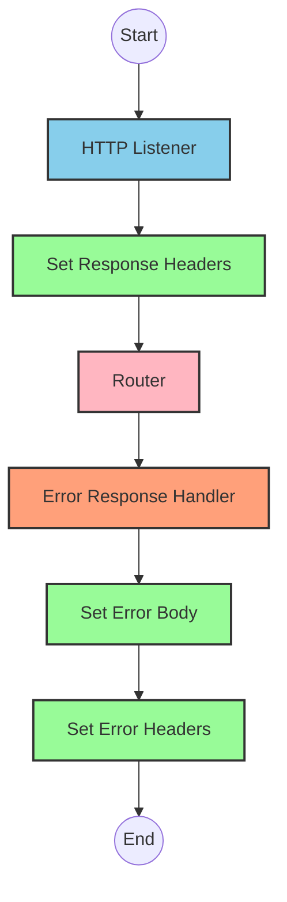
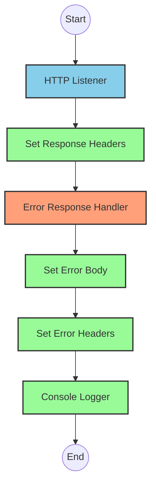
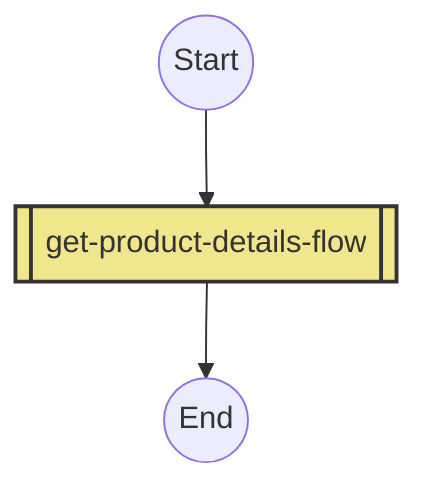
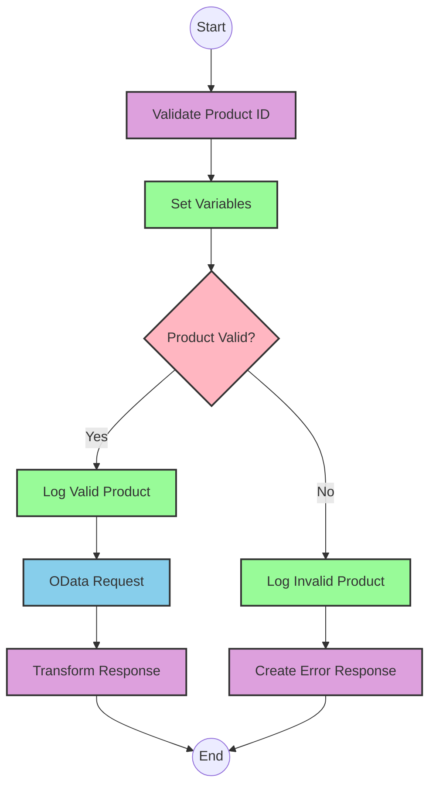

# API Overview
- This API provides product details from an SAP HANA database
- Base URL pattern: `/products`

# Endpoints

## GET /products
- **Purpose**: Retrieves product details based on a product identifier
- **Query Parameters**:
  - `productIdentifier` (required): The unique identifier for the product
- **Response Format**: JSON
- **Status Codes**:
  - 200: Success
  - 400: Bad Request
  - 404: Product Not Found
- **Response Body**:
  - Success: Product details including ProductId, Category, CategoryName, etc.
  - Error: JSON object with status, message, and errorCode

# Current MuleSoft Flow Logic

## Flow: products-main
This is the main entry point for the API that handles HTTP requests.
1. **Trigger**: HTTP listener
2. **Processing**: Routes requests to appropriate handlers
3. **Response**: Returns HTTP response with appropriate headers
4. **Error Handling**: Custom error response handling

## Flow: products-console
A separate flow for console logging.
1. **Trigger**: HTTP listener
2. **Processing**: Logs information to console
3. **Response**: Returns HTTP response with appropriate headers
4. **Error Handling**: Custom error response handling

## Flow: get:\products:products-config
1. **Trigger**: HTTP GET request to `/products` endpoint
2. **Processing**: References the `get-product-details-flow` subflow

## Subflow: get-product-details-flow
1. **Validation**: Checks if the provided product identifier is valid
2. **Processing**:
   - If valid: Queries SAP HANA for product details using OData
   - If invalid: Returns an error response
3. **Data Transformation**: 
   - First transforms to check if product identifier is valid:
     ```
     %dw 2.0
     output application/java
     var productidentifer=p('odata.productIdentifiers') splitBy(",")
     ---
     sizeOf(productidentifer filter ($ == attributes.queryParams.productIdentifier))>0
     ```
   - When querying SAP HANA, uses these exact OData parameters:
     ```
     #[output application/java
     ---
     {
         "$filter" : "ProductId eq '" ++ (attributes.queryParams.productIdentifier default '') ++ "'",
         "$select" : "ProductId,Category,CategoryName,CurrencyCode,DimensionDepth,DimensionHeight,DimensionUnit,DimensionWidth,LongDescription,Name,PictureUrl,Price,QuantityUnit,ShortDescription,SupplierId,Weight,WeightUnit"
     }]
     ```
   - Final transformation for successful response:
     ```
     %dw 2.0
     output application/json
     ---
     payload
     ```
   - Error transformation:
     ```
     %dw 2.0
     output application/json
     ---
     {
         status: "error",
         message: "The product identifier " ++ attributes.queryParams.productIdentifier ++ " was not found.",
         errorCode: "PRODUCT_NOT_FOUND"
     }
     ```
4. **Logging**: Logs processing status with product identifier information
5. **Error Handling**: Returns appropriate error messages for invalid product identifiers

# DataWeave Transformations Explained

## Product Identifier Validation
```
%dw 2.0
output application/java
var productidentifer=p('odata.productIdentifiers') splitBy(",")
---
sizeOf(productidentifer filter ($ == attributes.queryParams.productIdentifier))>0
```
- **Purpose**: Validates if the provided product identifier exists in the configured list
- **Input**: Query parameter `productIdentifier` from the HTTP request
- **Output**: Boolean value indicating if the product identifier is valid
- **Key Operations**:
  - Retrieves a comma-separated list of valid product identifiers from a property
  - Splits the list into an array using `splitBy(",")`
  - Filters the array to find matches with the provided product identifier
  - Uses `sizeOf()` to check if any matches were found (returns true if size > 0)

## OData Query Parameters
```
#[output application/java
---
{
    "$filter" : "ProductId eq '" ++ (attributes.queryParams.productIdentifier default '') ++ "'",
    "$select" : "ProductId,Category,CategoryName,CurrencyCode,DimensionDepth,DimensionHeight,DimensionUnit,DimensionWidth,LongDescription,Name,PictureUrl,Price,QuantityUnit,ShortDescription,SupplierId,Weight,WeightUnit"
}]
```
- **Purpose**: Constructs OData query parameters for the SAP HANA request
- **Input**: Product identifier from query parameters
- **Output**: Java map containing OData query parameters
- **Key Operations**:
  - Creates a `$filter` parameter that filters products by the exact ProductId
  - Creates a `$select` parameter that specifies which fields to retrieve
  - Uses string concatenation (`++`) to build the filter expression
  - Uses `default ''` to handle cases where productIdentifier might be null

## Success Response Transformation
```
%dw 2.0
output application/json
---
payload
```
- **Purpose**: Passes through the response from SAP HANA as JSON
- **Input**: Response payload from SAP HANA
- **Output**: JSON representation of the same payload
- **Key Operations**: Simple pass-through transformation

## Error Response Transformation
```
%dw 2.0
output application/json
---
{
    status: "error",
    message: "The product identifier " ++ attributes.queryParams.productIdentifier ++ " was not found.",
    errorCode: "PRODUCT_NOT_FOUND"
}
```
- **Purpose**: Creates a standardized error response
- **Input**: Query parameter containing the invalid product identifier
- **Output**: JSON error object with status, message, and error code
- **Key Operations**:
  - Constructs a descriptive error message including the invalid product identifier
  - Uses string concatenation (`++`) to include the identifier in the message

# SAP Integration Suite Implementation

## Component Mapping

| MuleSoft Component | SAP Integration Suite Equivalent | Notes |
|-------------------|----------------------------------|-------|
| HTTP Listener | HTTPS Adapter (Receiver) | Configure with same path and method |
| Router | Content Modifier + Router | Use Content Modifier to set properties and Router for conditional paths |
| Flow Reference | Process Call | References another integration flow |
| Transform | Message Mapping | Maps between different message formats |
| Logger | Write to Log | Logs messages to monitoring |
| HTTP Request | OData Adapter (Sender) | Configure with same OData parameters |
| Set Variable | Content Modifier | Sets exchange properties |
| Choice/When/Otherwise | Router | Implements conditional logic |
| Error Handler | Exception Subprocess | Handles errors with specific mappings |

## Integration Flow Visualization









## Configuration Details

### HTTP Adapter (Receiver)
- **Address**: `/products`
- **Method**: GET
- **Authentication**: As per source system requirements
- **CSRF Protection**: As needed

### OData Adapter (Sender)
- **Service**: SAP HANA OData service
- **Query Parameters**:
  - `$filter`: `ProductId eq '{productIdentifier}'`
  - `$select`: `ProductId,Category,CategoryName,CurrencyCode,DimensionDepth,DimensionHeight,DimensionUnit,DimensionWidth,LongDescription,Name,PictureUrl,Price,QuantityUnit,ShortDescription,SupplierId,Weight,WeightUnit`

### Content Modifiers
- **Set Variable (isExistProduct)**:
  - Expression: Same logic as original DataWeave transformation
  - Type: Boolean

### Message Mappings
- **Validate Product ID**:
  - Source: HTTP Request
  - Target: Exchange Property
  - Mapping: Check if product identifier exists in configured list
  
- **Transform Response**:
  - Source: OData Response
  - Target: HTTP Response
  - Mapping: Direct pass-through
  
- **Create Error Response**:
  - Source: Exchange Properties
  - Target: HTTP Response
  - Mapping: Create error JSON with status, message, and errorCode

### Router
- **Condition**: `${property.isExistProduct}`
- **True Path**: Proceed to OData request
- **False Path**: Create error response

### Write to Log
- **Log Level**: INFO
- **Messages**:
  - Valid: "The request is processed and sent downstream with the product identifier (${property.productIdentifier})."
  - Invalid: "The product identifier (${property.productIdentifier}) was not passed in the request or was passed incorrectly."

# Configuration

## Important Configuration Parameters
- `odata.productIdentifiers`: Comma-separated list of valid product identifiers

## HTTP Configurations
- **HTTP_Listener_config**: Base configuration for HTTP listeners
- **Hana_HTTP_Request_Configuration**: Configuration for SAP HANA HTTP requests
- **products-config**: API configuration referencing products.raml

## Error Handling
- **Global_Error_Handler**: Handles various APIKIT errors:
  - APIKIT:BAD_REQUEST
  - APIKIT:NOT_FOUND
  - APIKIT:METHOD_NOT_ALLOWED
  - APIKIT:NOT_ACCEPTABLE
  - APIKIT:UNSUPPORTED_MEDIA_TYPE
  - APIKIT:NOT_IMPLEMENTED