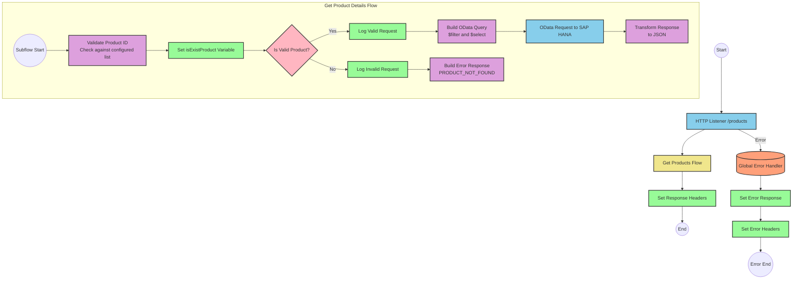

# SAP HANA Product Information API Integration

## Table of Contents
- [SAP HANA Product Information API Integration](#sap-hana-product-information-api-integration)
  - [Table of Contents](#table-of-contents)
  - [API Overview](#api-overview)
  - [Endpoints](#endpoints)
    - [GET /products](#get-products)
  - [Current MuleSoft Flow Logic](#current-mulesoft-flow-logic)
    - [Main Flows](#main-flows)
    - [Subflows](#subflows)
  - [DataWeave Transformations Explained](#dataweave-transformations-explained)
    - [Product Identifier Validation](#product-identifier-validation)
    - [OData Query Parameters Construction](#odata-query-parameters-construction)
    - [Success Response Transformation](#success-response-transformation)
    - [Error Response Transformation](#error-response-transformation)
  - [SAP Integration Suite Implementation](#sap-integration-suite-implementation)
    - [Component Mapping](#component-mapping)
    - [Integration Flow Visualization](#integration-flow-visualization)
    - [Configuration Details](#configuration-details)
  - [Environment Configuration](#environment-configuration)
  - [API Reference](#api-reference)

## API Overview
- This API provides access to product information stored in SAP HANA
- The API allows retrieval of detailed product information by product identifier
- Base URL: Determined by the HTTP_Listener_config
- Authentication: Not explicitly defined in the source documentation
- Response format: JSON
- The API validates product identifiers against a configured list before retrieving data

## Endpoints

### GET /products
- **Purpose**: Retrieves detailed product information based on a product identifier
- **Request Parameters**:
  - **Query Parameters**:
    - `productIdentifier` (required): The unique identifier of the product to retrieve
- **Response Format**:
  - **Success Response (200 OK)**:
    - Content-Type: application/json
    - Body: Product details including ProductId, Category, CategoryName, CurrencyCode, dimensions, descriptions, price, and other attributes
  - **Error Response (400 Bad Request)**:
    - Content-Type: application/json
    - Body: Error details including status, message, and errorCode
- **Example Error Response**:
  ```json
  {
    "status": "error",
    "message": "The product identifier ABC123 was not found.",
    "errorCode": "PRODUCT_NOT_FOUND"
  }
  ```

## Current MuleSoft Flow Logic

### Main Flows

1. **products-main Flow**
   - Triggered by an HTTP request to the API endpoint
   - Handles the main API routing and response formatting
   - Sets appropriate headers for the response
   - Includes error handling for API requests

2. **products-console Flow**
   - Triggered by an HTTP request to the console endpoint
   - Similar to the main flow but includes console output
   - Sets appropriate headers for the response
   - Includes error handling for API requests

3. **get:\products:products-config Flow**
   - Triggered when a GET request is made to the /products endpoint
   - References the get-product-details-flow subflow to process the request

### Subflows

**get-product-details-flow**
1. Validates if the provided product identifier exists in the configured list
   - Uses a DataWeave transformation to check if the product identifier is valid
   - Sets a variable `isExistProduct` based on the validation result

2. Branches based on the validation result:
   - If the product identifier is valid:
     - Logs a message indicating the request is being processed
     - Constructs an OData query with specific filter and select parameters
     - Sends a request to retrieve product details
     - Transforms the response to JSON format
   - If the product identifier is invalid:
     - Logs a message indicating the product identifier was not found or incorrect
     - Constructs an error response with appropriate status, message, and error code

3. The flow uses choice/when/otherwise components to implement the conditional logic

## DataWeave Transformations Explained

### Product Identifier Validation

```dw
%dw 2.0
output application/java
var productidentifer=p('odata.productIdentifiers') splitBy(",")
---
sizeOf(productidentifer filter ($ == attributes.queryParams.productIdentifier))>0
```

This transformation:
1. Retrieves a comma-separated list of valid product identifiers from a property `odata.productIdentifiers`
2. Splits the list into an array using the `splitBy` function
3. Filters the array to find matches with the provided product identifier in the query parameters
4. Returns a boolean value indicating whether the product identifier exists in the configured list (true if the size of the filtered array is greater than 0)

### OData Query Parameters Construction

```dw
#[output application/java
---
{
	"$filter" : "ProductId eq '" ++ (attributes.queryParams.productIdentifier default '') ++ "'",
	"$select" : "ProductId,Category,CategoryName,CurrencyCode,DimensionDepth,DimensionHeight,DimensionUnit,DimensionWidth,LongDescription,Name,PictureUrl,Price,QuantityUnit,ShortDescription,SupplierId,Weight,WeightUnit"
}]
```

This transformation:
1. Constructs OData query parameters for the request to the backend system
2. Creates a `$filter` parameter that filters products by the provided product identifier
3. Creates a `$select` parameter that specifies which fields to include in the response
4. Uses string concatenation (`++`) to build the filter expression with the product identifier
5. Uses the `default` function to provide an empty string if the product identifier is not present

### Success Response Transformation

```dw
%dw 2.0
output application/json
---
payload
```

This simple transformation:
1. Takes the payload from the OData response
2. Outputs it as JSON without any modifications
3. Preserves the structure and content of the original response

### Error Response Transformation

```dw
%dw 2.0
output application/json
---
{
	status: "error",
	message: "The product identifier " ++ attributes.queryParams.productIdentifier ++ " was not found.",
	errorCode: "PRODUCT_NOT_FOUND"
}
```

This transformation:
1. Creates a structured error response in JSON format
2. Sets a status field to "error"
3. Constructs a message that includes the invalid product identifier
4. Sets an errorCode field to "PRODUCT_NOT_FOUND"
5. Uses string concatenation (`++`) to include the product identifier in the error message

## SAP Integration Suite Implementation

### Component Mapping

| MuleSoft Component | SAP Integration Suite Equivalent | Notes |
|--------------------|----------------------------------|-------|
| HTTP Listener | HTTPS Adapter (Receiver) | Configure with the same path and method settings |
| Flow Reference | Process Call | Used to call the product details subflow |
| DataWeave Transform | Content Modifier + Groovy Script | For complex transformations, use Groovy Script; for simple mappings, use Content Modifier |
| Logger | Write to Log | Configure with the same log messages |
| HTTP Request | OData Adapter (Sender) | Configure with the same OData query parameters |
| Set Variable | Content Modifier (with property setting) | Used to set flow variables |
| Choice/When/Otherwise | Router | Configure with the same conditions |
| Set Payload | Content Modifier | Used to set the message payload |
| Error Handler | Exception Subprocess | Configure with the same error types and handling logic |

### Integration Flow Visualization



### Configuration Details

1. **HTTPS Adapter (Receiver)**
   - Path: /products
   - Method: GET
   - Authentication: To be determined based on security requirements

2. **OData Adapter (Sender)**
   - Connection to SAP HANA
   - Query Parameters:
     - $filter: ProductId eq '[productIdentifier]'
     - $select: ProductId,Category,CategoryName,CurrencyCode,DimensionDepth,DimensionHeight,DimensionUnit,DimensionWidth,LongDescription,Name,PictureUrl,Price,QuantityUnit,ShortDescription,SupplierId,Weight,WeightUnit

3. **Content Modifier (isExistProduct)**
   - Property Name: isExistProduct
   - Source: Result of product identifier validation script

4. **Router**
   - Condition: ${property.isExistProduct} = true
   - Default route: Error response path

5. **Groovy Script (Product Validation)**
   - Script to validate product identifier against configured list
   - Similar logic to the DataWeave transformation

6. **Write to Log**
   - Valid Request Log: "The request is processed and sent downstream with the product identifier (${property.productIdentifier})."
   - Invalid Request Log: "The product identifier (${property.productIdentifier}) was not passed in the request or was passed incorrectly."

7. **Content Modifier (Error Response)**
   - Set JSON structure with status, message, and errorCode
   - Message includes the invalid product identifier

## Environment Configuration

1. **Important Configuration Parameters**
   - `odata.productIdentifiers`: Comma-separated list of valid product identifiers
   - HTTP Listener configuration: Port and host settings
   - HANA HTTP Request Configuration: Connection details to SAP HANA

2. **Environment Variables**
   - No explicit environment variables mentioned in the source documentation
   - Recommended to externalize the following as environment variables:
     - SAP HANA connection details
     - Valid product identifiers list
     - API base URL

3. **Dependencies on External Systems**
   - SAP HANA: The integration relies on an SAP HANA backend to retrieve product information
   - The OData endpoint must support the $filter and $select query parameters

4. **Security Settings**
   - Authentication mechanism for SAP HANA connection (not specified in source)
   - API security settings (not specified in source)
   - Recommended to implement appropriate authentication and authorization

5. **Deployment Considerations**
   - Ensure network connectivity between the integration platform and SAP HANA
   - Configure appropriate timeouts for HTTP requests
   - Implement monitoring for integration health and performance

## API Reference

### Endpoints

| HTTP Method | Endpoint | Description |
|-------------|----------|-------------|
| GET | /products | Retrieve product details by product identifier |

### Request Parameters

**GET /products**
- Query Parameters:
  - `productIdentifier` (required): The unique identifier of the product to retrieve
  - Must be one of the configured valid product identifiers

### Response Schemas

**Success Response (200 OK)**
```json
{
  "ProductId": "string",
  "Category": "string",
  "CategoryName": "string",
  "CurrencyCode": "string",
  "DimensionDepth": "number",
  "DimensionHeight": "number",
  "DimensionUnit": "string",
  "DimensionWidth": "number",
  "LongDescription": "string",
  "Name": "string",
  "PictureUrl": "string",
  "Price": "number",
  "QuantityUnit": "string",
  "ShortDescription": "string",
  "SupplierId": "string",
  "Weight": "number",
  "WeightUnit": "string"
}
```

**Error Response (400 Bad Request)**
```json
{
  "status": "error",
  "message": "string",
  "errorCode": "string"
}
```

### Error Codes

| Error Code | Description |
|------------|-------------|
| PRODUCT_NOT_FOUND | The provided product identifier was not found in the list of valid identifiers |
| APIKIT:BAD_REQUEST | The request was malformed or missing required parameters |
| APIKIT:NOT_FOUND | The requested resource was not found |
| APIKIT:METHOD_NOT_ALLOWED | The HTTP method is not supported for the requested resource |
| APIKIT:NOT_ACCEPTABLE | The server cannot produce a response matching the list of acceptable values |
| APIKIT:UNSUPPORTED_MEDIA_TYPE | The request entity has a media type which the server does not support |
| APIKIT:NOT_IMPLEMENTED | The server does not support the functionality required to fulfill the request |