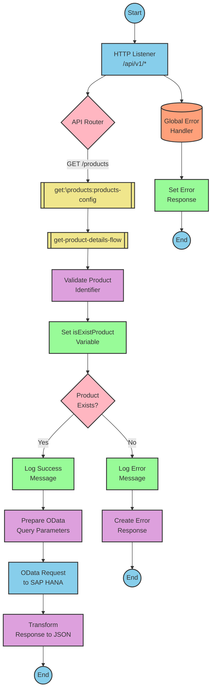

# SAP Integration Suite Implementation for Product API

# Table of Contents
- [API Overview](#api-overview)
- [Endpoints](#endpoints)
- [Current MuleSoft Flow Logic](#current-mulesoft-flow-logic)
- [DataWeave Transformations Explained](#dataweave-transformations-explained)
- [SAP Integration Suite Implementation](#sap-integration-suite-implementation)
  - [Component Mapping](#component-mapping)
  - [Integration Flow Visualization](#integration-flow-visualization)
- [Configuration Details](#configuration-details)
- [Configuration](#configuration)

# API Overview
This API provides access to product information from an SAP HANA backend system. It allows clients to retrieve product details by specifying a product identifier. The API validates the product identifier against a configured list of valid identifiers before retrieving the data from the backend system.

**Base URL**: `http://localhost:8081/api/v1`

# Endpoints

## GET /products
**Purpose**: Retrieves product details based on the provided product identifier.

**Request Parameters**:
- **Query Parameters**:
  - `productIdentifier` (required): The unique identifier of the product to retrieve

**Response Format**:
- **200 OK**: Successfully retrieved product details
  - Content-Type: application/json
  - Body: Product details JSON object
- **400 Bad Request**: Invalid request format
- **404 Not Found**: Product identifier not found or invalid
- **500 Internal Server Error**: Server-side error

**Example Response (200 OK)**:
```json
{
  "ProductId": "HT-2000",
  "Category": "Notebooks",
  "CategoryName": "Notebooks",
  "CurrencyCode": "USD",
  "DimensionDepth": 30,
  "DimensionHeight": 3,
  "DimensionUnit": "cm",
  "DimensionWidth": 40,
  "LongDescription": "Notebook Basic 17 with 2,80 GHz quad core, 17\" LCD, 4 GB DDR3 RAM, 500 GB Hard Disc, Windows 8 Pro",
  "Name": "Notebook Basic 17",
  "PictureUrl": "/sap/public/bc/NWDEMO_MODEL/IMAGES/HT-2000.jpg",
  "Price": 1249,
  "QuantityUnit": "EA",
  "ShortDescription": "Notebook Basic 17 with 2,80 GHz quad core, 17\" LCD, 4 GB DDR3 RAM, 500 GB Hard Disc",
  "SupplierId": "0100000046",
  "Weight": 4.5,
  "WeightUnit": "KG"
}
```

**Example Response (404 Not Found)**:
```json
{
  "status": "error",
  "message": "The product identifier HT-3000 was not found.",
  "errorCode": "PRODUCT_NOT_FOUND"
}
```

# Current MuleSoft Flow Logic

## products-main Flow
**Trigger**: HTTP listener configured at `/api/v1/*`
**Purpose**: Main entry point for the API that handles routing to appropriate endpoints

1. Starts with an HTTP listener that receives incoming requests
2. Sets up response handling with headers
3. Configures error response handling
4. Routes requests to appropriate endpoints based on the API configuration

## products-console Flow
**Trigger**: HTTP listener (likely for debugging/monitoring)
**Purpose**: Provides console output for API requests

1. Starts with an HTTP listener
2. Sets up response handling with headers
3. Configures error response handling
4. Outputs request information to the console

## get:\products:products-config Flow
**Trigger**: HTTP GET request to `/products` endpoint
**Purpose**: Handles product retrieval requests

1. Receives GET requests to the `/products` endpoint
2. Calls the `get-product-details-flow` subflow to process the request

## get-product-details-flow Subflow
**Purpose**: Validates the product identifier and retrieves product details from the backend

1. Validates if the requested product identifier exists in the configured list:
   ```
   %dw 2.0
   output application/java
   var productidentifer=p('odata.productIdentifiers') splitBy(",")
   ---
   sizeOf(productidentifer filter ($ == attributes.queryParams.productIdentifier))>0
   ```

2. Sets a variable `isExistProduct` with the validation result

3. Conditional processing based on validation:
   - If `isExistProduct` is true:
     - Logs a message: "The request is processed and sent downstream with the product identifier (#[attributes.queryParams.productIdentifier])."
     - Makes an HTTP request to the SAP HANA backend with OData query parameters:
       ```
       #[output application/java
       ---
       {
         "$filter" : "ProductId eq '" ++ (attributes.queryParams.productIdentifier default '') ++ "'",
         "$select" : "ProductId,Category,CategoryName,CurrencyCode,DimensionDepth,DimensionHeight,DimensionUnit,DimensionWidth,LongDescription,Name,PictureUrl,Price,QuantityUnit,ShortDescription,SupplierId,Weight,WeightUnit"
       }]
       ```
     - Transforms the response to JSON:
       ```
       %dw 2.0
       output application/json
       ---
       payload
       ```

   - If `isExistProduct` is false:
     - Logs a message: "The product identifier (#[attributes.queryParams.productIdentifier]) was not passed in the request or was passed incorrectly."
     - Returns an error response:
       ```
       %dw 2.0
       output application/json
       ---
       {
         status: "error",
         message: "The product identifier " ++ attributes.queryParams.productIdentifier ++ " was not found.",
         errorCode: "PRODUCT_NOT_FOUND"
       }
       ```

## Error Handling
The application implements global error handling for various APIKIT errors:
- APIKIT:BAD_REQUEST
- APIKIT:NOT_FOUND
- APIKIT:METHOD_NOT_ALLOWED
- APIKIT:NOT_ACCEPTABLE
- APIKIT:UNSUPPORTED_MEDIA_TYPE
- APIKIT:NOT_IMPLEMENTED

# DataWeave Transformations Explained

## Product Identifier Validation Transformation
**Purpose**: Validates if the requested product identifier exists in the configured list of valid identifiers.

**Input**: Query parameter `productIdentifier` from the HTTP request
**Output**: Boolean value indicating if the product identifier is valid

**Logic**:
1. Retrieves the configured list of product identifiers from the property `odata.productIdentifiers`
2. Splits the comma-separated list into an array
3. Filters the array to find matches with the requested product identifier
4. Returns true if at least one match is found (size > 0)

```dw
%dw 2.0
output application/java
var productidentifer=p('odata.productIdentifiers') splitBy(",")
---
sizeOf(productidentifer filter ($ == attributes.queryParams.productIdentifier))>0
```

## OData Query Parameters Transformation
**Purpose**: Constructs OData query parameters for filtering and selecting specific product fields.

**Input**: Product identifier from query parameters
**Output**: OData query parameters object with $filter and $select

**Logic**:
1. Creates a $filter parameter that filters products by the specified ProductId
2. Creates a $select parameter that specifies which product fields to include in the response

```dw
#[output application/java
---
{
  "$filter" : "ProductId eq '" ++ (attributes.queryParams.productIdentifier default '') ++ "'",
  "$select" : "ProductId,Category,CategoryName,CurrencyCode,DimensionDepth,DimensionHeight,DimensionUnit,DimensionWidth,LongDescription,Name,PictureUrl,Price,QuantityUnit,ShortDescription,SupplierId,Weight,WeightUnit"
}]
```

## Response Transformation
**Purpose**: Passes through the product data from the backend to the client.

**Input**: Product data from the SAP HANA backend
**Output**: JSON representation of the product data

**Logic**: Simple pass-through transformation that maintains the structure of the data but ensures JSON output format.

```dw
%dw 2.0
output application/json
---
payload
```

## Error Response Transformation
**Purpose**: Creates a standardized error response when the product identifier is invalid.

**Input**: Product identifier from query parameters
**Output**: JSON error object with status, message, and error code

**Logic**: Constructs an error object with a descriptive message that includes the invalid product identifier.

```dw
%dw 2.0
output application/json
---
{
  status: "error",
  message: "The product identifier " ++ attributes.queryParams.productIdentifier ++ " was not found.",
  errorCode: "PRODUCT_NOT_FOUND"
}
```

# SAP Integration Suite Implementation

## Component Mapping

| MuleSoft Component | SAP Integration Suite Equivalent | Notes |
|--------------------|----------------------------------|-------|
| HTTP Listener | HTTPS Adapter (Receiver) | Configure with the same path and port settings |
| Router | Content Modifier + Router | Use Content Modifier to set routing conditions and Router to direct flow |
| Flow Reference | Process Call | Used to call subflows |
| Logger | Write to Message Log | Configure with the same log messages |
| Set Variable | Content Modifier (Create/Set Properties) | Used to set flow variables |
| Choice/When/Otherwise | Router | Implement conditional logic with Router shapes |
| HTTP Request | OData Adapter (Sender) | Configure with the same OData query parameters |
| Transform (DataWeave) | Message Mapping | Implement the same transformation logic using message mapping |
| Set Payload | Content Modifier (Message Body) | Set the message payload |
| Error Handler | Exception Subprocess | Implement error handling logic |

## Integration Flow Visualization

### REST API Integration Flow: GET /products



# Configuration Details

## HTTP Listener Configuration
- **Component**: HTTPS Adapter (Receiver)
- **Parameters**:
  - Address: `/api/v1/*`
  - Port: `8081` (from dev.yaml)
  - Authentication: None (based on source)

## OData Request Configuration
- **Component**: OData Adapter (Sender)
- **Parameters**:
  - URL: `refapp-espm-ui-cf.cfapps.eu10.hana.ondemand.com` (from dev.yaml)
  - Port: `443` (from dev.yaml)
  - Path: `/espm-cloud-web/espm.svc/Products` (from dev.yaml)
  - Query Parameters:
    - $filter: `ProductId eq '{productIdentifier}'`
    - $select: `ProductId,Category,CategoryName,CurrencyCode,DimensionDepth,DimensionHeight,DimensionUnit,DimensionWidth,LongDescription,Name,PictureUrl,Price,QuantityUnit,ShortDescription,SupplierId,Weight,WeightUnit`

## Validate Product Identifier
- **Component**: Message Mapping
- **Parameters**:
  - Input: HTTP Request Query Parameters
  - Output: Boolean value
  - Mapping Script: Equivalent to the DataWeave script that checks if the product identifier exists in the configured list

## Router Configuration
- **Component**: Router
- **Parameters**:
  - Condition: `${property.isExistProduct}` (equivalent to MuleSoft's `vars.isExistProduct`)
  - Default Route: Error response path

## Error Response Configuration
- **Component**: Content Modifier
- **Parameters**:
  - Message Body: JSON error response with status, message, and errorCode

# Configuration

## Environment Variables
The following environment variables are required based on the source configuration:

### From dev.yaml:
- **API Configuration**:
  - `api.listener.port`: "8081"
  - `api.listener.path`: "/api/v1/*"
  
- **HANA Configuration**:
  - `hana.espm.url`: "refapp-espm-ui-cf.cfapps.eu10.hana.ondemand.com"
  - `hana.espm.port`: "443"
  - `hana.espm.path`: "/espm-cloud-web/espm.svc/Products"
  
- **OData Configuration**:
  - `odata.productIdentifiers`: "HT-2000,HT-2001"

## Dependencies on External Systems
- SAP HANA Cloud backend system for product data
- The integration depends on the availability of the ESPM service at the configured URL

## Security Settings
- HTTPS communication with the SAP HANA backend
- Port 443 indicates secure communication
- No explicit authentication mechanisms are defined in the source documentation