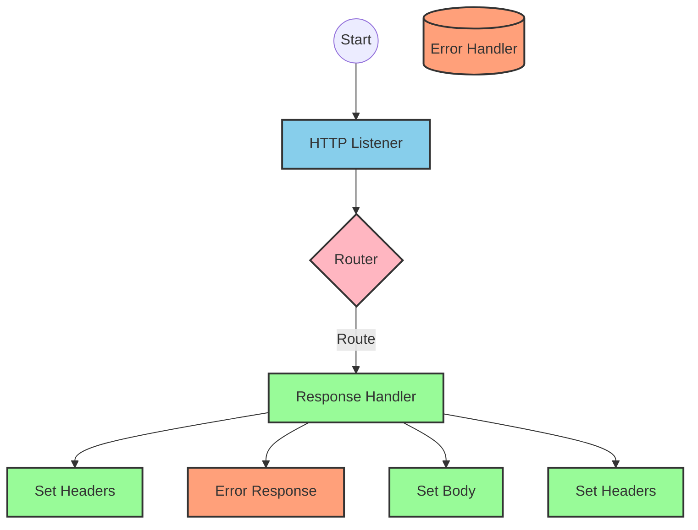
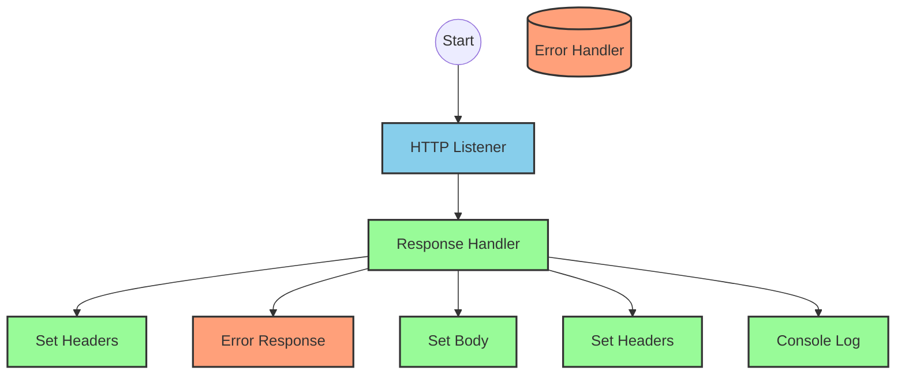
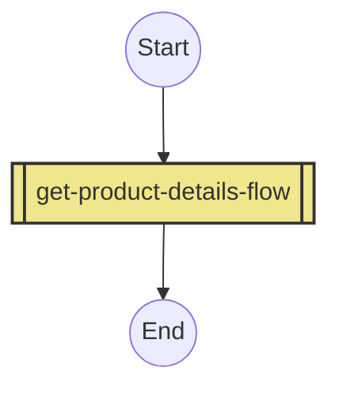
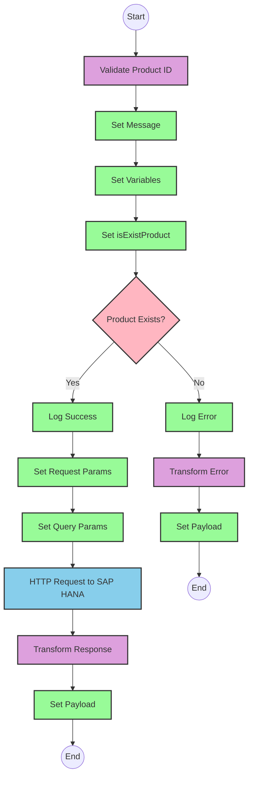

# API Overview
- This API provides product details from an SAP HANA database based on a product identifier
- Base URL pattern: `/products`

# Endpoints

## GET /products
- **Purpose**: Retrieves product details based on a product identifier
- **Request Parameters**:
  - **Query Parameters**:
    - `productIdentifier` (required): The unique identifier for the product
- **Response Format**:
  - Content-Type: application/json
  - Success: Product details from SAP HANA
  - Error: JSON object with status, message, and errorCode
- **Status Codes**:
  - 200: Success
  - 400: Bad Request
  - 404: Not Found
  - 405: Method Not Allowed
  - 406: Not Acceptable
  - 415: Unsupported Media Type
  - 501: Not Implemented

# Current MuleSoft Flow Logic

## Flow: products-main
This is the main entry point for the API that handles HTTP requests.
1. **Trigger**: HTTP listener
2. **Processing**: Routes requests to appropriate handlers
3. **Response**: Returns HTTP response with appropriate headers
4. **Error Handling**: Provides error responses with appropriate status codes

## Flow: products-console
This flow appears to be a console logging version of the main flow.
1. **Trigger**: HTTP listener
2. **Processing**: Logs requests to console
3. **Response**: Returns HTTP response with appropriate headers
4. **Error Handling**: Provides error responses with appropriate status codes

## Flow: get:\products:products-config
This flow handles GET requests to the /products endpoint.
1. **Trigger**: API Kit router for GET /products
2. **Processing**: References the get-product-details-flow subflow

## Subflow: get-product-details-flow
This subflow retrieves product details from SAP HANA.
1. **Validation**: Checks if the provided product identifier is valid
2. **Processing**:
   - If valid: Queries SAP HANA for product details using OData
   - If invalid: Returns an error response
3. **Data Transformations**:
   - Transforms the product identifier into an OData query
   - Transforms the SAP HANA response to JSON
4. **Error Handling**: Returns appropriate error messages

The flow uses these specific technical components:
- Validates product identifier against a configurable list (`p('odata.productIdentifiers')`)
- Uses OData query with exact parameters:
  - `$filter`: `ProductId eq '" ++ (attributes.queryParams.productIdentifier default '') ++ "'`
  - `$select`: `ProductId,Category,CategoryName,CurrencyCode,DimensionDepth,DimensionHeight,DimensionUnit,DimensionWidth,LongDescription,Name,PictureUrl,Price,QuantityUnit,ShortDescription,SupplierId,Weight,WeightUnit`

# DataWeave Transformations Explained

## Product Identifier Validation Transformation
This transformation checks if the provided product identifier exists in a predefined list of valid identifiers.

```dw
%dw 2.0
output application/java
var productidentifer=p('odata.productIdentifiers') splitBy(",")
---
sizeOf(productidentifer filter ($ == attributes.queryParams.productIdentifier))>0
```

- **Input**: The product identifier from query parameters
- **Output**: Boolean value (true/false)
- **Logic**:
  1. Retrieves a comma-separated list of valid product identifiers from a property
  2. Splits the list into an array
  3. Filters the array to find matches with the provided product identifier
  4. Returns true if at least one match is found (size > 0)

## OData Query Parameters Transformation
This transformation constructs the OData query parameters for the SAP HANA request.

```dw
#[output application/java
---
{
	"$filter" : "ProductId eq '" ++ (attributes.queryParams.productIdentifier default '') ++ "'",
	"$select" : "ProductId,Category,CategoryName,CurrencyCode,DimensionDepth,DimensionHeight,DimensionUnit,DimensionWidth,LongDescription,Name,PictureUrl,Price,QuantityUnit,ShortDescription,SupplierId,Weight,WeightUnit"
}]
```

- **Input**: The product identifier from query parameters
- **Output**: Java map with OData query parameters
- **Logic**:
  1. Constructs a $filter parameter that filters products by the provided product identifier
  2. Specifies a $select parameter to retrieve specific product fields

## Response Payload Transformation (Success)
This transformation passes through the SAP HANA response as JSON.

```dw
%dw 2.0
output application/json
---
payload
```

- **Input**: SAP HANA response
- **Output**: JSON representation of the response
- **Logic**: Simple pass-through transformation

## Error Response Transformation
This transformation constructs an error response when the product identifier is invalid.

```dw
%dw 2.0
output application/json
---
{
	status: "error",
	message: "The product identifier " ++ attributes.queryParams.productIdentifier ++ " was not found.",
	errorCode: "PRODUCT_NOT_FOUND"
}
```

- **Input**: The product identifier from query parameters
- **Output**: JSON error object
- **Logic**: Constructs an error object with status, message, and errorCode

# SAP Integration Suite Implementation

## Component Mapping

| MuleSoft Component | SAP Integration Suite Equivalent | Notes |
|--------------------|----------------------------------|-------|
| HTTP Listener | HTTPS Adapter (Server) | Configure with same path and method |
| Router | Content Modifier | Used to route based on HTTP method and path |
| Flow Reference | Process Call | References another integration flow |
| Transform | Message Mapping | Maps data between formats |
| Logger | Write to Log | Logs messages to monitoring |
| Choice/When/Otherwise | Router | Implements conditional logic |
| HTTP Request | HTTPS Adapter (Client) | Configures outbound HTTP requests |
| Set Variable | Content Modifier | Sets variables in the message processing |
| Set Payload | Content Modifier | Sets the message payload |
| Error Handler | Exception Subprocess | Handles errors in the integration flow |

## Integration Flow Visualization









## Configuration Details

### HTTP Listener Configuration
- **Component**: HTTPS Adapter (Server)
- **Parameters**:
  - Name: HTTP_Listener_config
  - Path: /products
  - Method: GET
  - Content Type: application/json

### HTTP Request Configuration
- **Component**: HTTPS Adapter (Client)
- **Parameters**:
  - Name: Hana_HTTP_Request_Configuration
  - URL: [SAP HANA OData endpoint - to be configured]
  - Method: GET
  - Query Parameters:
    - $filter: ProductId eq '[productIdentifier]'
    - $select: ProductId,Category,CategoryName,CurrencyCode,DimensionDepth,DimensionHeight,DimensionUnit,DimensionWidth,LongDescription,Name,PictureUrl,Price,QuantityUnit,ShortDescription,SupplierId,Weight,WeightUnit

### Router Configuration
- **Component**: Router
- **Conditions**:
  - When isExistProduct is true: Route to success path
  - Otherwise: Route to error path

### Message Mapping Configuration
- **Component**: Message Mapping
- **Mappings**:
  1. Validate Product ID:
     - Input: Query parameters
     - Output: Boolean (isExistProduct)
     - Logic: Check if productIdentifier exists in configured list
  2. Transform Response:
     - Input: SAP HANA response
     - Output: JSON payload
  3. Transform Error:
     - Input: Query parameters
     - Output: JSON error object

# Configuration
- **Property Configuration**:
  - odata.productIdentifiers: Comma-separated list of valid product identifiers
- **Error Handling**:
  - APIKIT:BAD_REQUEST: Propagate error
  - APIKIT:NOT_FOUND: Propagate error
  - APIKIT:METHOD_NOT_ALLOWED: Propagate error
  - APIKIT:NOT_ACCEPTABLE: Propagate error
  - APIKIT:UNSUPPORTED_MEDIA_TYPE: Propagate error
  - APIKIT:NOT_IMPLEMENTED: Propagate error
- **External Dependencies**:
  - SAP HANA OData service for product data