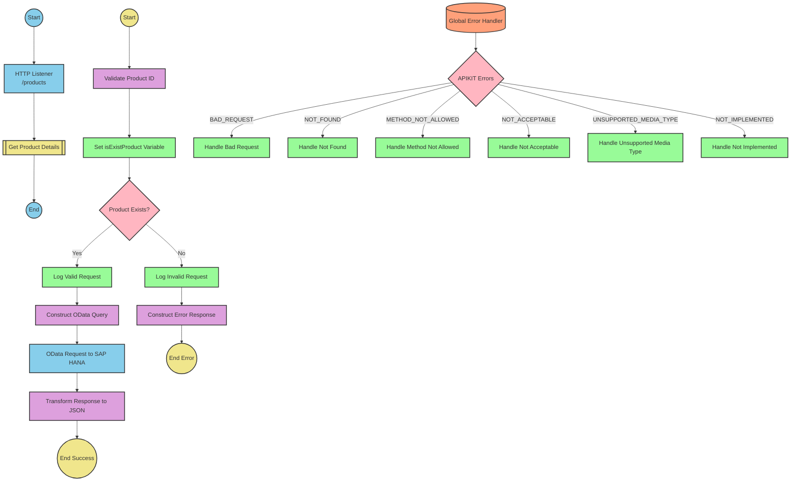

# SAP OData Product Information API Integration

## Table of Contents
- [API Overview](#api-overview)
- [Endpoints](#endpoints)
  - [GET /products](#get-products)
- [Current MuleSoft Flow Logic](#current-mulesoft-flow-logic)
  - [products-main Flow](#products-main-flow)
  - [products-console Flow](#products-console-flow)
  - [get:\products:products-config Flow](#getproductsproducts-config-flow)
  - [get-product-details-flow Subflow](#get-product-details-flow-subflow)
- [DataWeave Transformations Explained](#dataweave-transformations-explained)
  - [Product Identifier Validation](#product-identifier-validation)
  - [OData Query Parameters Construction](#odata-query-parameters-construction)
  - [Response Payload Transformation](#response-payload-transformation)
  - [Error Response Transformation](#error-response-transformation)
- [SAP Integration Suite Implementation](#sap-integration-suite-implementation)
  - [Component Mapping](#component-mapping)
  - [Integration Flow Visualization](#integration-flow-visualization)
  - [Configuration Details](#configuration-details)
- [Environment Configuration](#environment-configuration)
- [API Reference](#api-reference)
  - [GET /products](#get-products-1)
  - [Error Codes](#error-codes)

## API Overview
This API provides access to product information stored in an SAP HANA database through OData services. The integration allows clients to retrieve detailed product information by providing a product identifier as a query parameter. The API validates the product identifier against a configured list of valid identifiers before making the request to the backend SAP system.

- **Base URL**: Determined by the HTTP_Listener_config
- **Authentication**: Not explicitly defined in the source documentation
- **Rate Limiting**: Not specified in the source documentation
- **General Response Format**: JSON

The API serves as a facade to simplify access to product data from SAP systems, providing a RESTful interface that handles validation, error handling, and data transformation.

## Endpoints

### GET /products
Retrieves detailed product information based on a provided product identifier.

- **HTTP Method**: GET
- **Path**: /products
- **Purpose**: Fetch detailed product information from SAP HANA

**Request Parameters**:
- **Query Parameters**:
  - `productIdentifier` (required): The unique identifier of the product to retrieve

**Response Format**:
- **Success Response (200 OK)**:
  - Content-Type: application/json
  - Body: JSON object containing product details from SAP HANA

- **Error Response (400 Bad Request)**:
  - Content-Type: application/json
  - Body: JSON object with error details
    ```json
    {
      "status": "error",
      "message": "The product identifier {productIdentifier} was not found.",
      "errorCode": "PRODUCT_NOT_FOUND"
    }
    ```

**Error Handling**:
- If the product identifier is not provided or is invalid, returns a 400 Bad Request with a PRODUCT_NOT_FOUND error
- APIKIT errors are handled by the global error handler

## Current MuleSoft Flow Logic

### products-main Flow
1. **Trigger**: HTTP listener configured to receive API requests
2. **Processing**:
   - Sets response headers
   - Routes requests to appropriate handlers based on API specification
   - Includes error response handling
3. **Outcome**: Routes API requests to the appropriate endpoint handlers

### products-console Flow
1. **Trigger**: HTTP listener configured to receive console requests
2. **Processing**:
   - Sets response headers
   - Logs information to the console
   - Includes error response handling
3. **Outcome**: Provides console access for monitoring or debugging

### get:\products:products-config Flow
1. **Trigger**: GET request to the /products endpoint
2. **Processing**:
   - References the get-product-details-flow subflow
3. **Outcome**: Delegates processing to the get-product-details-flow subflow

### get-product-details-flow Subflow
1. **Trigger**: Flow reference from get:\products:products-config
2. **Processing Steps**:
   - Validates if the provided product identifier exists in the configured list
   - Sets variables for processing
   - Branches based on validation result:
     - If valid: Logs request, constructs OData query, and makes request to SAP HANA
     - If invalid: Logs error and returns error response
3. **Data Transformations**:
   - Transforms product identifier validation result to boolean
   - Constructs OData query parameters with $filter and $select
   - Transforms SAP HANA response to JSON
   - Constructs error response for invalid product identifiers
4. **Expected Outcomes**:
   - Success: Returns product details from SAP HANA
   - Error: Returns error response with PRODUCT_NOT_FOUND code

**Key Technical Details**:
- OData query parameters:
  - `$filter`: `ProductId eq '" ++ (attributes.queryParams.productIdentifier default '') ++ "'`
  - `$select`: `ProductId,Category,CategoryName,CurrencyCode,DimensionDepth,DimensionHeight,DimensionUnit,DimensionWidth,LongDescription,Name,PictureUrl,Price,QuantityUnit,ShortDescription,SupplierId,Weight,WeightUnit`

## DataWeave Transformations Explained

### Product Identifier Validation
This transformation validates if the provided product identifier exists in the configured list of valid identifiers.

**Input**: Product identifier from query parameters
**Output**: Boolean indicating if the product identifier is valid

```dw
%dw 2.0
output application/java
var productidentifer=p('odata.productIdentifiers') splitBy(",")
---
sizeOf(productidentifer filter ($ == attributes.queryParams.productIdentifier))>0
```

**Explanation**:
1. Retrieves the list of valid product identifiers from a property (`odata.productIdentifiers`)
2. Splits the comma-separated list into an array
3. Filters the array to find matches with the provided product identifier
4. Checks if the size of the filtered array is greater than 0 (indicating a match was found)
5. Returns true if a match is found, false otherwise

### OData Query Parameters Construction
This transformation constructs the OData query parameters for the SAP HANA request.

**Input**: Product identifier from query parameters
**Output**: OData query parameters as a Java map

```dw
#[output application/java
---
{
	"$filter" : "ProductId eq '" ++ (attributes.queryParams.productIdentifier default '') ++ "'",
	"$select" : "ProductId,Category,CategoryName,CurrencyCode,DimensionDepth,DimensionHeight,DimensionUnit,DimensionWidth,LongDescription,Name,PictureUrl,Price,QuantityUnit,ShortDescription,SupplierId,Weight,WeightUnit"
}]
```

**Explanation**:
1. Creates a Java map with two OData query parameters:
   - `$filter`: Constructs a filter expression that matches the ProductId with the provided product identifier
   - `$select`: Specifies the fields to retrieve from the OData service
2. Uses the `++` operator to concatenate strings for the filter expression
3. Uses the `default ''` expression to handle cases where the product identifier is not provided

### Response Payload Transformation
This transformation passes through the response from the SAP HANA OData service.

**Input**: Response from SAP HANA OData service
**Output**: JSON response

```dw
%dw 2.0
output application/json
---
payload
```

**Explanation**:
1. Simply outputs the payload as JSON without any transformation
2. Maintains the structure and content of the SAP HANA response

### Error Response Transformation
This transformation constructs an error response for invalid product identifiers.

**Input**: Product identifier from query parameters
**Output**: JSON error response

```dw
%dw 2.0
output application/json
---
{
	status: "error",
	message: "The product identifier " ++ attributes.queryParams.productIdentifier ++ " was not found.",
	errorCode: "PRODUCT_NOT_FOUND"
}
```

**Explanation**:
1. Creates a JSON object with three fields:
   - `status`: Set to "error" to indicate an error response
   - `message`: Constructs an error message that includes the invalid product identifier
   - `errorCode`: Set to "PRODUCT_NOT_FOUND" to indicate the type of error
2. Uses the `++` operator to concatenate strings for the error message

## SAP Integration Suite Implementation

### Component Mapping

| MuleSoft Component | SAP Integration Suite Equivalent | Notes |
|--------------------|----------------------------------|-------|
| HTTP Listener | HTTPS Adapter (Receiver) | Configure with the same path and method |
| Flow Reference | Process Call | Used to call subflows |
| DataWeave Transform | Content Modifier with Script | Use Groovy or JavaScript for equivalent logic |
| Logger | Content Modifier with Log Level | Set appropriate log level |
| HTTP Request | OData Adapter (Sender) | Configure with the same OData parameters |
| Set Variable | Content Modifier | Store values in exchange properties |
| Choice/When/Otherwise | Router | Implement conditional branching |
| Set Payload | Content Modifier | Set message body |
| Error Handler | Exception Subprocess | Handle errors with appropriate status codes |

### Integration Flow Visualization



### Configuration Details

#### HTTPS Adapter (Receiver)
- **Address**: `/products`
- **Authentication**: To be determined based on security requirements
- **CSRF Protection**: Disabled
- **Connection Timeout**: 30 seconds (default)

#### OData Adapter (Sender)
- **Service**: SAP HANA OData Service
- **Address**: To be configured based on SAP HANA endpoint
- **Authentication**: Basic Authentication or OAuth (to be determined)
- **Query Parameters**:
  - `$filter`: `ProductId eq '" ++ (attributes.queryParams.productIdentifier default '') ++ "'`
  - `$select`: `ProductId,Category,CategoryName,CurrencyCode,DimensionDepth,DimensionHeight,DimensionUnit,DimensionWidth,LongDescription,Name,PictureUrl,Price,QuantityUnit,ShortDescription,SupplierId,Weight,WeightUnit`

#### Content Modifier (Validate Product ID)
- **Script Type**: Groovy
- **Script**:
  ```groovy
  def productIdentifiers = property.get("odata.productIdentifiers").split(",")
  def productIdentifier = message.getHeaders().get("productIdentifier")
  def isExistProduct = productIdentifiers.any { it == productIdentifier }
  return isExistProduct
  ```

#### Router (Product Exists?)
- **Condition 1**: `${property.isExistProduct} == true`
- **Condition 2**: `${property.isExistProduct} == false`

#### Content Modifier (Log Valid Request)
- **Log Level**: INFO
- **Message**: `The request is processed and sent downstream with the product identifier (${header.productIdentifier}).`

#### Content Modifier (Log Invalid Request)
- **Log Level**: WARN
- **Message**: `The product identifier (${header.productIdentifier}) was not passed in the request or was passed incorrectly.`

#### Content Modifier (Construct Error Response)
- **Message Body**:
  ```json
  {
    "status": "error",
    "message": "The product identifier ${header.productIdentifier} was not found.",
    "errorCode": "PRODUCT_NOT_FOUND"
  }
  ```
- **Headers**:
  - Content-Type: application/json
  - HTTP Status Code: 400

## Environment Configuration

### Important Configuration Parameters
- **odata.productIdentifiers**: Comma-separated list of valid product identifiers

### Environment Variables
- **HTTP_LISTENER_HOST**: Host for the HTTP listener (e.g., "0.0.0.0")
- **HTTP_LISTENER_PORT**: Port for the HTTP listener (e.g., "8081")
- **HANA_HTTP_REQUEST_BASE_URL**: Base URL for SAP HANA OData service
- **HANA_HTTP_REQUEST_USERNAME**: Username for SAP HANA authentication
- **HANA_HTTP_REQUEST_PASSWORD**: Password for SAP HANA authentication

### Dependencies on External Systems
- **SAP HANA**: The integration depends on an SAP HANA system with OData services enabled
- **OData Service**: The OData service must support the query parameters used in the integration

### Security Settings
- **Authentication**: The integration should use appropriate authentication for the SAP HANA OData service
- **TLS/SSL**: HTTPS should be used for all communications
- **Credentials**: Credentials for SAP HANA should be stored securely

### Deployment Considerations
- **Connectivity**: Ensure network connectivity between the integration platform and SAP HANA
- **Firewall Rules**: Configure firewall rules to allow communication between systems
- **Load Balancing**: Consider load balancing for high-availability scenarios

### Required Resources
- **Memory**: Minimum 1GB recommended
- **CPU**: 1 CPU core minimum
- **Disk Space**: 500MB minimum for logs and temporary files

## API Reference

### GET /products
Retrieves detailed product information based on a provided product identifier.

**Request**:
- **Method**: GET
- **Path**: /products
- **Query Parameters**:
  - `productIdentifier` (required): The unique identifier of the product to retrieve
- **Headers**:
  - Accept: application/json

**Response**:
- **Status Code**: 200 OK
- **Content-Type**: application/json
- **Body**: JSON object containing product details
  ```json
  {
    "ProductId": "string",
    "Category": "string",
    "CategoryName": "string",
    "CurrencyCode": "string",
    "DimensionDepth": "number",
    "DimensionHeight": "number",
    "DimensionUnit": "string",
    "DimensionWidth": "number",
    "LongDescription": "string",
    "Name": "string",
    "PictureUrl": "string",
    "Price": "number",
    "QuantityUnit": "string",
    "ShortDescription": "string",
    "SupplierId": "string",
    "Weight": "number",
    "WeightUnit": "string"
  }
  ```

### Error Codes

| Error Code | HTTP Status | Description |
|------------|-------------|-------------|
| PRODUCT_NOT_FOUND | 400 | The provided product identifier was not found in the list of valid identifiers |
| APIKIT:BAD_REQUEST | 400 | The request was malformed or missing required parameters |
| APIKIT:NOT_FOUND | 404 | The requested resource was not found |
| APIKIT:METHOD_NOT_ALLOWED | 405 | The HTTP method is not supported for the requested resource |
| APIKIT:NOT_ACCEPTABLE | 406 | The server cannot produce a response matching the list of acceptable values |
| APIKIT:UNSUPPORTED_MEDIA_TYPE | 415 | The server cannot process the request's media type |
| APIKIT:NOT_IMPLEMENTED | 501 | The server does not support the functionality required to fulfill the request |