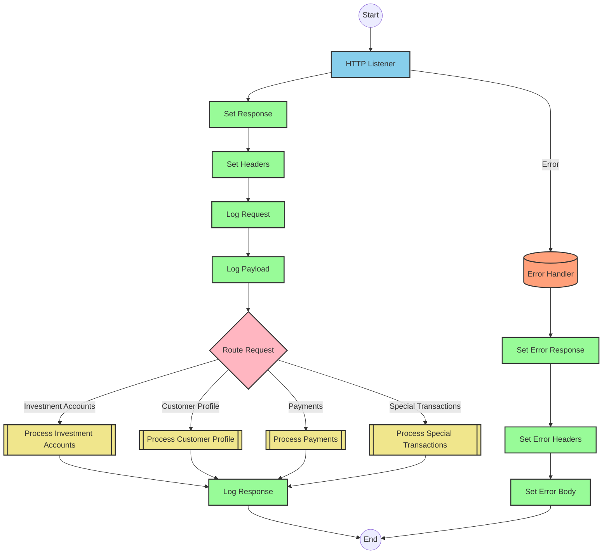
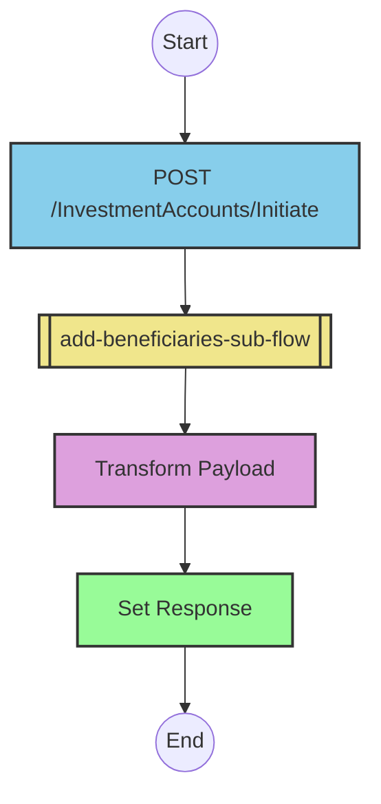
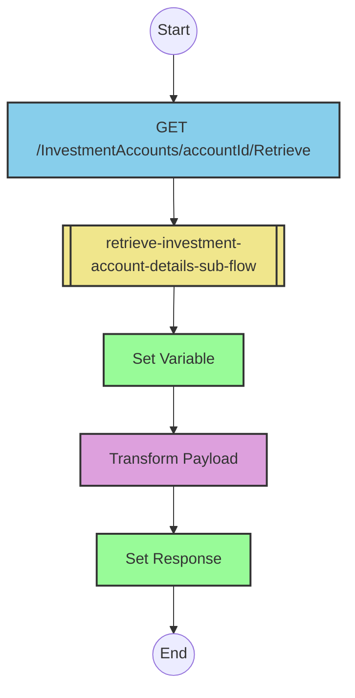
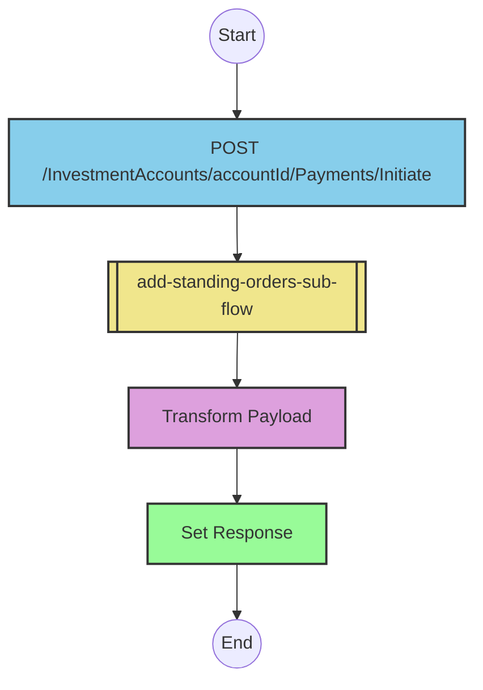
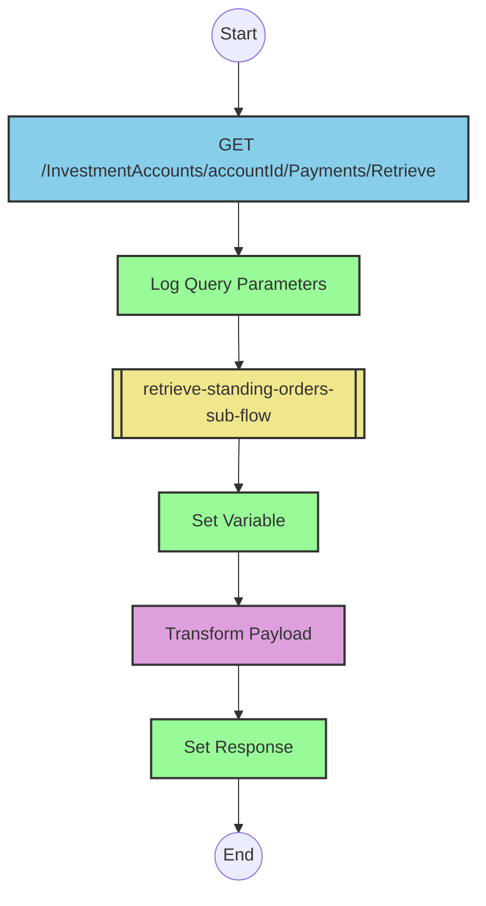
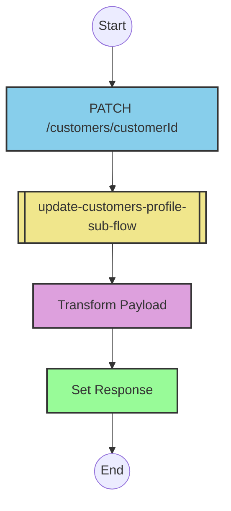
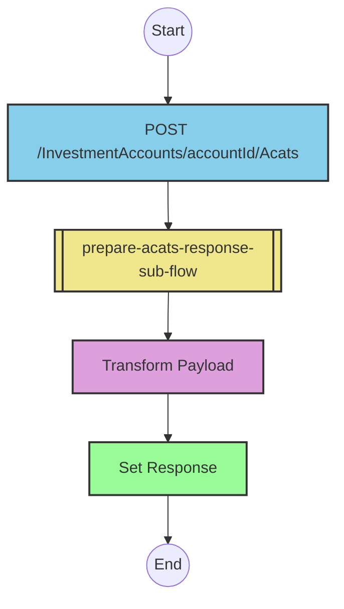
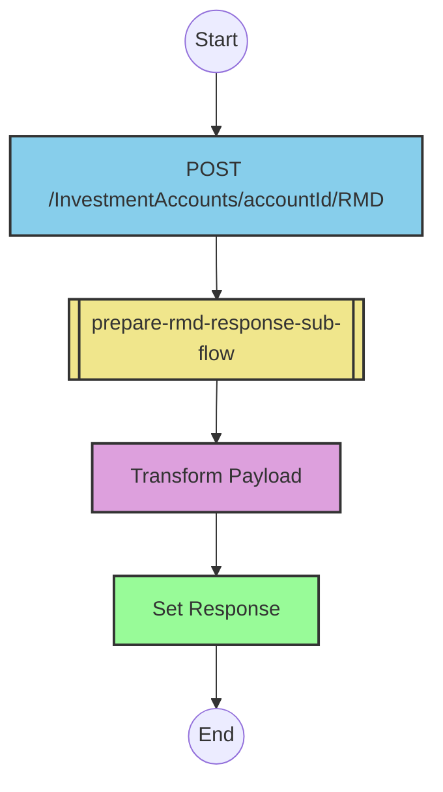

# API Overview
The Financial Services Cloud Wealth Management API provides a comprehensive set of endpoints for managing investment accounts, beneficiaries, standing orders, and customer profiles. It enables financial institutions to handle various wealth management operations including account creation, beneficiary management, payment processing, and account transfers.

- Base URL: `/api/v1`

# Endpoints

## Investment Accounts

### POST /InvestmentAccounts/Initiate
- **Purpose**: Initiates a new investment account with beneficiaries
- **Request Body**: JSON containing investment account and beneficiary details
- **Response**: 201 Created with the created beneficiary details including generated IDs
- **Example Response**:
```json
{
  "InvestmentAccounts": {
    "AccountIds": ["ACC123456"],
    "Beneficiaries": {
      "Primary": [
        {
          "BeneficiaryName": "John Doe",
          "BeneficiaryId": "BFR-1234567",
          "SharePercentage": "50"
        }
      ],
      "Contingent": [
        {
          "BeneficiaryName": "Jane Doe",
          "BeneficiaryId": "BFR-7654321",
          "SharePercentage": "50"
        }
      ]
    }
  }
}
```

### PATCH /InvestmentAccounts/Update
- **Purpose**: Updates existing beneficiaries for investment accounts
- **Request Body**: JSON containing investment account IDs and updated beneficiary details
- **Response**: 200 OK with updated beneficiary details

### DELETE /InvestmentAccounts/Delete
- **Purpose**: Deletes beneficiaries from investment accounts
- **Request Body**: JSON containing account IDs and beneficiary IDs to delete
- **Response**: 200 OK with confirmation of deleted beneficiaries

### GET /InvestmentAccounts/{accountId}/Retrieve
- **Purpose**: Retrieves investment account details including beneficiaries
- **Path Parameters**: `accountId` - The ID of the investment account
- **Response**: 200 OK with account and beneficiary details

## Payments

### POST /InvestmentAccounts/{accountId}/Payments/Initiate
- **Purpose**: Initiates standing orders for an investment account
- **Path Parameters**: `accountId` - The ID of the investment account
- **Request Body**: JSON containing payment details
- **Response**: 201 Created with created payment order details including generated IDs

### PATCH /InvestmentAccounts/{accountId}/Payments/Update
- **Purpose**: Updates or cancels existing standing orders
- **Path Parameters**: `accountId` - The ID of the investment account
- **Request Body**: JSON containing payment IDs to cancel
- **Response**: 200 OK with confirmation of cancellation

### GET /InvestmentAccounts/{accountId}/Payments/Retrieve
- **Purpose**: Retrieves standing orders for an investment account
- **Path Parameters**: `accountId` - The ID of the investment account
- **Query Parameters**: 
  - `paymentId` (optional) - Filter by payment ID
  - `payeeName` (optional) - Filter by payee name
  - `amount` (optional) - Filter by payment amount
- **Response**: 200 OK with matching payment orders

## Customer Profile

### PATCH /customers/{customerId}
- **Purpose**: Updates customer profile information
- **Path Parameters**: `customerId` - The ID of the customer
- **Request Body**: JSON containing updated profile information
- **Response**: 200 OK with updated profile details

## Special Transactions

### POST /InvestmentAccounts/{accountId}/Acats
- **Purpose**: Initiates an ACATS (Automated Customer Account Transfer Service) transaction
- **Path Parameters**: `accountId` - The ID of the investment account
- **Request Body**: JSON containing ACATS transfer details
- **Response**: 200 OK with ACATS transaction details

### POST /InvestmentAccounts/{accountId}/RMD
- **Purpose**: Initiates a Required Minimum Distribution (RMD) transaction
- **Path Parameters**: `accountId` - The ID of the investment account
- **Request Body**: JSON containing RMD details
- **Response**: 200 OK with RMD transaction details

# Current MuleSoft Flow Logic

## Main API Flow
The main flow (`fsc-wealth-management-api-main`) serves as the entry point for all API requests:

1. **Trigger**: HTTP listener configured to receive requests
2. **Processing**:
   - Logs request details including requestId and flowRefId from query parameters
   - Routes requests to appropriate endpoint handlers
   - Sets appropriate response headers
3. **Error Handling**: Implements comprehensive error handling for various HTTP status codes

## Beneficiary Management Flows

### Add Beneficiaries Flow
**Flow**: `post:\InvestmentAccounts\Initiate:application\json:fsc-wealth-management-api-config`

1. **Trigger**: POST request to `/InvestmentAccounts/Initiate`
2. **Processing**: Calls the `add-beneficiaries-sub-flow` subflow
3. **Data Transformation**: Transforms the request payload and generates unique beneficiary IDs
4. **Expected Outcome**: Returns a 201 Created response with the created beneficiaries

The `add-beneficiaries-sub-flow` uses this DataWeave transformation:

```dataweave
%dw 2.0
var bfr= "BFR-"
var bfrTrack= "BFRTRACK"
var bfrNumbers= '0123456789'
var bfrCharSetLength= sizeOf(bfrNumbers) - 1
var bfrNumbersLength= 7
output application/json skipNullOn = "everywhere"
---
{
	InvestmentAccounts: {
		AccountIds: payload.InvestmentAccounts.AccountIds map ( accountId , indexOfAccountId ) -> accountId,
		Beneficiaries: {
			Primary: payload.InvestmentAccounts.Beneficiaries.Primary map ($ ++ {
				BeneficiaryId: bfr ++ (1 to bfrNumbersLength map bfrNumbers[randomInt(bfrCharSetLength)] joinBy '')
			}),
			Contingent: payload.InvestmentAccounts.Beneficiaries.Contingent map ($ ++ {
				BeneficiaryId: bfr ++ (1 to bfrNumbersLength map bfrNumbers[randomInt(bfrCharSetLength)] joinBy '')
			})
		}
	}
}
```

### Update Beneficiaries Flow
**Flow**: `patch:\InvestmentAccounts\Update:application\json:fsc-wealth-management-api-config`

1. **Trigger**: PATCH request to `/InvestmentAccounts/Update`
2. **Processing**: Calls the `update-beneficiaries-sub-flow` subflow
3. **Data Transformation**: Updates beneficiary details and generates IDs for new beneficiaries
4. **Expected Outcome**: Returns a 200 OK response with updated beneficiaries

The `update-beneficiaries-sub-flow` uses a complex DataWeave transformation with a custom tree filtering function:

```dataweave
%dw 2.0
var bfr= "BFR-"
var bfrTrack= "BFRTRACK"
var bfrNumbers= '0123456789'
var bfrCharSetLength= sizeOf(bfrNumbers) - 1
var bfrNumbersLength= 7

fun treeFilter(value: Any, predicate: (value:Any) -> Boolean) =
    value  match {
            case object is Object ->  do {
               object mapObject ((value, key, index) -> 
                    (key): treeFilter(value, predicate)
                )
                filterObject ((value, key, index) -> predicate(value))
            }
            case array is Array -> do {
                    array map ((item, index) -> treeFilter(item, predicate))
                                         filter ((item, index) -> predicate(item))                 
            }
            else -> $
    }
    
output application/json skipNullOn = "everywhere"
---
{
	InvestmentAccounts: {
		AccountIds: payload.InvestmentAccounts.AccountIds map ( accountId , indexOfAccountId ) -> accountId,
		Addresses: payload.InvestmentAccounts.Addresses,
		Beneficiaries: {
			Primary: payload.InvestmentAccounts.Beneficiaries.Primary map if ( $.BeneficiaryId == null ) ($ ++ {
				"BeneficiaryId": bfr ++ (1 to bfrNumbersLength map bfrNumbers[randomInt(bfrCharSetLength)] joinBy '')
			}) else $,
			Contingent: payload.InvestmentAccounts.Beneficiaries.Contingent map if ( $.BeneficiaryId == null ) ($ ++ {
				"BeneficiaryId": bfr ++ (1 to bfrNumbersLength map bfrNumbers[randomInt(bfrCharSetLength)] joinBy '')
			}) else $
		}
	}
} treeFilter ((value) -> 
    value match {
        case v is Array| Object | Null | "" -> !isEmpty(v)
        else -> true
    }
)
```

### Delete Beneficiaries Flow
**Flow**: `delete:\InvestmentAccounts\Delete:application\json:fsc-wealth-management-api-config`

1. **Trigger**: DELETE request to `/InvestmentAccounts/Delete`
2. **Processing**: Calls the `delete-beneficiaries-sub-flow` subflow
3. **Data Transformation**: Marks specified beneficiaries as deleted
4. **Expected Outcome**: Returns a 200 OK response with confirmation

The `delete-beneficiaries-sub-flow` uses this DataWeave transformation:

```dataweave
%dw 2.0
output application/json skipNullOn = "everywhere"
---
{
	InvestmentAccounts: {
		AccountIds: payload.InvestmentAccounts.AccountIds map ( accountId , indexOfAccountId ) -> accountId, 
		Beneficiaries: payload.InvestmentAccounts.Beneficiaries map {
			BeneficiaryId: $.BeneficiaryId,
			Status: "DELETED"
		}
	}
}
```

### Retrieve Investment Account Details Flow
**Flow**: `get:\InvestmentAccounts\(accountId)\Retrieve:fsc-wealth-management-api-config`

1. **Trigger**: GET request to `/InvestmentAccounts/{accountId}/Retrieve`
2. **Processing**: Calls the `retrieve-investment-account-details-sub-flow` subflow
3. **Data Transformation**: Sets account details in a variable and transforms the response
4. **Expected Outcome**: Returns a 200 OK response with account and beneficiary details

The `retrieve-investment-account-details-sub-flow` uses this DataWeave transformation:

```dataweave
%dw 2.0
output application/json
---
{
	LinkedAccount: vars.investmentAccountDetails.LinkedAccount,
	Beneficiaries: vars.investmentAccountDetails.Beneficiaries
}
```

## Payment Management Flows

### Add Standing Orders Flow
**Flow**: `post:\InvestmentAccounts\(accountId)\Payments\Initiate:application\json:fsc-wealth-management-api-config`

1. **Trigger**: POST request to `/InvestmentAccounts/{accountId}/Payments/Initiate`
2. **Processing**: Calls the `add-standing-orders-sub-flow` subflow
3. **Data Transformation**: Generates unique payment IDs and adds creation timestamps
4. **Expected Outcome**: Returns a 201 Created response with the created payment orders

The `add-standing-orders-sub-flow` uses this DataWeave transformation:

```dataweave
%dw 2.0
var sot= "PMT"
var stordTrack= "STORDTRACK"
var sotNumbers= '0123456789'
var sotCharSetLength= sizeOf(sotNumbers) - 1
var sotNumbersLength= 7
output application/json skipNullOn = "everywhere"
---
{
	Payments: payload.Payments map ($ ++ {
		CreationDateTime: now(),
		PaymentId: sot ++ (1 to sotNumbersLength map sotNumbers[randomInt(sotCharSetLength)] joinBy '')
	})
}
```

### Cancel Standing Orders Flow
**Flow**: `patch:\InvestmentAccounts\(accountId)\Payments\Update:application\json:fsc-wealth-management-api-config`

1. **Trigger**: PATCH request to `/InvestmentAccounts/{accountId}/Payments/Update`
2. **Processing**: Calls the `cancel-standing-orders-sub-flow` subflow
3. **Data Transformation**: Adds cancellation timestamp to the response
4. **Expected Outcome**: Returns a 200 OK response with cancellation confirmation

The `cancel-standing-orders-sub-flow` uses this DataWeave transformation:

```dataweave
%dw 2.0
output application/json
---
{
	PaymentIds: payload.PaymentIds,
	CancelDateTime: now()
}
```

### Retrieve Standing Orders Flow
**Flow**: `get:\InvestmentAccounts\(accountId)\Payments\Retrieve:fsc-wealth-management-api-config`

1. **Trigger**: GET request to `/InvestmentAccounts/{accountId}/Payments/Retrieve`
2. **Processing**: 
   - Logs query parameters
   - Calls the `retrieve-standing-orders-sub-flow` subflow
3. **Data Transformation**: Filters payment orders based on query parameters
4. **Expected Outcome**: Returns a 200 OK response with matching payment orders

The `retrieve-standing-orders-sub-flow` uses this DataWeave transformation with complex conditional filtering:

```dataweave
%dw 2.0
output application/json  
---
{
  PaymentOrders: 
    if (attributes.queryParams.paymentId? and attributes.queryParams.payeeName? and attributes.queryParams.amount?)
      vars.paymentOrders filter ($.PaymentId ~= attributes.queryParams.paymentId and $.Payments.PayeeReference.PayeeName ~= attributes.queryParams.payeeName and $.Payments.PaymentDefinition.PaymentAmount.Amount ~= attributes.queryParams.amount)
    else if (attributes.queryParams.paymentId? and attributes.queryParams.payeeName?)
      vars.paymentOrders filter ($.PaymentId ~= attributes.queryParams.paymentId and $.Payments.PayeeReference.PayeeName ~= attributes.queryParams.payeeName)
    else if (attributes.queryParams.paymentId? and attributes.queryParams.amount?)
      vars.paymentOrders filter ($.PaymentId ~= attributes.queryParams.paymentId and $.Payments.PaymentDefinition.PaymentAmount.Amount ~= attributes.queryParams.amount)
    else if (attributes.queryParams.payeeName? and attributes.queryParams.amount?)
      vars.paymentOrders filter ($.Payments.PayeeReference.PayeeName ~= attributes.queryParams.payeeName and $.Payments.PaymentDefinition.PaymentAmount.Amount ~= attributes.queryParams.amount)
    else if (attributes.queryParams.paymentId?)
      vars.paymentOrders filter ($.PaymentId ~= attributes.queryParams.paymentId)
    else if (attributes.queryParams.payeeName?)
      vars.paymentOrders filter ($.Payments.PayeeReference.PayeeName ~= attributes.queryParams.payeeName)
    else if (attributes.queryParams.amount?)
      vars.paymentOrders filter ($.Payments.PaymentDefinition.PaymentAmount.Amount ~= attributes.queryParams.amount)
    else
      vars.paymentOrders
}
```

## Customer Profile Management Flow

### Update Customer Profile Flow
**Flow**: `patch:\customers\(customerId):application\json:fsc-wealth-management-api-config`

1. **Trigger**: PATCH request to `/customers/{customerId}`
2. **Processing**: Calls the `update-customers-profile-sub-flow` subflow
3. **Data Transformation**: Transforms the profile information
4. **Expected Outcome**: Returns a 200 OK response with updated profile details

The `update-customers-profile-sub-flow` uses this DataWeave transformation:

```dataweave
%dw 2.0
var ProfileInformation = payload.ProfileInformation
output application/json skipNullOn="everywhere"
---
{
	ProfileInformation: {
		Addresses: ProfileInformation.Addresses map ( address , indexOfAddress ) -> {
			AddressLine2: address.AddressLine2,
			AddressLine1: address.AddressLine1,
			State: address.State,
			PostalCode: address.PostalCode,
			City: address.City,
			AddressType: address.AddressType,
			Country: address.Country
		},
		Email: ProfileInformation.Email,
		FirstName: ProfileInformation.FirstName,
		Phone: ProfileInformation.Phone,
		LastName: ProfileInformation.LastName,
		Mobile: ProfileInformation.Mobile,
		BirthDate: ProfileInformation.BirthDate,
		MaritalStatus: ProfileInformation.MaritalStatus,
		EmploymentDetails: ProfileInformation.EmploymentDetails
	}
}
```

## Special Transaction Flows

### ACATS Transaction Flow
**Flow**: `post:\InvestmentAccounts\(accountId)\Acats:application\json:fsc-wealth-management-api-config`

1. **Trigger**: POST request to `/InvestmentAccounts/{accountId}/Acats`
2. **Processing**: Calls the `prepare-acats-response-sub-flow` subflow
3. **Data Transformation**: Transforms the ACATS details
4. **Expected Outcome**: Returns a 200 OK response with ACATS transaction details

The `prepare-acats-response-sub-flow` uses this DataWeave transformation:

```dataweave
%dw 2.0
output application/json skipNullOn="everywhere"
---
{
	AcatDetails: {
		TransferType: payload.AcatDetails.TransferType,
		AcatType: payload.AcatDetails.AcatType default null,
		TransferAction: payload.AcatDetails.TransferAction,
		TransferDetails: {
			Securities: payload.AcatDetails.TransferDetails.Securities,
			Cash: payload.AcatDetails.TransferDetails.Cash,
			FundsTransfer: payload.AcatDetails.TransferDetails.FundsTransfer,
			CashTransfer: payload.AcatDetails.TransferDetails.CashTransfer,
			CDTransfer: payload.AcatDetails.TransferDetails.CDTransfer,
			AnnuityTransfer: payload.AcatDetails.TransferDetails.AnnuityTransfer,
			ManagedAccountTransfer: payload.AcatDetails.TransferDetails.ManagedAccountTransfer
		},
		ExternalAccountDetails: {
			AccountNumber: payload.AcatDetails.ExternalAccountDetails.AccountNumber,
			AccountType: payload.AcatDetails.ExternalAccountDetails.AccountType,
			AccountTitle: payload.AcatDetails.ExternalAccountDetails.AccountTitle,
			TransferringFirmDetails: {
				FirmName: payload.AcatDetails.ExternalAccountDetails.TransferringFirmDetails.FirmName,
				Phone: payload.AcatDetails.ExternalAccountDetails.TransferringFirmDetails.Phone,
				Address: payload.AcatDetails.ExternalAccountDetails.TransferringFirmDetails.Address
			}
		}
	}
}
```

### RMD Transaction Flow
**Flow**: `post:\InvestmentAccounts\(accountId)\RMD:application\json:fsc-wealth-management-api-config`

1. **Trigger**: POST request to `/InvestmentAccounts/{accountId}/RMD`
2. **Processing**: Calls the `prepare-rmd-response-sub-flow` subflow
3. **Data Transformation**: Transforms the RMD details
4. **Expected Outcome**: Returns a 200 OK response with RMD transaction details

The `prepare-rmd-response-sub-flow` uses this DataWeave transformation:

```dataweave
%dw 2.0
output application/json skipNullOn="everywhere"
---
{
		PaymentOption: payload.PaymentOption,
		PaymentFrequency: payload.PaymentFrequency,
		DistributionSchedule: payload.DistributionSchedule,
		TaxYear: payload.TaxYear,
		CalculateRMDAmount: payload.CalculateRMDAmount,
		WithdrawlAmount: payload.WithdrawlAmount,
		PaymentInstructions: payload.PaymentInstructions,
		TaxWithholdings: payload.TaxWithholdings
}
```

# DataWeave Transformations Explained

## p-addBeneficiariesResponse.dwl
**Purpose**: Generates unique beneficiary IDs for new beneficiaries and structures the response.

**Input**: JSON payload containing investment account IDs and beneficiary details.

**Output**: JSON with the same structure but with added BeneficiaryId fields.

**Key Operations**:
- Uses variables to define the ID prefix and character set
- Uses `map` to iterate through arrays of beneficiaries
- Uses `randomInt` to generate random numbers for IDs
- Uses `skipNullOn = "everywhere"` to omit null values from the output

```dataweave
%dw 2.0
var bfr= "BFR-"
var bfrTrack= "BFRTRACK"
var bfrNumbers= '0123456789'
var bfrCharSetLength= sizeOf(bfrNumbers) - 1
var bfrNumbersLength= 7
output application/json skipNullOn = "everywhere"
---
{
	InvestmentAccounts: {
		AccountIds: payload.InvestmentAccounts.AccountIds map ( accountId , indexOfAccountId ) -> accountId,
		Beneficiaries: {
			Primary: payload.InvestmentAccounts.Beneficiaries.Primary map ($ ++ {
				BeneficiaryId: bfr ++ (1 to bfrNumbersLength map bfrNumbers[randomInt(bfrCharSetLength)] joinBy '')
			}),
			Contingent: payload.InvestmentAccounts.Beneficiaries.Contingent map ($ ++ {
				BeneficiaryId: bfr ++ (1 to bfrNumbersLength map bfrNumbers[randomInt(bfrCharSetLength)] joinBy '')
			})
		}
	}
}
```

## p-updateBeneficiariesResponse.dwl
**Purpose**: Updates beneficiary details and generates IDs for new beneficiaries, while filtering out empty values.

**Input**: JSON payload containing investment account IDs and beneficiary details.

**Output**: JSON with updated beneficiary details and new IDs for new beneficiaries.

**Key Operations**:
- Defines a custom `treeFilter` function to recursively filter out empty values
- Uses conditional mapping to only generate IDs for beneficiaries without existing IDs
- Uses pattern matching to determine if values are empty

```dataweave
%dw 2.0
var bfr= "BFR-"
var bfrTrack= "BFRTRACK"
var bfrNumbers= '0123456789'
var bfrCharSetLength= sizeOf(bfrNumbers) - 1
var bfrNumbersLength= 7

fun treeFilter(value: Any, predicate: (value:Any) -> Boolean) =
    value  match {
            case object is Object ->  do {
               object mapObject ((value, key, index) -> 
                    (key): treeFilter(value, predicate)
                )
                filterObject ((value, key, index) -> predicate(value))
            }
            case array is Array -> do {
                    array map ((item, index) -> treeFilter(item, predicate))
                                         filter ((item, index) -> predicate(item))                 
            }
            else -> $
    }
    
output application/json skipNullOn = "everywhere"
---
{
	InvestmentAccounts: {
		AccountIds: payload.InvestmentAccounts.AccountIds map ( accountId , indexOfAccountId ) -> accountId,
		Addresses: payload.InvestmentAccounts.Addresses,
		Beneficiaries: {
			Primary: payload.InvestmentAccounts.Beneficiaries.Primary map if ( $.BeneficiaryId == null ) ($ ++ {
				"BeneficiaryId": bfr ++ (1 to bfrNumbersLength map bfrNumbers[randomInt(bfrCharSetLength)] joinBy '')
			}) else $,
			Contingent: payload.InvestmentAccounts.Beneficiaries.Contingent map if ( $.BeneficiaryId == null ) ($ ++ {
				"BeneficiaryId": bfr ++ (1 to bfrNumbersLength map bfrNumbers[randomInt(bfrCharSetLength)] joinBy '')
			}) else $
		}
	}
} treeFilter ((value) -> 
    value match {
        case v is Array| Object | Null | "" -> !isEmpty(v)
        else -> true
    }
)
```

## p-deleteBeneficiariesResponse.dwl
**Purpose**: Transforms the request to mark specified beneficiaries as deleted.

**Input**: JSON payload containing account IDs and beneficiary IDs to delete.

**Output**: JSON with beneficiary IDs and a "DELETED" status.

**Key Operations**:
- Maps through account IDs to maintain the structure
- Maps through beneficiaries to extract IDs and add a status field

```dataweave
%dw 2.0
output application/json skipNullOn = "everywhere"
---
{
	InvestmentAccounts: {
		AccountIds: payload.InvestmentAccounts.AccountIds map ( accountId , indexOfAccountId ) -> accountId, 
		Beneficiaries: payload.InvestmentAccounts.Beneficiaries map {
			BeneficiaryId: $.BeneficiaryId,
			Status: "DELETED"
		}
	}
}
```

## p-getBeneficiariesResponse.dwl
**Purpose**: Retrieves account and beneficiary details from a variable.

**Input**: None (uses variables).

**Output**: JSON with linked account and beneficiary details.

**Key Operations**:
- Accesses the `investmentAccountDetails` variable to get account and beneficiary information

```dataweave
%dw 2.0
output application/json
---
{
	LinkedAccount: vars.investmentAccountDetails.LinkedAccount,
	Beneficiaries: vars.investmentAccountDetails.Beneficiaries
}
```

## p-addPaymentOrdersResponse.dwl
**Purpose**: Generates unique payment IDs and adds creation timestamps to payment orders.

**Input**: JSON payload containing payment details.

**Output**: JSON with payment details, creation timestamps, and unique IDs.

**Key Operations**:
- Uses variables to define the ID prefix and character set
- Uses `map` to iterate through payments
- Uses `now()` to generate current timestamps
- Uses `randomInt` to generate random numbers for IDs

```dataweave
%dw 2.0
var sot= "PMT"
var stordTrack= "STORDTRACK"
var sotNumbers= '0123456789'
var sotCharSetLength= sizeOf(sotNumbers) - 1
var sotNumbersLength= 7
output application/json skipNullOn = "everywhere"
---
{
	Payments: payload.Payments map ($ ++ {
		CreationDateTime: now(),
		PaymentId: sot ++ (1 to sotNumbersLength map sotNumbers[randomInt(sotCharSetLength)] joinBy '')
	})
}
```

## p-cancelPaymentOrdersResponse.dwl
**Purpose**: Adds a cancellation timestamp to the payment cancellation response.

**Input**: JSON payload containing payment IDs to cancel.

**Output**: JSON with payment IDs and a cancellation timestamp.

**Key Operations**:
- Passes through the payment IDs from the input
- Adds a `CancelDateTime` field with the current timestamp

```dataweave
%dw 2.0
output application/json
---
{
	PaymentIds: payload.PaymentIds,
	CancelDateTime: now()
}
```

## p-retrievePaymentOrdersResponse.dwl
**Purpose**: Filters payment orders based on query parameters.

**Input**: None (uses variables and query parameters).

**Output**: JSON with filtered payment orders.

**Key Operations**:
- Uses nested conditional statements to filter payment orders based on combinations of query parameters
- Uses the `~=` operator for approximate matching
- Handles all possible combinations of the three filter parameters (paymentId, payeeName, amount)

```dataweave
%dw 2.0
output application/json  
---
{
  PaymentOrders: 
    if (attributes.queryParams.paymentId? and attributes.queryParams.payeeName? and attributes.queryParams.amount?)
      vars.paymentOrders filter ($.PaymentId ~= attributes.queryParams.paymentId and $.Payments.PayeeReference.PayeeName ~= attributes.queryParams.payeeName and $.Payments.PaymentDefinition.PaymentAmount.Amount ~= attributes.queryParams.amount)
    else if (attributes.queryParams.paymentId? and attributes.queryParams.payeeName?)
      vars.paymentOrders filter ($.PaymentId ~= attributes.queryParams.paymentId and $.Payments.PayeeReference.PayeeName ~= attributes.queryParams.payeeName)
    else if (attributes.queryParams.paymentId? and attributes.queryParams.amount?)
      vars.paymentOrders filter ($.PaymentId ~= attributes.queryParams.paymentId and $.Payments.PaymentDefinition.PaymentAmount.Amount ~= attributes.queryParams.amount)
    else if (attributes.queryParams.payeeName? and attributes.queryParams.amount?)
      vars.paymentOrders filter ($.Payments.PayeeReference.PayeeName ~= attributes.queryParams.payeeName and $.Payments.PaymentDefinition.PaymentAmount.Amount ~= attributes.queryParams.amount)
    else if (attributes.queryParams.paymentId?)
      vars.paymentOrders filter ($.PaymentId ~= attributes.queryParams.paymentId)
    else if (attributes.queryParams.payeeName?)
      vars.paymentOrders filter ($.Payments.PayeeReference.PayeeName ~= attributes.queryParams.payeeName)
    else if (attributes.queryParams.amount?)
      vars.paymentOrders filter ($.Payments.PaymentDefinition.PaymentAmount.Amount ~= attributes.queryParams.amount)
    else
      vars.paymentOrders
}
```

## p-updateProfileResponse.dwl
**Purpose**: Transforms customer profile information for the response.

**Input**: JSON payload containing profile information.

**Output**: JSON with structured profile information.

**Key Operations**:
- Uses a variable to store the profile information for easier access
- Maps through address arrays to maintain the structure
- Uses `skipNullOn="everywhere"` to omit null values from the output

```dataweave
%dw 2.0
var ProfileInformation = payload.ProfileInformation
output application/json skipNullOn="everywhere"
---
{
	ProfileInformation: {
		Addresses: ProfileInformation.Addresses map ( address , indexOfAddress ) -> {
			AddressLine2: address.AddressLine2,
			AddressLine1: address.AddressLine1,
			State: address.State,
			PostalCode: address.PostalCode,
			City: address.City,
			AddressType: address.AddressType,
			Country: address.Country
		},
		Email: ProfileInformation.Email,
		FirstName: ProfileInformation.FirstName,
		Phone: ProfileInformation.Phone,
		LastName: ProfileInformation.LastName,
		Mobile: ProfileInformation.Mobile,
		BirthDate: ProfileInformation.BirthDate,
		MaritalStatus: ProfileInformation.MaritalStatus,
		EmploymentDetails: ProfileInformation.EmploymentDetails
	}
}
```

## p-acatResponse.dwl
**Purpose**: Transforms ACATS transaction details for the response.

**Input**: JSON payload containing ACATS details.

**Output**: JSON with structured ACATS transaction details.

**Key Operations**:
- Maintains the nested structure of the ACATS details
- Uses `default null` to handle missing values
- Uses `skipNullOn="everywhere"` to omit null values from the output

```dataweave
%dw 2.0
output application/json skipNullOn="everywhere"
---
{
	AcatDetails: {
		TransferType: payload.AcatDetails.TransferType,
		AcatType: payload.AcatDetails.AcatType default null,
		TransferAction: payload.AcatDetails.TransferAction,
		TransferDetails: {
			Securities: payload.AcatDetails.TransferDetails.Securities,
			Cash: payload.AcatDetails.TransferDetails.Cash,
			FundsTransfer: payload.AcatDetails.TransferDetails.FundsTransfer,
			CashTransfer: payload.AcatDetails.TransferDetails.CashTransfer,
			CDTransfer: payload.AcatDetails.TransferDetails.CDTransfer,
			AnnuityTransfer: payload.AcatDetails.TransferDetails.AnnuityTransfer,
			ManagedAccountTransfer: payload.AcatDetails.TransferDetails.ManagedAccountTransfer
		},
		ExternalAccountDetails: {
			AccountNumber: payload.AcatDetails.ExternalAccountDetails.AccountNumber,
			AccountType: payload.AcatDetails.ExternalAccountDetails.AccountType,
			AccountTitle: payload.AcatDetails.ExternalAccountDetails.AccountTitle,
			TransferringFirmDetails: {
				FirmName: payload.AcatDetails.ExternalAccountDetails.TransferringFirmDetails.FirmName,
				Phone: payload.AcatDetails.ExternalAccountDetails.TransferringFirmDetails.Phone,
				Address: payload.AcatDetails.ExternalAccountDetails.TransferringFirmDetails.Address
			}
		}
	}
}
```

## p-rmdResponse.dwl
**Purpose**: Transforms RMD transaction details for the response.

**Input**: JSON payload containing RMD details.

**Output**: JSON with structured RMD transaction details.

**Key Operations**:
- Passes through RMD details from the input
- Uses `skipNullOn="everywhere"` to omit null values from the output

```dataweave
%dw 2.0
output application/json skipNullOn="everywhere"
---
{
		PaymentOption: payload.PaymentOption,
		PaymentFrequency: payload.PaymentFrequency,
		DistributionSchedule: payload.DistributionSchedule,
		TaxYear: payload.TaxYear,
		CalculateRMDAmount: payload.CalculateRMDAmount,
		WithdrawlAmount: payload.WithdrawlAmount,
		PaymentInstructions: payload.PaymentInstructions,
		TaxWithholdings: payload.TaxWithholdings
}
```

# SAP Integration Suite Implementation

## Component Mapping

| MuleSoft Component | SAP Integration Suite Equivalent | Notes |
|--------------------|----------------------------------|-------|
| listener | HTTPS Adapter | Configure with the same endpoint paths and methods |
| router | Router | Maps to Content Modifier with routing logic |
| flow-ref | Process Call | Used to call subflows |
| set-variable | Content Modifier | Used to set variables |
| transform | Message Mapping | Maps to the SAP Integration Suite mapping component |
| set-payload | Content Modifier | Used to set the message payload |
| logger | Write Message to Log | Configure with the same log messages |
| error-handler | Exception Subprocess | Maps to exception handling in SAP Integration Suite |
| headers | Content Modifier | Used to set HTTP headers |
| response | Content Modifier | Used to prepare the HTTP response |

## Integration Flow Visualization

### Flow 1: Main API Flow



### Flow 2: Add Beneficiaries Flow



### Flow 3: Update Beneficiaries Flow


### Flow 4: Delete Beneficiaries Flow


### Flow 5: Retrieve Investment Account Details Flow



### Flow 6: Add Standing Orders Flow



### Flow 7: Cancel Standing Orders Flow


### Flow 8: Retrieve Standing Orders Flow



### Flow 9: Update Customer Profile Flow



### Flow 10: ACATS Transaction Flow



### Flow 11: RMD Transaction Flow



## Configuration Details

### HTTP Adapter Configuration
- **Endpoint**: `/api/v1`
- **HTTPS**: Enabled
- **Authentication**: Basic Authentication (configuration decision)
- **CSRF Protection**: Disabled
- **Timeout**: 30 seconds (default)

### Content Modifier Configuration
- **Variable Setting**: Use Content Modifier to set variables like `investmentAccountDetails` and `paymentOrders`
- **Header Setting**: Use Content Modifier to set HTTP headers
- **Response Preparation**: Use Content Modifier to prepare HTTP responses

### Message Mapping Configuration
- **Mapping Language**: Groovy or XSLT (equivalent to DataWeave)
- **Input Format**: JSON
- **Output Format**: JSON
- **Null Handling**: Skip null values (equivalent to `skipNullOn="everywhere"`)

### Router Configuration
- **Routing Condition**: Based on the request path and method
- **Default Route**: Error route for unmatched requests

### Exception Subprocess Configuration
- **Error Types**: Map MuleSoft error types to SAP Integration Suite error types
- **Error Handling**: Use Content Modifier to prepare error responses
- **Error Logging**: Use Write Message to Log for error logging

# Configuration

## Important Configuration Parameters
- **API Definition**: Based on RAML definition `fsc-wealth-management-api.raml`
- **HTTP Listener Configuration**: `fsc-wealth-management-api-httpListenerConfig`
- **API Configuration**: `fsc-wealth-management-api-config`
- **Outbound Headers Map Name**: `outboundHeaders`
- **HTTP Status Variable Name**: `httpStatus`

## Environment Variables
- **TLS Configuration**:
  - `keySecret`: `integration@keystore`
  - `keyStoreSecret`: `integration@keystore`

## Dependencies on External Systems
No explicit external system dependencies are mentioned in the source documentation. The application appears to be self-contained, using mock data for responses.

## Security Settings
- **TLS**: Configured with keystore secrets
- **Authentication**: Not explicitly defined in the source documentation (configuration decision)
- **Authorization**: Not explicitly defined in the source documentation (configuration decision)