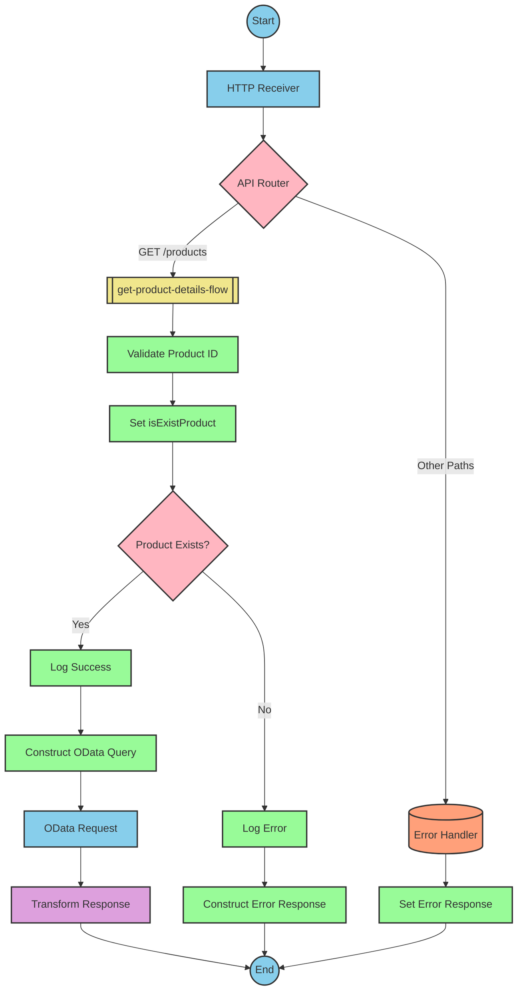

# SAP Integration Suite Documentation for Product API

# Table of Contents
- [API Overview](#api-overview)
- [Endpoints](#endpoints)
  - [GET /products](#get-products)
- [Current MuleSoft Flow Logic](#current-mulesoft-flow-logic)
  - [products-main Flow](#products-main-flow)
  - [products-console Flow](#products-console-flow)
  - [get:\products:products-config Flow](#getproductsproducts-config-flow)
  - [get-product-details-flow Subflow](#get-product-details-flow-subflow)
- [DataWeave Transformations Explained](#dataweave-transformations-explained)
  - [Product Identifier Validation](#product-identifier-validation)
  - [OData Query Parameters](#odata-query-parameters)
  - [Response Payload Transformation](#response-payload-transformation)
  - [Error Response Transformation](#error-response-transformation)
- [SAP Integration Suite Implementation](#sap-integration-suite-implementation)
  - [Component Mapping](#component-mapping)
  - [Integration Flow Visualization](#integration-flow-visualization)
- [Configuration Details](#configuration-details)
  - [HTTP Adapter Configuration](#http-adapter-configuration)
  - [OData Adapter Configuration](#odata-adapter-configuration)
  - [Content Modifier Configuration](#content-modifier-configuration)
  - [Router Configuration](#router-configuration)
- [Configuration](#configuration)
  - [Environment Variables](#environment-variables)
  - [External Dependencies](#external-dependencies)

# API Overview

This API provides access to product information from an SAP HANA backend system. It allows clients to retrieve detailed product information by specifying a product identifier. The API validates the product identifier against a configured list of valid identifiers before retrieving the data from the backend system.

Base URL: `http://localhost:8081/api/v1`

# Endpoints

## GET /products

This endpoint retrieves product details based on the provided product identifier.

**Request Parameters:**
- Query Parameters:
  - `productIdentifier` (required): The unique identifier of the product to retrieve

**Response Format:**
- Content-Type: `application/json`
- Status Codes:
  - 200: Successful response with product details
  - 400: Bad request (invalid input)
  - 404: Product not found
  - 500: Server error

**Example Request:**
```
GET /api/v1/products?productIdentifier=HT-2000
```

**Example Response (200):**
```json
{
  "ProductId": "HT-2000",
  "Category": "Notebooks",
  "CategoryName": "Notebooks",
  "CurrencyCode": "USD",
  "DimensionDepth": 30,
  "DimensionHeight": 3,
  "DimensionUnit": "cm",
  "DimensionWidth": 40,
  "LongDescription": "Notebook Basic 17 with 2,80 GHz quad core, 17\" LCD, 4 GB DDR3 RAM, 500 GB Hard Disc, Windows 8 Pro",
  "Name": "Notebook Basic 17",
  "PictureUrl": "/sap/public/bc/NWDEMO_MODEL/IMAGES/HT-2000.jpg",
  "Price": 1249,
  "QuantityUnit": "EA",
  "ShortDescription": "Notebook Basic 17 with 2,80 GHz quad core, 17\" LCD, 4 GB DDR3 RAM, 500 GB Hard Disc, Windows 8 Pro",
  "SupplierId": "0100000046",
  "Weight": 4.5,
  "WeightUnit": "KG"
}
```

**Example Error Response (404):**
```json
{
  "status": "error",
  "message": "The product identifier HT-3000 was not found.",
  "errorCode": "PRODUCT_NOT_FOUND"
}
```

# Current MuleSoft Flow Logic

## products-main Flow

This is the main entry point for the API. It handles HTTP requests and routes them to the appropriate flow based on the endpoint path.

1. **Trigger**: HTTP listener configured to listen on `/api/v1/*`
2. **Processing Steps**:
   - Sets response headers
   - Routes the request based on the API endpoint
   - Handles errors and formats error responses

## products-console Flow

This flow is used for logging and debugging purposes. It logs the request and response details to the console.

1. **Trigger**: HTTP listener
2. **Processing Steps**:
   - Sets response headers
   - Logs request and response details to the console
   - Handles errors and formats error responses

## get:\products:products-config Flow

This flow handles the GET /products endpoint.

1. **Trigger**: HTTP GET request to `/products`
2. **Processing Steps**:
   - Calls the `get-product-details-flow` subflow to process the request

## get-product-details-flow Subflow

This subflow handles the business logic for retrieving product details.

1. **Trigger**: Called from the `get:\products:products-config` flow
2. **Processing Steps**:
   - Validates the product identifier against a configured list of valid identifiers
   - If valid, constructs an OData query to retrieve product details from the backend
   - If invalid, returns an error response
3. **Data Transformations**:
   - Transforms the product identifier validation result
   - Constructs OData query parameters
   - Transforms the backend response to the API response format
   - Constructs error responses when needed
4. **Expected Outcomes**:
   - Success: Returns product details in JSON format
   - Error: Returns an error response with appropriate message and code

The flow includes the following key technical components:

1. **Product Identifier Validation**:
```dw
%dw 2.0
output application/java
var productidentifer=p('odata.productIdentifiers') splitBy(",")
---
sizeOf(productidentifer filter ($ == attributes.queryParams.productIdentifier))>0
```

2. **OData Query Parameters**:
```
#[output application/java
---
{
	"$filter" : "ProductId eq '" ++ (attributes.queryParams.productIdentifier default '') ++ "'",
	"$select" : "ProductId,Category,CategoryName,CurrencyCode,DimensionDepth,DimensionHeight,DimensionUnit,DimensionWidth,LongDescription,Name,PictureUrl,Price,QuantityUnit,ShortDescription,SupplierId,Weight,WeightUnit"
}]
```

3. **Response Transformation**:
```dw
%dw 2.0
output application/json
---
payload
```

4. **Error Response Transformation**:
```dw
%dw 2.0
output application/json
---
{
	status: "error",
	message: "The product identifier " ++ attributes.queryParams.productIdentifier ++ " was not found.",
	errorCode: "PRODUCT_NOT_FOUND"
}
```

# DataWeave Transformations Explained

## Product Identifier Validation

This transformation validates if the provided product identifier is in the list of configured valid identifiers.

**Input**: The product identifier from the query parameter
**Output**: A boolean value indicating if the product identifier is valid

**Logic**:
1. Retrieves the configured list of valid product identifiers from the property `odata.productIdentifiers`
2. Splits the comma-separated list into an array
3. Filters the array to find matches with the provided product identifier
4. Returns true if at least one match is found, false otherwise

```dw
%dw 2.0
output application/java
var productidentifer=p('odata.productIdentifiers') splitBy(",")
---
sizeOf(productidentifer filter ($ == attributes.queryParams.productIdentifier))>0
```

## OData Query Parameters

This transformation constructs the OData query parameters for retrieving product details from the backend.

**Input**: The product identifier from the query parameter
**Output**: A map of OData query parameters

**Logic**:
1. Constructs a `$filter` parameter to filter products by the provided product identifier
2. Constructs a `$select` parameter to specify which fields to retrieve

```
#[output application/java
---
{
	"$filter" : "ProductId eq '" ++ (attributes.queryParams.productIdentifier default '') ++ "'",
	"$select" : "ProductId,Category,CategoryName,CurrencyCode,DimensionDepth,DimensionHeight,DimensionUnit,DimensionWidth,LongDescription,Name,PictureUrl,Price,QuantityUnit,ShortDescription,SupplierId,Weight,WeightUnit"
}]
```

## Response Payload Transformation

This transformation passes through the backend response without modification.

**Input**: The backend response payload
**Output**: The same payload in JSON format

```dw
%dw 2.0
output application/json
---
payload
```

## Error Response Transformation

This transformation constructs an error response when the product identifier is invalid or not found.

**Input**: The product identifier from the query parameter
**Output**: A JSON error response with status, message, and error code

**Logic**:
1. Constructs a JSON object with error details
2. Includes the product identifier in the error message

```dw
%dw 2.0
output application/json
---
{
	status: "error",
	message: "The product identifier " ++ attributes.queryParams.productIdentifier ++ " was not found.",
	errorCode: "PRODUCT_NOT_FOUND"
}
```

# SAP Integration Suite Implementation

## Component Mapping

| MuleSoft Component | SAP Integration Suite Component | Notes |
|--------------------|--------------------------------|-------|
| HTTP Listener | HTTP Adapter (Receiver) | Configured to listen on `/api/v1/*` |
| Router | Router | Routes requests based on endpoint path |
| Flow Reference | Process Call | Calls subflows |
| Transform Message | Content Modifier | Transforms data |
| Logger | Content Modifier with Write to Log option | Logs messages |
| HTTP Request | OData Adapter (Sender) | Makes OData requests to backend |
| Choice | Router | Implements conditional logic |
| Set Variable | Content Modifier | Sets variables |
| Set Payload | Content Modifier | Sets response payload |
| Error Handler | Exception Subprocess | Handles errors |

## Integration Flow Visualization

### REST API Integration Flow: GET /products



# Configuration Details

## HTTP Adapter Configuration

### HTTP Receiver Adapter
- **Adapter Type**: HTTP
- **Direction**: Receiver
- **Path**: `/api/v1/*`
- **Port**: `${api.listener.port}` (default: 8081)
- **Authentication**: None (based on source documentation)

## OData Adapter Configuration

### OData Sender Adapter
- **Adapter Type**: OData
- **Direction**: Sender
- **URL**: `https://${hana.espm.url}:${hana.espm.port}${hana.espm.path}`
- **Authentication**: None (based on source documentation)
- **Query Parameters**:
  - **$filter**: `ProductId eq '${attributes.queryParams.productIdentifier}'`
  - **$select**: `ProductId,Category,CategoryName,CurrencyCode,DimensionDepth,DimensionHeight,DimensionUnit,DimensionWidth,LongDescription,Name,PictureUrl,Price,QuantityUnit,ShortDescription,SupplierId,Weight,WeightUnit`

## Content Modifier Configuration

### Validate Product ID
- **Type**: Content Modifier
- **Action**: Create variable
- **Variable Name**: isExistProduct
- **Value Type**: Expression
- **Value**:
  ```
  ${property.odata.productIdentifiers}.split(",").filter(item => item === ${attributes.queryParams.productIdentifier}).length > 0
  ```

### Log Success
- **Type**: Content Modifier
- **Action**: Write to Log
- **Log Level**: Info
- **Message**: `The request is processed and sent downstream with the product identifier (${attributes.queryParams.productIdentifier}).`

### Log Error
- **Type**: Content Modifier
- **Action**: Write to Log
- **Log Level**: Info
- **Message**: `The product identifier (${attributes.queryParams.productIdentifier}) was not passed in the request or was passed incorrectly.`

### Construct Error Response
- **Type**: Content Modifier
- **Action**: Create body
- **Content Type**: application/json
- **Body**:
  ```json
  {
    "status": "error",
    "message": "The product identifier ${attributes.queryParams.productIdentifier} was not found.",
    "errorCode": "PRODUCT_NOT_FOUND"
  }
  ```

## Router Configuration

### API Router
- **Type**: Router
- **Condition 1**: `${header.http.requesturi} contains '/products'`
- **Condition 2**: Default (for error handling)

### Product Router
- **Type**: Router
- **Condition 1**: `${property.isExistProduct} === true`
- **Condition 2**: Default (for error handling)

# Configuration

## Environment Variables

The following environment variables are used in the integration:

```yaml
api:
  listener:
    port: "8081"
    path: /api/v1/*
    
hana:
  espm:
    url: refapp-espm-ui-cf.cfapps.eu10.hana.ondemand.com
    port: "443"
    path: /espm-cloud-web/espm.svc/Products
    
odata:
  productIdentifiers: "HT-2000,HT-2001"
```

## External Dependencies

The integration depends on the following external systems:

1. **SAP HANA ESPM Service**
   - **URL**: refapp-espm-ui-cf.cfapps.eu10.hana.ondemand.com
   - **Port**: 443
   - **Path**: /espm-cloud-web/espm.svc/Products
   - **Protocol**: HTTPS
   - **Authentication**: None specified in source documentation

The integration uses OData protocol to communicate with the backend system, specifically using the $filter and $select query parameters to retrieve product information.