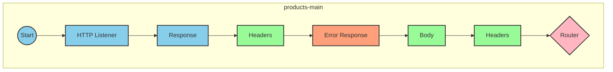
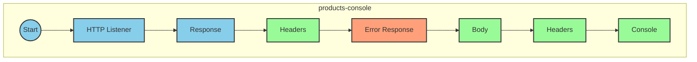
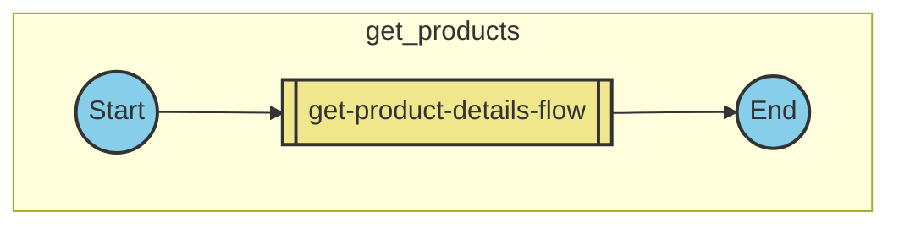

# API Overview
- This API provides product details from an SAP HANA database
- Base URL pattern: `/products`

# Endpoints

## GET /products
- **Purpose**: Retrieves product details based on a product identifier
- **Query Parameters**:
  - `productIdentifier` (required): The unique identifier of the product
- **Response Format**: JSON
- **Response Status Codes**:
  - 200: Success
  - 400: Bad Request
  - 404: Product Not Found
- **Response Body**: Product details including ProductId, Category, CategoryName, CurrencyCode, dimensions, descriptions, price, and other product attributes

# Current MuleSoft Flow Logic

## Flow: products-main
This is the main entry point for the API, triggered by an HTTP listener. It handles routing to the appropriate endpoints based on the API specification defined in products.raml.

## Flow: products-console
This flow is triggered by an HTTP listener and logs information to the console. It appears to be a monitoring or debugging flow.

## Flow: get:\products:products-config
This flow is triggered when a GET request is made to the `/products` endpoint. It references the `get-product-details-flow` subflow to handle the request.

## Subflow: get-product-details-flow
1. **Triggered by**: Reference from the `get:\products:products-config` flow
2. **Main processing steps**:
   - Validates if the provided product identifier is in the allowed list
   - Logs the request details
   - Makes an OData request to retrieve product details
   - Transforms the response to JSON format
3. **Data transformations**:
   - Validates product identifier against a configured list
   - Constructs OData query parameters
   - Transforms the response payload to JSON
4. **Error handling**:
   - Returns a custom error message if the product identifier is invalid or not found

### Key Technical Details:
- **Product Validation**: Checks if the product identifier is in a configured list
- **OData Query Parameters**:
  - `$filter`: `ProductId eq '" ++ (attributes.queryParams.productIdentifier default '') ++ "'`
  - `$select`: `ProductId,Category,CategoryName,CurrencyCode,DimensionDepth,DimensionHeight,DimensionUnit,DimensionWidth,LongDescription,Name,PictureUrl,Price,QuantityUnit,ShortDescription,SupplierId,Weight,WeightUnit`

# DataWeave Transformations Explained

## Product Identifier Validation Transformation
This transformation checks if the provided product identifier is in the allowed list of product identifiers.

```dw
%dw 2.0
output application/java
var productidentifer=p('odata.productIdentifiers') splitBy(",")
---
sizeOf(productidentifer filter ($ == attributes.queryParams.productIdentifier))>0
```

- **Input**: The product identifier from query parameters
- **Output**: Boolean value (true/false)
- **Logic**: 
  1. Retrieves the allowed product identifiers from a property and splits them by comma
  2. Filters the list to find matches with the provided product identifier
  3. Checks if the size of the filtered list is greater than 0 (meaning a match was found)

## OData Query Parameters Transformation
This transformation constructs the OData query parameters for the HTTP request.

```dw
#[output application/java
---
{
	"$filter" : "ProductId eq '" ++ (attributes.queryParams.productIdentifier default '') ++ "'",
	"$select" : "ProductId,Category,CategoryName,CurrencyCode,DimensionDepth,DimensionHeight,DimensionUnit,DimensionWidth,LongDescription,Name,PictureUrl,Price,QuantityUnit,ShortDescription,SupplierId,Weight,WeightUnit"
}]
```

- **Input**: The product identifier from query parameters
- **Output**: A Java map containing OData query parameters
- **Logic**:
  1. Constructs a $filter parameter that filters products by the provided product identifier
  2. Specifies the fields to be returned using the $select parameter

## Response Payload Transformation (Success)
This transformation passes through the payload from the HTTP request.

```dw
%dw 2.0
output application/json
---
payload
```

- **Input**: The response from the OData request
- **Output**: JSON representation of the same payload
- **Logic**: Simple pass-through transformation that converts the payload to JSON format

## Error Response Transformation
This transformation creates a custom error message when the product identifier is invalid.

```dw
%dw 2.0
output application/json
---
{
	status: "error",
	message: "The product identifier " ++ attributes.queryParams.productIdentifier ++ " was not found.",
	errorCode: "PRODUCT_NOT_FOUND"
}
```

- **Input**: The product identifier from query parameters
- **Output**: JSON error object
- **Logic**: Constructs an error object with status, message, and error code

# SAP Integration Suite Implementation

## Component Mapping

| MuleSoft Component | SAP Integration Suite Equivalent |
|--------------------|----------------------------------|
| HTTP Listener | HTTP Adapter (Receiver) |
| Flow Reference | Process Call |
| Transform Message | Content Modifier / Mapping |
| Logger | Write to Log |
| HTTP Request | OData Adapter (Sender) |
| Choice Router | Router |
| Set Variable | Content Modifier |
| Error Handler | Exception Subprocess |

## Integration Flow Visualization

```mermaid
flowchart TD
%% Define node styles
classDef httpAdapter fill:#87CEEB,stroke:#333,stroke-width:2px
classDef contentModifier fill:#98FB98,stroke:#333,stroke-width:2px
classDef router fill:#FFB6C1,stroke:#333,stroke-width:2px
classDef mapping fill:#DDA0DD,stroke:#333,stroke-width:2px
classDef exception fill:#FFA07A,stroke:#333,stroke-width:2px
classDef processCall fill:#F0E68C,stroke:#333,stroke-width:2px

%% Subflow: get-product-details-flow
subgraph get_product_details_flow
    start4((Start)):::processCall --> transform1[Transform]:::mapping
    transform1 -->|Set isExistProduct| message1[Message]:::contentModifier
    message1 --> variables[Variables]:::contentModifier
    variables --> setVariable[Set Variable]:::contentModifier
    setVariable --> choice{Choice}:::router
    
    choice -->|isExistProduct = true| when[When]:::router
    when --> logger1[Logger]:::contentModifier
    logger1 --> request[HTTP Request]:::httpAdapter
    request --> queryParams[Query Params]:::contentModifier
    queryParams --> transform2[Transform]:::mapping
    transform2 --> message2[Message]:::contentModifier
    message2 --> setPayload1[Set Payload]:::contentModifier
    
    choice -->|isExistProduct = false| otherwise[Otherwise]:::router
    otherwise --> logger2[Logger]:::contentModifier
    logger2 --> transform3[Transform]:::mapping
    transform3 --> message3[Message]:::contentModifier
    message3 --> setPayload2[Set Payload]:::contentModifier
    
    setPayload1 --> end4((End)):::processCall
    setPayload2 --> end4
end
```









## Configuration Details

### HTTP Listener Configuration
- **Component**: HTTP Listener
- **Configuration**: HTTP_Listener_config
- **Path**: /products
- **Method**: GET

### HTTP Request Configuration
- **Component**: HTTP Request
- **Configuration**: Hana_HTTP_Request_Configuration
- **Method**: GET
- **Query Parameters**:
  - $filter: ProductId eq '{productIdentifier}'
  - $select: ProductId,Category,CategoryName,CurrencyCode,DimensionDepth,DimensionHeight,DimensionUnit,DimensionWidth,LongDescription,Name,PictureUrl,Price,QuantityUnit,ShortDescription,SupplierId,Weight,WeightUnit

### Router Configuration
- **Component**: Choice Router
- **Condition**: vars.isExistProduct
- **When True**: Process product retrieval flow
- **Otherwise**: Return error message

### Content Modifier (Transform) Configurations
1. **Product Identifier Validation**:
   - Input: Query parameters
   - Output: Boolean value
   - Expression: See DataWeave transformation above

2. **Response Transformation**:
   - Input: HTTP response payload
   - Output: JSON payload
   - Expression: See DataWeave transformation above

3. **Error Response**:
   - Input: Query parameters
   - Output: JSON error object
   - Expression: See DataWeave transformation above

# Configuration

## Important Configuration Parameters
- **odata.productIdentifiers**: Comma-separated list of valid product identifiers

## Error Handling
The application implements a global error handler (Gobal_Error_Handler) that handles various APIKIT errors:
- APIKIT:BAD_REQUEST
- APIKIT:NOT_FOUND
- APIKIT:METHOD_NOT_ALLOWED
- APIKIT:NOT_ACCEPTABLE
- APIKIT:UNSUPPORTED_MEDIA_TYPE
- APIKIT:NOT_IMPLEMENTED

Each error is handled using on-error-propagate strategy.

## SAP Integration Suite Specific Considerations
- The OData adapter in SAP Integration Suite should be configured to connect to the same backend system as the MuleSoft HTTP Request
- The same query parameters ($filter, $select) should be maintained in the SAP implementation
- Error handling should be implemented using Exception Subprocesses to match the MuleSoft error handling strategy
- Content modifiers should be used to implement the same variable setting and payload transformations