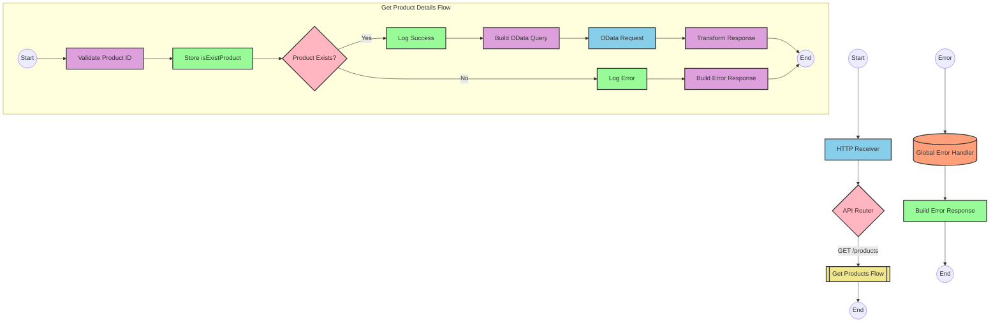

# SAP Product Information API Integration

## Table of Contents
- [API Overview](#api-overview)
- [Endpoints](#endpoints)
  - [GET /products](#get-products)
- [Current MuleSoft Flow Logic](#current-mulesoft-flow-logic)
  - [products-main Flow](#products-main-flow)
  - [products-console Flow](#products-console-flow)
  - [get:\products:products-config Flow](#getproductsproducts-config-flow)
  - [get-product-details-flow Subflow](#get-product-details-flow-subflow)
- [DataWeave Transformations Explained](#dataweave-transformations-explained)
  - [Product Identifier Validation](#product-identifier-validation)
  - [OData Query Parameters Construction](#odata-query-parameters-construction)
  - [Response Payload Transformation](#response-payload-transformation)
  - [Error Response Transformation](#error-response-transformation)
- [SAP Integration Suite Implementation](#sap-integration-suite-implementation)
  - [Component Mapping](#component-mapping)
  - [Integration Flow Visualization](#integration-flow-visualization)
  - [Configuration Details](#configuration-details)
- [Environment Configuration](#environment-configuration)
- [API Reference](#api-reference)

## API Overview
This API provides product information by retrieving product details from an SAP HANA database using OData queries. The API allows clients to request specific product information by providing a product identifier as a query parameter. The integration validates the product identifier against a configured list of valid identifiers before processing the request.

- **Base URL**: Determined by the HTTP_Listener_config
- **Authentication**: Not explicitly defined in the source documentation
- **Rate Limiting**: Not specified in the source documentation
- **General Response Format**: JSON

The API serves as a facade to simplify access to product data stored in SAP HANA, providing a RESTful interface that abstracts the underlying OData queries and data transformations.

## Endpoints

### GET /products
Retrieves detailed information about a specific product.

- **HTTP Method**: GET
- **Path**: /products
- **Purpose**: Fetch product details based on a product identifier

**Request Parameters**:
- **Query Parameters**:
  - `productIdentifier` (required): The unique identifier of the product to retrieve

**Response Format**:
- **Success Response (200 OK)**:
  - Content-Type: application/json
  - Body: JSON object containing product details including ProductId, Category, CategoryName, CurrencyCode, dimensions, descriptions, price, and other product attributes

- **Error Response (400 Bad Request)**:
  - Content-Type: application/json
  - Body: JSON object with status, message, and errorCode fields
  ```json
  {
    "status": "error",
    "message": "The product identifier {productIdentifier} was not found.",
    "errorCode": "PRODUCT_NOT_FOUND"
  }
  ```

**Example Request**:
```
GET /products?productIdentifier=HT-1000
```

**Error Handling**:
- If the product identifier is not provided or is invalid, the API returns a 400 Bad Request response with a PRODUCT_NOT_FOUND error code
- The API also handles APIKIT errors such as BAD_REQUEST, NOT_FOUND, METHOD_NOT_ALLOWED, NOT_ACCEPTABLE, UNSUPPORTED_MEDIA_TYPE, and NOT_IMPLEMENTED

## Current MuleSoft Flow Logic

### products-main Flow
1. **Trigger**: HTTP listener configured to receive incoming API requests
2. **Processing**:
   - Sets response headers
   - Routes the request to the appropriate handler based on the API specification
   - Handles errors using the Global_Error_Handler

### products-console Flow
1. **Trigger**: HTTP listener configured to receive incoming API requests
2. **Processing**:
   - Sets response headers
   - Logs request details to the console
   - Handles errors using the Global_Error_Handler

### get:\products:products-config Flow
1. **Trigger**: API request matching the GET /products endpoint pattern
2. **Processing**:
   - Calls the get-product-details-flow subflow to process the request

### get-product-details-flow Subflow
1. **Validation**:
   - Validates if the provided productIdentifier exists in the configured list of valid product identifiers
   - Sets a variable `isExistProduct` based on the validation result

2. **Conditional Processing**:
   - If `isExistProduct` is true:
     - Logs that the request is being processed
     - Constructs OData query parameters for filtering and selecting product fields
     - Makes an HTTP request to the SAP HANA system with the constructed query parameters
     - Transforms the response payload to JSON format
   - If `isExistProduct` is false:
     - Logs that the product identifier was not found or was passed incorrectly
     - Creates an error response with status "error", appropriate message, and error code "PRODUCT_NOT_FOUND"

3. **Technical Details**:
   - OData query parameters:
     - `$filter`: `ProductId eq '" ++ (attributes.queryParams.productIdentifier default '') ++ "'`
     - `$select`: `ProductId,Category,CategoryName,CurrencyCode,DimensionDepth,DimensionHeight,DimensionUnit,DimensionWidth,LongDescription,Name,PictureUrl,Price,QuantityUnit,ShortDescription,SupplierId,Weight,WeightUnit`

## DataWeave Transformations Explained

### Product Identifier Validation
This transformation checks if the provided product identifier exists in a configured list of valid product identifiers.

**Input**: Product identifier from query parameters
**Output**: Boolean value indicating if the product identifier is valid

```dw
%dw 2.0
output application/java
var productidentifer=p('odata.productIdentifiers') splitBy(",")
---
sizeOf(productidentifer filter ($ == attributes.queryParams.productIdentifier))>0
```

**Explanation**:
1. Retrieves a comma-separated list of valid product identifiers from a property `odata.productIdentifiers`
2. Splits the list into an array using the `splitBy` function
3. Filters the array to find elements matching the provided product identifier
4. Checks if the size of the filtered array is greater than 0, returning true if a match is found

### OData Query Parameters Construction
This transformation constructs the OData query parameters for filtering products by ID and selecting specific fields.

**Input**: Product identifier from query parameters
**Output**: OData query parameters as a Java map

```dw
#[output application/java
---
{
	"$filter" : "ProductId eq '" ++ (attributes.queryParams.productIdentifier default '') ++ "'",
	"$select" : "ProductId,Category,CategoryName,CurrencyCode,DimensionDepth,DimensionHeight,DimensionUnit,DimensionWidth,LongDescription,Name,PictureUrl,Price,QuantityUnit,ShortDescription,SupplierId,Weight,WeightUnit"
}]
```

**Explanation**:
1. Creates a Java map with two OData query parameters:
   - `$filter`: Constructs a filter expression that matches products with the specified ProductId
   - `$select`: Specifies the fields to include in the response
2. Uses string concatenation (`++`) to embed the product identifier in the filter expression
3. Uses the `default ''` operator to handle cases where the product identifier is not provided

### Response Payload Transformation
This transformation passes through the response payload from the SAP HANA system.

**Input**: Response from the SAP HANA system
**Output**: JSON representation of the response

```dw
%dw 2.0
output application/json
---
payload
```

**Explanation**:
1. Simply outputs the input payload as JSON without any transformation
2. This is used to ensure the response is in JSON format

### Error Response Transformation
This transformation creates an error response when the product identifier is invalid.

**Input**: Product identifier from query parameters
**Output**: JSON error response

```dw
%dw 2.0
output application/json
---
{
	status: "error",
	message: "The product identifier " ++ attributes.queryParams.productIdentifier ++ " was not found.",
	errorCode: "PRODUCT_NOT_FOUND"
}
```

**Explanation**:
1. Creates a JSON object with three fields:
   - `status`: Set to "error"
   - `message`: Dynamic message that includes the invalid product identifier
   - `errorCode`: Set to "PRODUCT_NOT_FOUND"
2. Uses string concatenation (`++`) to embed the product identifier in the error message

## SAP Integration Suite Implementation

### Component Mapping

| MuleSoft Component | SAP Integration Suite Equivalent | Notes |
|--------------------|----------------------------------|-------|
| HTTP Listener | HTTPS Adapter (Receiver) | Configure with the same path and method settings |
| Flow Reference | Process Call | Used to call the product details subflow |
| DataWeave Transform | Content Modifier with Script | Use Groovy or JavaScript for equivalent logic |
| Logger | Write to Message Log | Configure with the same log messages |
| HTTP Request | OData Adapter (Sender) | Configure with the same OData query parameters |
| Choice/When/Otherwise | Router | Implement the same conditional logic |
| Set Variable | Content Modifier | Store variables in message headers or properties |
| Set Payload | Content Modifier | Set the message body |
| Error Handler | Exception Subprocess | Implement the same error handling logic |

### Integration Flow Visualization



### Configuration Details

#### HTTP Receiver Adapter
- **Path**: /products
- **Method**: GET
- **Authentication**: To be determined based on security requirements

#### Content Modifier (Validate Product ID)
- **Script Type**: Groovy
- **Script Content**:
```groovy
def productIdentifiers = property.get("odata.productIdentifiers").split(",")
def productId = message.getHeaders().get("productIdentifier")
def isExistProduct = productIdentifiers.find { it == productId } != null
message.setProperty("isExistProduct", isExistProduct)
return message
```

#### Router (Product Exists?)
- **Condition 1**: ${property.isExistProduct} == true
- **Condition 2**: ${property.isExistProduct} == false

#### Content Modifier (Log Success)
- **Log Level**: INFO
- **Log Message**: "The request is processed and sent downstream with the product identifier (${header.productIdentifier})."

#### Content Modifier (Build OData Query)
- **Header Name**: SAP_OData_Filter
- **Header Value**: ProductId eq '${header.productIdentifier}'
- **Header Name**: SAP_OData_Select
- **Header Value**: ProductId,Category,CategoryName,CurrencyCode,DimensionDepth,DimensionHeight,DimensionUnit,DimensionWidth,LongDescription,Name,PictureUrl,Price,QuantityUnit,ShortDescription,SupplierId,Weight,WeightUnit

#### OData Adapter (Sender)
- **Service**: Product Service
- **Entity Set**: Products
- **Query Options**:
  - $filter: ${header.SAP_OData_Filter}
  - $select: ${header.SAP_OData_Select}

#### Content Modifier (Log Error)
- **Log Level**: WARN
- **Log Message**: "The product identifier (${header.productIdentifier}) was not passed in the request or was passed incorrectly."

#### Content Modifier (Build Error Response)
- **Message Body**:
```json
{
  "status": "error",
  "message": "The product identifier ${header.productIdentifier} was not found.",
  "errorCode": "PRODUCT_NOT_FOUND"
}
```
- **Content Type**: application/json

#### Exception Subprocess (Global Error Handler)
- **Error Types**: All API errors
- **Response Status Code**: Based on error type
- **Response Content Type**: application/json

## Environment Configuration

### Important Configuration Parameters
- **odata.productIdentifiers**: Comma-separated list of valid product identifiers

### Environment Variables
- **HTTP_LISTENER_HOST**: Host for the HTTP listener (e.g., "0.0.0.0")
- **HTTP_LISTENER_PORT**: Port for the HTTP listener (e.g., "8081")
- **HANA_BASE_URL**: Base URL for the SAP HANA OData service
- **PRODUCT_IDENTIFIERS**: Comma-separated list of valid product identifiers (e.g., "HT-1000,HT-1001,HT-1002")

### Dependencies on External Systems
- **SAP HANA**: The integration depends on an SAP HANA system that exposes product data through OData services

### Security Settings
- **Authentication**: The integration should implement appropriate authentication mechanisms for both the API endpoint and the connection to SAP HANA
- **TLS/SSL**: HTTPS should be used for all communications

### Deployment Considerations
- **Connectivity**: Ensure network connectivity between the integration platform and the SAP HANA system
- **Firewall Rules**: Configure firewall rules to allow communication between the integration platform and SAP HANA

### Required Resources
- **Memory**: Minimum 1GB recommended
- **CPU**: 1 vCPU minimum
- **Disk Space**: 500MB minimum

## API Reference

### Complete List of Endpoints

#### GET /products
Retrieves detailed information about a specific product.

**Request**:
- **Method**: GET
- **Path**: /products
- **Query Parameters**:
  - `productIdentifier` (required): The unique identifier of the product to retrieve

**Response**:
- **Status Code**: 200 OK
- **Content Type**: application/json
- **Schema**:
  ```json
  {
    "ProductId": "string",
    "Category": "string",
    "CategoryName": "string",
    "CurrencyCode": "string",
    "DimensionDepth": "number",
    "DimensionHeight": "number",
    "DimensionUnit": "string",
    "DimensionWidth": "number",
    "LongDescription": "string",
    "Name": "string",
    "PictureUrl": "string",
    "Price": "number",
    "QuantityUnit": "string",
    "ShortDescription": "string",
    "SupplierId": "string",
    "Weight": "number",
    "WeightUnit": "string"
  }
  ```

### Error Codes

| Error Code | HTTP Status | Description |
|------------|-------------|-------------|
| PRODUCT_NOT_FOUND | 400 | The specified product identifier was not found or is invalid |
| APIKIT:BAD_REQUEST | 400 | The request was malformed or contained invalid parameters |
| APIKIT:NOT_FOUND | 404 | The requested resource was not found |
| APIKIT:METHOD_NOT_ALLOWED | 405 | The HTTP method is not supported for the requested resource |
| APIKIT:NOT_ACCEPTABLE | 406 | The server cannot produce a response matching the list of acceptable values |
| APIKIT:UNSUPPORTED_MEDIA_TYPE | 415 | The request entity has a media type which the server does not support |
| APIKIT:NOT_IMPLEMENTED | 501 | The server does not support the functionality required to fulfill the request |

### Authentication Requirements
Authentication requirements are not explicitly defined in the source documentation. Implement appropriate authentication mechanisms based on security requirements.

### Rate Limiting
Rate limiting information is not specified in the source documentation. Implement rate limiting based on performance and security requirements.

### Pagination
Pagination is not implemented for this API as it returns data for a single product.

### Versioning Information
Versioning information is not explicitly defined in the source documentation. Consider implementing API versioning using URL paths (e.g., /v1/products) or headers.