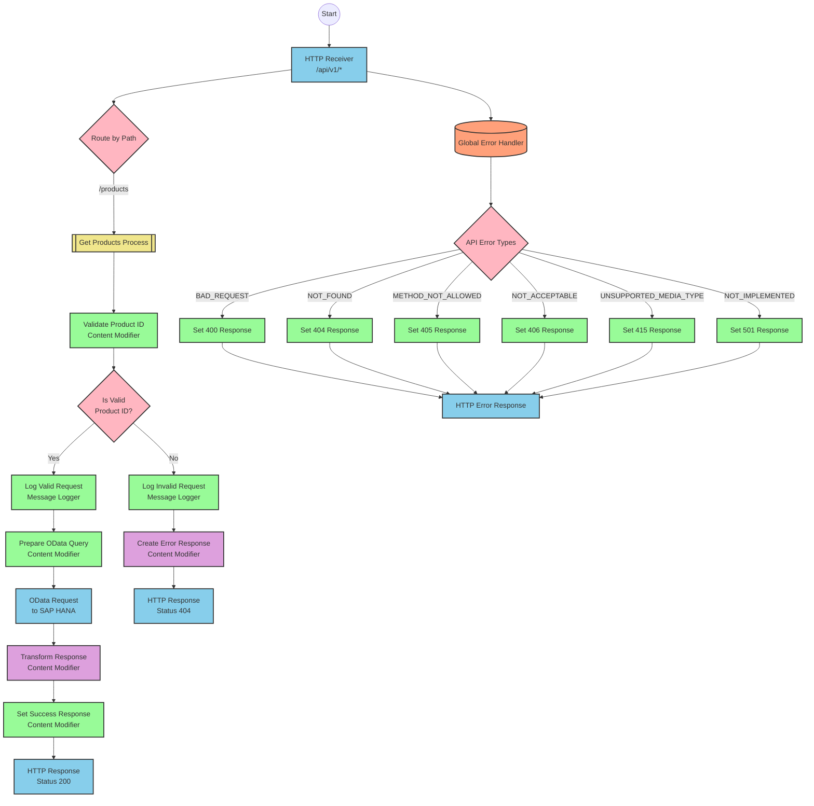

# SAP Integration Suite Documentation for Product API

# Table of Contents
- [API Overview](#api-overview)
- [Endpoints](#endpoints)
  - [GET /products](#get-products)
- [Current MuleSoft Flow Logic](#current-mulesoft-flow-logic)
  - [products-main Flow](#products-main-flow)
  - [products-console Flow](#products-console-flow)
  - [get:\products:products-config Flow](#getproductsproducts-config-flow)
  - [get-product-details-flow Subflow](#get-product-details-flow-subflow)
- [DataWeave Transformations Explained](#dataweave-transformations-explained)
  - [Product Identifier Validation](#product-identifier-validation)
  - [OData Query Parameters](#odata-query-parameters)
  - [Response Payload Transformation](#response-payload-transformation)
  - [Error Response Transformation](#error-response-transformation)
- [SAP Integration Suite Implementation](#sap-integration-suite-implementation)
  - [Component Mapping](#component-mapping)
  - [Integration Flow Visualization](#integration-flow-visualization)
- [Configuration Details](#configuration-details)
  - [HTTP Adapter Configuration](#http-adapter-configuration)
  - [OData Adapter Configuration](#odata-adapter-configuration)
  - [Content Modifier Configuration](#content-modifier-configuration)
  - [Router Configuration](#router-configuration)
- [Configuration](#configuration)
  - [Environment Variables](#environment-variables)
  - [External Dependencies](#external-dependencies)

# API Overview

This API provides access to product information from an SAP HANA backend system. It allows clients to retrieve product details by specifying a product identifier as a query parameter. The API validates the product identifier against a configured list of valid identifiers before retrieving the data from the backend system.

Base URL: `http://localhost:8081/api/v1`

# Endpoints

## GET /products

This endpoint retrieves product details based on the provided product identifier.

**Request Parameters:**
- Query Parameters:
  - `productIdentifier` (required): The unique identifier of the product to retrieve

**Response Format:**
- Content-Type: `application/json`
- Status Codes:
  - 200: Successful response with product details
  - 400: Bad request (invalid input)
  - 404: Product not found
  - 500: Server error

**Example Request:**
```
GET /api/v1/products?productIdentifier=HT-2000
```

**Example Response (200 OK):**
```json
{
  "ProductId": "HT-2000",
  "Category": "Notebooks",
  "CategoryName": "Notebooks",
  "CurrencyCode": "USD",
  "DimensionDepth": 30,
  "DimensionHeight": 3,
  "DimensionUnit": "cm",
  "DimensionWidth": 40,
  "LongDescription": "Notebook Basic 17 with 2,80 GHz quad core, 17\" LCD, 4 GB DDR3 RAM, 500 GB Hard Disc, Windows 8 Pro",
  "Name": "Notebook Basic 17",
  "PictureUrl": "/sap/public/bc/NWDEMO_MODEL/IMAGES/HT-2000.jpg",
  "Price": 1249,
  "QuantityUnit": "EA",
  "ShortDescription": "Notebook Basic 17 with 2,80 GHz quad core, 17\" LCD, 4 GB DDR3 RAM, 500 GB Hard Disc, Windows 8 Pro",
  "SupplierId": "0100000046",
  "Weight": 4.2,
  "WeightUnit": "KG"
}
```

**Example Error Response (404 Not Found):**
```json
{
  "status": "error",
  "message": "The product identifier HT-9999 was not found.",
  "errorCode": "PRODUCT_NOT_FOUND"
}
```

# Current MuleSoft Flow Logic

## products-main Flow

This is the main entry point for the API. It:
1. Is triggered by an HTTP listener configured to listen on `/api/v1/*`
2. Sets up response headers
3. Handles error responses
4. Routes requests to appropriate handlers based on the path

## products-console Flow

This flow is similar to the main flow but includes console logging:
1. Is triggered by an HTTP listener
2. Sets up response headers
3. Handles error responses
4. Logs information to the console

## get:\products:products-config Flow

This flow handles the GET /products endpoint:
1. Is triggered when a GET request is made to the /products endpoint
2. Calls the get-product-details-flow subflow to process the request

## get-product-details-flow Subflow

This subflow processes product detail requests:
1. Validates if the requested product identifier exists in the configured list
2. If valid:
   - Logs the request details
   - Constructs an OData query with filter and select parameters
   - Makes a request to the SAP HANA backend
   - Transforms the response to JSON
3. If invalid:
   - Logs the error
   - Returns an error response with appropriate message

The flow includes these key technical components:

1. **Product Identifier Validation**:
```dw
%dw 2.0
output application/java
var productidentifer=p('odata.productIdentifiers') splitBy(",")
---
sizeOf(productidentifer filter ($ == attributes.queryParams.productIdentifier))>0
```

2. **OData Query Parameters**:
```
#[output application/java
---
{
	"$filter" : "ProductId eq '" ++ (attributes.queryParams.productIdentifier default '') ++ "'",
	"$select" : "ProductId,Category,CategoryName,CurrencyCode,DimensionDepth,DimensionHeight,DimensionUnit,DimensionWidth,LongDescription,Name,PictureUrl,Price,QuantityUnit,ShortDescription,SupplierId,Weight,WeightUnit"
}]
```

3. **Response Transformation**:
```dw
%dw 2.0
output application/json
---
payload
```

4. **Error Response Transformation**:
```dw
%dw 2.0
output application/json
---
{
	status: "error",
	message: "The product identifier " ++ attributes.queryParams.productIdentifier ++ " was not found.",
	errorCode: "PRODUCT_NOT_FOUND"
}
```

# DataWeave Transformations Explained

## Product Identifier Validation

This transformation validates if the requested product identifier exists in the configured list of valid identifiers.

```dw
%dw 2.0
output application/java
var productidentifer=p('odata.productIdentifiers') splitBy(",")
---
sizeOf(productidentifer filter ($ == attributes.queryParams.productIdentifier))>0
```

**Explanation:**
1. The transformation retrieves the configured list of product identifiers from the property `odata.productIdentifiers`
2. It splits this comma-separated string into an array using `splitBy(",")`
3. It filters the array to find elements that match the requested product identifier
4. It checks if the size of the filtered array is greater than 0, returning a boolean result
5. The output is a Java boolean value that determines if the flow should proceed with the request or return an error

## OData Query Parameters

This transformation constructs the OData query parameters for the backend request.

```
#[output application/java
---
{
	"$filter" : "ProductId eq '" ++ (attributes.queryParams.productIdentifier default '') ++ "'",
	"$select" : "ProductId,Category,CategoryName,CurrencyCode,DimensionDepth,DimensionHeight,DimensionUnit,DimensionWidth,LongDescription,Name,PictureUrl,Price,QuantityUnit,ShortDescription,SupplierId,Weight,WeightUnit"
}]
```

**Explanation:**
1. The transformation creates a Java map with two OData query parameters:
   - `$filter`: Filters products where the ProductId equals the requested product identifier
   - `$select`: Specifies which fields to include in the response
2. It uses string concatenation (`++`) to build the filter expression
3. It includes a `default ''` to handle cases where the product identifier might be null

## Response Payload Transformation

This simple transformation passes the payload through without modification, ensuring the output is in JSON format.

```dw
%dw 2.0
output application/json
---
payload
```

**Explanation:**
1. The transformation takes the input payload (the response from the OData service)
2. It outputs it directly as JSON without any transformation
3. This ensures the client receives a properly formatted JSON response

## Error Response Transformation

This transformation creates a standardized error response when the product identifier is not valid.

```dw
%dw 2.0
output application/json
---
{
	status: "error",
	message: "The product identifier " ++ attributes.queryParams.productIdentifier ++ " was not found.",
	errorCode: "PRODUCT_NOT_FOUND"
}
```

**Explanation:**
1. The transformation creates a JSON object with three fields:
   - `status`: Set to "error" to indicate an error occurred
   - `message`: A descriptive message that includes the invalid product identifier
   - `errorCode`: A standardized error code "PRODUCT_NOT_FOUND"
2. It uses string concatenation (`++`) to include the requested product identifier in the error message

# SAP Integration Suite Implementation

## Component Mapping

| MuleSoft Component | SAP Integration Suite Equivalent | Notes |
|--------------------|----------------------------------|-------|
| HTTP Listener | HTTP Adapter (Receiver) | Configure with the same path and port |
| Flow Reference | Process Call | Used to call subflows |
| DataWeave Transform | Content Modifier or Groovy Script | For complex transformations, use Groovy Script |
| Logger | Write to Message Log | Configure with the same log message |
| HTTP Request | OData Adapter (Sender) | Configure with the same OData parameters |
| Choice/When/Otherwise | Router | Configure with the same condition |
| Set Variable | Content Modifier | Set properties in the message header |
| Set Payload | Content Modifier | Set the message body |
| Error Handler | Exception Subprocess | Configure with the same error types |

## REST API Integration Flow: Product API



# Configuration Details

## HTTP Adapter Configuration

**HTTP Receiver Adapter:**
- Address: `/api/v1/*`
- Port: 8081 (from configuration)
- Supported Methods: GET
- Authentication: None (based on source)
- CSRF Protection: None (based on source)

**OData Sender Adapter:**
- Address: `https://refapp-espm-ui-cf.cfapps.eu10.hana.ondemand.com:443/espm-cloud-web/espm.svc/Products`
- Authentication: None (based on source)
- Query Parameters: Dynamically set from Content Modifier

## OData Adapter Configuration

**OData Query Parameters:**
- $filter: Dynamically set to `ProductId eq '{productIdentifier}'`
- $select: `ProductId,Category,CategoryName,CurrencyCode,DimensionDepth,DimensionHeight,DimensionUnit,DimensionWidth,LongDescription,Name,PictureUrl,Price,QuantityUnit,ShortDescription,SupplierId,Weight,WeightUnit`

## Content Modifier Configuration

**Validate Product ID:**
- Script Type: Groovy
- Script:
```groovy
def productIdentifiers = property.get("odata.productIdentifiers").split(",")
def requestedId = message.getHeaders().get("productIdentifier")
def isValid = productIdentifiers.any { it == requestedId }
message.setProperty("isExistProduct", isValid)
return message
```

**Prepare OData Query:**
- Action: Create multipart/form-data
- Parameters:
  - $filter: `ProductId eq '${header.productIdentifier}'`
  - $select: `ProductId,Category,CategoryName,CurrencyCode,DimensionDepth,DimensionHeight,DimensionUnit,DimensionWidth,LongDescription,Name,PictureUrl,Price,QuantityUnit,ShortDescription,SupplierId,Weight,WeightUnit`

**Error Response:**
- Action: Create JSON
- Content:
```json
{
  "status": "error",
  "message": "The product identifier ${header.productIdentifier} was not found.",
  "errorCode": "PRODUCT_NOT_FOUND"
}
```

## Router Configuration

**Route by Path:**
- Default: Return error
- Condition 1: 
  - Condition Type: XPath
  - Expression: `$header.HTTP.RequestURI = '/products'`
  - Action: Route to Get Products Process

**Is Valid Product ID?:**
- Default: Route to Error Response
- Condition 1:
  - Condition Type: Property
  - Expression: `${property.isExistProduct} = true`
  - Action: Route to Valid Product Flow

# Configuration

## Environment Variables

The following environment variables are required:

```yaml
api:
  listener:
    port: "8081"
    path: /api/v1/*
    
hana:
  espm:
    url: refapp-espm-ui-cf.cfapps.eu10.hana.ondemand.com
    port: "443"
    path: /espm-cloud-web/espm.svc/Products
    
odata:
  productIdentifiers: "HT-2000,HT-2001"
```

## External Dependencies

The integration depends on:
1. SAP HANA ESPM service at `refapp-espm-ui-cf.cfapps.eu10.hana.ondemand.com`
2. OData service endpoint at `/espm-cloud-web/espm.svc/Products`

The integration validates product identifiers against a configured list (`odata.productIdentifiers`), which in the development environment is set to "HT-2000,HT-2001".