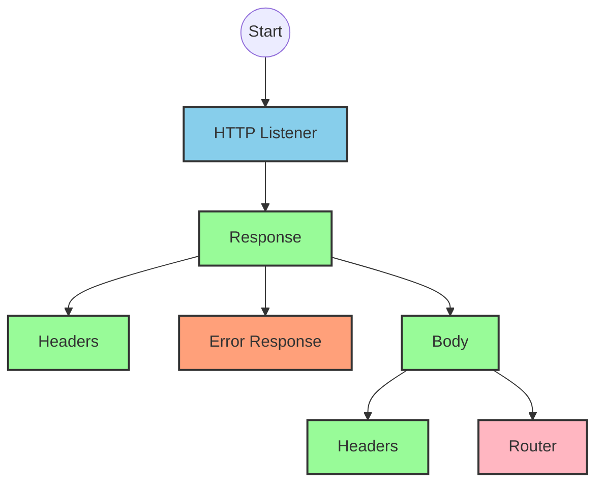
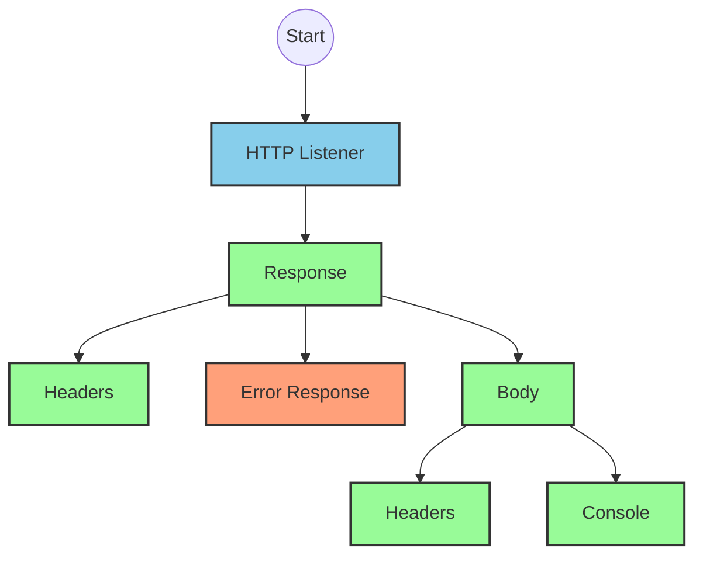
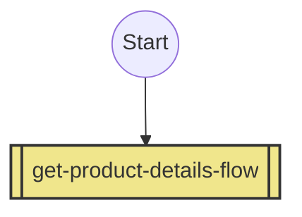
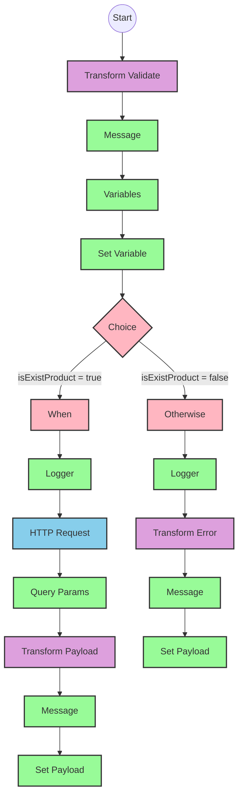

# API Overview
- This API provides product information from an SAP HANA database
- Base URL pattern: `/products`

# Endpoints

## GET /products
- **Purpose**: Retrieves product details based on a product identifier
- **Query Parameters**:
  - `productIdentifier` (required): The unique identifier for the product
- **Response Format**: JSON
- **Status Codes**:
  - 200: Success
  - 400: Bad Request
  - 404: Product Not Found
- **Response Body**: Product details including ID, name, description, price, and other attributes

# Current MuleSoft Flow Logic

## Flow: products-main
This is the main entry point for the API, triggered by an HTTP listener. It sets up the response structure and routes requests to appropriate handlers.

1. **Trigger**: HTTP listener
2. **Processing**:
   - Sets up response headers
   - Handles error responses
   - Routes requests based on API specification

## Flow: products-console
A separate flow for console-based interactions.

1. **Trigger**: HTTP listener
2. **Processing**:
   - Sets up response headers
   - Handles error responses
   - Outputs to console

## Flow: get:\products:products-config
Handles GET requests to the /products endpoint.

1. **Trigger**: HTTP GET request to /products
2. **Processing**:
   - References the get-product-details-flow subflow

## Subflow: get-product-details-flow
This is the core business logic flow that processes product requests.

1. **Validation**: Checks if the provided product identifier is valid
   - Uses a DataWeave transformation to validate the product identifier against a configured list
   ```
   %dw 2.0
   output application/java
   var productidentifer=p('odata.productIdentifiers') splitBy(",")
   ---
   sizeOf(productidentifer filter ($ == attributes.queryParams.productIdentifier))>0
   ```

2. **Conditional Processing**:
   - If product identifier is valid:
     - Logs the request
     - Makes an OData request to retrieve product details with these exact parameters:
       ```
       {
         "$filter" : "ProductId eq '" ++ (attributes.queryParams.productIdentifier default '') ++ "'",
         "$select" : "ProductId,Category,CategoryName,CurrencyCode,DimensionDepth,DimensionHeight,DimensionUnit,DimensionWidth,LongDescription,Name,PictureUrl,Price,QuantityUnit,ShortDescription,SupplierId,Weight,WeightUnit"
       }
       ```
     - Transforms the response to JSON format
   - If product identifier is invalid:
     - Logs the error
     - Returns an error response with status, message, and error code

3. **Response Handling**:
   - For valid products: Returns the product details in JSON format
   - For invalid products: Returns an error message

# DataWeave Transformations Explained

## Product Identifier Validation Transformation
```
%dw 2.0
output application/java
var productidentifer=p('odata.productIdentifiers') splitBy(",")
---
sizeOf(productidentifer filter ($ == attributes.queryParams.productIdentifier))>0
```

This transformation:
1. Retrieves a comma-separated list of valid product identifiers from a property
2. Splits the string into an array of product identifiers
3. Filters the array to find matches with the provided query parameter
4. Returns a boolean indicating if the product identifier exists (true if size > 0)

## OData Query Parameters Transformation
```
#[output application/java
---
{
	"$filter" : "ProductId eq '" ++ (attributes.queryParams.productIdentifier default '') ++ "'",
	"$select" : "ProductId,Category,CategoryName,CurrencyCode,DimensionDepth,DimensionHeight,DimensionUnit,DimensionWidth,LongDescription,Name,PictureUrl,Price,QuantityUnit,ShortDescription,SupplierId,Weight,WeightUnit"
}]
```

This transformation:
1. Creates an OData query with filter and select parameters
2. The filter targets products where ProductId equals the provided product identifier
3. The select parameter specifies which fields to return in the response

## Response Payload Transformation (Success)
```
%dw 2.0
output application/json
---
payload
```

This simple transformation:
1. Takes the input payload (from the OData response)
2. Outputs it as JSON without modification

## Error Response Transformation
```
%dw 2.0
output application/json
---
{
	status: "error",
	message: "The product identifier " ++ attributes.queryParams.productIdentifier ++ " was not found.",
	errorCode: "PRODUCT_NOT_FOUND"
}
```

This transformation:
1. Creates a structured error response
2. Includes the status ("error"), a descriptive message that includes the invalid product identifier, and an error code

# SAP Integration Suite Implementation

## Component Mapping

| MuleSoft Component | SAP Integration Suite Equivalent |
|-------------------|----------------------------------|
| HTTP Listener | HTTP Adapter (Receiver) |
| HTTP Request | HTTP Adapter (Sender) |
| Router | Content Modifier + Router |
| DataWeave Transform | Message Mapping |
| Logger | Write to Log |
| Flow Reference | Process Call |
| Choice/When/Otherwise | Router |
| Set Variable | Content Modifier |
| Set Payload | Content Modifier |
| Error Handler | Exception Subprocess |

## Integration Flow Visualization









## Configuration Details

### HTTP Listener Configuration
- Component: HTTP Adapter (Receiver)
- Parameters:
  - Name: HTTP_Listener_config
  - Port: 8081 (placeholder, configure as needed)
  - Host: 0.0.0.0 (placeholder, configure as needed)
  - Path: /api/* (placeholder, configure as needed)

### HTTP Request Configuration
- Component: HTTP Adapter (Sender)
- Parameters:
  - Name: Hana_HTTP_Request_Configuration
  - Base URL: [SAP HANA OData service URL]
  - Authentication: Basic (placeholder, configure as needed)
  - Timeout: 30000 ms (placeholder, configure as needed)

### Router Configuration
- Component: Router
- Parameters:
  - Routing conditions based on API specification
  - Route to appropriate flow based on HTTP method and path

### Transform Validate Configuration
- Component: Message Mapping
- Parameters:
  - Input format: application/java
  - Output format: application/java
  - Mapping script: As per the original DataWeave transformation

### Choice Component Configuration
- Component: Router
- Parameters:
  - Condition: vars.isExistProduct
  - True path: Process valid product request
  - False path: Return error response

### HTTP Request Query Parameters
- Component: Content Modifier
- Parameters:
  - $filter: ProductId eq '[productIdentifier]'
  - $select: ProductId,Category,CategoryName,CurrencyCode,DimensionDepth,DimensionHeight,DimensionUnit,DimensionWidth,LongDescription,Name,PictureUrl,Price,QuantityUnit,ShortDescription,SupplierId,Weight,WeightUnit

# Configuration

## Important Configuration Parameters
- odata.productIdentifiers: Comma-separated list of valid product identifiers

## Environment Variables
- None explicitly mentioned in the source documentation

## Dependencies on External Systems
- SAP HANA OData service for product data retrieval

## Security Settings
- HTTP Basic Authentication for SAP HANA OData service (inferred from HTTP Request configuration)
- API security settings not explicitly mentioned in the source documentation