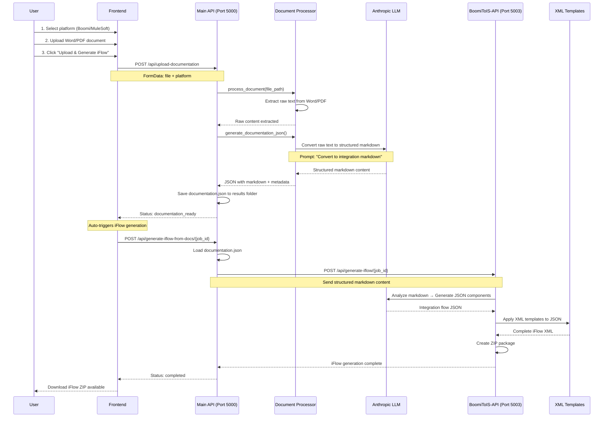

# Document Upload & iFlow Generation Flow

This document describes the complete flow when a user uploads a document (Word, PDF, etc.) and generates an iFlow directly without the traditional XML processing step.

## Overview

The document upload flow provides a streamlined path for generating SAP Integration Suite iFlows from business documentation. This bypasses the need for technical XML files and allows business users to generate integration flows from requirements documents.

## Sequence Diagram

## Process Phases

### Phase 1: Document Upload & Processing (10-15 seconds)

1. **File Validation**: Frontend validates file format and platform selection
2. **Document Upload**: File sent to Main API endpoint `/api/upload-documentation`
3. **Content Extraction**: Document processor extracts raw text from uploaded file
4. **LLM Conversion**: Raw text converted to structured markdown using Anthropic LLM
5. **JSON Generation**: Creates documentation JSON with both original and converted content

### Phase 2: Auto-iFlow Generation (30-60 seconds)

6. **Auto-Trigger**: Frontend automatically initiates iFlow generation
7. **API Routing**: Request routed to appropriate platform API (Boomi/MuleSoft)
8. **Component Analysis**: LLM analyzes structured markdown to identify integration components
9. **Template Application**: JSON components converted to SAP Integration Suite XML
10. **Package Creation**: Complete iFlow packaged into downloadable ZIP

### Phase 3: Completion (5 seconds)

11. **Download Ready**: User receives download link for generated iFlow
12. **Optional Deployment**: User can deploy directly to SAP BTP Integration Suite

## Key Improvements

### Before (Problem)
- Raw Word document content sent directly to BoomiToIS-API
- Unstructured text caused poor iFlow generation
- Manual documentation step required

### After (Solution)
- LLM converts raw content to structured markdown
- Clear sections help identify integration requirements
- Automatic processing without manual intervention

## API Endpoints

| Endpoint | Method | Purpose |
|----------|--------|---------|
| `/api/upload-documentation` | POST | Upload and process document |
| `/api/generate-iflow-from-docs/{job_id}` | POST | Generate iFlow from processed documentation |
| `/api/jobs/{job_id}` | GET | Check job status |
| `/api/jobs/{job_id}/download` | GET | Download generated iFlow |

## Supported File Formats

- **Word Documents**: .docx (recommended)
- **PDF Files**: .pdf
- **Text Files**: .txt, .md
- **JSON Files**: .json
- **Chat Transcripts**: .chat

## Error Handling

- **LLM Unavailable**: Falls back to basic markdown structure
- **File Processing Errors**: Clear error messages with supported formats
- **API Timeouts**: Proper timeout handling with retry mechanisms
- **Template Errors**: Fallback to basic iFlow structure

## Performance Expectations

- **Total Time**: 45-90 seconds (vs. previous manual workflow)
- **Document Processing**: 10-15 seconds
- **iFlow Generation**: 30-60 seconds
- **Package Creation**: 5 seconds

## Next Steps

1. Upload a Word document through the frontend
2. Verify structured markdown conversion
3. Confirm BoomiToIS-API receives proper format
4. Test complete iFlow generation workflow
