# BoomiToIS System Architecture & Flow

## 🎯 **Project Objective**

The **BoomiToIS Integration Platform** is an AI-powered system designed to automate the migration of integration flows from **Dell Boomi** and **MuleSoft** platforms to **SAP Integration Suite**. This addresses the critical business need for organizations transitioning their integration architecture to SAP's cloud-native integration platform.

### **Business Challenge**
- **Manual Migration Complexity**: Converting integration flows between platforms requires deep technical expertise and significant time investment
- **Platform Differences**: Each integration platform has unique components, configurations, and architectural patterns
- **Resource Constraints**: Limited availability of experts familiar with both source and target platforms
- **Migration Risk**: Manual conversion introduces potential for errors and incomplete implementations

### **Solution Approach**
Our platform leverages **Generative AI** and **intelligent template systems** to automate the conversion process:

1. **📄 Document Analysis**: AI-powered extraction and enhancement of integration documentation
2. **🧠 Component Intelligence**: LLM-based analysis to identify and map integration components
3. **🔧 Template-Based Generation**: Automated creation of SAP Integration Suite iFlows using proven templates
4. **✅ Validation & Optimization**: Ensuring generated iFlows are deployment-ready and follow best practices

### **Conversion Methodology**

#### **Phase 1: Documentation Processing**
- **Input**: Integration documentation (Word docs, PDFs, XML exports, flow diagrams)
- **AI Enhancement**: LLM-powered analysis to extract technical details, fill gaps, and standardize format
- **Output**: Comprehensive markdown documentation with complete integration specifications

#### **Phase 2: Component Analysis & Mapping**
- **Pattern Recognition**: AI identifies integration patterns (HTTP listeners, data transformations, connectors)
- **Component Mapping**: Intelligent translation from source platform components to SAP Integration Suite equivalents
- **Configuration Extraction**: Automated extraction of connection details, security settings, and business logic

#### **Phase 3: iFlow Generation**
- **Template Selection**: AI selects appropriate SAP Integration Suite templates based on integration patterns
- **BPMN2 Generation**: Creates complete Business Process Model and Notation (BPMN2) XML structures
- **Project Assembly**: Generates full project structure including manifests, configurations, and metadata

#### **Phase 4: Validation & Deployment**
- **Syntax Validation**: Ensures generated XML is valid and SAP Integration Suite compliant
- **Best Practice Compliance**: Applies SAP integration best practices and security standards
- **Deployment Readiness**: Produces artifacts ready for import into SAP Integration Suite

### **Supported Migration Paths**

| **Source Platform** | **Target Platform** | **Status** | **AI Provider Options** |
|-------------------|-------------------|------------|------------------------|
| **Dell Boomi** | SAP Integration Suite | ✅ Production Ready | Claude, GPT, Azure OpenAI, **Gemma-3** |
| **MuleSoft** | SAP Integration Suite | ✅ Production Ready | Claude, GPT, Azure OpenAI, **Gemma-3** |
| **Generic Documentation** | SAP Integration Suite | ✅ Available | All providers |

### **Key Innovation: Multi-LLM Architecture**
- **Provider Flexibility**: Support for multiple AI providers (Anthropic Claude, OpenAI GPT, Azure OpenAI, RunPod Gemma-3)
- **Cost Optimization**: Choose between premium cloud APIs and cost-effective self-hosted models
- **Reliability**: Fallback mechanisms ensure continuous operation
- **Performance**: Latest models like Gemma-3 with 32K context windows for complex integrations

---

## System Overview

The BoomiToIS system transforms Dell Boomi and MuleSoft integration processes into SAP Integration Suite iFlows through a multi-stage pipeline involving AI analysis, component processing, and XML generation.

### **How We Achieve This Conversion**

#### **🔄 Hybrid AI-Code Architecture**
Our system uses a **strategic combination** of AI intelligence and deterministic code processing:

- **AI Role (Limited & Focused)**: Understanding integration requirements and generating component specifications
- **Code Role (Extensive)**: Template-based XML generation, validation, and package assembly
- **Result**: Reliable, consistent, and SAP-compliant iFlow generation

#### **🎯 Two-Point LLM Strategy**
We use AI at exactly **two strategic points** in the pipeline:

1. **Documentation Enhancement** (Optional): Improve human-readable documentation quality
2. **Component Analysis** (Required): Extract technical components and configurations from documentation

**Everything else is pure code** - no AI involved in XML generation, validation, or packaging.

#### **🔧 Template-Driven Generation**
- **Pre-built Templates**: Comprehensive library of SAP Integration Suite component templates
- **Pattern Matching**: Intelligent mapping from source platform patterns to SAP equivalents
- **Deterministic Output**: Same input always produces the same output
- **SAP Compliance**: Templates ensure adherence to SAP Integration Suite standards

#### **🚀 Multi-Platform Support**
- **Dell Boomi**: XML parsing → Component extraction → SAP iFlow generation
- **MuleSoft**: Flow analysis → Pattern recognition → SAP iFlow generation
- **Documentation**: Manual input → AI enhancement → SAP iFlow generation

#### **⚡ Performance & Reliability**
- **Fast Processing**: Template-based generation is near-instantaneous
- **High Accuracy**: AI focuses only on understanding, not generation
- **Consistent Quality**: Templates guarantee SAP Integration Suite compliance
- **Scalable**: Can process multiple integrations simultaneously

## Complete System Flow

```mermaid
graph TD
    %% Input Sources
    A[Dell Boomi ZIP File] --> B[BoomiXMLProcessor]
    A1[Manual Markdown Input] --> D[Basic Markdown Documentation]
    A2[JSON Configuration] --> D

    %% Initial Processing - Convert to Markdown (Pure Code)
    B --> B1[Extract XML Files]
    B1 --> B2[Parse Process Components]
    B2 --> B3[Parse Connectors]
    B3 --> B4[Parse Data Maps]
    B4 --> D[Basic Markdown Documentation]

    %% LLM USAGE POINT #1: Documentation Enhancement (Optional)
    D --> DOC_LLM_BOUNDARY["🤖 LLM USAGE #1: DOCUMENTATION ENHANCEMENT"]
    DOC_LLM_BOUNDARY --> DOC_ENHANCE{Enhancement Requested?}
    DOC_ENHANCE -->|Yes| DOC_LLM[Documentation Enhancement LLM]
    DOC_ENHANCE -->|No| ENHANCED_DOC[Final Markdown Documentation]

    DOC_LLM --> DOC_PROVIDER{Provider Type?}
    DOC_PROVIDER -->|anthropic| DOC_CLAUDE[Claude: Enhance Documentation]
    DOC_PROVIDER -->|openai| DOC_GPT[GPT: Enhance Documentation]
    DOC_PROVIDER -->|azure| DOC_AZURE[Azure OpenAI: Enhance Documentation]
    DOC_PROVIDER -->|gemma3| DOC_GEMMA3[Gemma-3: Enhance Documentation<br/>RunPod OpenAI-Compatible API]

    DOC_CLAUDE --> ENHANCED_DOC[Enhanced Markdown Documentation]
    DOC_GPT --> ENHANCED_DOC
    DOC_AZURE --> ENHANCED_DOC
    DOC_GEMMA3 --> ENHANCED_DOC

    %% LLM USAGE POINT #2: Component Analysis (Always Required)
    ENHANCED_DOC --> COMP_LLM_BOUNDARY["🤖 LLM USAGE #2: COMPONENT ANALYSIS"]
    COMP_LLM_BOUNDARY --> COMP_LLM[Component Analysis LLM]

    COMP_LLM --> COMP_PROVIDER{Provider Type?}
    COMP_PROVIDER -->|anthropic| COMP_CLAUDE[Claude: Analyze → Component JSON]
    COMP_PROVIDER -->|openai| COMP_GPT[GPT: Analyze → Component JSON]
    COMP_PROVIDER -->|azure| COMP_AZURE[Azure OpenAI: Analyze → Component JSON]
    COMP_PROVIDER -->|gemma3| COMP_GEMMA3[Gemma-3: Analyze → Component JSON<br/>RunPod OpenAI-Compatible API<br/>16K Token Output Limit]
    COMP_PROVIDER -->|local| COMP_LOCAL[Local Fallback: Extract JSON]

    %% AI Response - Basic Component JSON Only
    COMP_CLAUDE --> E[Basic Component JSON]
    COMP_GPT --> E
    COMP_AZURE --> E
    COMP_GEMMA3 --> E
    COMP_LOCAL --> E

    E --> F[JSON Parser & Validator]
    F --> F1{Valid JSON?}
    F1 -->|No| F2[Retry with Enhanced Prompt]
    F2 --> COMP_LLM
    F1 -->|Yes| CODE_BOUNDARY["⚙️ CODE PROCESSING BOUNDARY - NO MORE LLM"]

    %% EVERYTHING BELOW IS PURE CODE - NO LLM
    CODE_BOUNDARY --> G[Basic Components JSON]

    %% Enhancement Layer - Pure Code Logic
    G --> H[Keyword-Based Enhancement Engine]
    H --> H1[Component Type Detection]
    H1 --> H2[Pattern Recognition Engine]

    H2 --> I{Component Type?}
    I -->|request_reply + SFTP| I1[SFTP Template Generator]
    I -->|request_reply + SuccessFactors| I2[SuccessFactors Template Generator]
    I -->|request_reply + HTTP| I3[HTTP Template Generator]
    I -->|content_modifier| I4[Content Modifier Template]
    I -->|enricher| I5[Enricher Template]
    I -->|router| I6[Router Template]

    %% Template-Based Component Generation
    I1 --> J1[Service Task + SFTP Receiver + SFTP Message Flow]
    I2 --> J2[Service Task + SF Receiver + OData Message Flow]
    I3 --> J3[Service Task + HTTP Receiver + HTTP Message Flow]
    I4 --> J4[Content Modifier XML]
    I5 --> J5[Content Enricher XML]
    I6 --> J6[Exclusive Gateway XML]

    %% Component Assembly
    J1 --> K[Enhanced Component Collection]
    J2 --> K
    J3 --> K
    J4 --> K
    J5 --> K
    J6 --> K

    K --> L[Component Organizer]
    L --> L1[Process Components List]
    L --> L2[Participants List]
    L --> L3[Message Flows List]
    L --> L4[Sequence Flows List]

    %% XML Generation - Pure Code
    L1 --> M[XML Assembly Engine]
    L2 --> M
    L3 --> M
    L4 --> M

    M --> M1[Process XML Generator]
    M --> M2[Collaboration XML Generator]
    M --> M3[BPMN Diagram Generator]

    %% XML Assembly
    M1 --> N[XML Combiner]
    M2 --> N
    M3 --> N

    N --> N1[Add Start/End Events]
    N1 --> N2[Generate Sequence Flows]
    N2 --> N3[Create BPMN Shapes]
    N3 --> N4[Create BPMN Edges]
    N4 --> O[Complete iFlow XML]

    %% Validation & Fixing - Pure Code
    O --> P[XML Validator & Auto-Fixer]
    P --> P1[Component Reference Validation]
    P1 --> P2[Sequence Flow Connection Fixing]
    P2 --> P3[BPMN Compliance Validation]
    P3 --> Q[Validated iFlow XML]

    %% Package Assembly - Pure Code
    Q --> R[SAP Package Generator]
    R --> R1[Create .iflw File]
    R --> R2[Generate MANIFEST.MF]
    R --> R3[Create Parameters Files]
    R --> R4[Generate Project Structure]

    R1 --> S[ZIP Package Assembler]
    R2 --> S
    R3 --> S
    R4 --> S

    S --> T[📦 Final SAP Integration Suite Package]

    %% User Domain - Outside Our System
    T --> USER_BOUNDARY["👤 USER DOMAIN BOUNDARY"]
    USER_BOUNDARY --> U1[Download ZIP]
    U1 --> U2[Import to SAP Integration Suite]
    U2 --> U3[Configure Credentials & Parameters]
    U3 --> U4[Deploy iFlow]
    U4 --> U5[Test & Monitor Integration]

    %% Debug Output - Code Generated
    D --> DEBUG0[Save basic_markdown.md]
    ENHANCED_DOC --> DEBUG1[Save enhanced_documentation.md]
    G --> DEBUG2[Save basic_components.json]
    K --> DEBUG3[Save enhanced_components.json]
    O --> DEBUG4[Save raw_iflow.xml]
    Q --> DEBUG5[Save final_iflow.xml]

    %% Styling with black text for better readability
    classDef inputNode fill:#e1f5fe,color:#000000
    classDef llmNode fill:#fff3e0,color:#000000
    classDef codeNode fill:#e8f5e8,color:#000000
    classDef outputNode fill:#fce4ec,color:#000000
    classDef userNode fill:#f3e5f5,color:#000000
    classDef debugNode fill:#f5f5f5,color:#000000
    classDef boundaryNode fill:#ffebee,stroke:#d32f2f,stroke-width:3px,color:#000000
    classDef enhancementNode fill:#e8f5e8,stroke:#4caf50,stroke-width:2px,color:#000000

    class A,A1,A2,D inputNode
    class DOC_CLAUDE,DOC_GPT,DOC_AZURE,DOC_GEMMA3,COMP_CLAUDE,COMP_GPT,COMP_AZURE,COMP_GEMMA3,COMP_LOCAL,E,F llmNode
    class H,I,J1,J2,J3,J4,J5,J6,K,L,M,N,P,R,S codeNode
    class T outputNode
    class U1,U2,U3,U4,U5 userNode
    class DEBUG0,DEBUG1,DEBUG2,DEBUG3,DEBUG4,DEBUG5 debugNode
    class DOC_LLM_BOUNDARY,COMP_LLM_BOUNDARY,CODE_BOUNDARY,USER_BOUNDARY boundaryNode
    class ENHANCED_DOC enhancementNode
```



## Key Components Breakdown

### 1. Input Processing Layer (Pure Code)
- **BoomiXMLProcessor**: Extracts and parses Dell Boomi ZIP files
- **XML Parser**: Processes process components, connectors, and data maps
- **Basic Markdown Generator**: Converts XML to structured markdown documentation

### 2. LLM Usage Point #1: Documentation Enhancement (Optional)
- **Purpose**: Enhance basic markdown with AI insights and comprehensive analysis
- **Multi-Provider Support**: Claude, GPT, Azure OpenAI
- **Input**: Basic markdown documentation from XML parsing
- **Output**: Enhanced markdown with detailed explanations, flow logic, and migration guidance
- **Trigger**: Only when `enhance=True` parameter is set
- **Timeout**: 10-minute timeout to prevent hanging

### 3. LLM Usage Point #2: Component Analysis (Always Required)
- **Purpose**: Analyze markdown documentation → Generate component JSON
- **Multi-Provider Support**: Claude, GPT, Azure OpenAI, **Gemma-3 (RunPod)**, Local Fallback
- **Input**: Markdown documentation (basic or enhanced)
- **Output**: Basic component JSON with types, names, and configurations
- **Enhanced Prompting**: Context-aware prompts for accurate component identification
- **JSON Validation**: Ensures valid JSON structure with retry logic

#### **🚀 RunPod Gemma-3 Integration (Latest Addition)**
- **Model**: `google/gemma-3-4b-it` via RunPod vLLM Worker
- **Endpoint**: OpenAI-compatible API (`/openai/v1/chat/completions`)
- **Token Limits**: 24K input tokens, 16K output tokens (vs. previous 2K limit)
- **Timeout**: 20 minutes for complex iFlow generation (vs. previous 5 minutes)
- **Format**: Standard OpenAI chat completion format with `messages` array
- **Benefits**: Higher token limits enable complete iFlow generation without truncation

### 4. Enhancement Engine (Pure Code - No LLM)
- **Keyword Detection**: Scans component types and configurations from LLM JSON
- **Pattern Mapping**: Maps keywords to SAP component patterns (SFTP, SuccessFactors, HTTP)
- **Template Selection**: Chooses appropriate XML templates based on component types
- **Component Generation**: Creates complete SAP-compliant XML components

### 5. XML Assembly Layer (Pure Code)
- **Template Engine**: SAP Integration Suite compliant XML templates
- **BPMN Generator**: Creates visual layout, shapes, and edges
- **Flow Builder**: Connects components with proper sequence flows
- **Validation Engine**: Ensures XML compliance and auto-fixes issues

### 6. Package Assembly Layer (Pure Code)
- **ZIP Builder**: Creates complete deployable iFlow packages
- **Metadata Generator**: Required SAP Integration Suite files (.iflw, MANIFEST.MF, parameters)
- **Debug System**: Comprehensive logging and intermediate file output

### 7. User Domain (Outside Our System)
- **Import**: User imports ZIP to SAP Integration Suite
- **Configuration**: User sets credentials and parameters
- **Deployment**: User deploys and monitors the integration

## Enhanced Request-Reply Processing (Code-Based Engine)

The system's key innovation is the **code-based** enhanced request-reply processing that creates complete patterns:

```mermaid
graph LR
    A[LLM: Basic JSON<br/>type: request_reply] --> B[Code: Keyword Detection]
    B --> C{Protocol Analysis}
    C -->|SFTP Keywords| D[SFTP Template Engine]
    C -->|SuccessFactors Keywords| E[SuccessFactors Template Engine]
    C -->|Generic HTTP| F[HTTP Template Engine]

    D --> D1[✅ Service Task XML<br/>activityType: ExternalCall]
    D --> D2[✅ SFTP Receiver XML<br/>ifl:type: EndpointRecevier]
    D --> D3[✅ SFTP Message Flow XML<br/>ComponentType: SFTP]

    E --> E1[✅ Service Task XML<br/>activityType: ExternalCall]
    E --> E2[✅ SF Receiver XML<br/>ifl:type: EndpointRecevier]
    E --> E3[✅ OData Message Flow XML<br/>ComponentType: SuccessFactors]

    F --> F1[✅ Service Task XML<br/>activityType: ExternalCall]
    F --> F2[✅ HTTP Receiver XML<br/>ifl:type: EndpointRecevier]
    F --> F3[✅ HTTP Message Flow XML<br/>ComponentType: HTTP]

    %% Styling for better readability
    classDef llmNode fill:#fff3e0,color:#000000
    classDef codeNode fill:#e8f5e8,color:#000000
    classDef templateNode fill:#e3f2fd,color:#000000
    classDef outputNode fill:#f1f8e9,color:#000000

    class A llmNode
    class B,C codeNode
    class D,E,F templateNode
    class D1,D2,D3,E1,E2,E3,F1,F2,F3 outputNode
```



## 🎯 **Key Innovation: LLM + Code Separation**

- **LLM Role**: Analyze integration requirements → Generate basic component list
- **Code Role**: Transform basic components → Complete SAP-compliant XML patterns
- **Result**: Every `request_reply` component becomes a complete request-reply pattern with proper connections

This architecture ensures that every request-reply component generates both the request (Service Task) and reply (Receiver Participant + Message Flow) components, creating complete integration patterns that are properly connected and SAP Integration Suite compliant.

## 🤖 Two Distinct LLM Usage Points

The system uses LLMs at exactly **two specific points** in the pipeline:

### **LLM Usage #1: Documentation Enhancement (Optional)**


**Purpose**: Improve documentation quality with AI insights
- **Input**: Basic markdown generated from XML parsing
- **Process**: LLM adds detailed explanations, flow logic, migration guidance
- **Output**: Enhanced markdown with comprehensive analysis
- **Trigger**: Only when user requests enhancement (`enhance=True`)
- **Provider**: Anthropic Claude (configurable to OpenAI/Azure)
- **Timeout**: 10 minutes to prevent hanging
- **Fallback**: Uses basic markdown if enhancement fails

### **LLM Usage #2: Component Analysis (Always Required)**


**Purpose**: Understand integration requirements and generate component structure
- **Input**: Markdown documentation (basic or enhanced)
- **Process**: LLM analyzes integration logic and identifies required components
- **Output**: Basic JSON with component types, names, and configurations
- **Trigger**: Always required for iFlow generation
- **Provider**: Multi-provider support (Claude, GPT, Azure, Local fallback)
- **Retry Logic**: Automatic retry with enhanced prompts if JSON is invalid
- **Validation**: Strict JSON validation and cleanup

## 🔄 **The Complete LLM Flow**

```
Boomi ZIP → [Code] Basic Markdown → [LLM #1 Optional] Enhanced Markdown → [LLM #2 Always] Component JSON → [Code] iFlow Package
```

### **Key Insights:**
1. **Documentation Enhancement** is optional and improves human-readable output
2. **Component Analysis** is mandatory and drives the technical iFlow generation
3. **Everything after LLM #2** is pure code logic using templates and keyword mapping
4. **No LLM involvement** in XML generation, validation, or package assembly

## 🎯 **Critical Requirement: Template-Prompt Synchronization**

The system's success depends on **perfect alignment** between LLM prompts and available templates:

```mermaid
graph TD
    A[Template Library] --> B[Template Registry]
    B --> C[Extract Component Types]
    B --> D[Extract Configuration Schemas]
    B --> E[Extract Property Names]

    C --> F[Generate LLM Prompts]
    D --> F
    E --> F

    F --> G[LLM Component Analysis]
    G --> H[Generated Component JSON]

    H --> I{JSON Validation}
    I -->|Valid| J[Template Selection Engine]
    I -->|Invalid| K[❌ Template Mismatch]

    J --> L{Template Found?}
    L -->|Yes| M[✅ XML Generation]
    L -->|No| N[❌ Missing Template]

    K --> O[Prompt Update Required]
    N --> P[Template Addition Required]

    %% Critical Synchronization Points
    Q[🔄 SYNC POINT 1<br/>Component Types] --> C
    Q --> F

    R[🔄 SYNC POINT 2<br/>Config Schemas] --> D
    R --> F

    S[🔄 SYNC POINT 3<br/>Property Names] --> E
    S --> F

    %% Styling
    classDef templateNode fill:#e3f2fd,color:#000000
    classDef llmNode fill:#fff3e0,color:#000000
    classDef validationNode fill:#fff9c4,color:#000000
    classDef successNode fill:#e8f5e8,color:#000000
    classDef errorNode fill:#ffebee,color:#000000
    classDef syncNode fill:#f3e5f5,color:#000000,stroke:#9c27b0,stroke-width:3px

    class A,B,C,D,E,J templateNode
    class F,G,H llmNode
    class I,L validationNode
    class M successNode
    class K,N,O,P errorNode
    class Q,R,S syncNode
```



## 📋 **Template-Prompt Synchronization Requirements**

### **1. Component Type Synchronization**
```json
// LLM Prompt MUST specify EXACTLY these types:
{
  "supported_types": [
    "request_reply",        // → service_task + receiver + message_flow templates
    "content_modifier",     // → content_modifier_template
    "enricher",            // → content_enricher_template
    "router",              // → exclusive_gateway_template
    "exception_handler"    // → exception_subprocess_template
  ]
}
```

### **2. Configuration Schema Synchronization**
```json
// LLM output schemas MUST match template parameters:
{
  "sftp_config": {
    "protocol": "SFTP",           // Required for template selection
    "host": "{{host}}",           // Maps to template parameter
    "port": "{{port}}",           // Maps to template parameter
    "path": "{{path}}",           // Maps to template parameter
    "authentication": "{{auth}}"   // Maps to template parameter
  },
  "successfactors_config": {
    "adapter_type": "OData",      // Maps to {{adapter_type}}
    "operation": "{{operation}}", // Maps to {{operation}}
    "auth_method": "{{auth}}"     // Maps to {{auth_method}}
  }
}
```

### **3. Property Name Synchronization**
```
LLM Output Property    →    Template Parameter
"adapter_type"         →    {{adapter_type}}
"operation"            →    {{operation}}
"auth_method"          →    {{auth_method}}
"host"                 →    {{host}}
"port"                 →    {{port}}
"path"                 →    {{path}}
```

## 🔄 **Template-First Development Workflow**

```mermaid
graph TD
    A[📋 Requirements Analysis] --> B[🔧 Build SAP Templates]
    B --> C[📊 Extract Template Schemas]
    C --> D[🤖 Generate LLM Prompts]
    D --> E[✅ Test LLM Output]
    E --> F{Output Matches Templates?}

    F -->|Yes| G[✅ Deploy to Production]
    F -->|No| H[🔄 Update Prompts]
    H --> E

    %% Template Addition Workflow
    I[➕ New Template Added] --> J[📊 Update Schema Registry]
    J --> K[🤖 Regenerate Prompts]
    K --> L[✅ Test Integration]
    L --> M{All Tests Pass?}
    M -->|Yes| N[✅ Update Production]
    M -->|No| O[🔧 Fix Template/Prompt]
    O --> K

    %% Maintenance Workflow
    P[🔄 Template Modified] --> Q[📊 Update Schemas]
    Q --> R[🤖 Update Prompts]
    R --> S[✅ Regression Testing]
    S --> T{Backward Compatible?}
    T -->|Yes| U[✅ Deploy Update]
    T -->|No| V[🔧 Fix Compatibility]
    V --> R

    %% Styling
    classDef processNode fill:#e3f2fd,color:#000000
    classDef templateNode fill:#e8f5e8,color:#000000
    classDef llmNode fill:#fff3e0,color:#000000
    classDef testNode fill:#fff9c4,color:#000000
    classDef successNode fill:#e8f5e8,color:#000000
    classDef errorNode fill:#ffebee,color:#000000

    class A,I,P processNode
    class B,C,J,Q templateNode
    class D,H,K,R llmNode
    class E,L,S testNode
    class G,N,U successNode
    class O,V errorNode
```



## ⚠️ **Critical Maintenance Rules**

### **Rule #1: Template-First Development**
```
NEVER modify LLM prompts without corresponding template changes
ALWAYS build templates first, then derive prompts from them
```

### **Rule #2: Synchronization Validation**
```python
def validate_template_prompt_sync():
    template_types = get_all_template_types()
    prompt_types = extract_types_from_prompts()

    if template_types != prompt_types:
        raise SyncError("Template-Prompt mismatch detected!")
```

### **Rule #3: Backward Compatibility**
```
When adding new templates:
✅ Add new component types to prompts
✅ Maintain existing type support
❌ Never remove existing template support without migration
```

## 🎯 **Template Library Structure**

```
templates/
├── components/
│   ├── service_tasks/
│   │   ├── sftp_service_task.xml
│   │   ├── successfactors_service_task.xml
│   │   └── http_service_task.xml
│   ├── participants/
│   │   ├── sftp_receiver.xml
│   │   ├── successfactors_receiver.xml
│   │   └── http_receiver.xml
│   └── message_flows/
│       ├── sftp_message_flow.xml
│       ├── odata_message_flow.xml
│       └── http_message_flow.xml
├── schemas/
│   ├── component_types.json
│   ├── config_schemas.json
│   └── property_mappings.json
└── prompts/
    ├── component_analysis_prompt.txt
    ├── supported_types.json
    └── example_outputs.json
```

## 🚀 **Future Vision: Zero-LLM Generation**

With complete template coverage:

```
Requirements → [LLM] → Component JSON → [Pure Template Engine] → iFlow Package
                ↑                              ↑
        Only for analysis              No AI needed!
```

**Benefits:**
- ⚡ **Instant generation** (no API calls)
- 🎯 **100% deterministic** (same input = same output)
- 🔒 **Perfect compliance** (templates guarantee SAP standards)
- 📱 **Offline capable** (no internet required)
- 💰 **Cost effective** (minimal LLM usage)

## Detailed Prompt Engineering Flow


## JSON Structure Evolution

The system processes JSON through multiple enhancement stages:


## Component Processing Pipeline


## Template System Architecture


## Debug & Monitoring Flow

```mermaid
graph TD
    A[System Start] --> B[Debug Directory Creation]
    B --> C[genai_debug/]

    C --> D[Raw Analysis Response]
    C --> E[Parsed Components JSON]
    C --> F[Final Components JSON]
    C --> G[iFlow Input Components]
    C --> H[Raw iFlow XML]
    C --> I[Final iFlow XML]
    C --> J[Generation Approach Info]
    C --> K[README with Details]

    D --> D1[raw_analysis_response_attempt1.txt<br/>Direct LLM output]
    E --> E1[parsed_components.json<br/>Initial component parsing]
    F --> F1[final_components.json<br/>Enhanced components]
    G --> G1[iflow_input_components_[name].json<br/>Template input data]
    H --> H1[raw_iflow_[name].xml<br/>Before validation]
    I --> I1[final_iflow_[name].xml<br/>After validation & fixing]
    J --> J1[generation_approach_[name].json<br/>Metadata about generation]
    K --> K1[README.md<br/>Human-readable summary]

    subgraph "Error Handling"
        L[JSON Parse Error] --> L1[Retry with Enhanced Prompt]
        M[XML Validation Error] --> M1[Auto-fix Common Issues]
        N[Component Reference Error] --> N1[Generate Missing Components]
        O[Sequence Flow Error] --> O1[Rebuild Flow Connections]
    end

    L1 --> A
    M1 --> H
    N1 --> H
    O1 --> H
```

## Complete Data Transformation Flow


## Key Innovation: Enhanced Request-Reply Processing

The system's main innovation is the enhanced request-reply processing that solves the "hanging Start Message Event" problem:

### Before Enhancement:
```
[Start Event] ← [Sender]
     ↓ (missing connection)
[End Event]
```

### After Enhancement:
```
[Start Event] ← [Sender]
     ↓
[Service Task] ↔ [SFTP Receiver]
     ↓
[End Event]
```

### The Enhancement Process:

1. **Detection**: System detects `type: "request_reply"` components
2. **Analysis**: Analyzes component config for protocol (SFTP, SuccessFactors, HTTP)
3. **Generation**: Creates complete pattern:
   - Service Task (request part)
   - Receiver Participant (reply part)
   - Message Flow (connection with protocol details)
4. **Connection**: Automatically connects Start Event → Service Task → End Event

This ensures every request-reply component generates both request AND reply components, creating complete, connected integration patterns that are SAP Integration Suite compliant.

## File Structure

```
architecture/
├── system-flow-diagram.md          # This comprehensive flow diagram
├── component-templates.md           # Template documentation (future)
├── api-integration-patterns.md      # Integration pattern examples (future)
└── debugging-guide.md              # Debugging and troubleshooting (future)
```

## 🚀 Recent Architecture Updates (Latest)

### RunPod Gemma-3 Integration Enhancement

**Service**: `MuleToIS-API-Gemma3` (Unified Platform Handler)

#### **Key Improvements:**
1. **OpenAI-Compatible Endpoint**: Migrated from raw RunPod format to OpenAI-compatible API
   - **Old**: `https://api.runpod.ai/v2/{endpoint}/run` with custom payload
   - **New**: `https://api.runpod.ai/v2/{endpoint}/openai/v1/chat/completions` with standard OpenAI format

2. **Enhanced Token Limits**: Resolved 352-character truncation issue
   - **Input Tokens**: 24,576 (24K) - handles large documentation
   - **Output Tokens**: 16,384 (16K) - enables complete iFlow generation
   - **Previous Limit**: 2,048 tokens (caused truncation)

3. **Extended Timeouts**: Accommodates RunPod cold starts
   - **API Timeout**: 20 minutes (vs. previous 5 minutes)
   - **Frontend Polling**: 20 minutes (vs. previous 10 minutes)
   - **Cold Start Handling**: Proper timeout for model initialization

4. **Unified Platform Support**: Single service handles both platforms
   - **Dell Boomi**: Platform detection and specialized prompts
   - **MuleSoft**: Platform detection and specialized prompts
   - **Model**: `google/gemma-3-4b-it` (verified working model)

#### **Request Format (OpenAI-Compatible):**
```json
{
  "model": "google/gemma-3-4b-it",
  "messages": [
    {
      "role": "user",
      "content": "Generate SAP Integration Suite iFlow..."
    }
  ],
  "max_tokens": 16384,
  "temperature": 0.3,
  "top_p": 0.9,
  "stream": false
}
```

#### **Response Handling:**
- **Format**: Standard OpenAI `choices[0].message.content`
- **Validation**: Proper error handling for model not found, timeouts
- **Debugging**: Enhanced logging for response structure analysis

#### **Benefits:**
- ✅ **Complete iFlow Generation**: No more 352-character truncation
- ✅ **Reliable Processing**: Proper timeout handling for complex prompts
- ✅ **Platform Flexibility**: Single service for multiple platforms
- ✅ **Cost Effective**: RunPod serverless pricing vs. traditional cloud APIs
- ✅ **Model Control**: Direct access to latest Gemma-3 models

This architecture documentation provides a complete understanding of how the BoomiToIS system transforms Dell Boomi processes into SAP Integration Suite iFlows through intelligent analysis, enhanced processing, and template-based generation, now enhanced with robust RunPod Gemma-3 integration.
