# IS-Migration Platform - Technology Architecture Summary

## 🏗️ Architecture Overview

The IS-Migration platform follows a **modern microservices architecture** with clear separation of concerns across multiple technology layers.

## � Technology Architecture Diagram


## � Technology Stack Overview

```mermaid
graph LR
    %% Frontend Stack
    subgraph "🖥️ Frontend Stack"
        FE_TECH["React 18<br/>Vite<br/>Tailwind CSS<br/>HeroUI<br/>Redux Toolkit"]
    end

    %% Backend Stack
    subgraph "⚙️ Backend Stack"
        BE_TECH["Python 3.11+<br/>Flask Framework<br/>REST APIs<br/>WSGI Server<br/>CORS Middleware"]
    end

    %% AI/ML Stack
    subgraph "🧠 AI/ML Stack"
        AI_TECH["Anthropic Claude<br/>OpenAI GPT<br/>Azure OpenAI<br/>RunPod Gemma-3<br/>Multi-Provider Strategy"]
    end

    %% Data Stack
    subgraph "📊 Data Stack"
        DATA_TECH["Supabase PostgreSQL<br/>AWS S3<br/>CF Object Store<br/>Real-time Subscriptions<br/>Row Level Security"]
    end

    %% Infrastructure Stack
    subgraph "☁️ Infrastructure Stack"
        INFRA_TECH["Cloud Foundry<br/>SAP BTP Platform<br/>AWS Infrastructure<br/>Static Hosting<br/>Containerization"]
    end

    %% Integration Stack
    subgraph "🔗 Integration Stack"
        INT_TECH["SAP Integration Suite<br/>REST APIs<br/>OAuth 2.0<br/>JSON/XML<br/>HTTPS"]
    end

    %% DevOps Stack
    subgraph "🛠️ DevOps Stack"
        DEV_TECH["Git Version Control<br/>GitHub Actions<br/>NPM/PIP<br/>CF CLI<br/>VS Code"]
    end

    %% Architecture Patterns
    subgraph "🏗️ Architecture Patterns"
        PATTERNS["Microservices<br/>API-First Design<br/>JAMstack<br/>Event-Driven<br/>Multi-Tenant"]
    end

    %% Technology Connections
    FE_TECH <--> BE_TECH
    BE_TECH <--> AI_TECH
    BE_TECH <--> DATA_TECH
    BE_TECH <--> INT_TECH
    FE_TECH -.-> INFRA_TECH
    BE_TECH -.-> INFRA_TECH
    DEV_TECH -.-> INFRA_TECH
    PATTERNS -.-> FE_TECH
    PATTERNS -.-> BE_TECH

    %% Styling
    classDef frontendStyle fill:#e3f2fd,stroke:#1976d2,stroke-width:3px,color:#000000
    classDef backendStyle fill:#f3e5f5,stroke:#7b1fa2,stroke-width:3px,color:#000000
    classDef aiStyle fill:#fff3e0,stroke:#f57c00,stroke-width:3px,color:#000000
    classDef dataStyle fill:#fce4ec,stroke:#c2185b,stroke-width:3px,color:#000000
    classDef infraStyle fill:#e0f2f1,stroke:#00695c,stroke-width:3px,color:#000000
    classDef integrationStyle fill:#fff8e1,stroke:#ff8f00,stroke-width:3px,color:#000000
    classDef devopsStyle fill:#e8eaf6,stroke:#3f51b5,stroke-width:3px,color:#000000
    classDef patternStyle fill:#f1f8e9,stroke:#558b2f,stroke-width:3px,color:#000000

    class FE_TECH frontendStyle
    class BE_TECH backendStyle
    class AI_TECH aiStyle
    class DATA_TECH dataStyle
    class INFRA_TECH infraStyle
    class INT_TECH integrationStyle
    class DEV_TECH devopsStyle
    class PATTERNS patternStyle
```



## ��📚 Technology Stack

### 🖥️ **Frontend Stack**
- **Framework**: React 18 with modern hooks and functional components
- **Build System**: Vite for fast development and optimized production builds
- **Styling**: Tailwind CSS for utility-first styling
- **UI Components**: HeroUI for consistent design system
- **State Management**: Redux Toolkit for predictable state management
- **Deployment**: Static hosting on Cloud Foundry

### ⚙️ **Backend Stack**
- **Language**: Python 3.11+ for robust server-side processing
- **Framework**: Flask for lightweight, flexible web framework
- **API Design**: RESTful APIs with JSON communication
- **Server**: WSGI-compatible server for production deployment
- **Cross-Origin**: CORS middleware for secure frontend-backend communication
- **Architecture**: Microservices with dedicated APIs per platform

### 🧠 **AI/ML Stack**
- **Primary Provider**: Anthropic Claude Sonnet-4 for advanced analysis
- **Alternative Providers**: OpenAI GPT-4/3.5, Azure OpenAI
- **Cost-Effective Option**: RunPod Gemma-3 with vLLM inference
- **Strategy**: Multi-provider approach with fallback mechanisms
- **Integration**: OpenAI-compatible APIs for standardized communication

### 📊 **Data Stack**
- **Primary Database**: Supabase PostgreSQL with real-time capabilities
- **Schema**: Dedicated `is_migration` schema for data isolation
- **Security**: Row Level Security (RLS) for data protection
- **File Storage**: AWS S3 and Cloud Foundry Object Store
- **Local Development**: File system storage for rapid development

### ☁️ **Infrastructure Stack**
- **Primary Platform**: Cloud Foundry for application hosting
- **Cloud Provider**: SAP BTP (Business Technology Platform)
- **Region**: EU10 for European data residency
- **Containerization**: Cloud Foundry buildpacks for automatic deployment
- **Static Assets**: Dedicated static file hosting for frontend

### 🔗 **Integration Stack**
- **Target Platform**: SAP Integration Suite for iFlow deployment
- **Authentication**: OAuth 2.0 and Basic Auth for SAP BTP
- **Data Formats**: JSON for APIs, XML/BPMN for iFlow generation
- **Protocols**: HTTPS for secure communication
- **APIs**: RESTful design with standardized endpoints

### 🛠️ **DevOps Stack**
- **Version Control**: Git with GitHub for source code management
- **CI/CD**: GitHub Actions for automated deployment
- **Package Management**: NPM for frontend, PIP for backend
- **CLI Tools**: Cloud Foundry CLI for deployment management
- **Development**: VS Code with Python and JavaScript extensions

## 🏗️ **Architecture Patterns**

### **Microservices Architecture**
- **Main API**: Orchestration and document processing
- **BoomiToIS-API**: Boomi-specific processing logic
- **MuleToIS-API**: MuleSoft-specific processing logic
- **Gemma3-API**: RunPod integration service

### **API-First Design**
- RESTful APIs as the primary interface
- Standardized JSON communication
- Clear API contracts and documentation
- Version management and backward compatibility

### **JAMstack Frontend**
- JavaScript (React) for dynamic functionality
- APIs for backend communication
- Markup (HTML/CSS) for presentation
- Static hosting for performance and security

### **Event-Driven Processing**
- Asynchronous job processing
- Real-time status updates
- Progress tracking and notifications
- Error handling and retry mechanisms

## ⚙️ **Key Technology Decisions**

### **Language Choices**
- **Frontend**: JavaScript/TypeScript for modern web development
- **Backend**: Python for AI/ML integration and rapid development
- **Rationale**: Optimal balance of developer productivity and ecosystem support

### **Database Strategy**
- **Primary**: PostgreSQL for ACID compliance and advanced features
- **Provider**: Supabase for managed PostgreSQL with real-time features
- **Storage**: Object storage for file management and scalability

### **AI Provider Strategy**
- **Multi-Provider**: Avoid vendor lock-in and optimize costs
- **Primary**: Anthropic Claude for superior analysis capabilities
- **Fallback**: OpenAI and Azure OpenAI for reliability
- **Cost-Effective**: RunPod for budget-conscious deployments

### **Cloud Platform Choice**
- **Primary**: Cloud Foundry for enterprise-grade hosting
- **Provider**: SAP BTP for seamless SAP ecosystem integration
- **Benefits**: Automatic scaling, managed services, enterprise security

### **Frontend Architecture**
- **SPA**: Single Page Application for responsive user experience
- **State Management**: Redux for complex state scenarios
- **Build System**: Vite for fast development and optimized builds

## 🔄 **Technology Integration Flow**

```
React Frontend → Flask APIs → AI Providers → Template Engine → SAP Integration Suite
      ↓              ↓            ↓              ↓                    ↓
  Static Hosting → CF Platform → Multi-LLM → XML Generation → iFlow Deployment
      ↓              ↓            ↓              ↓                    ↓
  User Interface → Job Management → Analysis → Package Creation → SAP BTP
```

## 🎯 **Architecture Benefits**

### **Scalability**
- Microservices can scale independently
- Cloud-native deployment with automatic scaling
- Stateless design for horizontal scaling

### **Reliability**
- Multi-provider AI strategy reduces single points of failure
- Database replication and backup strategies
- Error handling and retry mechanisms

### **Maintainability**
- Clear separation of concerns
- Standardized APIs and interfaces
- Comprehensive logging and debugging

### **Security**
- OAuth 2.0 for secure authentication
- HTTPS for encrypted communication
- Row Level Security for data protection
- Environment-based configuration management

This technology architecture provides a solid foundation for the IS-Migration platform, balancing modern development practices with enterprise requirements and scalability needs.
