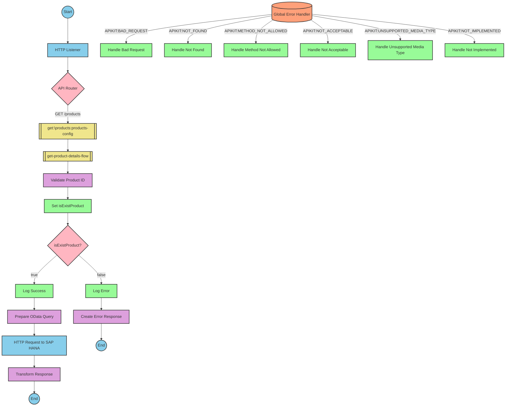

# SAP Integration Suite Implementation for Product API

# Table of Contents
- [API Overview](#api-overview)
- [Endpoints](#endpoints)
- [Current MuleSoft Flow Logic](#current-mulesoft-flow-logic)
- [DataWeave Transformations Explained](#dataweave-transformations-explained)
- [SAP Integration Suite Implementation](#sap-integration-suite-implementation)
  - [Component Mapping](#component-mapping)
  - [Integration Flow Visualization](#integration-flow-visualization)
- [Configuration Details](#configuration-details)
- [Configuration](#configuration)

# API Overview
This API provides access to product information from an SAP HANA backend system. It allows clients to retrieve product details by specifying a product identifier. The API validates the product identifier against a configured list of valid identifiers before retrieving the data from the SAP HANA backend.

**Base URL**: `http://localhost:8081/api/v1`

# Endpoints

## GET /products
**Purpose**: Retrieves product details based on the provided product identifier.

**Request Parameters**:
- **Query Parameters**:
  - `productIdentifier` (required): The unique identifier of the product to retrieve

**Response Format**:
- **200 OK**: Successfully retrieved product details
  - Content-Type: application/json
  - Body: Product details in JSON format
- **400 Bad Request**: Invalid request
- **404 Not Found**: Product not found
- **500 Internal Server Error**: Server error

**Error Response Example**:
```json
{
  "status": "error",
  "message": "The product identifier HT-9999 was not found.",
  "errorCode": "PRODUCT_NOT_FOUND"
}
```

# Current MuleSoft Flow Logic

## products-main Flow
**Trigger**: HTTP listener configured at `/api/v1/*`
**Purpose**: Main entry point for the API that handles routing to appropriate endpoints

1. Starts with an HTTP listener configured to listen at `/api/v1/*`
2. Sets up response handling
3. Configures error response handling
4. Routes requests to appropriate flows based on the API specification

## products-console Flow
**Trigger**: HTTP listener (likely for debugging/monitoring)
**Purpose**: Logs requests to the console for monitoring purposes

1. Starts with an HTTP listener
2. Sets up response handling
3. Configures error response handling
4. Logs request details to the console

## get:\products:products-config Flow
**Trigger**: HTTP GET request to `/products` endpoint
**Purpose**: Handles GET requests to the products endpoint

1. Receives GET requests to `/products`
2. Calls the `get-product-details-flow` subflow to process the request

## get-product-details-flow Subflow
**Purpose**: Validates the product identifier and retrieves product details from the backend

1. Validates if the provided product identifier exists in the configured list:
   ```
   %dw 2.0
   output application/java
   var productidentifer=p('odata.productIdentifiers') splitBy(",")
   ---
   sizeOf(productidentifer filter ($ == attributes.queryParams.productIdentifier))>0
   ```

2. Sets a variable `isExistProduct` with the validation result

3. Conditional processing based on validation:
   - If `isExistProduct` is true:
     - Logs: "The request is processed and sent downstream with the product identifier (#[attributes.queryParams.productIdentifier])."
     - Makes an HTTP request to the SAP HANA backend with the following query parameters:
       ```
       #[output application/java
       ---
       {
         "$filter" : "ProductId eq '" ++ (attributes.queryParams.productIdentifier default '') ++ "'",
         "$select" : "ProductId,Category,CategoryName,CurrencyCode,DimensionDepth,DimensionHeight,DimensionUnit,DimensionWidth,LongDescription,Name,PictureUrl,Price,QuantityUnit,ShortDescription,SupplierId,Weight,WeightUnit"
       }]
       ```
     - Transforms the response payload:
       ```
       %dw 2.0
       output application/json
       ---
       payload
       ```

   - If `isExistProduct` is false:
     - Logs: "The product identifier (#[attributes.queryParams.productIdentifier]) was not passed in the request or was passed incorrectly."
     - Sets an error response:
       ```
       %dw 2.0
       output application/json
       ---
       {
         status: "error",
         message: "The product identifier " ++ attributes.queryParams.productIdentifier ++ " was not found.",
         errorCode: "PRODUCT_NOT_FOUND"
       }
       ```

## Error Handling
The application implements a global error handler that handles various APIKIT errors:
- APIKIT:BAD_REQUEST
- APIKIT:NOT_FOUND
- APIKIT:METHOD_NOT_ALLOWED
- APIKIT:NOT_ACCEPTABLE
- APIKIT:UNSUPPORTED_MEDIA_TYPE
- APIKIT:NOT_IMPLEMENTED

# DataWeave Transformations Explained

## Product Identifier Validation Transformation
**Purpose**: Validates if the provided product identifier exists in the configured list of valid identifiers.

**Input**: Query parameter `productIdentifier` from the HTTP request
**Output**: Boolean value indicating if the product identifier is valid

**Logic**:
1. Retrieves the configured list of product identifiers from the property `odata.productIdentifiers`
2. Splits the comma-separated list into an array
3. Filters the array to find matches with the provided product identifier
4. Returns true if at least one match is found (size > 0)

```dw
%dw 2.0
output application/java
var productidentifer=p('odata.productIdentifiers') splitBy(",")
---
sizeOf(productidentifer filter ($ == attributes.queryParams.productIdentifier))>0
```

## OData Query Parameters Transformation
**Purpose**: Constructs OData query parameters for filtering and selecting product fields.

**Input**: Product identifier from query parameters
**Output**: OData query parameters object

**Logic**:
1. Creates a `$filter` parameter to filter products by the provided product identifier
2. Creates a `$select` parameter to specify which product fields to retrieve

```dw
#[output application/java
---
{
  "$filter" : "ProductId eq '" ++ (attributes.queryParams.productIdentifier default '') ++ "'",
  "$select" : "ProductId,Category,CategoryName,CurrencyCode,DimensionDepth,DimensionHeight,DimensionUnit,DimensionWidth,LongDescription,Name,PictureUrl,Price,QuantityUnit,ShortDescription,SupplierId,Weight,WeightUnit"
}]
```

## Response Payload Transformation
**Purpose**: Passes through the response payload from the backend.

**Input**: Response payload from the SAP HANA backend
**Output**: JSON response payload

**Logic**: Simple pass-through transformation that maintains the structure of the backend response.

```dw
%dw 2.0
output application/json
---
payload
```

## Error Response Transformation
**Purpose**: Constructs an error response when the product identifier is invalid.

**Input**: Product identifier from query parameters
**Output**: JSON error response

**Logic**: Creates a structured error response with status, message, and error code.

```dw
%dw 2.0
output application/json
---
{
  status: "error",
  message: "The product identifier " ++ attributes.queryParams.productIdentifier ++ " was not found.",
  errorCode: "PRODUCT_NOT_FOUND"
}
```

# SAP Integration Suite Implementation

## Component Mapping

| MuleSoft Component | SAP Integration Suite Equivalent | Notes |
|--------------------|----------------------------------|-------|
| HTTP Listener | HTTPS Adapter (Receiver) | Configure with the same path and port settings |
| Router | Content Modifier + Router | Use a Content Modifier to set properties and a Router for conditional processing |
| Flow Reference | Process Call | Use Process Call to invoke another integration flow |
| Logger | Write to Message Log | Configure with the same log message |
| Transform | Message Mapping | Use Message Mapping for DataWeave transformations |
| HTTP Request | HTTPS Adapter (Sender) | Configure with the same URL and query parameters |
| Set Variable | Content Modifier | Use Content Modifier to set properties |
| Choice/When/Otherwise | Router | Use Router with conditions for conditional processing |
| Set Payload | Content Modifier | Use Content Modifier to set the message body |
| Error Handler | Exception Subprocess | Configure exception handling for different error types |

## Integration Flow Visualization

### REST API Integration Flow: GET /products



## Configuration Details

### HTTP Adapter (Receiver)
- **Address**: `/api/v1/*`
- **Port**: `8081` (from dev.yaml)
- **Authentication**: None (based on source)

### HTTP Adapter (Sender)
- **URL**: `https://refapp-espm-ui-cf.cfapps.eu10.hana.ondemand.com:443/espm-cloud-web/espm.svc/Products` (from dev.yaml)
- **Query Parameters**: 
  - `$filter`: `ProductId eq '{productIdentifier}'`
  - `$select`: `ProductId,Category,CategoryName,CurrencyCode,DimensionDepth,DimensionHeight,DimensionUnit,DimensionWidth,LongDescription,Name,PictureUrl,Price,QuantityUnit,ShortDescription,SupplierId,Weight,WeightUnit`

### Message Mapping (Validate Product ID)
- **Source Format**: JSON
- **Target Format**: Java
- **Mapping Script**: Equivalent to the DataWeave script that checks if the product identifier exists in the configured list

### Content Modifier (Set isExistProduct)
- **Action**: Create Property
- **Property Name**: `isExistProduct`
- **Property Value**: Result from the validation mapping

### Router (isExistProduct?)
- **Condition 1**: `${property.isExistProduct} = true`
- **Condition 2**: `${property.isExistProduct} = false`

### Message Mapping (Error Response)
- **Source Format**: None
- **Target Format**: JSON
- **Mapping Script**: Equivalent to the DataWeave script that creates the error response

### Exception Subprocess
- **Error Types**: 
  - Bad Request
  - Not Found
  - Method Not Allowed
  - Not Acceptable
  - Unsupported Media Type
  - Not Implemented

# Configuration

## Environment Variables
From the dev.yaml file:

```yaml
api:
  listener:
    port: "8081"
    path: /api/v1/*
    
hana:
  espm:
    url: refapp-espm-ui-cf.cfapps.eu10.hana.ondemand.com
    port: "443"
    path: /espm-cloud-web/espm.svc/Products
    
odata:
  productIdentifiers: "HT-2000,HT-2001"
```

## Dependencies on External Systems
- **SAP HANA Backend**: The integration depends on the SAP HANA backend system at `refapp-espm-ui-cf.cfapps.eu10.hana.ondemand.com` to retrieve product information.

## Security Settings
- No explicit security settings are mentioned in the source documentation.
- For production deployment, consider implementing:
  - OAuth or Basic Authentication for the HTTP endpoints
  - TLS/SSL for secure communication
  - API rate limiting to prevent abuse

## Configuration Parameters
- **Product Identifiers**: The list of valid product identifiers is configured in the `odata.productIdentifiers` property.
- **Backend URL**: The URL of the SAP HANA backend is configured in the `hana.espm.url`, `hana.espm.port`, and `hana.espm.path` properties.
- **API Listener**: The API listener is configured in the `api.listener.port` and `api.listener.path` properties.