# API Overview
The Financial Services Cloud Wealth Management API provides comprehensive functionality for managing investment accounts, beneficiaries, standing orders, and customer profiles. It enables financial institutions to handle various wealth management operations including account creation, beneficiary management, payment processing, and specialized financial transactions like ACATS (Automated Customer Account Transfer Service) and RMD (Required Minimum Distribution).

- Base URL pattern: `/api/v1`

# Endpoints

## Investment Accounts

### POST /InvestmentAccounts/Initiate
- **Purpose**: Create new investment accounts with beneficiaries
- **Request Body**: JSON containing account and beneficiary details
- **Response**: 201 Created with created account and beneficiary details including generated IDs
- **Example Response**:
```json
{
  "InvestmentAccounts": {
    "AccountIds": ["ACC123456"],
    "Beneficiaries": {
      "Primary": [
        {
          "BeneficiaryId": "BFR-1234567",
          "BeneficiaryName": "John Doe",
          "SharePercentage": "50"
        }
      ],
      "Contingent": [
        {
          "BeneficiaryId": "BFR-7654321",
          "BeneficiaryName": "Jane Doe",
          "SharePercentage": "50"
        }
      ]
    }
  }
}
```

### PATCH /InvestmentAccounts/Update
- **Purpose**: Update existing investment account beneficiaries
- **Request Body**: JSON containing account IDs and beneficiary details to update
- **Response**: 200 OK with updated beneficiary details
- **Example Request Body**:
```json
{
  "InvestmentAccounts": {
    "AccountIds": ["ACC123456"],
    "Beneficiaries": {
      "Primary": [
        {
          "BeneficiaryId": "BFR-1234567",
          "SharePercentage": "60"
        }
      ]
    }
  }
}
```

### DELETE /InvestmentAccounts/Delete
- **Purpose**: Delete beneficiaries from investment accounts
- **Request Body**: JSON containing account IDs and beneficiary IDs to delete
- **Response**: 200 OK with confirmation of deleted beneficiaries
- **Example Response**:
```json
{
  "InvestmentAccounts": {
    "AccountIds": ["ACC123456"],
    "Beneficiaries": [
      {
        "BeneficiaryId": "BFR-1234567",
        "Status": "DELETED"
      }
    ]
  }
}
```

### GET /InvestmentAccounts/{accountId}/Retrieve
- **Purpose**: Retrieve investment account details including beneficiaries
- **Path Parameters**: accountId - The unique identifier for the account
- **Response**: 200 OK with account and beneficiary details
- **Example Response**:
```json
{
  "LinkedAccount": {
    "AccountNumber": "AMZ10012",
    "AccountHolderName": "Bob",
    "AccountType": "Individual"
  },
  "Beneficiaries": {
    "Primary": [
      {
        "BeneficiaryId": "BFR-8066473",
        "BeneficiaryName": "Gabriel Basso",
        "SharePercentage": "5"
      }
    ]
  }
}
```

## Customer Profile

### PATCH /customers/{customerId}
- **Purpose**: Update customer profile information
- **Path Parameters**: customerId - The unique identifier for the customer
- **Request Body**: JSON containing profile information to update
- **Response**: 200 OK with updated profile information
- **Example Response**:
```json
{
  "ProfileInformation": {
    "FirstName": "John",
    "LastName": "Doe",
    "Email": "john.doe@example.com",
    "Phone": "1234567890",
    "Addresses": [
      {
        "AddressType": "Mailing Address",
        "AddressLine1": "415 Mission St",
        "City": "San Francisco",
        "State": "CA",
        "PostalCode": "94105",
        "Country": "USA"
      }
    ]
  }
}
```

## Payment Orders

### POST /InvestmentAccounts/{accountId}/Payments/Initiate
- **Purpose**: Create new standing orders for an investment account
- **Path Parameters**: accountId - The unique identifier for the account
- **Request Body**: JSON containing payment order details
- **Response**: 201 Created with created payment order details including generated IDs
- **Example Response**:
```json
{
  "Payments": [
    {
      "PaymentId": "PMT1234567",
      "CreationDateTime": "2023-10-09T16:34:19.993+05:30",
      "PaymentType": "standing order",
      "PaymentMode": "Bank Wire"
    }
  ]
}
```

### PATCH /InvestmentAccounts/{accountId}/Payments/Update
- **Purpose**: Cancel existing standing orders for an investment account
- **Path Parameters**: accountId - The unique identifier for the account
- **Request Body**: JSON containing payment IDs to cancel
- **Response**: 200 OK with confirmation of canceled payment orders
- **Example Response**:
```json
{
  "PaymentIds": ["PMT1234567"],
  "CancelDateTime": "2023-10-10T10:15:30.000+05:30"
}
```

### GET /InvestmentAccounts/{accountId}/Payments/Retrieve
- **Purpose**: Retrieve standing orders for an investment account
- **Path Parameters**: accountId - The unique identifier for the account
- **Query Parameters**: 
  - paymentId (optional) - Filter by payment ID
  - payeeName (optional) - Filter by payee name
  - amount (optional) - Filter by payment amount
- **Response**: 200 OK with payment order details
- **Example Response**:
```json
{
  "PaymentOrders": [
    {
      "PaymentId": "PMT3564864",
      "CreationDateTime": "2023-10-09T16:34:19.993+05:30",
      "Payments": {
        "PaymentType": "standing order",
        "PaymentMode": "Bank Wire"
      }
    }
  ]
}
```

## Specialized Financial Transactions

### POST /InvestmentAccounts/{accountId}/Acats
- **Purpose**: Initiate an ACATS (Automated Customer Account Transfer Service) transaction
- **Path Parameters**: accountId - The unique identifier for the account
- **Request Body**: JSON containing ACATS transaction details
- **Response**: 200 OK with ACATS transaction details
- **Example Response**:
```json
{
  "AcatDetails": {
    "TransferType": "Full",
    "TransferAction": "Inwards",
    "ExternalAccountDetails": {
      "AccountNumber": "EXT123456",
      "AccountType": "Individual"
    }
  }
}
```

### POST /InvestmentAccounts/{accountId}/RMD
- **Purpose**: Process Required Minimum Distribution (RMD) for retirement accounts
- **Path Parameters**: accountId - The unique identifier for the account
- **Request Body**: JSON containing RMD details
- **Response**: 200 OK with RMD details
- **Example Response**:
```json
{
  "PaymentOption": "Calculated RMD",
  "PaymentFrequency": "Annual",
  "TaxYear": "2023",
  "CalculateRMDAmount": true
}
```

# Current MuleSoft Flow Logic

## Main API Flow
The main flow (`fsc-wealth-management-api-main`) serves as the entry point for all API requests. It:
1. Is triggered by HTTP requests to the API endpoints
2. Logs request details including requestId and flowRefId
3. Routes requests to appropriate subflows based on the endpoint
4. Handles error responses
5. Returns formatted responses to the client

## Investment Account Flows

### Add Beneficiaries Flow
**Trigger**: POST request to `/InvestmentAccounts/Initiate`
**Processing Steps**:
1. Receives request with account and beneficiary details
2. Transforms the request using the `p-addBeneficiariesResponse.dwl` transformation
3. Generates unique BeneficiaryId values for each beneficiary
4. Returns the transformed response with generated IDs

The DataWeave transformation used:
```dataweave
%dw 2.0
var bfr= "BFR-"
var bfrTrack= "BFRTRACK"
var bfrNumbers= '0123456789'
var bfrCharSetLength= sizeOf(bfrNumbers) - 1
var bfrNumbersLength= 7
output application/json skipNullOn = "everywhere"
---
{
	InvestmentAccounts: {
		AccountIds: payload.InvestmentAccounts.AccountIds map ( accountId , indexOfAccountId ) -> accountId,
		Beneficiaries: {
			Primary: payload.InvestmentAccounts.Beneficiaries.Primary map ($ ++ {
				BeneficiaryId: bfr ++ (1 to bfrNumbersLength map bfrNumbers[randomInt(bfrCharSetLength)] joinBy '')
			}),
			Contingent: payload.InvestmentAccounts.Beneficiaries.Contingent map ($ ++ {
				BeneficiaryId: bfr ++ (1 to bfrNumbersLength map bfrNumbers[randomInt(bfrCharSetLength)] joinBy '')
			})
		}
	}
}
```

### Update Beneficiaries Flow
**Trigger**: PATCH request to `/InvestmentAccounts/Update`
**Processing Steps**:
1. Receives request with account and beneficiary details to update
2. Transforms the request using the `p-updateBeneficiariesResponse.dwl` transformation
3. Generates unique BeneficiaryId values for any new beneficiaries
4. Filters out empty values using the treeFilter function
5. Returns the transformed response

The DataWeave transformation used:
```dataweave
%dw 2.0
var bfr= "BFR-"
var bfrTrack= "BFRTRACK"
var bfrNumbers= '0123456789'
var bfrCharSetLength= sizeOf(bfrNumbers) - 1
var bfrNumbersLength= 7

fun treeFilter(value: Any, predicate: (value:Any) -> Boolean) =
    value  match {
            case object is Object ->  do {
               object mapObject ((value, key, index) -> 
                    (key): treeFilter(value, predicate)
                )
                filterObject ((value, key, index) -> predicate(value))
            }
            case array is Array -> do {
                    array map ((item, index) -> treeFilter(item, predicate))
                                         filter ((item, index) -> predicate(item))                 
            }
            else -> $
    }
    
output application/json skipNullOn = "everywhere"
---
{
	InvestmentAccounts: {
		AccountIds: payload.InvestmentAccounts.AccountIds map ( accountId , indexOfAccountId ) -> accountId,
		Addresses: payload.InvestmentAccounts.Addresses,
		Beneficiaries: {
			Primary: payload.InvestmentAccounts.Beneficiaries.Primary map if ( $.BeneficiaryId == null ) ($ ++ {
				"BeneficiaryId": bfr ++ (1 to bfrNumbersLength map bfrNumbers[randomInt(bfrCharSetLength)] joinBy '')
			}) else $,
			Contingent: payload.InvestmentAccounts.Beneficiaries.Contingent map if ( $.BeneficiaryId == null ) ($ ++ {
				"BeneficiaryId": bfr ++ (1 to bfrNumbersLength map bfrNumbers[randomInt(bfrCharSetLength)] joinBy '')
			}) else $
		}
	}
} treeFilter ((value) -> 
    value match {
        case v is Array| Object | Null | "" -> !isEmpty(v)
        else -> true
    }
)
```

### Delete Beneficiaries Flow
**Trigger**: DELETE request to `/InvestmentAccounts/Delete`
**Processing Steps**:
1. Receives request with account and beneficiary IDs to delete
2. Transforms the request using the `p-deleteBeneficiariesResponse.dwl` transformation
3. Sets the status of each beneficiary to "DELETED"
4. Returns the transformed response

The DataWeave transformation used:
```dataweave
%dw 2.0
output application/json skipNullOn = "everywhere"
---
{
	InvestmentAccounts: {
		AccountIds: payload.InvestmentAccounts.AccountIds map ( accountId , indexOfAccountId ) -> accountId, 
		Beneficiaries: payload.InvestmentAccounts.Beneficiaries map {
			BeneficiaryId: $.BeneficiaryId,
			Status: "DELETED"
		}
	}
}
```

### Retrieve Investment Account Details Flow
**Trigger**: GET request to `/InvestmentAccounts/{accountId}/Retrieve`
**Processing Steps**:
1. Receives request with accountId path parameter
2. Sets the accountId as a variable
3. Transforms the response using the `p-getBeneficiariesResponse.dwl` transformation
4. Returns the account details and beneficiaries

The DataWeave transformation used:
```dataweave
%dw 2.0
output application/json
---
{
	LinkedAccount: vars.investmentAccountDetails.LinkedAccount,
	Beneficiaries: vars.investmentAccountDetails.Beneficiaries
}
```

## Customer Profile Flow

### Update Customer Profile Flow
**Trigger**: PATCH request to `/customers/{customerId}`
**Processing Steps**:
1. Receives request with customerId path parameter and profile details to update
2. Transforms the request using the `p-updateProfileResponse.dwl` transformation
3. Returns the transformed response with updated profile information

The DataWeave transformation used:
```dataweave
%dw 2.0
var ProfileInformation = payload.ProfileInformation
output application/json skipNullOn="everywhere"
---
{
	ProfileInformation: {
		Addresses: ProfileInformation.Addresses map ( address , indexOfAddress ) -> {
			AddressLine2: address.AddressLine2,
			AddressLine1: address.AddressLine1,
			State: address.State,
			PostalCode: address.PostalCode,
			City: address.City,
			AddressType: address.AddressType,
			Country: address.Country
		},
		Email: ProfileInformation.Email,
		FirstName: ProfileInformation.FirstName,
		Phone: ProfileInformation.Phone,
		LastName: ProfileInformation.LastName,
		Mobile: ProfileInformation.Mobile,
		BirthDate: ProfileInformation.BirthDate,
		MaritalStatus: ProfileInformation.MaritalStatus,
		EmploymentDetails: ProfileInformation.EmploymentDetails
	}
}
```

## Payment Orders Flows

### Add Standing Orders Flow
**Trigger**: POST request to `/InvestmentAccounts/{accountId}/Payments/Initiate`
**Processing Steps**:
1. Receives request with accountId path parameter and payment order details
2. Transforms the request using the `p-addPaymentOrdersResponse.dwl` transformation
3. Generates unique PaymentId values and adds creation timestamps
4. Returns the transformed response with generated IDs

The DataWeave transformation used:
```dataweave
%dw 2.0
var sot= "PMT"
var stordTrack= "STORDTRACK"
var sotNumbers= '0123456789'
var sotCharSetLength= sizeOf(sotNumbers) - 1
var sotNumbersLength= 7
output application/json skipNullOn = "everywhere"
---
{
	Payments: payload.Payments map ($ ++ {
		CreationDateTime: now(),
		PaymentId: sot ++ (1 to sotNumbersLength map sotNumbers[randomInt(sotCharSetLength)] joinBy '')
	})
}
```

### Cancel Standing Orders Flow
**Trigger**: PATCH request to `/InvestmentAccounts/{accountId}/Payments/Update`
**Processing Steps**:
1. Receives request with accountId path parameter and payment IDs to cancel
2. Transforms the request using the `p-cancelPaymentOrdersResponse.dwl` transformation
3. Adds cancellation timestamp
4. Returns the transformed response

The DataWeave transformation used:
```dataweave
%dw 2.0
output application/json
---
{
	PaymentIds: payload.PaymentIds,
	CancelDateTime: now()
}
```

### Retrieve Standing Orders Flow
**Trigger**: GET request to `/InvestmentAccounts/{accountId}/Payments/Retrieve`
**Processing Steps**:
1. Receives request with accountId path parameter and optional query parameters
2. Logs query parameters
3. Sets variables for filtering
4. Transforms the response using the `p-retrievePaymentOrdersResponse.dwl` transformation
5. Filters payment orders based on query parameters
6. Returns the filtered payment orders

The DataWeave transformation used:
```dataweave
%dw 2.0
output application/json  
---
{
  PaymentOrders: 
    if (attributes.queryParams.paymentId? and attributes.queryParams.payeeName? and attributes.queryParams.amount?)
      vars.paymentOrders filter ($.PaymentId ~= attributes.queryParams.paymentId and $.Payments.PayeeReference.PayeeName ~= attributes.queryParams.payeeName and $.Payments.PaymentDefinition.PaymentAmount.Amount ~= attributes.queryParams.amount)
    else if (attributes.queryParams.paymentId? and attributes.queryParams.payeeName?)
      vars.paymentOrders filter ($.PaymentId ~= attributes.queryParams.paymentId and $.Payments.PayeeReference.PayeeName ~= attributes.queryParams.payeeName)
    else if (attributes.queryParams.paymentId? and attributes.queryParams.amount?)
      vars.paymentOrders filter ($.PaymentId ~= attributes.queryParams.paymentId and $.Payments.PaymentDefinition.PaymentAmount.Amount ~= attributes.queryParams.amount)
    else if (attributes.queryParams.payeeName? and attributes.queryParams.amount?)
      vars.paymentOrders filter ($.Payments.PayeeReference.PayeeName ~= attributes.queryParams.payeeName and $.Payments.PaymentDefinition.PaymentAmount.Amount ~= attributes.queryParams.amount)
    else if (attributes.queryParams.paymentId?)
      vars.paymentOrders filter ($.PaymentId ~= attributes.queryParams.paymentId)
    else if (attributes.queryParams.payeeName?)
      vars.paymentOrders filter ($.Payments.PayeeReference.PayeeName ~= attributes.queryParams.payeeName)
    else if (attributes.queryParams.amount?)
      vars.paymentOrders filter ($.Payments.PaymentDefinition.PaymentAmount.Amount ~= attributes.queryParams.amount)
    else
      vars.paymentOrders
}
```

## Specialized Financial Transactions Flows

### ACATS Flow
**Trigger**: POST request to `/InvestmentAccounts/{accountId}/Acats`
**Processing Steps**:
1. Receives request with accountId path parameter and ACATS details
2. Transforms the request using the `p-acatResponse.dwl` transformation
3. Returns the transformed response

The DataWeave transformation used:
```dataweave
%dw 2.0
output application/json skipNullOn="everywhere"
---
{
	AcatDetails: {
		TransferType: payload.AcatDetails.TransferType,
		AcatType: payload.AcatDetails.AcatType default null,
		TransferAction: payload.AcatDetails.TransferAction,
		TransferDetails: {
			Securities: payload.AcatDetails.TransferDetails.Securities,
			Cash: payload.AcatDetails.TransferDetails.Cash,
			FundsTransfer: payload.AcatDetails.TransferDetails.FundsTransfer,
			CashTransfer: payload.AcatDetails.TransferDetails.CashTransfer,
			CDTransfer: payload.AcatDetails.TransferDetails.CDTransfer,
			AnnuityTransfer: payload.AcatDetails.TransferDetails.AnnuityTransfer,
			ManagedAccountTransfer: payload.AcatDetails.TransferDetails.ManagedAccountTransfer
		},
		ExternalAccountDetails: {
			AccountNumber: payload.AcatDetails.ExternalAccountDetails.AccountNumber,
			AccountType: payload.AcatDetails.ExternalAccountDetails.AccountType,
			AccountTitle: payload.AcatDetails.ExternalAccountDetails.AccountTitle,
			TransferringFirmDetails: {
				FirmName: payload.AcatDetails.ExternalAccountDetails.TransferringFirmDetails.FirmName,
				Phone: payload.AcatDetails.ExternalAccountDetails.TransferringFirmDetails.Phone,
				Address: payload.AcatDetails.ExternalAccountDetails.TransferringFirmDetails.Address
			}
		}
	}
}
```

### RMD Flow
**Trigger**: POST request to `/InvestmentAccounts/{accountId}/RMD`
**Processing Steps**:
1. Receives request with accountId path parameter and RMD details
2. Transforms the request using the `p-rmdResponse.dwl` transformation
3. Returns the transformed response

The DataWeave transformation used:
```dataweave
%dw 2.0
output application/json skipNullOn="everywhere"
---
{
		PaymentOption: payload.PaymentOption,
		PaymentFrequency: payload.PaymentFrequency,
		DistributionSchedule: payload.DistributionSchedule,
		TaxYear: payload.TaxYear,
		CalculateRMDAmount: payload.CalculateRMDAmount,
		WithdrawlAmount: payload.WithdrawlAmount,
		PaymentInstructions: payload.PaymentInstructions,
		TaxWithholdings: payload.TaxWithholdings
}
```

# DataWeave Transformations Explained

## p-addBeneficiariesResponse.dwl
**Purpose**: Generates unique beneficiary IDs for new beneficiaries and structures the response.

**Input**: JSON payload containing account IDs and beneficiary details.
**Output**: JSON with the same structure but with added BeneficiaryId fields.

**Key Operations**:
- Uses variables to define the ID prefix and character set
- Uses `map` to iterate through arrays of beneficiaries
- Uses `randomInt` to generate random numbers for IDs
- Uses the `++` operator to append the generated ID to each beneficiary object

**Logic**:
1. Defines variables for ID generation (prefix, character set, length)
2. Maps through account IDs to preserve them
3. Maps through primary and contingent beneficiaries, adding a unique ID to each

```dataweave
%dw 2.0
var bfr= "BFR-"
var bfrTrack= "BFRTRACK"
var bfrNumbers= '0123456789'
var bfrCharSetLength= sizeOf(bfrNumbers) - 1
var bfrNumbersLength= 7
output application/json skipNullOn = "everywhere"
---
{
	InvestmentAccounts: {
		AccountIds: payload.InvestmentAccounts.AccountIds map ( accountId , indexOfAccountId ) -> accountId,
		Beneficiaries: {
			Primary: payload.InvestmentAccounts.Beneficiaries.Primary map ($ ++ {
				BeneficiaryId: bfr ++ (1 to bfrNumbersLength map bfrNumbers[randomInt(bfrCharSetLength)] joinBy '')
			}),
			Contingent: payload.InvestmentAccounts.Beneficiaries.Contingent map ($ ++ {
				BeneficiaryId: bfr ++ (1 to bfrNumbersLength map bfrNumbers[randomInt(bfrCharSetLength)] joinBy '')
			})
		}
	}
}
```

## p-updateBeneficiariesResponse.dwl
**Purpose**: Updates beneficiary information and generates IDs for new beneficiaries.

**Input**: JSON payload containing account IDs and beneficiary details to update.
**Output**: JSON with updated beneficiary information and new IDs for new beneficiaries.

**Key Operations**:
- Defines a custom `treeFilter` function to remove empty values
- Uses conditional mapping to only generate IDs for beneficiaries without existing IDs
- Uses pattern matching to filter out empty values

**Logic**:
1. Defines variables for ID generation
2. Defines a recursive `treeFilter` function that removes empty values from objects and arrays
3. Maps through account IDs and beneficiaries
4. Conditionally adds IDs only to beneficiaries where BeneficiaryId is null
5. Applies the treeFilter to remove empty values from the result

```dataweave
%dw 2.0
var bfr= "BFR-"
var bfrTrack= "BFRTRACK"
var bfrNumbers= '0123456789'
var bfrCharSetLength= sizeOf(bfrNumbers) - 1
var bfrNumbersLength= 7

fun treeFilter(value: Any, predicate: (value:Any) -> Boolean) =
    value  match {
            case object is Object ->  do {
               object mapObject ((value, key, index) -> 
                    (key): treeFilter(value, predicate)
                )
                filterObject ((value, key, index) -> predicate(value))
            }
            case array is Array -> do {
                    array map ((item, index) -> treeFilter(item, predicate))
                                         filter ((item, index) -> predicate(item))                 
            }
            else -> $
    }
    
output application/json skipNullOn = "everywhere"
---
{
	InvestmentAccounts: {
		AccountIds: payload.InvestmentAccounts.AccountIds map ( accountId , indexOfAccountId ) -> accountId,
		Addresses: payload.InvestmentAccounts.Addresses,
		Beneficiaries: {
			Primary: payload.InvestmentAccounts.Beneficiaries.Primary map if ( $.BeneficiaryId == null ) ($ ++ {
				"BeneficiaryId": bfr ++ (1 to bfrNumbersLength map bfrNumbers[randomInt(bfrCharSetLength)] joinBy '')
			}) else $,
			Contingent: payload.InvestmentAccounts.Beneficiaries.Contingent map if ( $.BeneficiaryId == null ) ($ ++ {
				"BeneficiaryId": bfr ++ (1 to bfrNumbersLength map bfrNumbers[randomInt(bfrCharSetLength)] joinBy '')
			}) else $
		}
	}
} treeFilter ((value) -> 
    value match {
        case v is Array| Object | Null | "" -> !isEmpty(v)
        else -> true
    }
)
```

## p-deleteBeneficiariesResponse.dwl
**Purpose**: Formats the response for deleted beneficiaries.

**Input**: JSON payload containing account IDs and beneficiary IDs to delete.
**Output**: JSON with account IDs and beneficiary IDs with a "DELETED" status.

**Key Operations**:
- Uses `map` to transform beneficiaries to a simpler structure with status
- Uses `skipNullOn = "everywhere"` to remove null values

**Logic**:
1. Maps through account IDs to preserve them
2. Maps through beneficiaries, keeping only the BeneficiaryId and adding a "DELETED" status

```dataweave
%dw 2.0
output application/json skipNullOn = "everywhere"
---
{
	InvestmentAccounts: {
		AccountIds: payload.InvestmentAccounts.AccountIds map ( accountId , indexOfAccountId ) -> accountId, 
		Beneficiaries: payload.InvestmentAccounts.Beneficiaries map {
			BeneficiaryId: $.BeneficiaryId,
			Status: "DELETED"
		}
	}
}
```

## p-getBeneficiariesResponse.dwl
**Purpose**: Formats the response for retrieving investment account details.

**Input**: Variables containing account details.
**Output**: JSON with linked account and beneficiary information.

**Key Operations**:
- Uses variables to access account details
- Simple structure mapping

**Logic**:
1. Creates a response object with LinkedAccount and Beneficiaries from the variables

```dataweave
%dw 2.0
output application/json
---
{
	LinkedAccount: vars.investmentAccountDetails.LinkedAccount,
	Beneficiaries: vars.investmentAccountDetails.Beneficiaries
}
```

## p-updateProfileResponse.dwl
**Purpose**: Formats the response for updating customer profile information.

**Input**: JSON payload containing profile information to update.
**Output**: JSON with updated profile information.

**Key Operations**:
- Uses a variable to simplify access to profile information
- Maps through addresses to maintain structure
- Uses `skipNullOn="everywhere"` to remove null values

**Logic**:
1. Stores profile information in a variable for easier access
2. Creates a response object with the profile information
3. Maps through addresses to maintain their structure

```dataweave
%dw 2.0
var ProfileInformation = payload.ProfileInformation
output application/json skipNullOn="everywhere"
---
{
	ProfileInformation: {
		Addresses: ProfileInformation.Addresses map ( address , indexOfAddress ) -> {
			AddressLine2: address.AddressLine2,
			AddressLine1: address.AddressLine1,
			State: address.State,
			PostalCode: address.PostalCode,
			City: address.City,
			AddressType: address.AddressType,
			Country: address.Country
		},
		Email: ProfileInformation.Email,
		FirstName: ProfileInformation.FirstName,
		Phone: ProfileInformation.Phone,
		LastName: ProfileInformation.LastName,
		Mobile: ProfileInformation.Mobile,
		BirthDate: ProfileInformation.BirthDate,
		MaritalStatus: ProfileInformation.MaritalStatus,
		EmploymentDetails: ProfileInformation.EmploymentDetails
	}
}
```

## p-addPaymentOrdersResponse.dwl
**Purpose**: Generates unique payment IDs and adds creation timestamps for new payment orders.

**Input**: JSON payload containing payment order details.
**Output**: JSON with payment orders including generated IDs and timestamps.

**Key Operations**:
- Uses variables to define the ID prefix and character set
- Uses `map` to iterate through payment orders
- Uses `randomInt` to generate random numbers for IDs
- Uses `now()` to add current timestamp

**Logic**:
1. Defines variables for ID generation (prefix, character set, length)
2. Maps through payment orders, adding a unique ID and creation timestamp to each

```dataweave
%dw 2.0
var sot= "PMT"
var stordTrack= "STORDTRACK"
var sotNumbers= '0123456789'
var sotCharSetLength= sizeOf(sotNumbers) - 1
var sotNumbersLength= 7
output application/json skipNullOn = "everywhere"
---
{
	Payments: payload.Payments map ($ ++ {
		CreationDateTime: now(),
		PaymentId: sot ++ (1 to sotNumbersLength map sotNumbers[randomInt(sotCharSetLength)] joinBy '')
	})
}
```

## p-cancelPaymentOrdersResponse.dwl
**Purpose**: Formats the response for canceled payment orders.

**Input**: JSON payload containing payment IDs to cancel.
**Output**: JSON with payment IDs and cancellation timestamp.

**Key Operations**:
- Uses `now()` to add current timestamp

**Logic**:
1. Creates a response object with the payment IDs from the payload
2. Adds a CancelDateTime with the current timestamp

```dataweave
%dw 2.0
output application/json
---
{
	PaymentIds: payload.PaymentIds,
	CancelDateTime: now()
}
```

## p-retrievePaymentOrdersResponse.dwl
**Purpose**: Filters payment orders based on query parameters.

**Input**: Variables containing payment orders and query parameters.
**Output**: JSON with filtered payment orders.

**Key Operations**:
- Uses nested conditional statements to handle different combinations of query parameters
- Uses the `filter` operation to filter payment orders
- Uses the `~=` operator for approximate matching

**Logic**:
1. Creates a response object with PaymentOrders
2. Uses nested if-else statements to handle different combinations of query parameters
3. Filters payment orders based on the provided query parameters
4. Returns all payment orders if no query parameters are provided

```dataweave
%dw 2.0
output application/json  
---
{
  PaymentOrders: 
    if (attributes.queryParams.paymentId? and attributes.queryParams.payeeName? and attributes.queryParams.amount?)
      vars.paymentOrders filter ($.PaymentId ~= attributes.queryParams.paymentId and $.Payments.PayeeReference.PayeeName ~= attributes.queryParams.payeeName and $.Payments.PaymentDefinition.PaymentAmount.Amount ~= attributes.queryParams.amount)
    else if (attributes.queryParams.paymentId? and attributes.queryParams.payeeName?)
      vars.paymentOrders filter ($.PaymentId ~= attributes.queryParams.paymentId and $.Payments.PayeeReference.PayeeName ~= attributes.queryParams.payeeName)
    else if (attributes.queryParams.paymentId? and attributes.queryParams.amount?)
      vars.paymentOrders filter ($.PaymentId ~= attributes.queryParams.paymentId and $.Payments.PaymentDefinition.PaymentAmount.Amount ~= attributes.queryParams.amount)
    else if (attributes.queryParams.payeeName? and attributes.queryParams.amount?)
      vars.paymentOrders filter ($.Payments.PayeeReference.PayeeName ~= attributes.queryParams.payeeName and $.Payments.PaymentDefinition.PaymentAmount.Amount ~= attributes.queryParams.amount)
    else if (attributes.queryParams.paymentId?)
      vars.paymentOrders filter ($.PaymentId ~= attributes.queryParams.paymentId)
    else if (attributes.queryParams.payeeName?)
      vars.paymentOrders filter ($.Payments.PayeeReference.PayeeName ~= attributes.queryParams.payeeName)
    else if (attributes.queryParams.amount?)
      vars.paymentOrders filter ($.Payments.PaymentDefinition.PaymentAmount.Amount ~= attributes.queryParams.amount)
    else
      vars.paymentOrders
}
```

## p-acatResponse.dwl
**Purpose**: Formats the response for ACATS transactions.

**Input**: JSON payload containing ACATS details.
**Output**: JSON with structured ACATS details.

**Key Operations**:
- Uses `skipNullOn="everywhere"` to remove null values
- Uses `default null` to handle missing values

**Logic**:
1. Creates a response object with the ACATS details from the payload
2. Preserves the nested structure of the ACATS details

```dataweave
%dw 2.0
output application/json skipNullOn="everywhere"
---
{
	AcatDetails: {
		TransferType: payload.AcatDetails.TransferType,
		AcatType: payload.AcatDetails.AcatType default null,
		TransferAction: payload.AcatDetails.TransferAction,
		TransferDetails: {
			Securities: payload.AcatDetails.TransferDetails.Securities,
			Cash: payload.AcatDetails.TransferDetails.Cash,
			FundsTransfer: payload.AcatDetails.TransferDetails.FundsTransfer,
			CashTransfer: payload.AcatDetails.TransferDetails.CashTransfer,
			CDTransfer: payload.AcatDetails.TransferDetails.CDTransfer,
			AnnuityTransfer: payload.AcatDetails.TransferDetails.AnnuityTransfer,
			ManagedAccountTransfer: payload.AcatDetails.TransferDetails.ManagedAccountTransfer
		},
		ExternalAccountDetails: {
			AccountNumber: payload.AcatDetails.ExternalAccountDetails.AccountNumber,
			AccountType: payload.AcatDetails.ExternalAccountDetails.AccountType,
			AccountTitle: payload.AcatDetails.ExternalAccountDetails.AccountTitle,
			TransferringFirmDetails: {
				FirmName: payload.AcatDetails.ExternalAccountDetails.TransferringFirmDetails.FirmName,
				Phone: payload.AcatDetails.ExternalAccountDetails.TransferringFirmDetails.Phone,
				Address: payload.AcatDetails.ExternalAccountDetails.TransferringFirmDetails.Address
			}
		}
	}
}
```

## p-rmdResponse.dwl
**Purpose**: Formats the response for RMD transactions.

**Input**: JSON payload containing RMD details.
**Output**: JSON with RMD details.

**Key Operations**:
- Uses `skipNullOn="everywhere"` to remove null values

**Logic**:
1. Creates a response object with the RMD details from the payload

```dataweave
%dw 2.0
output application/json skipNullOn="everywhere"
---
{
		PaymentOption: payload.PaymentOption,
		PaymentFrequency: payload.PaymentFrequency,
		DistributionSchedule: payload.DistributionSchedule,
		TaxYear: payload.TaxYear,
		CalculateRMDAmount: payload.CalculateRMDAmount,
		WithdrawlAmount: payload.WithdrawlAmount,
		PaymentInstructions: payload.PaymentInstructions,
		TaxWithholdings: payload.TaxWithholdings
}
```

# SAP Integration Suite Implementation

## Component Mapping

| MuleSoft Component | SAP Integration Suite Equivalent | Notes |
|--------------------|----------------------------------|-------|
| listener | HTTP Adapter (Receiver) | Configure with the same path and method |
| response | HTTP Adapter (Sender) | Configure with appropriate status codes |
| headers | Message Mapping | Map headers in the message processing |
| error-response | Exception Subprocess | Handle errors with appropriate status codes |
| body | Content Modifier | Set the message body |
| logger | Write to Log | Configure with the same log message |
| router | Router | Configure with the same routing conditions |
| error-handler | Exception Subprocess | Handle errors with appropriate status codes |
| flow-ref | Process Call | Call subprocesses with the same name |
| set-variable | Content Modifier | Set variables with the same name and value |
| set-payload | Content Modifier | Set the message payload |
| transform | Message Mapping | Implement the same transformation logic |

## Integration Flow Visualization

### Flow 1: fsc-wealth-management-api-main

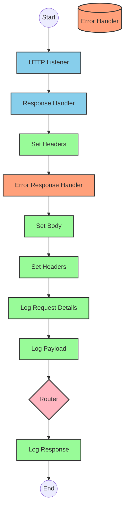

### Flow 2: patch:InvestmentAccounts\Update:application\json:fsc-wealth-management-api-config

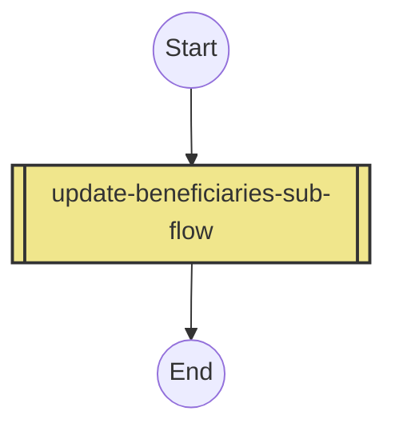

### Flow 3: delete:InvestmentAccounts\Delete:application\json:fsc-wealth-management-api-config

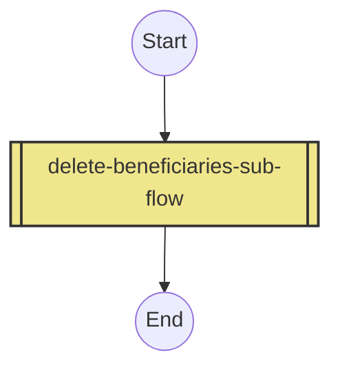

### Flow 4: get:InvestmentAccounts\(accountId)\Retrieve:fsc-wealth-management-api-config

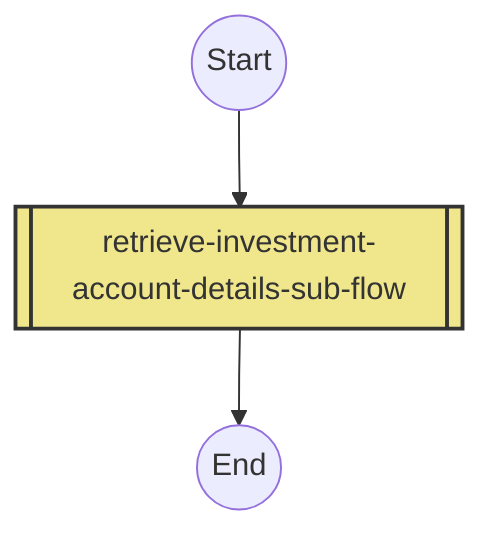

### Flow 5: post:InvestmentAccounts\Initiate:application\json:fsc-wealth-management-api-config

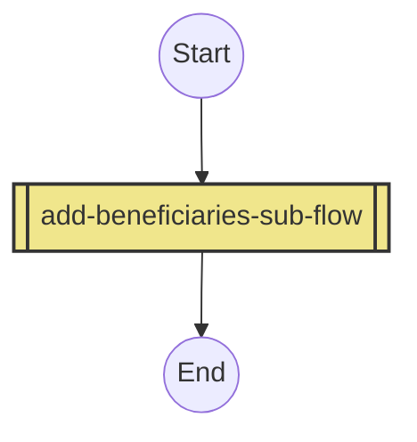

### Flow 6: patch:customers\(customerId):application\json:fsc-wealth-management-api-config

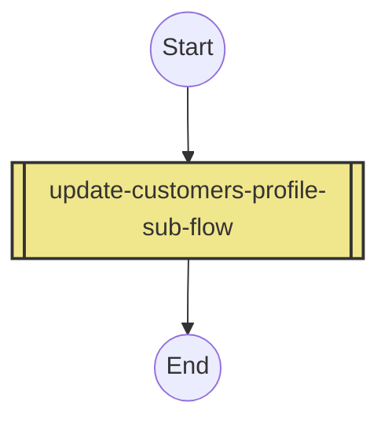

### Flow 7: patch:InvestmentAccounts\(accountId)\Payments\Update:application\json:fsc-wealth-management-api-config

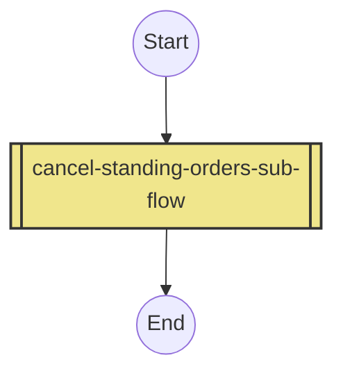

### Flow 8: post:InvestmentAccounts\(accountId)\Payments\Initiate:application\json:fsc-wealth-management-api-config


### Flow 9: get:InvestmentAccounts\(accountId)\Payments\Retrieve:fsc-wealth-management-api-config

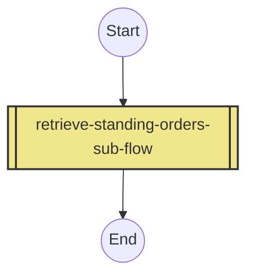

### Flow 10: post:InvestmentAccounts\(accountId)\Acats:application\json:fsc-wealth-management-api-config


### Flow 11: post:InvestmentAccounts\(accountId)\RMD:application\json:fsc-wealth-management-api-config

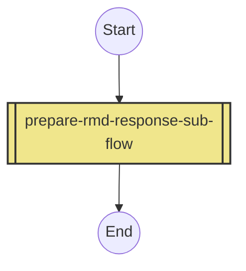

### Flow 12: delete-beneficiaries-sub-flow

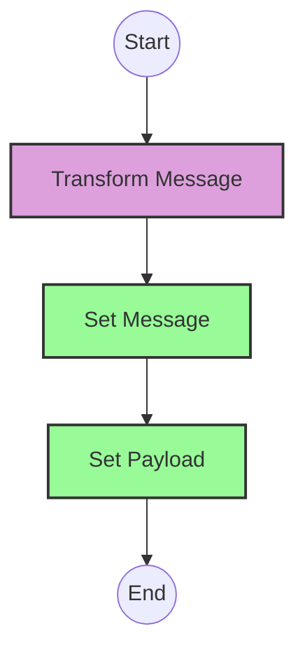

### Flow 13: retrieve-investment-account-details-sub-flow

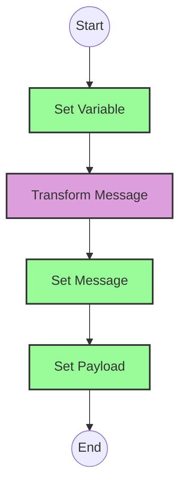

### Flow 14: retrieve-standing-orders-sub-flow

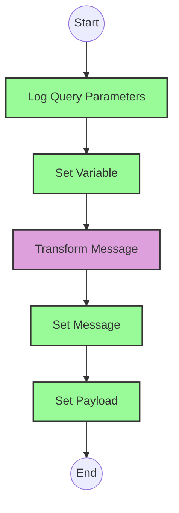

### Flow 15: update-customers-profile-sub-flow


### Flow 16: cancel-standing-orders-sub-flow


### Flow 17: update-beneficiaries-sub-flow


### Flow 18: prepare-acats-response-sub-flow


### Flow 19: add-standing-orders-sub-flow


### Flow 20: prepare-rmd-response-sub-flow


### Flow 21: add-beneficiaries-sub-flow

```mermaid
flowchart TD
%% Define node styles
classDef httpAdapter fill:#87CEEB,stroke:#333,stroke-width:2px
classDef contentModifier fill:#98FB98,stroke:#333,stroke-width:2px
classDef router fill:#FFB6C1,stroke:#333,stroke-width:2px
classDef mapping fill:#DDA0DD,stroke:#333,stroke-width:2px
classDef exception fill:#FFA07A,stroke:#333,stroke-width:2px
classDef processCall fill:#F0E68C,stroke:#333,stroke-width:2px

%% Add Beneficiaries Subflow
A((Start)) --> B[Transform Message]:::mapping
B --> C[Set Message]:::contentModifier
C --> D[Set Payload]:::contentModifier
D --> E((End))
```

## Configuration Details

### HTTP Adapter (Receiver)
- **Address**: `/api/v1`
- **HTTPS**: Enabled
- **Authentication**: Basic Authentication
- **TLS Configuration**: Use keySecret and keyStoreSecret from config.yaml

### Message Mapping
- **Mapping Type**: Groovy Script (for complex transformations) or Message Mapping (for simpler transformations)
- **Input Format**: JSON
- **Output Format**: JSON
- **Mapping Logic**: Implement the same logic as the DataWeave transformations

### Content Modifier
- **Message Header**: Set appropriate headers for HTTP responses
- **Message Body**: Set the message body as needed
- **Properties**: Set variables with the same names and values as in MuleSoft

### Router
- **Condition Type**: XPath or Content-Based
- **Routing Rules**: Implement the same routing logic as in MuleSoft

### Exception Subprocess
- **Error Handling**: Implement the same error handling logic as in MuleSoft
- **Error Mapping**: Map MuleSoft error codes to SAP Integration Suite error codes

### Process Call
- **Process Name**: Use the same names as the MuleSoft subflows
- **Input Mapping**: Map input parameters as needed
- **Output Mapping**: Map output parameters as needed

# Configuration

## Important Configuration Parameters
- **HTTP Listener Configuration**: 
  - Name: fsc-wealth-management-api-httpListenerConfig
  - Base Path: /api/v1

- **API Configuration**:
  - Name: fsc-wealth-management-api-config
  - API: fsc-wealth-management-api.raml
  - Outbound Headers Map Name: outboundHeaders
  - HTTP Status Variable Name: httpStatus

## Environment Variables
- **TLS Configuration**:
  - keySecret: integration@keystore
  - keyStoreSecret: integration@keystore

## Dependencies on External Systems
- No explicit external system dependencies are mentioned in the source documentation.

## Security Settings
- **TLS**: Configured using keySecret and keyStoreSecret from config.yaml
- **Error Handling**: Common exception handler for various API errors